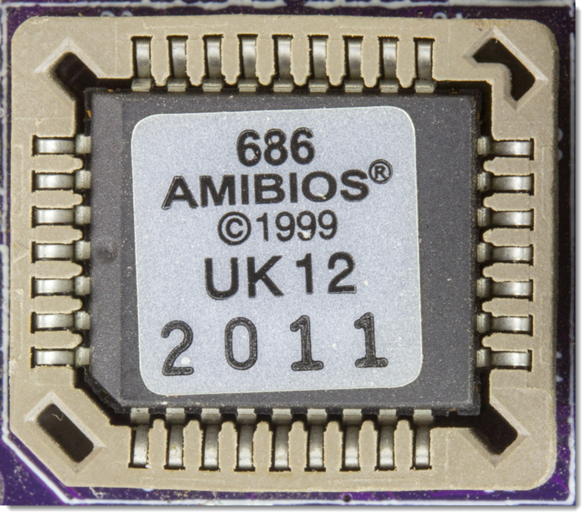
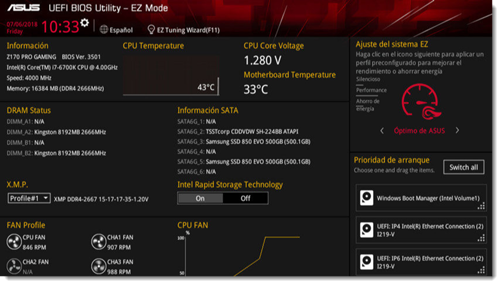
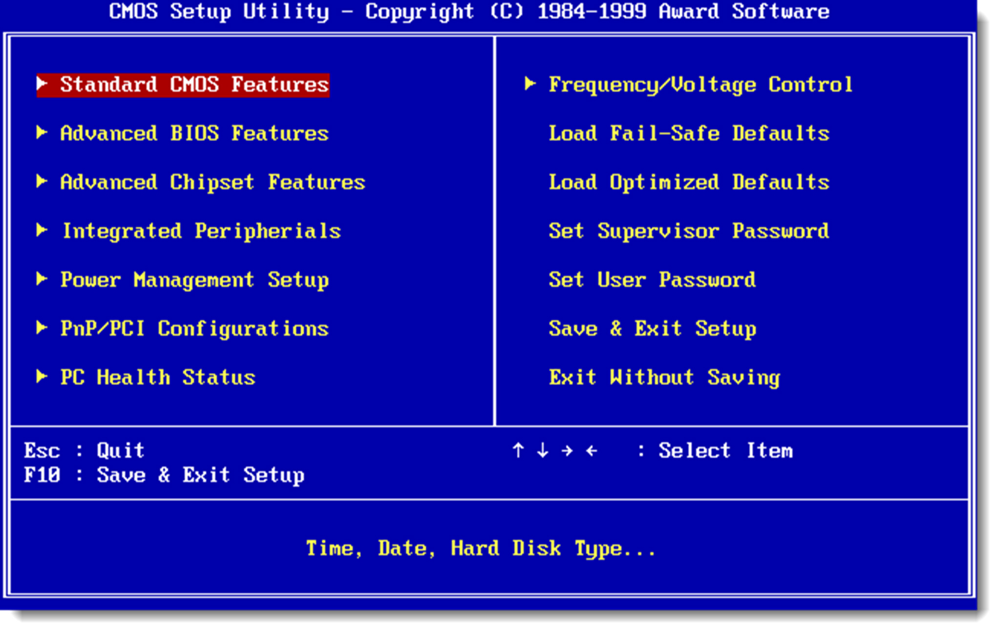

# Qué es la BIOS?. Características. Configuración y optimización

BIOS es el acrónimo de Basic Input Output System y se trata del **firmware** que se ejecuta al iniciar el ordenador en modo frío. Antes de iniciar el sistema operativo, un ordenador necesita realizar ciertas comprobaciones de hardware antes de cargarse en memoria. Para conseguir esa información sobre el estado de los componentes, necesitará el acceso a todo el hardware del sistema. Esta es una de las funciones de la BIOS, interponer una capa de abstracción entre ellos. De esta forma el sistema operativo obtiene esa información de la BIOS, que a su vez, la obtiene directamente del hardware.

Uno de sus primeros cometidos es comprobar el estado del hardware mediante el **POST (Power On Self Test)**, el cual comprueba si el hardware se comporta como debiera. Si el resultado de esta prueba es satisfactorio, reanudará la secuencia de arranque del sistema operativo.

No solo las placas base contienen este **firmware**, casi cualquier dispositivo posee una BIOS que facilita la comunicación con sus niveles superiores. Componentes como tarjetas de video, de red, impresoras y tarjetas capturadoras entre otros.

La mayoría de los fabricantes de componentes delegan la producción de la BIOS a terceros. Éstos actualizan el firmware para dotarlos de nuevas funcionalidades, compatibilidad con nuevos dispositivos o corregir errores. En la actualidad existen dos proveedores de BIOS mayoritarios que son American Megatrends y Phoenix Technologies que son de código propietario. Existe una alternativa de código abierto denominada Coreboot (en el que basa OpenBIOS), aunque muy poco extendida.

A medida que los requerimientos del hardware y de los sistemas operativos han ido aumentando, el sistema BIOS debía someterse a numerosas revisiones. Además, algunas de estos requerimientos no podían implementarse dadas las limitaciones técnicas del firmware. Esto sucedió durante las primeras fases de desarrollo del procesador Itanium, diseñado a la par entre Intel y Hewlett-Packard.

De esta forma nace UEFI, acrónimo de United Extensible Firmware Interface, con nuevas características como proporcionar menús gráficos, uso del ratón, acceso remoto para la teleasistencia o la utilización de extensiones que amplían sus funcionalidades sin ser necesaria una actualización completa.

Sin duda, una de las características más importantes que introdujo en sistema UEFI, fue la creación de un nuevo sistema de arranque, la que permite la carga directa del sistema operativo sin intermediación de los gestores de arranque. Esta propiedad obligó a crear un modo de retrocompatibilidad con BIOS, debido a que los sistemas operativos antiguos necesitaban un gestor de arranque para poder iniciar el proceso. UEFI permite coexistir a ambos sistemas de arranque.

En la actualidad el uso de UEFI se ha extendido y casi la totalidad de los sistemas operativos modernos es compatible con este firmware. Las diferencias entre ambos sistemas resultan evidentes y UEFI introduce las siguientes características:

- una nueva **apariencia** gráfica que permite el uso de ratón y de animaciones.
- utiliza un nuevo sistema de particionado, **GPT** que sustituye a **MBR** (tema que se verá en lo sucesivo).
- mejora la seguridad con **Secure Boot**, el cual no permite la inicialización de sistemas operativos no autentificados, para proteger de software malintencionado que se ejecuta al inicio.
- arranque del sistema más rápido.
- el sistema **UEFI no está bloqueado**, lo que permite añadir extensiones de terceros para complementar su funcionalidad.

En ambos casos, la configuración de este firmware pasa por establecer la hora y fecha del sistema, la velocidad el procesador y overclocking, la prioridad de dispositivos de arranque, la configuración de puestos serie y paralelo y obtener información del hardware entre otras muchas funcionalidades. Toda esta configuración se guarda en una memoria especial denominada **CMOS** (Complementary Metal Oxide Semiconductor) que se alimenta de una pila modelo **CR-2032**. Cuando el ordenador está apagado, es esta batería la que mantiene los datos de configuración guardados. Si esta pila dejase de funcionar, la BIOS/UEFI pasará a tomar los valores predeterminados de fábrica.
