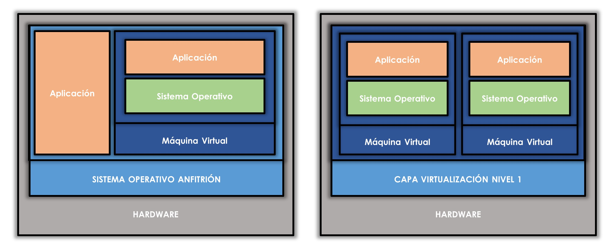
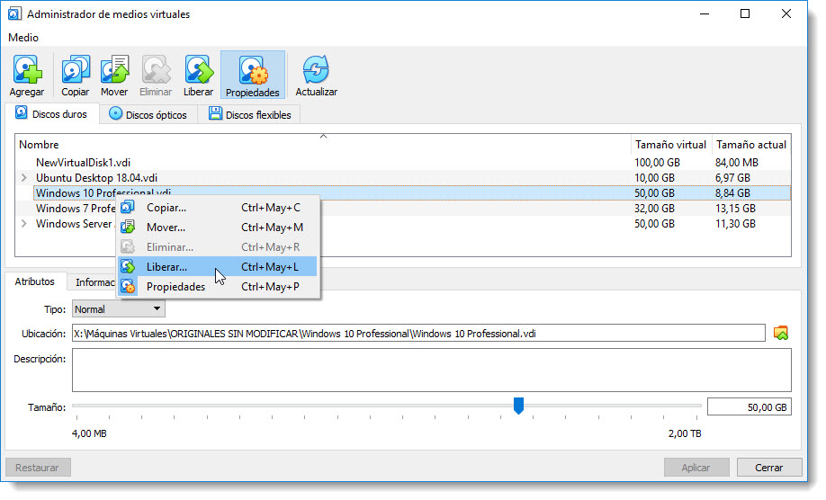
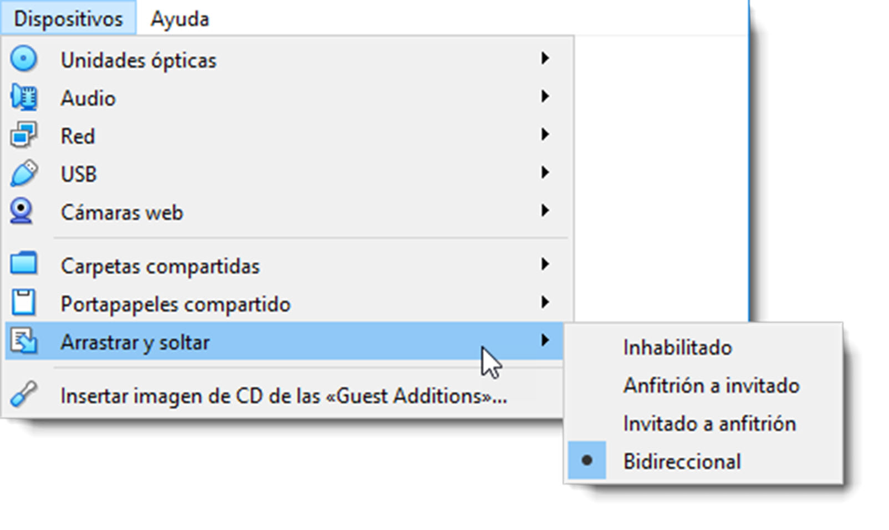
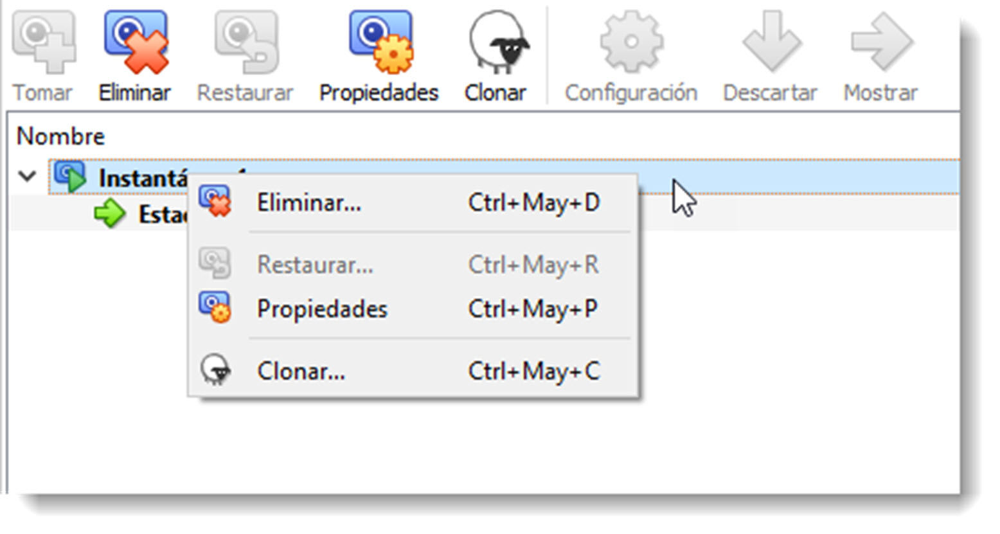

# Virtualización

## Introducción.Herramientas de virtualización

A pesar de que parezca una tecnología moderna, fue desarrollada en la década de los 60 por IBM. La primera máquina diseñada para estos menesteres fue el IBM S/360 Modelo 67. Estos mainframes o superordenadores no optimizaban sus recursos por lo que surgió la idea “fraccionar lógicamente” los recursos y dividirlos en varias tarea, lo que hoy se conoce somo multitasking. En la década de los 80 y principios de los 90 con el abaratamiento del hardware gracias a los procesadores x86 de Intel, comenzó a generalizarse el uso de microordenadores que estaban lejos de las prestaciones ofrecidas por los mainframes. Esto provocó que la tecnología de virtualización dejara de utilizarse hasta bien entrados los años 90. Volvió a utilizarse profusamente en el ámbito de los servidores, pero también se empezó a usar en otros ámbitos de la informática como el test de software o seguridad de aplicaciones usando para ello los sandboxes.

La virtualización crea una capa de abstracción de los recursos de un ordenador para que puedan ser utilizados por un sistema operativo virtualizado. Esta nueva capa de abstracción se denomina **Hypervisor** o VMM (Virtual Machine Monitor) y su trabajo consiste en administrar recursos reales de una máquina y convertirlos en recursos virtuales.

La máquina que ofrece sus recursos reales para que sean convertidos en virtuales se denomina **máquina anfitrión**. Por otra parte, la máquina que utiliza estos recursos virtualizados ofrecidos por la máquina anfitrión se denomina **máquina huésped**. Lo habitual en esta tecnología es que existan más de una máquina huésped por cada máquina anfitrión y no viceversa. Es posible encontrar el caso contrario y se trata de la tecnología empleada en los sistemas operativos distribuidos vistos en la unidad anterior.

Esta capa de software (VMM) gestiona los recursos principales del ordenador como el procesador, la memoria principal, dispositivos periféricos, memoria secundaria y redes de comunicación. Se encarga de repartir los recursos de forma dinámica entre todos las máquinas virtuales, lo que hace que se pueda contener varias máquinas dentro de un sólo anfitrión.
No es raro encontrar numerosas herramientas de virtualización en el mercado especializadas en diferentes ámbitos. Existen varias formas de virtualización y es posible virtualizar tanto el hardware como el software de servidor, sesiones de usuario, aplicaciones y también se pueden crear máquinas virtuales en un ordenador de escritorio. Esta última será la forma que se utilizará a lo largo de este módulo. Se crearán varias máquinas virtuales conectadas entre sí para dar soporte a nuestra infraestructura de servicio de directorio.

En cuanto a tipos de virtualización, existe cuantiosa casuística, pero hay dos tipologías que destacan entre ellas; por la infraestructura de virtualización y por la técnica de virtualización.

En el primer caso disponemos de **virtualización de nivel 1**, que es la que realiza directamente sobre el hardware de la máquina anfitrión sin intermediarios. No existe sistema operativo que gestione los recursos de la máquina para ofrecérselos al software de virtualización, sino que es el software de virtualización el que accede directamente a los recursos físicos y los transforma en virtuales. La ventaja de no contar con otro sistema operativo entre la virtualización y el hardware, facilita y optimiza la conversión de los recursos. Se pueden encontrar diferentes herramientas de nivel 1, recordemos las más destacadas:

- **Xen Project Hypervisor** es una plataforma de virtualización de nivel 1 de código abierto mantenido por una comunidad de desarrolladores que se mantiene muy activa. Muchas de las plataformas de virtualización on-line están basadas en Xen Project Hypervisor como Amazon Web Services, Aliyum y Verizon Cloud entre otras.

- **Proxmox** es un software de código abierto con su propia comunidad de desarrolladores. Está orientada a la construcción de infraestructuras informáticas a lo largo de una red local. Posee una interfaz web para el control de las máquinas y ofrece otra serie de servicios virtualizados como Proxmox Mail Gateway, un filtro de spam y virus, aunque estos productos requieren de una suscripción.
- **Hyper-V** es otra propuesta por parte de Microsoft de código propietario y de pago en este caso. La ventaja sobre otras plataformas de nivel 1 es que es una plataforma nativa para sistemas operativos de la compañía, lo que favorece su rendimiento y escalabilidad. Esta plataforma también puede trabajar como una de nivel 2, integrada en la familia de servidores de Microsoft desde Windows Server 2008.
- **WMware vSphere Hypervisor** es otra plataforma de nivel 1 ofrecida por WMware (empresa referente en el mundo de la virtualización) de código propietario pero de uso gratuito.

**La virtualización de nivel 2** al contrario, se realiza sobre el sistema operativo de la máquina anfitrión. Se instala una aplicación que contendrá las máquinas virtuales. Este tipo de virtualización es la más extendida y es con la que se trabajará en este módulo. Entre los diferentes sistemas de virtualización de nivel 2, se destacan las siguientes:

- **VMware Workstation** que nos ofrece una de las plataformas de nivel 2 más potentes y se ha convertido en un estándar del sector para la virtualización. Es de código propietario y su uso es de pago, aunque disponemos de VWware Workstation Player de forma gratuita, aunque perderemos la capacidad de crear máquinas virtuales, tan sólo administrarlas.
- **Oracle VM VirtualBox** es una propuesta que hasta 2007 disponía de su versión OSE (Open Source Edition) bajo licencia GPL 2 (General Public License). Actualmente es de código propietario pero gratuita, aunque tan sólo se puede utilizar bajo licencia de “Uso personal y de Evaluación” PUEL (Personal Use and Evaluation License). Licencia que se ajustará las necesidades de este módulo, por lo que será esta herramienta la que se usará para virtualizar la infraestructura necesaria.
- **QEMU** es un emulador y plataforma virtual de código abierto que se distribuye de forma gratuita. Es compatible con la mayoría de máquinas virtuales y permite administrar las creadas con Xen Project Hypervisor con un rendimiento muy cercano al original.

En cuanto a la clasificación por técnicas de virtualización disponemos de dos tipos:

- **virtualización por software**, que posibilita la virtualización en todo tipo de ordenadores, antiguos y modernos, pero las máquinas virtuales son lentas y necesita más recursos por parte del procesador.
- **virtualización por hardware**, que aceleran la ejecución del huésped, pero sólo funcionan con procesadores modernos. En el caso de Intel, la virtualización por hardware se denomina VT-x y en el caso de AMD, se denomina AMD-V. En la mayoría de ordenadores, la virtualización por hardware se debe habilitar en la BIOS.

Las ventajas que ofrece esta tecnología son notables y van desde la reutilización y optimización del aprovechamiento del hardware hasta la contribución medioambiental, pasando por la rápida incorporación de nuevos recursos al sistema virtualizado, reducción de costes económicos y espaciales, mejora de los procesos de clonación y copia de sistema, mejora los procesos de aislamiento ante un fallo o alerta de seguridad y la administración global centralizada de los recursos.

### Configuración y administración de un sistema virtualizado

Los pasos contenidos en este apartado son válidos para cualquier sistema de virtualización de nivel 2, pero se va a centrar los ejemplos en la solución Oracle VM VirtualBox. Esta plataforma permite la creación de máquinas virtuales y una red virtual para conectar estas máquinas sin ocasionar interferencias con las máquinas o redes físicas en las que se encuentre el equipo anfitrión.

#### Creación de una máquina virtual

A la hora de crear una máquina virtual, Oracle VM VirtualBox ofrece un asistente que guiará a través de todo el proceso. Una vez lanzado el asistente ahorraremos tiempo si se usa el botón de **Modo Experto** el cual mostrará en una sola ventana las opciones de creación de nuestra máquina.

Tres son los elementos que se deben configurar como mínimo para la creación de una máquina virtual:

- El tipo de sistema operativo que contendrá la máquina y su arquitectura,
- El tamaño de la memoria principal y
- Qué disco duro virtual le asignaremos como memoria secundaria.
  Hay que tener presente los recursos de los que dispone la máquina anfitrión, y no ceder demasiados de éstos para que el rendimiento no caiga hasta límites insufribles. Habitualmente el software de virtualización avisa al usuario si va a superar estos límites.

La elección de un tipo de disco duro determinará en que plataformas será compatible ese disco duro virtual. De esta manera VDI (VirtualBox Disk Image) será el formato nativo de VirtualBox, aunque también disponemos de **VHD (Virtual Hard Disk)** de Microsoft Virtual PC, **VMDK (Virtual Machine Disk)** propia de VMware Workstation, **HDD (Parallels Hard Disk)** de Parallels o los formatos **QCOW (QEMU Copy-On-Web)** y **QED (QEMU Enhanced Disk)** de la plataforma QEMU.

Algo a tener muy en cuenta es el tipo de almacenamiento físico que vamos a dar al disco duro virtual. Existen dos opciones:

- Almacenamiento **reservado dinámicamente**, aumenta el tamaño del fichero a medida que los archivos se van copiando en el disco duro virtual. En esta configuración no importa el tamaño máximo del disco, ya que tan sólo cuando éste esté lleno, ocupará ese espacio de forma física en el disco anfitrión. Ofrece la ventaja de ahorrar espacio en el disco duro físico, pero es una configuración más lenta ya que tiene que redireccionar espacio nuevo cada vez que se escribe un archivo en el disco duro virtual.
- Almacenamiento **en tamaño fijo**, reserva el espacio en el disco anfitrión en función del total de la capacidad del disco duro virtual. Si el tamaño máximo del disco duro virtual es de 32 GB, será ese el tamaño del archivo en el disco duro físico. Esta configuración consume más cantidad de recursos del sistema anfitrión. Por contra en acceso al disco es más rápido, ya que no será necesario la redirección de espacio nuevo en el disco duro en cada escritura.

El fichero que contenga en disco duro virtual, tendrá unas dimensiones considerables, sobre todo si se usa la técnica de almacenamiento en tamaño fijo. Oracle VM Workstation ofrece la posibilidad de dividir este fichero en fragmentos de 2 GB lo que permitirá mejor gestión del disco duro, el aumento de seguridad y la compatibilidad. Marcar esta casilla es obligatorio si el disco duro anfitrión posee un sistema de archivos anterior a NTFS (FAT16 o FAT32).

#### Administrador de medios virtuales

Cuando se crea una máquina virtual se crea también una disco duro virtual alojado en el disco duro anfitrión, como se ya se ha mencionado. La creación de este dispositivo virtual lleva consigo la asignación de un identificador unívoco basado en UUID (Universal Unique Identifier). Se trata de un número de 128 bits separado en cinco grupos por guiones. Esta identificación única evita que el mismo disco duro virtual sea asignado a varias máquinas virtuales de forma simultánea.
Cuando se crea una máquina, se le asocia un disco duro nuevo o bien uno ya existente. Mientras este disco esté asignado a una máquina virtual se encuentra en estado ligado y tan solo esa máquina será capaz de escribir en él. Esto quiere decir también que no se puede asignar a ninguna otra.

Si es necesario realizar esta asignación, antes se debe liberar ese disco a través del administrador de medios virtuales. De esta forma simulamos el funcionamiento físico de los discos duros y, además, dotamos de más seguridad al sistema virtualizado.

Desde este mismo menú podremos realizar una copia de un disco duro virtual. Una vez realizada, el disco duro copiado habrá generado un nuevo UUID, indicando que, a pesar de ser una copia exacta del primero, en realidad Oracle VM VirtualBox lo tratará como un disco duro diferente. Este disco recién creado se le puede asignar a cualquier máquina virtual disponible, incluso la que contiene el disco original.

Otras de las acciones que se puede realizar en este administrador, es dotar de funcionalidades especiales a los discos duros virtuales. Existen diferentes modos los cuales se resumen en:

- **normal**, esta es la configuración por defecto cuando se crea un nuevo disco duro. No existen restricciones sobre como el sistema operativo huésped lee y escribe en el disco. Los cambios que se produzcan en él serán permanentes.

- **inmutable**, cualquier dato escrito por un sistema operativo huésped en un disco inmutable se almacena en una imagen de disco de diferenciación separada. Cuando la máquina virtual a la que se adjunta la imagen de disco se apaga o reinicia, el disco de diferenciación y los contenidos que se encuentran en él se descartan, dejando el disco inmutable inalterado. Este enfoque permite que múltiples máquinas virtuales que comparten el mismo archivo de imagen de disco, cada uno se le asigna su propio disco de diferenciación durante el tiempo de ejecución. A pesar de soportar más de una máquina ligado a un dispositivo inmutable, tan sólo una de ellas puede estar encendida de forma simultanea.

- **escritura** simultánea, permite las operaciones de escritura y lectura como en modo normal con la salvedad que al apagar o reiniciar la máquina el disco vuelve a su estado original.

- **compartible**, permite compartir un disco duro entre varias máquinas virtuales. Esto lo hace ideal para la formación de clusters. Sólo los discos de tamaño fijo pueden utilizar esta configuración.

- **multiconexión**, básicamente se trata de un medio inmutable con conexión de varias máquinas simultáneamente. Además, el disco de diferenciación que crea cada máquina conectada a este disco duro, no se borra al reiniciar o apagar el sistema virtual.

Este administrador también gestiona los discos ópticos y los discos flexibles, indicando a qué máquina virtual están conectados y permitiendo conectarlos a otra máquina si así se requiere. Estos dispositivos funcionan de igual forma que los discos duros virtuales en modo normal, pudiendo estar conectados a una única máquina virtual de forma simultánea.

#### Configurar redes virtuales

Una de las ventajas de trabajar con máquinas virtuales, es que desde el punto de vista de una red local, podemos tratarla de igual forma que si de un equipo físico se tratase. Es más, si así se requiere, también nos permite la creación de una red local interna y que tan sólo los equipos huésped sean capaces de detectar.
Esta configuración brinda la posibilidad de crear sistemas informáticos de prueba completamente virtualizados, y sin interacción alguna con la máquina anfitrión. Cualquiera de estas configuraciones debe realizarse sobre el adaptador de red virtual, que será el encargado de gestionar la conexión de la máquina.
Hay que conocer las distintas configuraciones que se le pueden asignar a un dispositivo de red virtual:

- **no conectado**, la tarjeta virtual existe en el huésped, pero está configurada como si no tuviera ningún cable conectado. Huelga decir que la máquina huésped no dispone de conexión de red alguna.
- **NAT**, (Network Address Translation) es el modo por defecto de la tarjeta de red virtual. La máquina huésped puede conectarse a otras redes mediante un router virtual proporcionado por Oracle VirtualBox. En este modo es posible navegar por Internet sin ser detectado por el resto de nodos de la red. Dicho router sirve direcciones DHCP del tipo 10.0.X.0/24 donde X es igual a dos para la primera tarjeta de red, X es igual a tres para la segunda tarjeta de red y así sucesivamente. En el caso de una única tarjeta de red, el router tiene como puerta de enlace la dirección 10.0.2.2, como servidor DNS la dirección 10.0.2.3 y la primera dirección DHCP asignada es la 10.0.2.15.
- **red NAT**, configura una red a la que se unen todas las máquinas virtuales que quieran tener acceso a Internet sin interferir con la red en la que está inmersa el anfitrión. Antes de unirnos a una red de estas características habrá que crearla con la herramienta en línea de comandos vboxmanage o a través del administrador de redes.
- **Adaptador puente**, se crea un tarjeta de red virtual en el anfitrión que intercepta el tráfico del huésped y puede inyectar paquetes en la red, de manera que el huésped se configura como si estuviera conectado por un cable a la tarjeta de red virtual del anfitrión. La máquina huésped es visible en la red.
- **red interna**, se crea una red virtual visible entre las máquinas virtuales, pero invisible al anfitrión y a máquinas externas a la red. Cada red virtual creada se identifica mediante un nombre. Para conectar a los huéspedes en la misma red virtual, será necesario que sus controladoras de red se sitúen en la red con el mismo nombre.
- **adaptador sólo-anfitrión:** en este modo se crea una tarjeta de red virtual en el anfitrión que puede conectarse con las máquinas virtuales sin necesitar que el anfitrión tenga una tarjeta destinada a esta tarea.

  

## Instalación de sistemas operativos. Requisitos y configuración previa

Una de las primera tareas que se deben realizar para la instalación de un sistema operativo, es confirmar que efectivamente se puede instalar. Para ello es necesario comprobar los requisitos mínimos de hardware que se deben cumplir para que el sistema operativo se instale y funcione correctamente.

Es necesario revisar los requerimientos en la velocidad del procesador, cantidad de memoria principal y CHIPSET de la placa base. En la actualidad las tarjetas gráficas y la memoria secundaria son requisitos que se cumplen con relativa facilidad.

Además, es muy importante comprobar que el fabricante del hardware dispone de los controladores para la versión del sistema operativo. La inexistencia de ellos no impide la instalación, pero afectará al rendimiento general del ordenador.
Una vez determinados los requisitos mínimos de hardware, hay que asegurarse si es compatible con el sistema operativo que haya elegido para la infraestructura, sobre todo en lo referente a la arquitectura del procesador. Un procesador con una arquitectura de 32 bits será incapaz de manejar un sistema operativo de una arquitectura diferente. Además, en la medida de lo posible se ha de elegir la arquitectura de 64 bits para contener los sistemas operativos, ya que la anterior posee ciertas limitaciones que supondrían un lastre en el sistema.

En la actualidad, la instalación de un sistema operativo es un proceso completamente guiado y trivial, por lo que no se ahondará mucho en este proceso. Será con posterioridad cuando se configuren muchos de los aspectos que se han configurado de forma automática. Pero antes será necesario realizar ciertas comprobaciones:

- revisar la compatibilidad y requerimientos del hardware.
- arrancar el ordenador con el medio extraíble conectado y la BIOS debidamente configurada.
- iniciar el asistente de instalación que guiará el proceso de instalación.
- asignar particiones de forma adecuada a los discos duros, proceso que se realizará de forma automática en este apartado.
- tras la copia de ficheros, realizar configuraciones iniciales en cada sistema operativo, operaciones que se analizarán en la unidad de trabajo número 3.

No existen muchas diferencias entre el proceso de instalación de un sistema operativo cliente y uno de red, al menos en sistemas operativos de Microsoft. Por lo que respecta a distribuciones basadas en GNU/Linux usadas en este manual, sí existen algunas diferencias entre instalar un sistema operativo cliente o uno de red. Las diferencias se ilustran en el siguiente apartado.

## Instalación de Ubuntu Server

El proceso de instalación de Ubuntu Server no es muy diferente del de Ubuntu Desktop pero al contrario que éste, necesita instalar ciertas características que todavía no se ha tratado. Por este motivo se realizará una pequeña guía de instalación destacando las configuraciones que son requeridas durante el proceso y propias de un servicio de directorio, como el servicio de DNS:

- tras elegir el idioma y configuración del teclado, procederá a detectar el hardware del sistema y configurarlo, entre ellos, los dispositivos de red. Turno para la configuración predeterminada de red y el nombre de la máquina.
- turno de los usuarios. Configurará un usuario para usar en lugar de la cuenta de superusuario. El asistente es autoexplicativo: nombre del usuario, nombre de la cuenta, contraseña, ubicación y cifrado de la cuenta.
- la instalación seguirá con el particionado del disco y la copia de ficheros en el disco duro. Como de costumbre, ofrecerá un particionado automático y otro manual. En cada ocasión se procederá según requerimientos.
- una vez copiados los datos, se descargarán las actualizaciones necesarias, se configurará el gestor de paquetes así como las actualizaciones del sistema operativo. En el siguiente paso es dónde se encuentra la diferencia a la que se hacía referencia. Ubuntu Server permite instalar diferentes servicios durante el proceso de instalación del sistema operativo. Se seleccionará la opción “Herramientas estándar del sistema” y se instalarán los servicios necesarios de forma manual a medida que sean necesarios tras la instalación.

La instalación de **Microsoft Windows Server** no ofrece esta posibilidad, siendo con posterioridad cuando el SOR sea promocionado a servidor y dotado de estas herramientas, tema que se abordará en la unidad de trabajo número 5.

## Herramientas de virtualización

Para el estudio de los contenidos que se detallan es este punto será necesario la instalación, en cada sistema operativo contenido en una máquina virtual, la herramienta **Oracle Guest Additions**.

Para instalarla, una vez arrancada la máquina virtual, se accede al menú Dispositivos  → Insertar imagen de CD de las Guest Additions…  . Tras esto se deberá instalar el software en la máquina huésped como si de un programa normal se tratase (claro dependiendo que sistema operativo sea). Al acabar, y tras reiniciar el sistema virtualizado, ya se dispondrá de las opciones de compartición que se especifican en este apartado.

### Comunicación anfitrión-huésped

Aunque dispongamos de una red y la máquina huésped se encuentre dentro de esta red de alguna de las formas que se han visto en el apartado anterior, es posible que tanto el huésped como el anfitrión se comuniquen sin necesidad de estar contenidos dentro de ella. Además de ser una comunicación más rápida y cómoda, no interfiere en con el resto de equipos tanto virtuales como físicos.

#### Carpetas compartidas

En la máquina anfitrión se crea una carpeta a la que los huéspedes pueden acceder. El acceso se realizará en función del sistema operativo que contenga la máquina virtual. Si se trata de un sistema de Microsoft, se accederá a la carpeta como si de un recurso de red se tratase. Si se trata de un sistema operativo GNU/Linux o Solaris se proporciona un sistema de archivos especial diseñado para estas tareas denominado vboxsf.

#### Dispositivos USB

Otra forma rápida de compartir ficheros es el uso de dispositivos de almacenamiento USB. Conseguiremos conectar un dispositivo USB a la máquina virtual siguiendo estos pasos:

- conecta el USB a la máquina anfitrión.
- en la máquina huésped Dispositivos→ USB y aparecerá un listado de los dispositivos que se encuentran conectados.
- pulsamos sobre alguno de ellos, el control de éste pasará a manos de la máquina virtual.
- para liberar el dispositivo USB, pulsamos sobre el dispositivo que queramos liberar, el anfitrión retomará el control sobre él.

Hay que tener en cuenta que esta acción desconectará la el dispositivo USB de la máquina anfitrión. Si en ese momento existe algún fichero abierto en él, es posible la pérdida de información. Esta situación se repite cuando queremos liberar el dispositivo desde la máquina huésped.

#### Arrastrar y soltar

Oracle VirtualBox permite con este método arrastrar archivos entre anfitrión-cliente como si de una carpeta se tratase. Para habilitarlo hay que ir al menú a Dispositivos → Arrastrar y soltar. Se puede elegir el sentido de la copia de ficheros, desactivarlo o configurarlos como bidireccional.

#### Portapapeles

También es posible compartir el portapapeles entre los sistemas anfitrión-huésped a través del menú Dispositivos → Portapapeles compartido. De igual forma que en el caso anterior, es posible configurar la dirección o deshabilitar esta característica.

En definitiva, se dispone de muchas opciones para compartir ficheros entre la máquina anfitrión y el huésped. A todas las vistas en este apartado hay que añadir **los recursos compartidos de red**. Elegir una de ellas dependerá de la necesidades de cada ocasión y también de las preferencias del usuario.

### Herramientas avanzadas

Este apartado no pretende ser exhaustivo, ya que la explicación de todas las posibilidades que ofrece una herramienta como Oracle VirtualBox excede de las pretensiones de este manual. Sí que se trata de acciones comunes que todo usuario debe conocer para optimizar su trabajo.

#### Instantáneas

Las instantáneas, también conocidas como snapshots, permiten al usuario realizar una copia del estado actual de la máquina para poder regresar a él con posterioridad. Esta opción es útil cuando se necesita realizar una instalación de software crítico, alguna configuración del sistema o alguna otra acción que ponga en peligro la estabilidad del sistema operativo. Antes de proceder a esta acción, es conveniente realizar una instantánea para guardar el estado actual del sistema. A partir de este punto, todos los cambios que se realicen quedarán guardados en un disco duro virtual diferencial. Una vez acabado la acción crítica sobre el sistema, éste podrá volver a un estado anterior y comenzar una nueva línea de tiempo, si así se requiere.

Cuando Oracle VirtualBox realiza una instantánea las guarda en la pestaña de Instantáneas de cada máquina virtual. Es posible realizarlas tanto con la máquina corriendo como apagada y muy recomendable que escribamos un comentario del motivo por el cual realizamos la instantánea. Pasados unos días será difícil recordar el porqué se hizo esa snapshot. Si es necesario la recuperación de una de ellas, tan sólo habrá que pulsar el botón derecho sobre ella y seleccionar la opción  Restaurar Instantánea  del menú emergente.

#### Atajos de teclado

Existen combinaciones de teclas especiales para cada sistema operativo. Cuando se realizan estas combinaciones, siempre son captadas por el anfitrión, dejando sin posibilidad de reacción al huésped. Por ejemplo, si pulsamos la combinación **Alt+Crtl+Supr** con una máquina huésped abierta, no será ésta la que muestre el administrador de tareas, sino el anfitrión. Para enviar ordenes mediante combinación de teclas especiales al huésped es posible realizarla de dos formas:

- a través del menú Entrada  → Teclado  en la ventana de la máquina
  virtuales.
- mediante una combinación de teclas alternativa, todas los huéspedes tienen una tecla especial denominada **tecla anfitrión** que nos brinda otra forma de interactuar con ella. En el ejemplo anterior, si es necesario abrir el administrador de tareas en el huésped, se realizará pulsando la tecla **anfitrión+Supr** .
  Por defecto,_Oracle VM VirtualBox_ establece que la tecla anfitrión es **Ctrl Derecho**. A través del menú Entrada  → Teclado → Preferencias de teclado…  se habilitará un editor para poder cambiar tanto la tecla anfitrión como sus combinaciones.

#### Clonar una máquina virtual

Clonar una máquina es crear una copia de un huésped exactamente igual a la clonada con la salvedad de sus números de identificación (UUID) diferentes. De esta forma ambas máquinas podrán ser ejecutadas dentro del mismo entorno.
Es una práctica recomendable que, tras acabar la instalación e instalar las Guess Additions, se realice una clon de la máquina para disponer de una copia limpia por si ocurriera algún desastre. Es importante tener en cuenta que el huésped clonado siempre debe permanecer apagado hasta que termine el proceso.

Existe un asistente de clonado en que se deberá indicar el nombre de la nueva máquina, si se quiere cambiar la MAC de los dispositivos de red (importante, hay que recordar que no pueden haber dos tarjetas de red con la misma dirección física dentro del sistema), así como si se desea clonar tan sólo el estado actual de la máquina o con todas sus instantáneas.

Además de estas opciones, es importante la selección del tipo de clonación que mejor se adapte a las necesidades del proyecto:

- **completa**, crea una copia de todos los archivos de la máquina virtual junto con todos sus discos duros.
- **enlazada**, crea una copia de todos los archivos de la máquina virtual pero no de los discos duros. En su lugar genera un nuevo disco duro diferencial donde almacena los cambios que se producen sobre el estado inicial de la máquina clonada. En este estado, el nuevo huésped es dependiente de la máquina original y no podrá funcionar sin ella. Este método ahorra espacio en el disco duro pero aumenta las dependencias entre dispositivos virtuales.

Una vez seleccionadas todas las opciones, pulsando el botón Clonar obtendremos una nueva máquina idéntica a la inicial.

#### Exportación e importación de máquinas virtuales

Este método es valido cuando queremos trasladar alguna máquina huésped de un equipo a otro e incluso de un software de virtualización diferente de dónde fue creado. Para ello se dispone de un estándar abierto para empaquetar y distribuir servicios virtualizados denominado Open Virtualization Format **(OVF)**. Al tratarse de un estándar abierto no está vinculado a ninguna arquitectura de procesador en concreto. La unidad de empaquetado y distribución se denomina paquete OVF y puede contener uno o más sistemas virtuales, cada uno de los cuales se puede implementar en una máquina virtual distinta.

Para realizar estas acciones, para las cuales las máquinas y/o servicios virtualizados deben estar apagados, es necesario ir al  Archivo → Exportar servicio virtualizado…  y seguir el asistente que aparece.

#### Cifrado de máquinas virtuales

Oracle VM VirtualBox ofrece una opción para cifrar las máquinas virtuales que contengan información sensible. En concreto cifrará el archivo de disco o discos duros que del que el sistema virtualizado disponga. A través del menú Configuración< → General  → Cifrado se puede activar el cifrado de la máquina virtual.

Se utilizará un algoritmo de cifrado simétrico AES de 128 o 256 bits. Tras insertar la contraseña comenzará el proceso de cifrado. Es posible revertir esta operación si se desmarca la opción Habilitar cifrado. En ese caso el programa solicitará la clave AES y procederá al descifrado de los archivos de la máquina virtual.

El cifrado del disco duro virtual permitirá que tan sólo la máquina que lo ha cifrado pueda usarlo, a menos que, al configurarlo en otro huésped, introduzcamos la contraseña de cifrado. Esto evita que el disco virtual pueda conectarse a otras máquinas sin el consentimiento del administrador del sistema.

Se ha de tener en cuenta que, al menos hasta la versión 5.1 de Oracle VM VirtualBox, es necesario instalar el **Oracle VirtualBox Extension Pack** para tener disponible la opción de cifrado. Este paquete es descargable desde su página oficial. Además de esta característica ofrece la posibilidad de cambiar el controlador de los dispositivos USB virtuales de la versión 1.0 a la 2.0 o 3.0, con el significativo aumento de rendimiento, el uso de la webcam del anfitrión y el VirtualBox RDP (Remote Desktop Protocol) entre otras funcionalidades.

Son muchas las características que ofrece este software de virtualización, aunque conocerlas todas no es el objetivo de este manual. Conociendo las herramientas descritas en esta unidad, el trabajo del resto del manual se realizará sin complicaciones.
