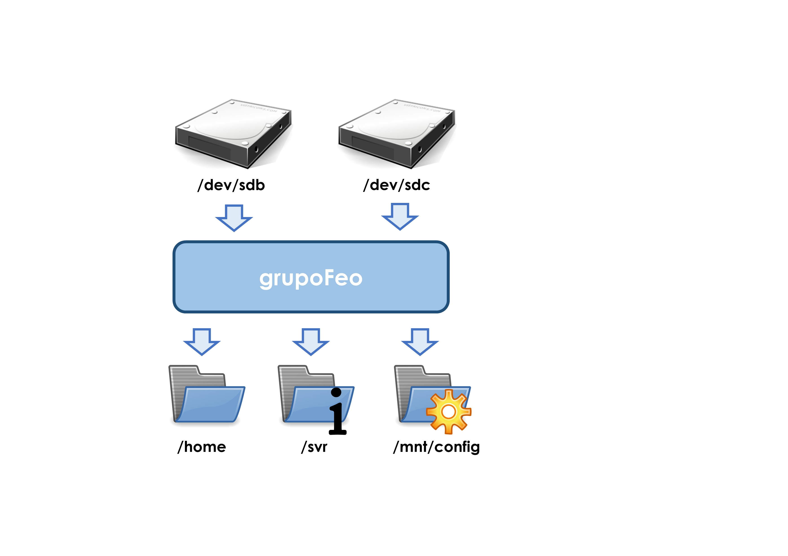
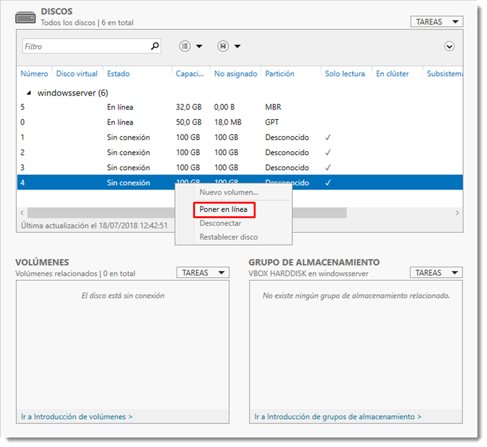

# Volúmenes distribuidos.

Como ya se vio en temas anteriores, sobre la estructura física un disco duro es posible crear una estructura lógica que lo dote de forma. Ya son conocidos conceptos como sistemas de particionado _(Master Boot Record y GUID Partition Table)_, partición o sistema de archivos. Cuando se habla de una partición, ésta queda confinada en un único dispositivo hardware. Además la modificación de alguna de sus propiedades puede ser costosa en tiempo.

Los volúmenes poseen las mismas características que las particiones vistas con anterioridad, con el añadido de que un volumen distribuido puede contener varios dispositivos físicos, es decir, una estructura lógica que se desarrolla en varios discos duros al mismo tiempo. Entre otras ventajas, los volúmenes permiten el uso de técnicas de tolerancia a fallos como los RAID.

En Microsoft Windows Serverla creación de volúmenes distribuidos se denominan **Grupos de almacenamiento** y se construyen a través de la herramienta de Administrador del Servidor, como casi cualquier tarea de administración del servidor.

La creación de un grupo de almacenamiento pasa por iniciar los discos que se acaban de instalar. Para ello se accede a <span class="menu">Administrador del servidor</span> → <span class="menu">Servicios de archivos y de almacenamiento</span> → Volúmenes → <span class="menu">Discos</span> en donde pulsando con el botón derecho sobre cada disco se procede a Poner en línea. Esta acción asigna el control del disco al servidor donde está conectado. Esto parece una obviedad, pero cualquier otro servidor puede gestionar un disco duro conectado a éste. También es posible inicializar el disco, que consiste en asignarle una tabla de particionado, aunque esta tarea de momento es opcional.



Ahora se accede al apartado <span class="menu">Grupos de almacenamiento</span> y se crea uno nuevo con la opción <span class="menu">Nuevo grupo de almacenamiento…</span> del desplegable <span class="menu">TAREAS</span>. Esto iniciará un asistente en que se debe indicar el nombre del grupo y los dispositivos físicos que formarán parte de él. De este modo ya se dispone de un volumen lógico en el sistema.



Una vez creado, es posible añadir o eliminar discos físicos a este conjunto de igual modo, pero esta vez eligiendo la opción <span class="menu">Agregar nuevo disco físico…</span> al pulsar con el botón derecho sobre el grupo. A través de la opción <span class="menu">Eliminar grupo</span> de almacenamiento es posible eliminarlo y dejar libre los discos involucrados en él. Este proceso elimina todos los datos que pueda contener.

Los volúmenes lógicos en GNU/Linux se forman a través de la aplicación LVM _(Logical Volume Manager)_, una herramienta que inicialmente fue creado por Heinz Mauelshagen en 1998 para el sistema operativo HP-UX, el Unix de HP. Después sería implementado en el kernel GNU/Linux, por lo que no será necesaria su instalación.

LVM puede gestionar grupos de discos y particiones como un todo en lugar de manejar varios espacios independientes. Permite unir varias particiones como una sola, ampliarlas en otros discos físicos diferentes, montar varios discos en modo RAID, añadir discos duros en caliente, sin olvidar la función snapshot para crear backups.
Esta utilidad maneja varios conceptos con lo que el administrador debe estar familiarizado:

- **PV** (Phisical Volume), son los volúmenes físicos, es decir, discos duros o particiones de un equipo.
- **VG** (Volume Group), grupo volumen, es el área creada por uno o varios dispositivos físicos.
- **LV** (Logical Volume), volúmenes lógicos o dispositivos donde se pueden crear sistemas de ficheros y creados sobre un grupo de volumen.

La creación de un volumen lógico pasa por seguir estos pasos;

- creación de volúmenes físicos PV para que LVM pueda gestionarlos,
- la creación de un grupo de PV en un grupo de volumen VG de este modo se creará un nuevo dispositivo en el sistema que será la unión de los discos físicos,
- creación de volúmenes lógicos LV, de igual forma que en un disco tradicional, se le puede asignar un sistema de ficheros o particionar según necesidades del sistema.

Para la gestión de estos elementos se dispone de numerosos comandos cuya explicación queda fuera del alcance de este manual. No obstante, se ilustrará el uso de ellos a través de un ejemplo. Para la gestión de los volúmenes físicos PV (phisical volume), entre otros, se dispone de:

- `pvcreate`, usado para crear un volumen físico.
- `pvchange`, cambia los atributos de un volumen físico.
- `pvdisplay`, muestra información sobre un volumen físico.
- `pvmove`, mueve extensiones físicas de un volumen a otro.
- `pvscan`, localiza y enumera todos los volúmenes físicos.
- `pvremove`, elimina el volumen físico.
  Para la administración de grupos de volúmenes o VG:
- `vgchange`, cambia los atributos de un grupo volumen.
- `vgck`, comprueba la consistencia del grupo volumen.
- `vgcreate`, crea un grupo volumen a partir de volúmenes físicos.
- `vgdisplay`, muestra los atributos de un grupo volumen.
- `vgextend`, añade volúmenes físicos a un grupo volumen.
- `vgmerge`, combina dos grupos volumen.
- `vgreduce`, elimina volúmenes físicos de un grupo volumen.
- `vgremove`, elimina un grupo volumen.
- `vgrename`, renombra un grupo volumen.
- `vgsplit`, divide un grupo volumen.

Y finalmente, para el manejo de volúmenes lógicos LV:

- `lvchange`, cambia los atributos de un volumen lógico.
- `lvcreate`, crea un volumen lógico.
- `lvdisplay`, muestra los atributos de los volúmenes lógicos existentes.
- `lvextend`, incrementa el tamaño de un volumen lógico.
- `lvreduce`, reduce el tamaño de un volumen lógico.
- `lvremove`, elimina un volumen lógico.
- `lvrename`, renombra un volumen lógico.
- `lvscan`, localiza y enumera todos los volúmenes lógicos del sistema.

Cada uno de estos comandos posee numerosas opciones y modificadores que por sí solos darían para un tema. Es conveniente revisar la ayuda de estos comandos antes de su utilización.

Las ventajas de este sistema de volúmenes son múltiples. Imagina que creamos cuatro particiones contiguas en un disco. Si en el futuro fuese necesario aumentar alguna de las tres primeras no podríamos hacerlo sin borrar las siguientes, lo que **es complejo, peligroso y requiere de parada del servidor casi con toda seguridad**. Es posible aumentar el tamaño de cada volumen independientemente de que no haya espacio libre. Para ello se utiliza el espacio de otros discos físicos, e incluso se dispone de la opción para mover volúmenes lógicos entre dispositivos físicos. Y todo ello sin la necesidad de para el servidor o sin desmontar el sistema de ficheros.

Para ilustrar mejor el uso de estos comandos, se han instalado en el servidor de Ubuntu Server, cuatro discos duros SATA de 100 GB de tamaño cada uno en el sistema y se han dividido en dos particiones de 50 GB. Se dispone por tanto de los siguientes dispositivos `/dev/sdb1, /dev/sdb2, /dev/sdc1, /dev/sdc2, /dev/sdd1, /dev/sdd2, /dev/sde1 y /dev/sde2`, además del dispositivo de disco que contiene el sistema operativo.
Para crear un volumen con las tres particiones 1 de los tres primeros discos, primero debemos crear unidades físicas con estas particiones

```bash title=""

sudo pvcreate /dev/sdb1 /dev/sdc1 /dev/sdd1
```

El terminal contestará con este mensaje

```bash title=""

Physical volume "/dev/sdc1" successfully created.
Physical volume "/dev/sdb1" successfully created.
Physical volume "/dev/sdd1" successfully created.
```

Ahora LVM dispone de estos tres volúmenes para poder crear un grupo, que se crea a través del comando

```bash title=""

vgcreate <nombre_del_volumen> <volúmenes_físicos_en_lvm>
```

de este modo

```bash title=""

sudo vgcreate grupoFeo /dev/sdb1 /dev/sdc1 /dev/sdd1
```

que obtenemos este mensaje

```bash title=""

Volume group "grupoFeo" successfully created
```

Llegados a este punto ya se dispone de un volumen físico que engloba las tres primeras partes de los discos `/dev/sdb, /dev/sdc y /dev/sdd`. Para ello se comprueba la información del grupo con el comando `vgdisplay`, que ofrece el siguiente resultado:

```bash title=""

--- Volume group ---
VG Name grupoFeo
System ID
Format lvm2
Metadata Areas 3
Metadata Sequence No 1
VG Access read/write
VG Status resizable
MAX LV 0
Cur LV 0
Open LV 0
Max PV 0
Cur PV 3
Act PV 3
VG Size <139,69 GiB
PE Size 4,00 MiB
Total PE 35760
Alloc PE / Size 0 / 0
Free PE / Size 35760 / <139,69 GiB
VG UUID rNXzAV-kDIJ-YsQU-bc5Z-OjsD-e6tf-ePKeec
```

Varios son los datos importantes en este informe. El primero es comprobar que el tamaño del grupo coincide con el tamaño de los tres discos; `VG Size <139,69 GiB`, el nombre `VG Name grupoFeo` y el estado del grupo `VG Status resizable`, que indica si el grupo es modificable o no. En este caso sí lo es. Esto va a permitir la modificación de este grupo, como por ejemplo si se añadiera la primera partición del cuarto disco, que se había quedado en el olvido. Para ello hay que crear su unidad física y extender el grupo creado

```bash title=""

sudo pvcreate /dev/sde1
sudo vgextend grupoFeo /dev/sde1
```

Ahora el tamaño del grupo de volúmenes debe haber cambiado, se consulta con `vgdisplay` y se comprueba la línea `VG Size <186,25 GiB`. Todo ha ido de forma correcta.

De igual modo que en un disco duro físico normal, es hora de crear los volúmenes lógicos al igual que si se tratasen de particiones de un disco duro tradicional, pero utilizando LVM

```bash title=""

lvcreate <opciones> <nombre_del_volumen> <nombre_del_grupo>

```

Así, si es necesario crear un volumen de 100 GiB.

```bash title=""

sudo lvcreate -L 100G -n volumen1Feo grupoFeo
```

Las opciones `-L` especifica el tamaño del volumen y `-n` el nombre del mismo. Es posible comprobarlo con `lvdisplay o lvscan`, del mismo modo que que en grupos de volúmenes. De este modo es posible crear los volúmenes necesarios dentro de un grupo. La parte interesante de este proceso es que, en este punto se ha generado un archivo de dispositivo en la carpeta `/dev`, por lo que es posible utilizarlos como si de un dispositivo normal se tratase.

Este nuevo dispositivo tiene el nombre asignado al grupo y dentro de él, el nombre de los volúmenes creados. Ahora tan sólo será necesario dotarlo de un sistema de ficheros y un punto de montaje del modo aprendido

```bash title=""

sudo mkfs.ext4 /dev/grupoFeo/volumen1Feo
sudo mount /dev/grupoFeo/volumen1Feo /media/discoFeo
```

La ventaja de este esquema de volúmenes es su versatilidad. Aún quedan disponibles 86,25 GiB del grupo que se creó, por lo que se incrementará la capacidad del volumen creado

```bash title=""

sudo lvextend -L +86,25G /dev/grupoFeo/voluemn1Feo
```

Si se comprueba el espacio con el comando vldisplay se comprobará como el volumen ha crecido. Lo interesante de este método es que no es necesario desmontar el volumen y además los ficheros contenidos quedan intactos. También es posible reducir el tamaño del volumen con el comando `lvreduce`, aunque para esta tarea sí es necesario desmontar el volumen, pero con la ventaja de los datos no se verán afectados.

Una vez construidos los volúmenes es necesario la modificación del fichero fstab para que monte este volumen con el inicio del sistema, como ya se ha visto en unidades anteriores.

Llegados hasta aquí tan sólo queda indicar como deshacer todo este trabajo y devolver el control de los discos al sistema. La destrucción de esta infraestructura lógica ha de realizarse de **manera inversa a su creación**, es decir, se destruyen los volúmenes lógicos, luego los grupos y finalmente los discos físicos

```bash title=""

sudo unmout /media/discoFeo
sudo lvremove /dev/grupoFeo/volumen1Feo
sudo vgremove grupoFeo
sudo pvremove /dev/sdb1 /dev/sdc1 /dev/sdd1 /dev/sde1
```

El uso de este tipo de volúmenes dinámicos simplifica las tareas de ampliación o modificación de discos, las cuales se realizan sin necesidad de apagar el sistema y conservando los ficheros, características a tener muy en cuenta para para todo buen administrador de sistemas.
