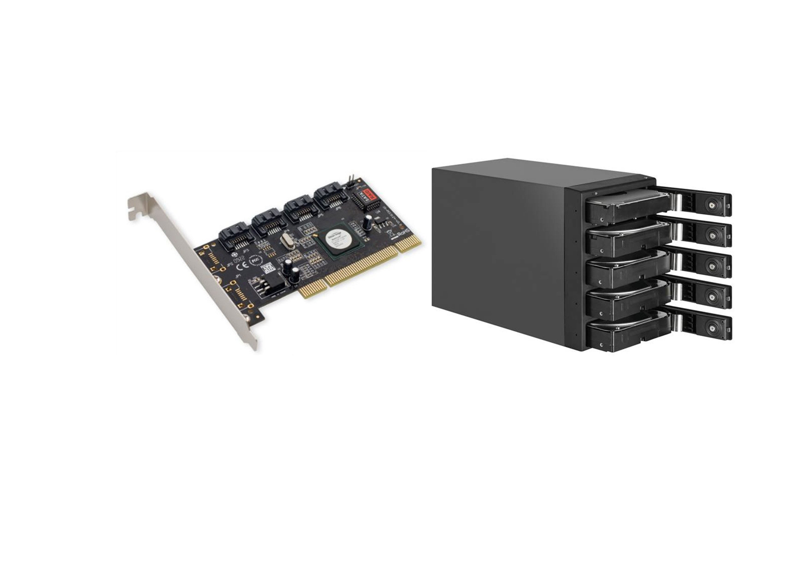
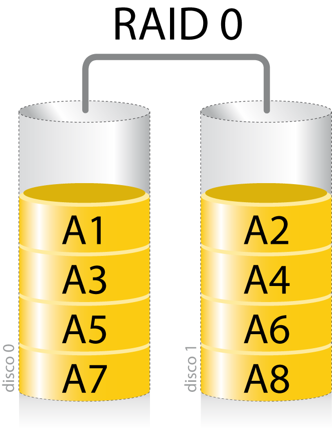
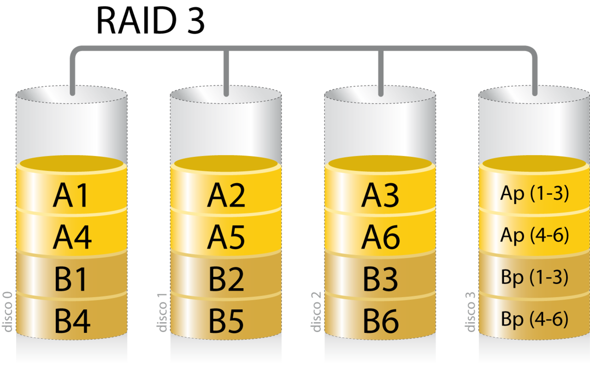
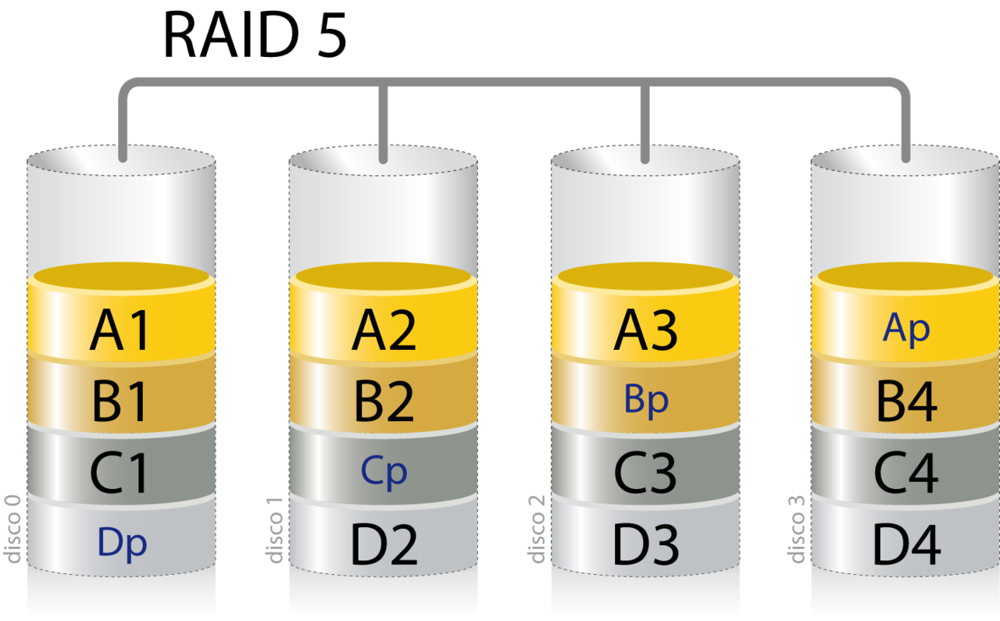
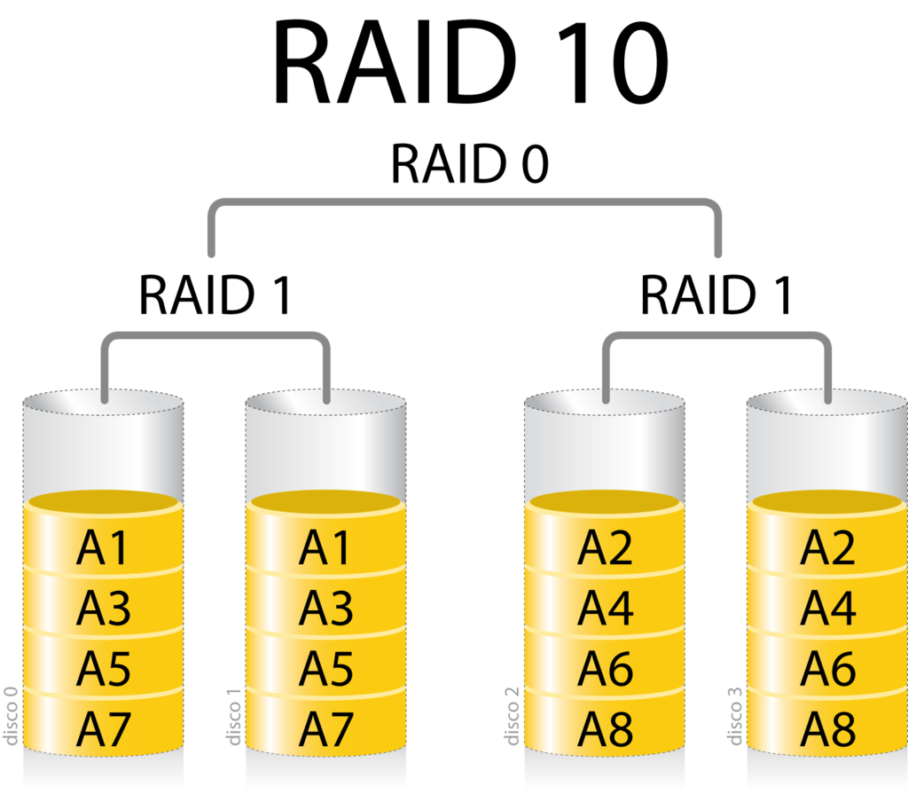

# Sistemas de tolerancia a fallos.

El término **RAID** es un acrónimo del inglés **"Redundant Array of Independent Disks" (matriz redundante de discos independientes)**. RAID combina varios discos duros para formar una única unidad lógica en la que se almacenan los datos de forma redundante. Ofrecen tolerancia a fallos y altos niveles de rendimiento que un sólo disco duro o un grupo de discos duros independientes. Si se produce un fallo, el RAID mantiene el servidor activo y en funcionamiento mientras se sustituye la unidad defectuosa. Se utiliza también con mucha frecuencia para mejorar el rendimiento de servidores y estaciones de trabajo. Estos dos objetivos, **protección de datos y mejora del rendimiento**, no se excluyen entre sí.

Un RAID ofrece varias opciones de configuración, llamadas niveles RAID, cada una de las cuales proporciona un equilibrio distinto entre tolerancia a fallos, rendimiento y coste. Además, todos los sistemas RAID suponen la pérdida de parte de la capacidad de almacenamiento de los discos, para conseguir la redundancia o almacenar los datos de paridad.

Los sistemas RAID profesionales deben incluir los elementos críticos por duplicado: fuentes de alimentación y ventiladores redundantes y deben ser extraíbles en caliente (Hot Swap). De poco sirve disponer de un sistema tolerante al fallos de un disco si después falla por ejemplo una fuente de alimentación que provoca la caída del sistema.

Un RAID ofrece las siguientes ventajas:

- **tolerancia a fallos**, protege contra la pérdida de datos y proporciona recuperación de datos en tiempo real con acceso ininterrumpido en caso de que falle un disco.
- **mejora del rendimiento/velocidad**, consta de dos o más discos duros que ante el sistema principal funcionan como un único dispositivo. Los datos se desglosan en fragmentos que se escriben en varias unidades de forma simultánea. Este proceso, denominado fraccionamiento de datos, incrementa notablemente el rendimiento.
- **mayor fiabilidad**, emplean dos técnicas para aumentar la fiabilidad: **la redundancia de datos y la información de paridad**. La redundancia implica el almacenamiento de los mismos datos en más de una unidad. De esta forma, si falla una unidad, todos los datos quedan disponibles en la otra unidad de inmediato. Aunque este planteamiento es muy eficaz, también es muy costoso, ya que exige el uso de conjuntos de unidades duplicados. El segundo planteamiento para la protección de los datos consiste en el uso de la paridad de datos. RAID utiliza un algoritmo matemático para generar información de paridad. Cuando se produce un fallo en una unidad se leen los datos correctos que quedan y se comparan con los datos de paridad almacenados por la matriz.
- **alta disponibilidad**, que depende de dos aspectos: la integridad de los datos y tolerancia a fallos. La integridad de los datos se refiere a la capacidad para obtener los datos adecuados en cualquier momento. La mayoría de las soluciones RAID ofrecen reparación dinámica de sectores, que repara sobre la marcha los sectores defectuosos debidos a errores de software. La tolerancia a fallos, el segundo aspecto de la disponibilidad, es la capacidad para mantener los datos disponibles en caso de que se produzcan uno o varios fallos en el sistema.

## Tipos de RAID.

Los niveles de RAID pueden implementarse en dos tipos de tecnología: basada en software y basada en hardware, y estos últimos pueden estar basados en host o RAID externo.

Los RAID basados en software vienen por defecto como una opción en la configuración de los sistemas operativos. Sin embargo, no son implementaciones adecuadas en la mayoría de los casos y cada vez son menos empleados por su bajo rendimiento.

La ventaja de los RAID basados en hardware es su independencia de la plataforma o sistema operativo, ya que son vistos por éste como un gran disco duro más, y con un mejor rendimiento.

Dentro de los RAID basados en hardware encontramos los basado en host, que utilizan controladoras conectadas a una ranura PCIe del equipo servidor. Ofrece ventajas significativas en lo que respecta a rendimiento, integridad de los datos y gestión.

Sin embargo, la solución más profesional y recomendada es la solución hardware RAID externa. En este caso, las operaciones RAID se llevan a cabo mediante un controlador situado en el sistema externo, que se conecta al servidor mediante un adaptador de bus de host iSCSI, SCSI, SAS o Fibre Channel. Las soluciones RAID externas son independientes del sistema operativo, aportan mayor flexibilidad y permiten crear sistemas de almacenamiento de gran capacidad para servidores de gama alta.

Aún así, los RAID por software se usa de forma extendida debido a un factor muy importante: su costo y facilidad de implementación. Serán éstos los que se tratarán en este punto.



### Niveles de RAID\.

La elección de los diferentes niveles de RAID va a depender de las necesidades del sistema en lo que respecta a factores como seguridad, velocidad, capacidad y coste. No hay un nivel mejor que otro, cada uno es apropiado para determinadas aplicaciones y entornos informáticos. De hecho, resulta frecuente el uso de varios niveles RAID para distintas aplicaciones del mismo servidor. De este modo se dispone de varios niveles básicos con los que se pueden crear otros mucho más complejos.

- **RAID 0: Data Striping**
  También conocido como fraccionados. Reparte los datos en pequeños segmentos que se distribuyen entre varias unidades. Este nivel de RAID **no ofrece tolerancia al fallos, ya que no existe redundancia**. El fallo de cualquier disco del RAID tendría como resultado la pérdida de los datos y sería necesario restaurarlos desde una copia de seguridad.
  Por contra ofrece una **velocidad de transferencia de datos la cual aumenta en relación al número de discos que forman el conjunto**. Esto representa una gran ventaja en operaciones secuenciales con ficheros de gran tamaño. Es aconsejable en aplicaciones que necesiten un almacenamiento a gran velocidad pero que no requiera tolerancia a fallos. Para implementar una solución RAID 0 se necesita un mínimo de dos unidades de disco.
  

- **RAID 1: Mirroring**

También llamado discos en espejo, se basa en la utilización de discos adicionales sobre los que se realiza una copia síncrona de los datos. Ofrece una excelente disponibilidad de los datos con redundancia. Para ello, se duplican todos los datos de una unidad en otra. De esta manera se asegura la integridad de los datos y la tolerancia al fallos, pues en caso de avería, la controladora sigue trabajando con los discos no dañados sin detener el sistema. Es una buena solución para las aplicaciones que requieren redundancia cuando **hay sólo dos unidades disponibles**. Los servidores de archivos pequeños son un buen ejemplo. Se necesita un mínimo de dos unidades para implementar un RAID 1.


- **RAID 3: Paridad.**

  Dedica un único disco al almacenamiento de información de paridad. La información de ECC (Error Checking and Correction) se usa para detectar errores y corregirlos. La recuperación de datos se consigue mediante operaciones del tipo O exclusivo (XOR) de la información registrada en los otros discos. Las operaciones de lectura y escritura acceden a todos los discos al mismo tiempo, por lo cual el RAID 3 es mejor para sistemas de un sólo usuario con aplicaciones que utilicen ficheros de gran tamaño.
  Ofrece altas tasas de transferencia, alta fiabilidad y alta disponibilidad, a un coste inferior que un Mirroring (RAID 1). Sin embargo, su rendimiento en escritura es menor e igual al de un disco debido a que la información de paridad ha de escribirse siempre en el mismo disco. Se necesita un mínimo de tres unidades para implementar una solución RAID 3.
  

- **RAID 5: Paridad distribuida.**

  Este RAID optimiza la capacidad del sistema mediante el uso de paridad distribuida. Esto lo consigue mediante el cálculo de información de paridad y su almacenamiento alternativo por bloques en todos los discos del conjunto. La información del usuario se graba por bloques y de forma alternativa en todos ellos. De esta manera, si cualquiera de las unidades de disco falla, se puede recuperar la información en tiempo real mediante una operación lógica de O exclusivo a partir de la información de paridad y los datos de los otros discos.
  El RAID 5 ofrece la mejor relación rendimiento-coste, gracias a la combinación del fraccionamiento de datos y la paridad como método para recuperar los datos en caso de fallo.
  Este nivel de array es especialmente indicado para trabajar con sistemas operativos multiusuario. Puede configurarse si se dispone **de tres unidades de disco** en la configuración, aunque su resultado óptimo de capacidad se obtiene a partir de seis.
  Estos son las tres configuraciones básicas de RAID. La combinación de ellas da como resultado otros tipos de matrices combinados y más especializados. Son los RAID híbridos.

  

  - **RAID 6: Doble paridad.**

    Es similar al RAID 5, pero incluye un segundo esquema de paridad distribuido por los distintos discos y por tanto ofrece tolerancia extremadamente alta a las averías de disco, pues soporta el fallo simultáneo de dos discos. No obstante, este elevado nivel de seguridad tiene como contrapartida un menor rendimiento en la escritura debido a que debe llevar a cabo dos escrituras de paridad por cada una de datos. A pesar de ello es un nivel de RAID que se utiliza frecuentemente en entornos donde prima la seguridad por delante de la velocidad.

  - **Combinando sistemas: RAID 10**
    Combinación de los RAID 1 y 0 que proporciona velocidad y tolerancia a fallos simultáneamente. El nivel de RAID 10 fracciona los datos para mejorar el rendimiento, pero también utiliza un conjunto de discos duplicados para conseguir redundancia de datos. Al ser una variedad de RAID híbrida, RAID 10 combina las ventajas de rendimiento de RAID 0 con la redundancia que aporta RAID 1. Sin embargo, la principal desventaja es que requiere un mínimo de cuatro unidades y sólo dos de ellas se utilizan para el almacenamiento de datos. Las unidades se deben añadir en pares cuando se aumenta la capacidad, lo que multiplica por dos los costes de almacenamiento.
    Existen numerosas combinaciones de arrays mucho más complejas y específicas para ciertos sistemas. Por ejemplo el RAID 30 que conecta dos RAID 3 a través de un RAID 0, lo el cual necesita un mínimo de seis discos, o el RAID 100 , para dotar de una seguridad extrema al sistema de ficheros.
    Hay que tener en cuenta el coste de espacio a la hora de implementar cada una de estas soluciones. La utilización de varios discos no convierte la capacidad del RAID con la suma de éstos, sino que es posible que se deba sacrificar hasta un 50% del espacio en aras de la seguridad y/o el rendimiento
    

### Creación de un RAID

Desde la <span class="menu">Administración de equipos</span> en Microsoft Windows Server es desde donde se lanzan los asistentes que guiarán al administrador durante la creación de estos dispositivos. Hay que tener en cuenta la nomenclatura que utiliza Microsoft y hay que familiarizarse con ella:

- **volumen simple**, adscrito a un único dispositivo físico.
- **volumen distribuido**, los estudiados en esta unidad.
- **volumen seccionado**, hace referencia un RAID 0.
- **volumen reflejado**, contiene un RAID 1 o Espejo.
- **volumen RAID-5**, su nombre en indicativo.

La creación de estas matrices viene guiada por un asistente que se inicia desde El <span class="menu">Administrador de equipos</span>. Basta con pulsar con el botón derecho sobre un disco para comenzar el asistente.

Algo más laboriosa es la creación de un RAID 10. Para ello será necesario la creación de dos grupos de almacenamiento de dos discos cada uno y sobre ellos, implementar un RAID 0.

Como siempre, en Ubuntu Server estas tareas se realizarán desde el terminal y para ello será necesario la instalación del paquete mdadm, si no estuviera instalado.

```bash title=""

sudo apt-get install mdadm
```

El comando `mdadm` permite la creación, administración, monitorización de RAID en GNU/Linux y su uso es muy intuitivo, si se conoce el concepto de volumen dinámico y matriz. Una vez diseñado y colocado en el sistema los discos necesarios, tan sólo habrá que crear el comando necesario.
Las acciones que mdadm acepta son:

- `--create`, para crea una nuevo RAID.
- `--detail, --query o –-misc`, muestra información de un RAID.
- `--examine`, información de las unidades físicas que componen el RAID.
- `--fail`, marcar un dispositivo como fallido
- `--remove`, eliminar un dispositivo del RAID o eliminar el propio RAID.
- `--stop`, detiene el RAID para modificar sus discos. Se utiliza si no se dispone de tecnología “en-caliente” para la desconexión de los discos.
- `--add`, añade un dispositivo al RAID.

Otra de las opciones necesarias para la creación de un RAID es su nivel, el cual se especifica a través de la opción `–-level`, de este modo 0 indica RAID 0, 1 crea un RAID 1, 5 construye un RAID 5 y 10 monta un RAID 10, entre otras opciones. El siguiente comando crea un RAID 1 con los dispositivos `/dev/sdb y /dev/sdc` y que tendrá como archivo de dispositivo `/dev/md/md0`

```bash title=""

  sudo mdadm -–create -–verbose /dev/md/md0 –-level=1 –-raid-devices=2 /dev/sdb /dev/sdc
```

El proceso de creación de un RAID puede ser largo y no debe interrumpirse. Es posible consultar el estado de creación a través del comando

```bash title=""

sudo cat /proc/mdstat
```

el cuál informa del estado de creación de la siguiente manera

```bash title=""

Personalities : [linear] [multipath] [raid0] [raid1] [raid6] [raid5] [raid4] [raid10]
md127 : active raid1 sdc[1] sdb[0]
104792064 blocks super 1.2 [2/2] [UU]
[=======>.............] resync = 37.8% (39644032/104792064) finish=5.4min speed=200310K/sec
unused devices: <none>
```

Una vez creado se puede consultar sus características con el comando
sudo mdadm –detail /dev/md/md0
El cual ofrece el siguiente resultado

```bash title=""

/dev/md/md0:
Version : 1.2
Creation Time : Wed Jul 18 16:16:39 2018
Raid Level : raid1
Array Size : 104792064 (99.94 GiB 107.31 GB)
Used Dev Size : 104792064 (99.94 GiB 107.31 GB)
Raid Devices : 2
Total Devices : 2
Persistence : Superblock is persistent

    Update Time : Wed Jul 18 16:25:25 2018
          State : clean

Active Devices : 2
Working Devices : 2
Failed Devices : 0
Spare Devices : 0

           Name : ubuntuserver:md0  (local to host ubuntuserver)
           UUID : 71cee8c2:16078f1e:60d18789:a31904eb
         Events : 17

    Number   Major   Minor   RaidDevice State
       0       8       16        0      active sync   /dev/sdb
       1       8       32        1      active sync   /dev/sdc
```

Se trata de un informe completo en donde se identifica el nivel de RAID, los dispositivos que lo conforman así como si están activos, fallidos o en reserva. Información muy útil que el administrador deberá revisar periódicamente.
El resultado de todo este proceso es un nuevo dispositivo en el sistema, pero que contiene dos unidades de disco duro físicas. Tras su creación es necesario dotarlo de un sistema de archivos, un punto de montaje y añadir este dispositivo en el fichero fstab para su auntomontaje al inicio de sesión, como ya se ha visto con anterioridad.

### Supervisar un RAID.

La aplicación `mdadm` también ofrece herramientas para la supervisión de los RAID creados. Cuando `mdadm` está configurado para ejecutarse como un demonio genera informes sobre los eventos detectados a través de correo electrónico, de notificación o syslog. Por defecto, `mdadm` escanea todas dispositivos existentes y registra cualquier evento detectado en `/var/log/syslog`. Si el sistema posee un gran número de estos dispositivos o si es necesario centrarse en uno de ellos, es posible indicarlos en el fichero mdadm.conf situado en `/etc/mdadm/mdadm.conf `añadiendo la siguiente línea al final del fichero

`ARRAY /dev/md/md0 devices=/dev/sdb,/dev/sdc`

Tras modificar el fichero, será necesario reiniciar el demonio con

```bash title=""
service mdmonitor restart
```

Si en alguno de estos informes se detecto un error en uno de los dispositivos, será necesario la sustitución de ese disco. El primer paso es marcar este dispositivo como fallido

```bash title=""
sudo mdadm /dev/md/md0 –fail /dev/sdb
```

para después proceder a retirarlo de la matriz

```bash title=""
sudo mdadm –remove /dev/md/md0 /dev/sdb
```

Una vez que se haya instalado de forma correcta en el servidor, es decir, se saque el disco del equipo y se coloque el nuevo, será necesario añadir este dispositivo a la matriz

```bash title=""
sudo mdadm /dev/md/md0 –add /dev/sdd
```

y reconstruir la matriz con los nuevos discos

```bash title=""
sudo mdadm --assemble /dev/md/md0 /dev/sdc /dev/sdd
```

Es posible anticiparse al fallo de un dispositivo incluyendo uno en la matriz que actúe como reserva. En el ejemplo anterior, si el disco /dev/sdd se hubiera configurado como reserva, no hubiese sido necesario todo este proceso, el propio RAID desactivaría el disco fallido y lo implementaría en la matriz. Para realizar esta reserva es necesario usar la opción `–-spare-devices=1 /dev/sdd` durante la creación de la matriz, o añadirlo con posterioridad con el comando

```bash title=""
sudo mdadm –add /dev/md/md0 /dev/sdd
```

Al añadir un nuevo dispositivo y no realizar la reconstrucción con la opción `–-assemble`, este nuevo dispositivo queda en la reserva.
