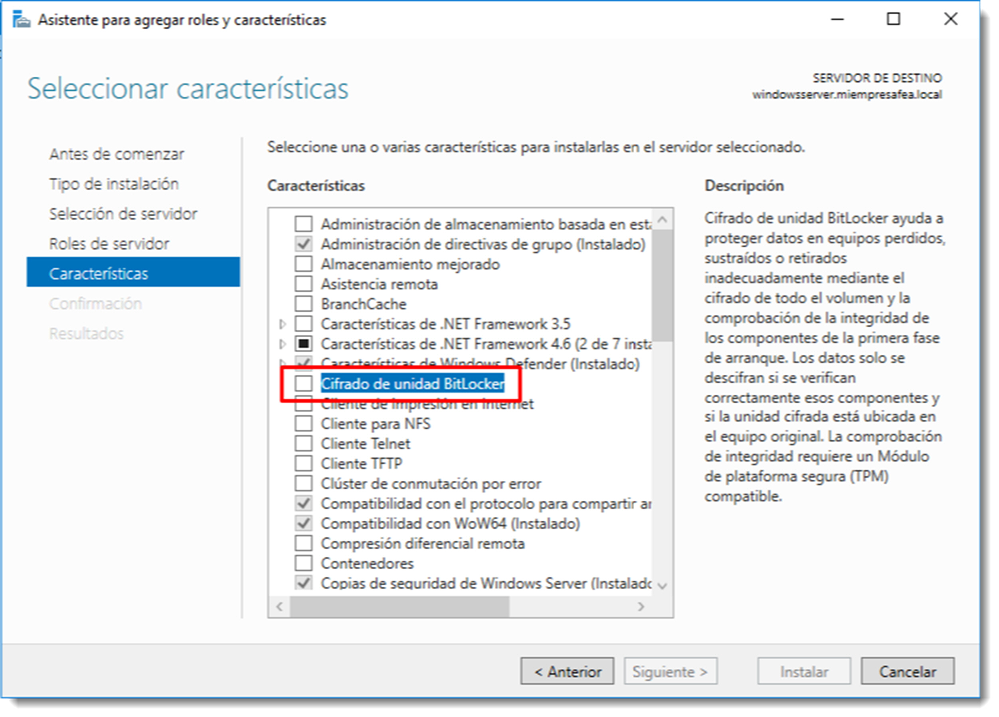
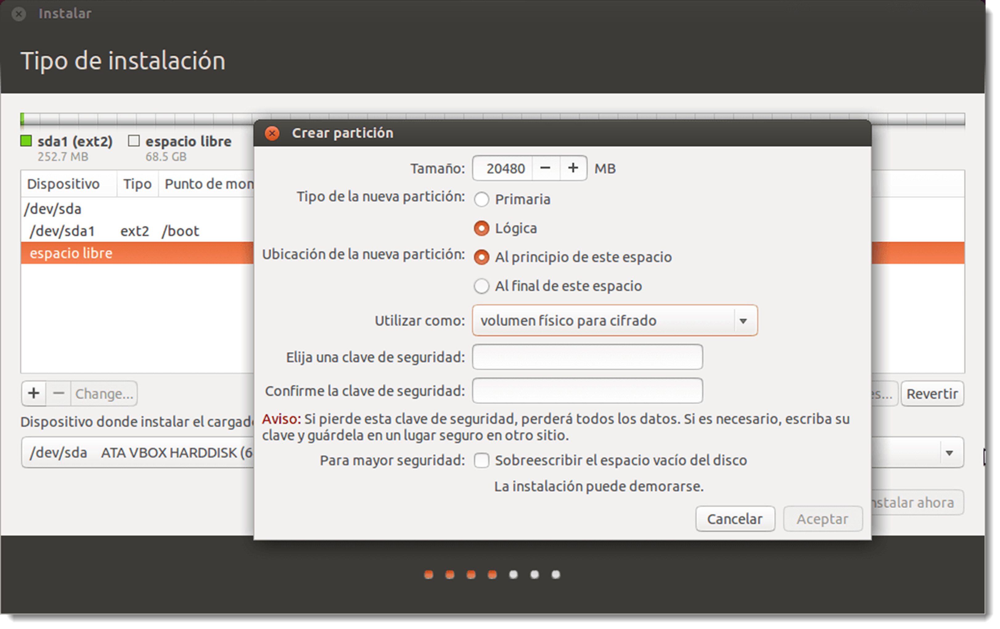

# Encriptación de datos.

El cifrado es una tecnología que protege la información contenida en el sistema, convirtiéndola en un código ilegible que no resulta fácil descifrar sin la clave de descifrado. Si esta técnica se aplica a un disco, unidad, partición o volumen se evita el acceso no autorizado a la información contenida en ellos.

Es habitual que el proceso de cifrado se realice de forma transparente, también conocido como cifrado en tiempo real. Es un método en el que los datos son automáticamente cifrados o descifrados al mismo tiempo que son leídos o escritos. Si se introduce un archivo en una unidad cifrada, de forma automática ese archivo pasará a estar cifrado con la clave de cifrado de la unidad.
Algo a tener en cuenta es que el cifrado de unidades no reemplaza en ningún caso al cifrado de ficheros. Es posible combinar ambos sistemas de cifrado si es necesario dotar de seguridad reforzada a ciertos contenidos del disco. Si un intruso consigue acceso al sistema en tiempo de ejecución, también tendrá acceso a todos los archivos del mismo. El cifrado de archivos dota de seguridad extra a la información sensible contenida en la unidad.
En sistemas de ámbito empresarial ya es muy común el uso del **TPM (Trusted Platform Module)** tanto en servidores como en equipos cliente, especialmente en portátiles. Se trata de un chip integrado en la placa base del ordenador que se encarga de cifrar la información y asociarla a ese dispositivo. Por lo tanto, la información contenida en las unidades de almacenamiento tan sólo podrá ser descifrada si se encuentra conectado a placa base que lo encriptó. Dado que cada chip TPM es único para cada dispositivo en particular, es capaz de realizar la autenticación de de la información de los datos contenidos en el soporte de almacenamiento. El problema reside en si es la placa base o el chip TPM el que se avería. En ese caso sería necesario recurrir a copias de seguridad externas para recuperar la información. Existen numerosas herramientas para la encriptación de la información. Sin embargo, se pueden clasificar en tres tipos:

- **cifrado por software**, en la que es un programa el que se encarga de cifrar/descifrar la información. Tiene un impacto sensible en el sistema y puede resultar un proceso lento en función de la carga de trabajo.
- **cifrado hardware basado en la localización de dispositivos de almacenamiento**, que usa el chip TPM para el cifrado de datos. No tiene un impacto significativo en el rendimiento del sistema.
- **cifrado hardware basado en otros componentes**, el cual funciona de forma similar al TPM, pero que usa otro hardware como el procesador o la dirección física de la tarjeta de red para realizar el cifrado. Este es el único cambio, ya que comparten inconvenientes si se sustituye el hardware.

Los sistemas operativos de Microsoft disponen de varias aplicaciones de terceros para realizar esta tarea como _TrueCrypt, AES Crypt o AxCrypt_, que son muy intuitivas gracias a su interfaz gráfica. Pero el propio sistema operativo también dispone de _BitLocker_ y es posible activarlo para volúmenes internos como pata externos. Para acceder a _BitLocker_ hay que dirigirse a <span class="menu">Panel de control</span> → -<span class="menu">Sistema y seguridad</span> → <span class="menu">Cifrado de unidad BitLocker</span>, y activarlo en las unidades que se necesite encriptar. Como es habitual, esta acción lanza un asistente que guiará al usuario durante el proceso.

Para modificar las características de cifrado como el algoritmo de encriptación o la longitud de la clave, hay que dirigirse a la directiva de grupo correspondiente, situada en <span class="menu">Directiva de Equipo local </span>→ <span class="menu">Configuración del equipo</span> → <span class="menu">Plantillas Administrativas</span> → <span class="menu">Componentes de Windows</span> → <span class="menu">Cifrado de unidad BitLocker</span> . El cambio de configuración de las técnicas de cifrado a través de estas directivas, no afecta a las unidades ya cifradas, sino a los que se encripten tras su modificación. Recuerda que una vez cambiada una directiva de grupo, es posible que los cambios no se vean reflejados has los siguientes noventa minutos. Si el tiempo apremia, es posible forzar la actualización con el siguiente comando

```PowerShell title=""

gpupdate /target:Computer /force
```

En Microsoft Windows Server esta aplicación no viene instalada por defecto y, por tanto, habrá que instalar la característica <span class="menu">Cifrado de unidad Bitlocker</span> desde el instalador de roles y características, como es habitual. Además de ésta, el sistema debe instalar el <span class="menu">Visor de contraseñas de recuperación de BitLocker</span> que se encargará de la gestión de las contraseñas de cifrado.


El proceso de encriptado que usa BitLocker funciona a través de asistentes muy intuitivos, por lo que no se profundizará en este apartado.

También es posible el cifrado de cualquier archivo del sistema accediendo a sus propiedades, a través de la pestaña <span class="menu">General</span> → <span class="menu">Avanzados…</span>, en el diálogo siguiente se elegirá la opción Cifrar contenido para proteger datos.

En los sistemas operativos basados en GNU/Linux es posible realizar esta operación tanto en clientes como en servidores. Ubuntu Desktop ofrece la posibilidad de crear particiones cifradas durante el proceso de creación de una partición. En la opción de Utilizar como se elige **Volumen físico para cifrado**, inmediatamente después se pedirá al usuario una contraseña de encriptación y, de forma transparente, el sistema operativo encriptará cada uno de los datos que contenga o se depositen en esta unidad.



De la misma forma, ese sistema operativo permite la encriptación de la carpeta personal /home del usuario, por si no se requiere el cifrado de todo un volumen. Será tan sencillo como, durante el proceso de creación de un usuario, marcar la opción de **Cifrar mi carpeta personal**.

También es posible la instalación de aplicaciones que realicen estas tareas y tener más libertad a la hora de elegir qué partes de un volumen se deben cifrar y cuales no. Son varias aplicaciones la que dan esa libertad al usuario como VeraCrypt, LUKS o eCryptfs la cual permite tanto el cifrado de carpetas únicamente como el de volúmenes enteros. Por su versatilidad se tratará la última de ellas.
Lo primero que hay que hacer es instalar el software necesario

```bash title=""

sudo apt-get update | sudo apt-get install ecryptfs-utils
```

Esta aplicación permite el cifrado de volúmenes, carpetas de usuario `(ecryptfs-migrate-home)`, área de intercambio `(ecryptfs-setup-swap)` y cualquier carpeta del sistema. Para realizar el cifrado de cualquier carpeta, bastará con montarla sobre sí misma usando un sistema de archivos proporcionado por ecryptsfs

```bash title=""

sudo mount -t ecryptfs /home/administrador/feo /home/administrador/feo
```

Lanzado el comando, preguntará varias cosas como la contraseña de cifrado, el tipo de cifrado, la longitud de éste, si se desea guardar la clave de cifrado en un fichero (totalmente desaconsejable) y, por último, si se desea encriptar también el nombre de los ficheros y no sólo su contenido. Para acceder a esta carpeta o para descifrarla habrá que utilizar, como parece lógico, la contraseña creada durante el proceso de cifrado. El proceso de descifrado se realiza desmontando esta carpeta con el comando `umount`.

Hay que tener presente que el cifrado de datos
no solo consume recursos del sistema, sino que también aumentará el espacio consumido por los archivos cifrados.
