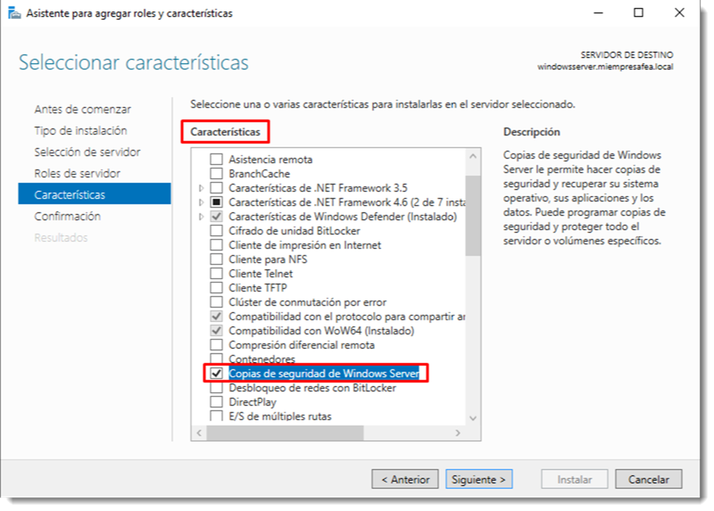

# Copias de seguridad del sistema

Es vital que uno de los principales activos de la empresa como lo es su información, se mantenga a salvo de posibles pérdidas. Aún así, es muy común el descuido de esta práctica convirtiéndolo en algo accesorio y no recibiendo la importancia que se merece.

La verdadera utilidad de crear copias de seguridad reside en la **recuperación de la información de una forma rápida y sencilla**. Además, será necesario la comprobación periódica del proceso y consulta de bitácoras para poder garantizar que el proceso se está efectuando de forma correcta.

Se dispone de diferentes tipos de copia de seguridad que se usarán en función de los datos a respaldar y las necesidades del sistema. No serán tratados por igual los ficheros que contienen la información de los datos de contabilidad que los datos personales de usuarios del sistema. Los primeros serán objeto de respaldos con una periodicidad mayor que los segundos, debido fundamentalmente a la impronta de su pérdida.
Tan importante como los datos de la empresa, es lo copia de seguridad del propio sistema. Es de vital importancia que la herramienta que gestiona el directorio se mantenga respaldado en todo momento y pueda ser sustituido en caso necesario.
Para ello se dispone de varios tipos de copias de seguridad:

- **copias completas**, es el formato de copia más sencillo y se basa en realizar una copia de todos los datos en otro soporte como cintas, discos duros externos, soporte ópticos, etcétera. La ventaja es que se dispone de todos los datos en cada copia por lo que se podrá acceder a diferentes versiones de los archivos guardados. Además estas copias pueden ser comprimidas y cifradas si así se requiere. Los inconvenientes son evidentes:**tiempo y costo de almacenaje**.
  Por ejemplo, se realiza una copia de seguridad de todos los datos los viernes, al cierre de la empresa.
- **copias diferenciales**, solo realiza la copia de los archivos que han cambiado desde la última copia completa, exceptuando la primera vez que se realiza, que tendrá el mismo comportamiento que la copia completa. Su principal ventaja es que son más rápidas y su impacto en el sistema es mucho menor.
  Por ejemplo, se realiza una copia diaria al cierre de la jornada. La copia del martes contendrá todos los datos que se han modificado desde la última copia completa. Así, el martes contendrá los datos que se han modificado ese mismo día más los del día anterior. A medida que la copia diferencial de aleja de la completa, crece en tamaño y carga en el sistema.
- **copias incrementales**, sólo realizan copias de los datos **que han cambiado desde la última copia de seguridad**, se trate de una completa o diferencial.
  Por ejemplo, si la copia se realiza el martes, tan sólo contendrá los archivos modificados desde la última copia realizada. Contendrá los ficheros modificados el martes y no los del lunes. Al ser una copia más pequeña se puede ejecutar con mayor periodicidad ya que el impacto sobre el sistema es menor.
- **copias espejo**, son similares a las copias completas salvo por la diferencia de que los archivos no pueden ser comprimidos ni cifrados. Las desventajas son claras: **consumo de espacio elevado y poca seguridad.**

## Programación de copias de seguridad

Una buena planificación de las copias de seguridad debe tener en cuenta varios factores como la importancia de los datos a respaldar, el impacto del proceso en el sistema y consumo de recursos. No existen una única solución válida de copias de seguridad. Correrá cargo del administrador del sistema especificar un plan de respaldo combinando todos los factores mencionados con anterioridad.

De este modo, las copias completos proporcionan una buena alternativa si queremos tener mayor tolerancia a fallos y una restauración más rápida. Realizar copias completas diarias, está recomendado para empresas con volúmenes de datos muy pequeños, ya que tendremos un elevado nivel de protección a cambio de un moderado coste de almacenamiento.

Si se opta por una copia completa semanal en combinación con incrementales diarias, se obtendrá un proceso más rápido de copia y un menor coste de almacenamiento. Por contra, al disponer de un mayor número de copias, consumirá más tiempo restaurar la información.
Si se combina una copia completa semanal y diferenciales diarios, se conseguirán unos resultados intermedios: un mayor nivel de protección de los datos, tiempos de restauración más cortos y un pequeño incremento en el coste de almacenamiento.

Por supuesto las combinaciones van a depender de las necesidades de la empresa y la importancia de los datos a respaldar. Será el administrador el que decida una estrategia válida de respaldo que combine todos estos factores.

En unidades anteriores se ha tratado el tema de la salvaguarda de la información de los usuarios y documentos del sistema. En este apartado se tratará de la protección de la configuración del SO a través de copias de seguridad del sistema. Casi tan importante como mantener a salvo los datos de los usuarios es, sin lugar a dudas, mantener a salvo de errores y pérdidas la configuración de los controladores de dominio. Los motivos resultan obvios. Además, si las copias se encuentran programadas, la protección se producirá de forma automática con la frecuencia que se estime necesaria.

En los SO basados en Microsoft Windows, será necesario instalar la característica de **Copias de seguridad de Windows Server**. Recuerda que el proceso solicita la instalación de los roles antes que las características, por lo que pulsa el botón siguiente cuando solicite instalar un rol para pasar directamente a la instalación de características.



A partir de Microsoft Windows Server 2008 se utiliza la herramienta para copias de seguridad denominada Windows Server Backup, instalada en el apartado anterior. Esta utilidad destaca, entre otras funcionalidades, por:

- mejores prestaciones a la hora de realizar copias de seguridad completas del servidor
- copias parciales, es decir, sólo algunos de sus volúmenes
- copias de la configuración de aplicaciones de software base
- posibilidad de salvaguardar sólo el estado del sistema

Pero esta característica no instala sólo una herramienta, sino que está compuesta por varias utilidades que permiten un control total del proceso de respaldo y recuperación. Entre ellas hay que destacar **el complemento Copias de seguridad de MMC (Microsoft Management Console)**, que permite realizar estas copias también a través de CLI con el comando `wbadmin`, y que, además integra la extensión **Instantáneas de carpetas compartidas.**

Otra de estas herramientas es el Entorno de recuperación de Windows, que integra la herramienta de Recuperación de imagen del sistema, la **Herramienta de diagnóstico de memoria de Windows** y los comandos del símbolo del sistema.

Junto con la inclusión de este nuevo software, Microsoft ha eliminado el soporte y la utilidad `Ntbackup.exe`, que gestionaba las copia de seguridad previamente. No es posible por tanto recuperar datos almacenados en copias de seguridad realizadas con este sistema. No obstante, Microsoft ofrece de una versión que permite la recuperación de datos contenidos en copias de seguridad antiguas, aunque no es posible su respaldo completo.

Ahora que ya se dispone de una herramienta para la copia del sistema, es preciso planificar estas copias para que realicen en función de varios parámetros:

- **carga del sistema**, en efecto, no es buena idea realizar estas tareas cuando el sistema soporta la mayor carga de trabajo. Además de añadir una carga extra, la copia de seguridad se alargará en el tiempo quedando expuesta a una mayor posibilidad de sufrir errores.
- **horario de trabajo**, es muy recomendable que las copias se planifiquen fuera del horario laboral, en la medida de lo posible. Es durante la jornada laboral cuando se realizan los cambios en el sistema que hay que salvaguardar. Parece lógico que, al finalizar la jornada y con ella los cambios, se produzca la copia de seguridad del sistema.
- **adecuar la periodicidad de la copia, dependiendo de la actividad del sistema en general y sobre todo del flujo de la información**. En sistemas con poco cambios es posible espaciar las copias de seguridad. Por contra, cuando el sistema se enfrenta a continuos cambios será necesario realizar estas copias con una mayor asiduidad.
- **programación y tipo de copias**, es recomendable que el sistema sea capaz de realizar las copias de seguridad atendiendo a una programación, de forma desatendida y de tipo incremental.

Todas estas características las posee Windows Server Backup.

Para iniciar la gestión de copias de seguridad en Microsoft Windows Server tan sólo es necesario abrir la herramienta recién instalada y pulsar sobre el menú <span class="menu">Acción</span>. En él aparecen el acceso a tres asistentes que simplificarán al máximo esta tarea.

En Ubuntu Server existen varias opciones para realizar esta tarea a través de GUI como **BackupPC, Konserve o Grsync**. Casi todas las soluciones basadas en GUI utilizan por debajo el paquete `rsync` que es posible utilizarlo con CLI. Será este el modo en el que se trabajará en este apartado. Para comenzar a trabajar con ella, primero hay que proceder a su instalación, de la forma habitual

```bash title=""

sudo apt-get install rsync
```

`rsync` ofrece copias de seguridad de datos tanto totales como incrementales. Además tiene la posibilidad de comprimir y cifrar datos.

El uso de este paquete es

```bash title=""

rsync <opciones> <origen> <destino>
```

Al poderse utilizar en la línea de comandos, es posible añadirlo a la tabla de cron para programar las copias de seguridad, como ya se ha tratado en unidades anteriores.

Las opciones que ofrece rsync son, entre otras:

```bash title=""

- -a, copiar recursivamente manteniendo privilegios, fechas y permisos (similar a la opción conjunta -rlptgoD).
- -r, copia una carpeta de forma recursiva.
- -A, conserva los ACL de los ficheros.
- -g, mantiene el grupo al que pertenece el fichero.
- -o, preserva el propietario del archivo.
- -E, mantener ejecutabilidad de los ficheros.
- -v, activa el modo verbose.
- -z, comprimir los datos.
- --exclude, excluye archivos de un directorio en concreto o de un patrón determinado.
```

Las opciones de `rsync` son interminables. Como siempre, es altamente recomendable consultar la ayuda de este comando.

Una vez que se han seleccionado las opciones para la copia de seguridad, tan sólo habrá que escribir el comando

```bash title=""

rsync -aAXv --exclude={"/tmp/_","/mnt/_","/media/_","/lost+found/_"} /\_ /media/copia
```

Usando el conjunto de opciones `-aAX`, los ficheros son transferidos en modo archivo, asegurándose que los enlaces simbólicos, dispositivos, permisos, atributos de propiedad, tiempos de modificación, ACLs y atributos extendidos se mantienen intactos.

La opción `--exclude` hará que aquellos ficheros que coincidan con los patrones dados sean excluidos. /lost+found es específico del sistema de archivos, por lo que será excluido de la copia de seguridad. Entrecomillar los patrones de exclusión evitará su expansión por parte del intérprete de ordenes, lo que es necesario cuando, por ejemplo, se hacen copias de seguridad por SSH.

A la hora de hacer una copia de todo el sistema, hay que tener en cuenta algunas consideraciones:

- los contenidos de `/dev, /proc, /sys, /tmp` son creados al cargar el sistema, por lo que guardarlo es un trabajo totalmente inútil. Algo parecido con la carpeta `/lost+found`, estos datos no se generan al inicio del sistema, pero sí que pertenecen a una distribución de GNU/Linux en concreto. Todos estos contenidos es buena práctica excluirlos de la copia de seguridad del sistema.
- las carpetas `/mnt y /media` son excluidas para evitar la creación de bucles infinitos. Si se plantea hacer una copia de seguridad en alguna ubicación que no sea ninguna de éstas, es necesario añadirla a la lista de exclusión, por idéntico motivo.
- si el sistema usa un archivo `swap`, es buena idea de excluirlo también.
- hay que considerar si también hay que respaldar la carpeta `/home`. Los datos contenidos en esta carpeta serán considerablemente más cuantiosos que los del sistema. Además se puede excluir subdirectorios no importantes como `/home/_/.thumbnails/_, /home/_/.cache/mozilla/_, /home/_/.cache/chromium/_, /home/\_/.local/share/Trash/\*`, dependiendo del software que haya instalado en el sistema.
- separar la copia de seguridad del sistema de los datos de usuario puede ser buena idea.

Como siempre, la opción CLI ofrece más posibilidades que la versión GUI.
