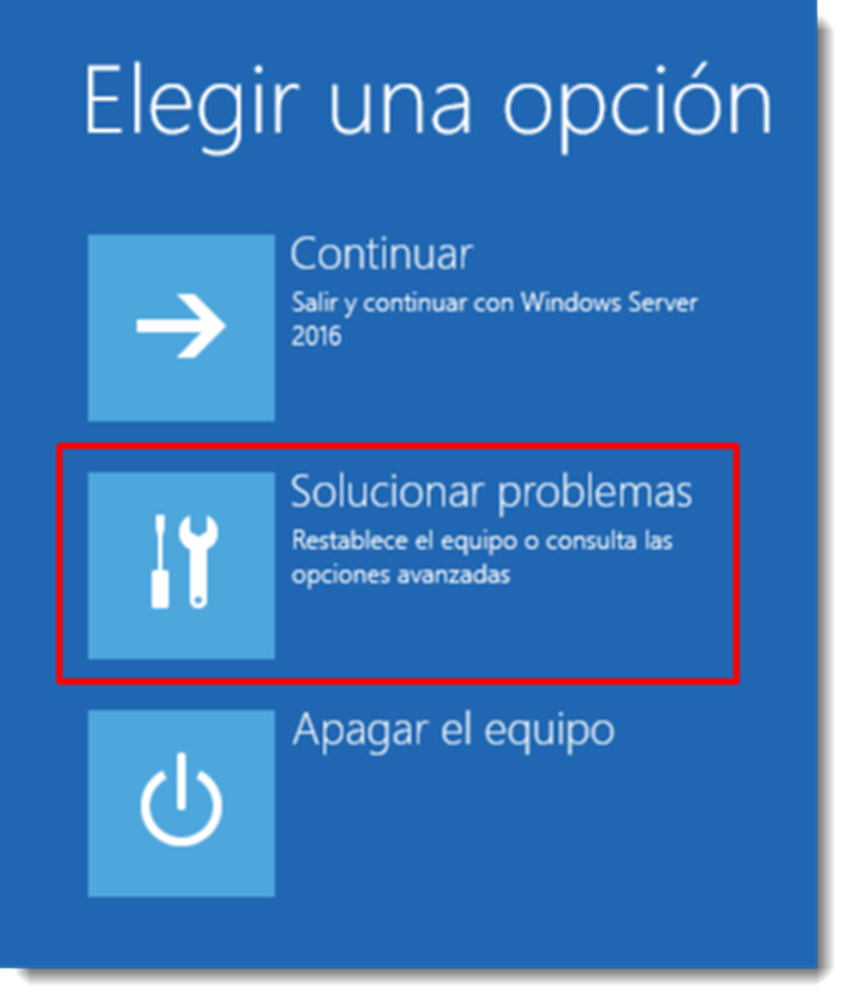

# Recuperación del sistema. Opciones de restauración del sistema

Si el sistema falla, presenta algún problema de rendimiento o sencillamente no inicia, el administrador del sistema deberá plantearse la restauración del sistema completo. Una de las incorporaciones del software Copia de seguridad Windows Server es precisamente ésta. Para ello será necesario haber realizado previamente una copia completa del sistema, tal y como se ha explicado en el punto anterior.

Existen varias formas de iniciar el proceso de recuperación, y dependerá de la sintomatología del servidor; si posee la capacidad de arrancar se utilizará la opción de Reparar el equipo a la que accederemos pulsando la tecla F8. Si no posee capacidad de arrancar, es posible utilizar el disco de instalación de Microsoft Windows Server. Esta última forma será utilizable en cualquiera de los casos de recuperación del sistema por lo que será buena idea aprenderla.

En los casos más graves en los que haya que sustituir parte del hardware o el equipo, será conveniente comprobar dos parámetros de vital importancia:

- que la unidad de almacenamiento sea de un tamaño **mayor o igual a la sustituida**. Aunque los volúmenes del disco a recuperar no ocupen la capacidad total del disco, en la definición del volumen en la tabla de particiones está definido hasta qué bloque puede llegar, por lo que será necesario tener esa capacidad como mínimo.
- que la arquitectura del procesador sea la misma o compatible. No es funcional una copia de seguridad realizada en una arquitectura diferente a la del equipo a restaurar. Es este caso sería necesario realizar una recuperación parcial una vez instalado el sistema.

Para iniciar el proceso de recuperación es necesario arrancar el sistema con el disco de instalación, seleccionar idioma y entrar en la opción Reparar el equipo. Se dispone de tres opciones; Continuar, Solucionar problemas o Apagar el equipo.

Al seleccionar la opción Solucionar problemas, es posible iniciar a través del símbolo del sistema o realizar una recuperación de imagen del sistema. Será la segunda la que se seleccionará. En caso de tener disponibles varias versiones del sistema operativo, preguntará cual de ellas es necesario recuperar.

Una vez especificado el sistema operativo, detectará las diferentes copias de seguridad de las que dispone el sistema y sugerirá la última realizada. Esta será la opción recomendable, aunque existe la posibilidad de seleccionar otra imagen del sistema.

Tras la selección de la copia, ofrece la posibilidad de volver a particionar y dar formato a discos pudiendo excluir alguno de los discos del sistema. Esta opción es válida si es necesario el reemplazo del disco duro por uno nuevo. De esta forma no será necesario el particionado previo, y se podrá dejar en manos del sistema de recuperación.

También, si el disco duro ha cambiado de tecnología, por ejemplo se ha cambiado un disco duro SATA por uno SAS, quizás sea necesario la inclusión de controladores para el correcto funcionamiento de este dispositivo. Por último, a través de la opción Opciones avanzadas… permite el reinicio del sistema al finalizar la copia y la comprobación de los datos.

Para realizar estas tareas en los sistemas operativos basados en GNU/Linux se usa el comando rsync intercambiando el origen y el destino. Si no se dispone de acceso al sistema, se deben seguir estos pasos:

- se inicia el equipo desde el disco de instalación de GNU/Linux y seleccionar la opción Live, con esta acción ya se dispone de un terminal con el que poder realizar las siguientes acciones.
- montar la unidad a reparar, por ejemplo en `/mnt/reparar.`
- montar la unidad de respaldo, por ejemplo en `/mnt/respaldo.`
- utilizar estos puntos de montaje para realizar un `rsync`, pero en sentido inverso.

Si la recuperación es de la información contenida en la carpeta `/home`, el proceso se simplifica ya que tan sólo será necesario realizar el último punto del listado anterior.
