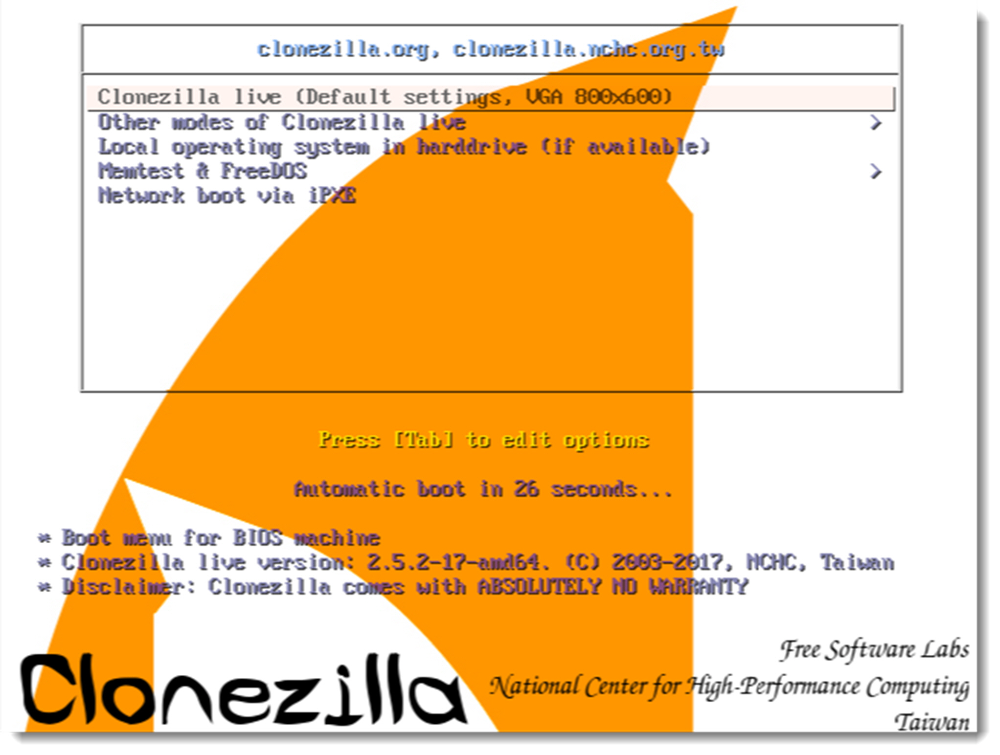
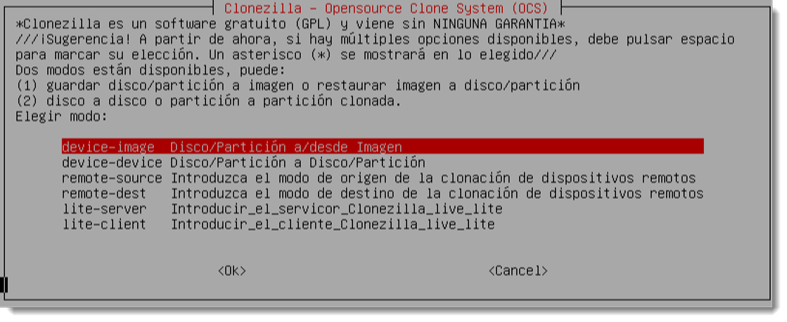
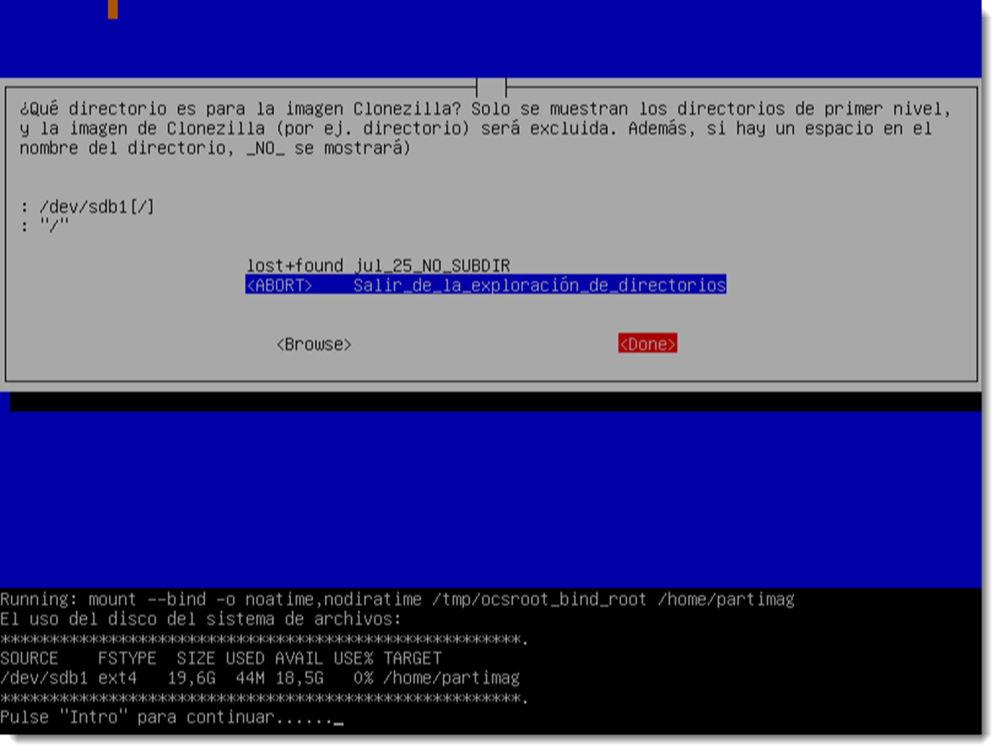
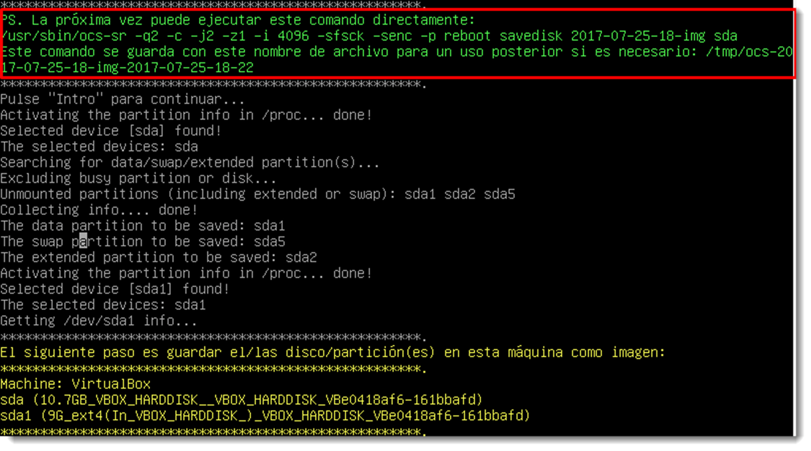

# Instalación por clonación

Tras la instalación del sistema operativo hay que proceder a su configuración y la instalación del software necesario. Son tareas que se repiten en cada uno de los clientes del sistema y, si estos son numerosos, convendría automatizar. Es habitual elegir uno de los ordenadores del sistema como modelo y realizar una copia del disco duro que se denomina imagen.

Esa imagen pasa a un dispositivo extraíble desde donde se podrá distribuir al resto de equipos.
A través de un software específico, esa imagen es clonada a cualquiera de los equipos del sistema informático con la ventaja de que todo el software estará instalado y configurado. Tan solo son necesarios unos pequeños ajustes, como cambiar el nombre al equipo o revisar los controladores, que consumen mucho menos tiempo que el trabajo completo.

Para poder realizar esta clonación es necesario que los equipos que reciben la imagen clonada dispongan de un hardware similar o compatible con el de la imagen copiada. Resulta evidente que no todos lo equipos de un sistema informático poseen el mismo hardware.

En estas ocasiones los técnicos de TIC pueden construir diferentes versiones de la imagen clonada en función de los requerimientos de cada ordenador.

La clonación de un equipo se puede realizar a través de varias formas, siendo las más comunes:

- a través de un dispositivo extraíble como un DVD, un pendrive o un disco duro externo, que habrá que conectar al equipo antes de iniciar el proceso.
- a través de la red, usando para ello las NIC (Network Interface Card) de los equipos. Para ello estas tarjetas deben ser compatibles con el protocolo PXE (Preboot eXecution Enviroment). Este punto se tratará de forma más extensa en lo sucesivo.
- a través de la nube, muchas empresas ofrecen servicios de Cloud (nube en inglés) para desempeñar esta tarea. Será necesario arrancar el ordenador desde un pendrive que cargará la interfaz necesaria para acceder a las imágenes.

La elección de uno u otro método será responsabilidad del técnico y se realizará en función de las necesidades o posibilidades del sistema informático.

Los sistema operativos de Microsoft, desde su versión Vista, ofrecen una herramienta en línea de comandos que se conoce como **ImageX**. Esta herramienta permite crear un archivo de imagen del sistema operativo para trasladarlo a otro ordenador. Para ello utiliza el formato WIN (Windows Imaging Format) que tiene la particularidad de ser arrancable gracias a la creación de un fichero anexo denominado **BOOT.WIN**. No se va a profundizar más en esta técnica, ya que este sistema tan sólo es válido para sistemas operativos de Microsoft.

Existen muchas herramientas de clonado independientes del sistema operativo, ya que se ejecutan antes de cargar el sistema operativo. Una de la empresas líder en este sector es Symantec con su producto Ghost Solution Suite, del cual podremos descargar una versión de prueba desde su página web. Es una excelente solución si se dispone de los medios económicos para implementarla, ya que posee una interfaz simple y efectiva que facilita la realización de todas estas tareas. No obstante, en este manual se ofrece la opción de usar software libre y gratuito para la realización de estas tareas.
Una alternativa de código libre bajo licencia GPL es Clonezilla. Ofrece dos versiones:

- **Clonezilla live**, está formada por una distribución GNU/Linux pequeña y arrancable desde un medio extraíble. Permite hacer la restauración de la máquina donde se ejecuta.
- **Clonezilla SE (Server Edition)**, requiere la instalación de un sistema operativo DRBL (Diskless Remote Boot in Linux) para dar respuesta a las solicitudes. Este sistema operativo se instala en un ordenador conectado a la red y compatible con el protocolo PXE (Preboot eXecution Enviroment). El servidor de imágenes almacenará las imágenes y las ofrecerá bajo demanda.

Esta herramienta ofrece las siguientes características:

- soporta casi todos los sistemas de ficheros comerciales
- es compatible tanto particionado MBR como GPT
- realiza copias de discos enteros como de particiones específicas.
- la imagen a clonar puede ser ofrecida de forma local, o a través de un servidor SSH (Secure Shell), Samba o WebDAV (Web Distributed Authoring and Versioning). - permite encriptar las imágenes para una mayor seguridad y confidencialidad de la información.

A pesar de tratarse de un software mimado por la comunidad y con una gran funcionalidad, todavía presenta algunas limitaciones:

- la partición de destino de la imagen ha de ser de igual o superior tamaño, a pesar de que el tamaño de la imagen sea inferior.
- no es posible realizar imágenes incrementales o diferenciales.
- el clonado on-line no está implementado, todavía.
- las imágenes creadas no pueden ser exploradas con ningún gestor de ficheros.

La comunidad no ceja en el empeño de subsanar estas limitaciones, que seguro que en un tiempo prudencial serán implementadas.

## Creación/restauración de una imagen con Clonezilla Live

Se va a desgranar los diferentes pasos que hay que seguir para crear/restaurar una imagen utilizando la herramienta Clonezilla Live.

- descargar el software _Clonezilla Live_ en formato ISO y arrancar una máquina virtual con esta imagen como primera opción de arranque. Además, se debe dotar a la máquina virtual de un segundo disco duro para contener la imagen. Se debe particionar de forma adecuada y asignarle un sistema de archivos al nuevo disco duro. Es conveniente etiquetar también el disco duro para que resulta fácilmente identificable.
- arrancar la imagen y seleccionar la opción “Clonezilla live (default settings, VGA 800x600)”. Tras esto seleccionaremos el idioma en el que aparecerá la interfaz y la configuración del teclado.
  
- para crear una imagen de un dispositivo, es preciso seleccionar la primera opción device-image, es decir, desde un dispositivo a una imagen. Además de ésta, ofrece la posibilidad de copiar un dispositivo a otro, cargar/enviar una imagen desde/hasta un servidor preexistente o configurar este ordenador como un servidor ligero de Clonezilla Server Edition, la cual desaparecerá al reiniciar el equipo.
- se selecciona el destino donde se guardará la imagen creada. Ofrece multitud de soluciones a través de diferentes servidores, pero en esta ocasión, el dispositivo está conectado de forma local. Tras esta selección, detectará los dispositivos conectados y se elegirá el que contendrá la imagen.
  
- será necesario crea un punto de montaje para que el programa pueda acceder al nuevo dispositivo. El punto de montaje será /home/partimag por defecto. Si es necesario cambiarlo, el nuevo nombre no deberá contener espacios en blanco.
  
- es posible seleccionar dos modos de asistente a partir de este punto. Se recomienda seleccionar el modo experto ya que ofrecerá más opciones. Después se seleccionará crear una imagen de un disco completo, es decir, con su tabla de particiones.
- se debe especificar un nombre a la imagen que se va a crear. Tras esto, se selecciona el disco duro de origen.
- a partir de aquí el asistente nos guiará a través de las diferentes opciones que el técnico dispone para realizar la imagen: modo de compatibilidad, configurar parámetros avanzados, de compresión de la imagen, si es necesario dividir el archivo resultante en volúmenes, comprobaciones de integridad del disco de origen/destino, si es necesario cifrar la imagen o no y qué hacer tras finalizar la clonación. Es altamente recomendable leer los mensajes que el programa nos ofrece, no están ahí de adorno.
  

- una vez configurada la imagen, el programa mostrará por pantalla el comando resultante que ejecutará en el terminal para crear la imagen. Guardar este comando para su reutilización es una práctica recomendable si se necesita repetir el proceso.

De este modo se ha creado una imagen desde un dispositivo. Ahora queda revisar el proceso inverso; volcar la imagen en una nueva máquina. Para ello, se seguirán los siguientes pasos:

- se creará una nueva máquina virtual con un disco duro de igual o superior tamaño al clonado. Además, se ha de desvincular el disco duro que contiene la imagen creada y colocarlo como segundo disco en la nueva máquina. Para finalizar, se ha de colocar la imagen del software Clonezilla Live en la unidad óptica de la nueva máquina.
- se inicia y configura el programa de igual forma que en el caso anterior. También es necesario indicar la misma opción que en el caso anterior device-image y a través de un dispositivo local local_dev, ya que el dispositivo se encuentra conectado directamente.
- se ha de seleccionar el dispositivo que contiene la imagen y que se necesita restaurar. Ésta estará contenida en una carpeta con el nombre facilitado a la hora de realizarla, que si no se ha modificado se ubicará en `/home/partimag.`
- entre las opciones que ofrece Clonezilla Live, se seleccionará la más apropiadas, en esta ocasión restoredisk. Se elige la imagen a restaurar, el destino de la misma, las opciones de la restauración, si es necesario crear una nueva tabla de particiones o se usa la que posee el archivo, las opciones de comprobación y qué hacer tras la restauración.

De este modo es como **Clonezilla Live** crea y restaura imágenes. El proceso es adaptable a cada situación ya que existen numerosas opciones de configuración y el programa es compatible con casi todos los sistemas de archivo existentes.
