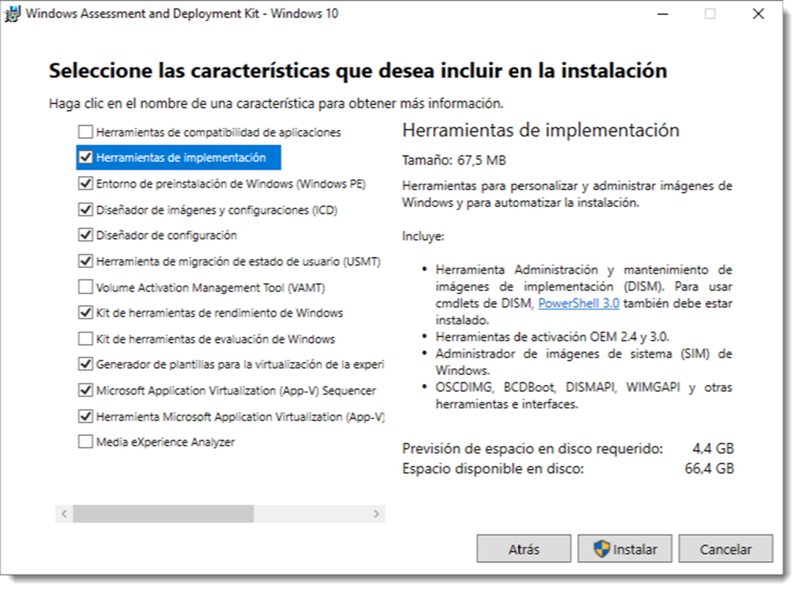
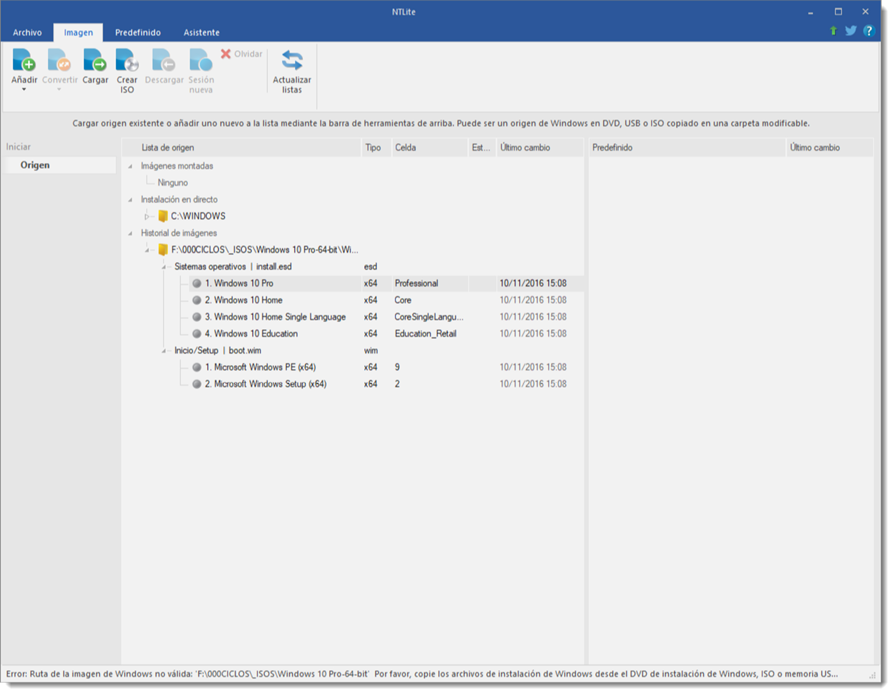

# Configuración y uso de instalaciones desatendidas

La instalación desatendida permite realizar esta tarea con poca intervención del usuario y se basa en archivo de respuesta. Este archivo contiene un guion en texto simple que indica el modo de instalarlo sin a penas intervención del usuario.

Tanto los sistemas operativos de Microsoft desde su versión Windows XP, como las distribuciones de GNU/Linux disponen de software destinado a realizar estas tareas. Los primeros cuentan con un conjunto de herramientas denominado Windows Assessment and Deployment Kit (Windows ADK). Se puede descargar desde su página web y contiene, entre otras, las Herramientas de implementación.


Tras su instalación, se accede a través de <span class="menu">Inicio</span> → <span class="menu">Windows Kits</span> → <span class="menu">Administrador de Imágenes del Sistema de Windows</span>. Se debe disponer de acceso lectura escritura a un fichero de imagen WIM (Windows Imaging Format), por lo que es necesario copiar el contenido de una imagen ISO al disco duro. Una vez copiada, se especifica la ruta de acceso al fichero y se empieza con la edición.

Se trata de un programa muy intuitivo que permite integración de Service Packs, eliminación de componentes, integración de controladores, paquetes de software de terceros, configuración de servicios y parches del sistema, entre otras opciones. Si es necesario, existe un manual de uso elaborado por parte de Microsoft al que poder consultar. También existen utilidades de terceros para realizar esta tarea como **nLite** que, aunque parezca imposible, su utilización es todavía más sencilla.



Los sistemas operativos basados en GNU/Linux también disponen de herramientas para realizar estas tareas, como **Preseed o Kickstart**. El primero de ellos surgió de para distribuciones basadas en Debian. Se trata de escribir un guión que se realizará tras el proceso de instalación del kernel y asociarlo a una imagen ISO de instalación. Pero últimamente ,se ha impuesto cloud-init como método de automatización **la inicialización de las instancias de la nube durante el arranque del sistema**.

Algunos ejemplos de tareas que puede realizar cloud-init son:

- Configurar un nombre de host
- Instalación de paquetes en una instancia
- Ejecución de scripts
- Suprimir el comportamiento por defecto de la máquina virtual

`cloud-init` fue desarrollado **inicialmente** por Canonical para las imágenes cloud de Ubuntu usadas por AWS. Desde entonces, la aplicación ha evolucionado y puede ser usada en otras muchas distribuciones y en otros entornos **cloud (y no cloud)**.

Funciona en **dos etapas** una antes de que se configure la red del sistemas, en esta **primera** se descubre la fuente de datos, obtiene todos los datos de configuración de ella y configura la red. Y en la **segunda** es donde configura la instancia en ejecución según sus necesidades, según lo especificado en los datos del proveedor y/o datos del usuario.

Como hemos podido leer, cloud-init está enfocado en la nube pero en nuestro caso vamos a realizar una ISO en el que se automatiza la instalación de Ubuntu 22.04. También decir que de la versión 20.04 a la versión que vamos a instalar ha habido cambios y no valdría estos pasos.

## Prerequisitos

Necesitamos la ISO de ubuntu 24 de base para nuestra nueva ISO. Por lo que necesitamos los siguientes paquetes que tienes que ser instalados. `p7zip` que nos servirá para descomprimir la ISO de base ( la versión 24 de ubuntu server ) y `xorriso` que nos sirve para construir la ISO nueva.

## Creación del entorno.

Crea un directorio para trabajar,y dentro de el otro que se llame `source-files`. En el directorio de trabajo descarga la iso y descomprimala con el siguiente comando.

```bash title=""
7z -y x ubuntu.iso -osource-files

```

!!! warning

    Ten en cuenta que no hay espacio en `-osource-files`

En el directorio `source-files` vemos los archivos ISO más un directorio llamado '[BOOT]'. Ese directorio contiene los archivos `1-Boot-NoEmul.img 2-Boot-NoEmul.img` que son, respectivamente, las imágenes de partición mbr (registro de arranque maestro) y efi (UEFI) de la ISO. Estos se utilizarán cuando creemos el ISO modificado. Vamos a quitarlos y los movemos al directorio BOOT del directorio de trabajo

```bash title=""
mv  '[BOOT]' ../BOOT
```

## Editando el grub

Edita source-files/boot/grub/grub.cfg y añadela encima de las entradas del menú existentes,

```bash title=""

menuentry "Autoinstall Ubuntu Server" {
    set gfxpayload=keep
    linux   /casper/vmlinuz quiet autoinstall ds=nocloud\;s=/cdrom/server/  ---
    initrd  /casper/initrd
}
```

Si observamos la “\” delante del punto y coma. Esto es necesario para escapar del “;”, de lo contrario, **grub trataría el resto de la línea como un comentario**.

Esta entrada del menú agrega la directiva de autoinstalación del kernel y la "fuente de datos" (ds) para cloud-init de tipo "nocloud". s=/cdrom/server/es una referencia al directorio donde agregaremos archivos de datos de usuario y metadatos que contienen la configuración del instalador yaml. /cdrom es el directorio de nivel superior de la ISO.

Antes de crear los ficheros de configuración de la instalación, vamos a crear un directorio que se llame `server` dentro de `source-files` donde almacenemos estos ficheros.

## Crear datos de la Instalación.

Creamos el fichero meta-data que es obligatorio que esté pero que en nuestro caso va a estar vacío.

```bash title=""
touch source-files/server/meta-data

```

A continuación, los datos del usuario se pondrán en un fichero yaml. Estos ficheros siguen unas reglas especificas . Las podemos ver en esta [web](https://docs.fileformat.com/es/programming/yaml/).

La única guía en la que podemos basarnos para saber que es lo que podemos poner en este fichero o no está en el siguiente [link](https://canonical-subiquity.readthedocs-hosted.com/en/latest/reference/autoinstall-reference.html)

```bash title="Ejemplo de archivo user-data"
#cloud-config
autoinstall:
  version: 1
  interactive-sections:  # Install groups listed here will wait for user input
   - storage
  storage:  # This should set the interactive (lvm set) default
    layout:
      name: lvm
      match:
        size: largest
  locale: es_ES.UTF-8
  keyboard:
    layout: es
  identity:
    hostname: Server
    password: $6$PiTL.ZmMVYG6U4q4$qa8lkOtlAAioKLKqt1q1Ci03HUAE4xRnhrvNd1x1oaSVoma2sTRCHtvt2/QV61tn0QQF6m2e/n0Uf1fQ/3yid0
    username: ubuntu
  ssh:
    allow-pw: true
    install-server: true
  apt:
    primary:
      - arches: [default]
        uri: http://us.archive.ubuntu.com/ubuntu/
 #   sources:     # Example for adding a ppa source
 #     ignored1:  # This is here to get the yaml formatting right when adding a ppa
 #       source: ppa:graphics-drivers/ppa
  packages:
    - build-essential
    - network-manager
    - dkms
    - emacs-nox
    # - ubuntu-desktop-minimal^  # uncomment to add a minimal desktop
  package_update: true
  package_upgrade: true
  late-commands:
    # Changing from networkd to NetworkManager
    # move existing config out of the way
    - find /target/etc/netplan/ -name "*.yaml" -exec sh -c 'mv "$1" "$1-orig"' _ {} \;
    # Create a new netplan and enable it
    - |
      cat <<EOF | sudo tee /target/etc/netplan/01-netcfg.yaml
      network:
        version: 2
        renderer: NetworkManager
      EOF
    - curtin in-target --target /target netplan generate
    - curtin in-target --target /target netplan apply
    - curtin in-target --target /target systemctl enable NetworkManager.service
    # Install NVIDIA driver (with apt-get flags)
    - curtin in-target -- apt-get -y install --no-install-recommends nvidia-driver-520
  #user-data: # Commands here run during first boot (cannot be interactive)
  #  runcmd:
  #    # Install the NVIDIA driver from the ppa we setup earlier
  #    - [apt-get, install, --yes,  nvidia-driver-510, --no-install-recommends]
```

Si hacemos una inspección del documento anterior tenemos dos partes totalmente separadas. Antes de la instalación y después de ella. Una vez realizada la primera parte, con [curtin](https://curtin.readthedocs.io/en/latest/topics/overview.html) podemos modificar e instalar módulos de hardware o modificar la red.

## Creación de una ISO

Ahora es el momento de crear la ISO personalizada pero lo primero que tenemos que hacer es que con el siguiente comando, observar la información de como montar la ISO.

```bash title=""
xorriso -indev ubuntu.iso -report_el_torito as_mkisofs

```

Con la anterior información vamos a crear nuestra nueva ISO modificada.

```bash title=""

cd source-files

xorriso -as mkisofs -r \
-V 'Ubuntu 24.04 LTS '\
 -o ../ubuntu-24.04-autoinstall.iso \
--grub2-mbr ../BOOT/1-Boot-NoEmul.img \
--protective-msdos-label \
-partition_cyl_align off \
-partition_offset 16 \
--mbr-force-bootable \
-append_partition 2 28732ac11ff8d211ba4b00a0c93ec93b ../BOOT/2-Boot-NoEmul.img \
 -part_like_isohybrid \
 -iso_mbr_part_type a2a0d0ebe5b9334487c068b6b72699c7 \
 -c '/boot.catalog' \
 -b 'boot/grub/i386-pc/eltorito.img'\
 -no-emul-boot -boot-load-size 4\
 -boot-info-table --grub2-boot-info \
-eltorito-alt-boot \
-e '--interval:appended_partition_2_start_1342505s_size_10140d:all::' -no-emul-boot \
-boot-load-size 10140 \
-isohybrid-gpt-basdat \
```

Vamos a **destacar dos modificadores**. El primero, `--grub2-mbr ../BOOT/1-Boot-NoEmul.img ` que le indica el arranque de la imagen con un sistema mbr y el segundo, `-append_partition 2 28732ac11ff8d211ba4b00a0c93ec93b ../BOOT/2-Boot-NoEmul.img \` que le indica que el arranque por UEFI.

Ahora solo basta probarla, en una máquina virtual por ejemplo.
