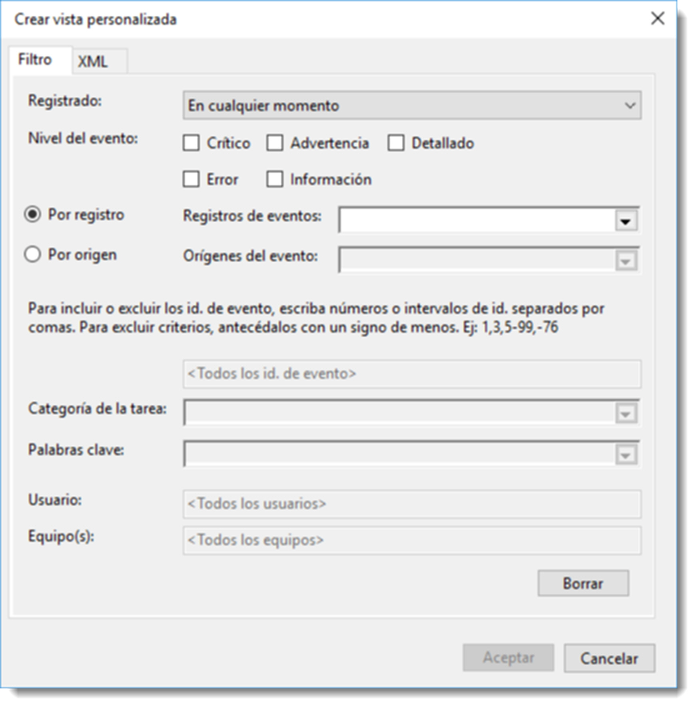
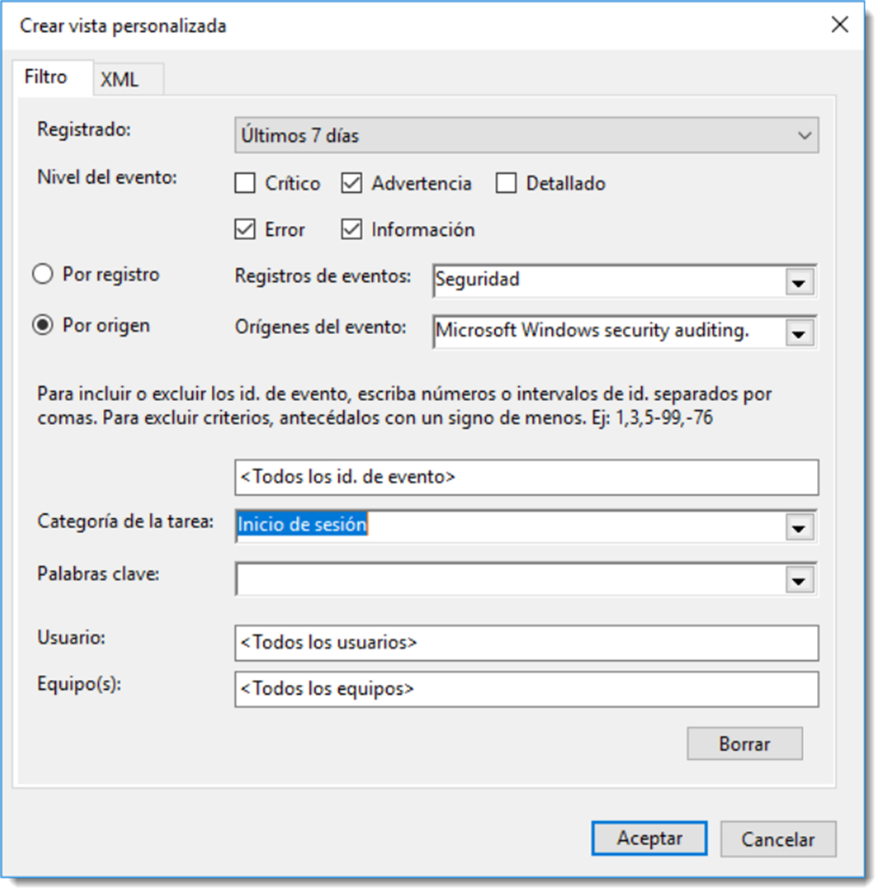

# Detección de problemas de forma local

## Registro de sucesos.

Es importante para un administrador conocer todo lo que pasa en el sistema. Resulta evidente que a medida que dicho sistema crezca será imposible el seguimiento de todos los eventos que se generen. Afortunadamente, los sistemas operativos, y otras muchas aplicaciones, guardan detalles de su funcionamiento en unos archivos especiales, llamados registros de eventos, también conocidos como bitácoras o logs, por su nombre en inglés.

El objetivo de estos ficheros es contener anotaciones sobre toda su actividad y funcionamiento, sus anomalías, interferencias con otro software o cualquier otro tipo de información que sea reseñable. Este tipo de ficheros agrupan los registros en función del tipo de evento que lo haya generado. Cada sistema posee una tipología diferente de sucesos, aunque es posible, al menos, destacar tres tipos de eventos:

- **de aplicaciones**, lanzados por el software instalado en el sistema. No todas las acciones serán registradas, sino aquellas que sean de vital importancia.
- **de sistema**, acciones desencadenadas por el sistema operativo. Cualquier acción queda guardada en un fichero de bitácora y agrupada, a su vez, a través de una serie de subcategorías cuyo número y tipología dependen del sistema operativo que las genere.
- **de seguridad**, registra toda acción referida con la autenticación de usuarios, permisos de acceso a recursos, ejecución de software, acceso a redes, etcétera. En definitiva, cualquier acción que pueda suponer un peligro potencial.

Además de estos tipos de eventos, si el sistema operativo actúa como controlador dentro de una estructura de dominio, también registrará los eventos relacionados con **el servicio de directorio**,**la replicación de archivos**, y todos los servicios que tenga implementados, como por ejemplo el DNS o el DHCP.

Toda esta cantidad ingente información se registra en tiempo real y se guarda en ficheros con formato XML. Afortunadamente los sistemas operativos disponen de herramientas para poder gestionar toda esta información de una manera **rápida y eficaz**. En sistemas operativos de Microsoft se dispone del **Visor de eventos**.

Permite consultar y administrar, de una forma potente y centralizada, la información contenida en los múltiples registros de eventos.

Se accede a esta herramienta a través del <span class="menu">Administrador del servidor</span> → <span class="menu">Administrador del servidor</span> → <span class="menu">Visor de eventos</span>. La columna de la izquierda contiene una estructura arborescente con cuatro nodos principales

- **Vistas** personalizadas, que permitirá elegir una serie de eventos a los que prestaremos especial atención, incluso es posible indicar que al producirse un evento, desencadene una acción.
- **Registros de Windows**, parte fundamental de esta herramienta muestra los eventos del sistema relacionadas con la seguridad, sistema y aplicación. Se entrará en detalle en lo sucesivo.
- **Registros de aplicaciones**, todos los eventos generados por las aplicaciones y servicios del directorio se recogen en esta rama. Desde el panel de administración del servidor, ya se informa al administrador de forma puntual sobre los posibles eventos de cada uno de los servicios de directorio.
- **Suscripciones**, es posible configurar avisos que procedan desde otros equipos del domino. Para ello será necesario la activación del servicio de suscripción de eventos. Al crear una suscripción, por defecto activa este servicio tanto en el servidor como en el cliente que se necesite vigilar.

En la rama Registros de Windows se encuentran varios tipos de eventos:

- **aplicación**, eventos de las aplicaciones y los servicios que no forman parte del sistema.
- **seguridad**, eventos relacionados con la seguridad del sistema.
- **instalación**, eventos relativos a la configuración de roles y características.
- **sistema**, eventos del sistema y de sus componentes.

Para ver los eventos de diferentes tipos, bastará con pinchar sobre cada categoría y se filtrarán por tipo.


En la rama **Vista personalizada** se presenta la información separada en dos ramas bien diferenciadas; la que hace referencia a los Eventos administrativos del sistema y las que lo hacen de los Roles de servidor, en donde la información se agrupará por roles y características.

Aún así, la información registrada es ingente y el administrador puede perderse en la búsqueda de un dato en concreto. Por ese motivo se ha implementado la creación de vistas predeterminadas que no son otra cosa que aplicar filtros para limitar los resultados de tal modo que resulte sencillo encontrar el registro buscado.

A través del menú <span class="menu">Acción</span> → <span class="menu">Crear vista personalizada…</span> el cual permite filtrar por el momento en el que se ha registrado el evento, el nivel al que se ha producido (crítico, advertencia, error entre otros), por qué parte del registro se ha producido o qué software ha producido el evento e incluso es posible excluir ciertos eventos a través de su ID, si son de cierto usuario o han sido realizados en algún equipo determinado. Es posible ajustar la búsqueda hasta que encontrar el registro sea trivial.

Una vez configurada convenientemente la búsqueda, el asistente solicitará un nombre y lugar en dónde guardar la vista. De esta forma se dispondrá de un rápido acceso a ella.

### Creación de una vista personalizada

Por ejemplo, uno de los eventos que se suelen tener en cuenta es las veces que se intenta el inicio de sesión en el dominio. Es posible crear una vista que contenga tan sólo los eventos de esta subcategoría. Para ello se crea una nueva vista personalizada con los siguientes parámetros:

- **En la opción Registrado**, se elegirá el intervalo de tiempo en el que se registran todos los eventos del tipo seleccionado. Es posible seleccionar una fecha específica. En este ejemplo se elegirán los últimos 7 días.
- Nivel de evento se elegirá **Advertencia** y **Error** ya que son los de eventos que nos interesa registrar. Si no se tiene muy claro a qué tipo de evento pertenece la acción que se pretende registrar, no se marcan ninguna opción, de este modo se contemplarán todas. Ya habrá tiempo para filtrar después.
- El origen del evento será lanzado por el servicio _Microsoft Windows security auditing_, por lo que será necesario elegir el registro **Por origen** y no **Por registro**, ya que no interesa un registro de un tipo específico, sino los lanzados desde un servicio determinado. En **Orígenes del evento** se marca el servicio mencionado antes. Nótese que de forma automática el **Registro de eventos** marca **Seguridad**, ya que es el tipo de evento al que pertenecen los eventos que lanza este servicio.
- Si se conoce el ID del evento, es posible colocarlo en la casilla de inclusión de identificadores. Si no se conoce, es recomendable dejarlo en blanco, de este modo se registrarán todos los eventos de la categoría elegida con anterioridad. Cuando se conozca el ID del evento, se podrá editar la vista personalizada.
- En la opción **Categoría de la tareas** se ofrecen todas las tipologías de eventos relacionadas con el origen de evento seleccionado en el apartado anterior. Se marcará Inicio de sesión que es la que interesa en este ejemplo. Es posible incluir varias de ellas si fuese necesario.
- Además de todos estos filtros, es posible añadir **Palabras clave**, los Usuarios a los que afecta y los Equipos en donde se producen. En este ejemplo no se indicará palabra clave alguna y se auditarán todos los usuarios y todos los equipos.

Para finalizar el nombre de la vista será **Intentos de Inicio** y su ubicación por defecto. Esto creará una nueva vista personalizada que aparecerá en el panel de la izquierda del administrador de eventos.



Otra de las características interesantes que ofrece esta aplicación es la de vincular una tarea cuando se produzca un evento determinado. Así por ejemplo es posible ejecutar un programa, enviar un mensaje de correo electrónico o mostrar una alerta. Bastará con ir al menú <span class="menu">Acción</span> → <span class="menu">Adjuntar tarea a esta vista personalizada…</span>, el cual lanzará un asistente que permitirá especificar que acción se necesita realizar y cómo. Esta opción cobra especial interés si se ha creado un script de terminal o de PowerShell con acciones a seguir para tratar este evento.

## Sucesos en GNU/Linux

En los sistemas operativos basados en GNU/Linux, si no se especifica lo contrario, todos los archivos de bitácora o logs se encuentran en el directorio `/var/log`. En versiones antiguas de este sistema operativo, era el demonio `syslogd (Syslog Daemon)` el que se encargaba de guardar información sobre el funcionamiento del sistema.

En la actualidad y, desde la versión de Ubuntu Server 14.04, se utiliza una versión mejorada de syslogd denominada `rsyslogd`. Esta versión ofrece posibilidades multhilado, acceso a bases de datos para guardar la información y una salida de datos altamente configurable.

Alguno de los registros más importantes que vigila `rsyslogd` son:

- **auth y authpriv**, información relativa a autorizaciones y seguridad (anteriormente esta tipología se llamaba security).
- **cron**, mensajes sobre demonios de programación de tareas como `cron o anacrom`.
- **daemon**, mensaje sobre otros procesos del sistema.
- **ftp, lpr, mail**, news entre otros, información referida a cada uno de estos servicios.
- **kern**, mensajes referidos al núcleo del sistema operativos.
- **user**, datos sobre aplicaciones de terceros. Si se analiza el contenido de la carpeta `/var/log`se observa que existen varios ficheros con idéntico nombre a estas categorías pero con extensión log. En ellos estarán contenida la información que estos procesos o demonios generen; por ejemplo `auth.log o kern.log`. También es posible observar como existen otros como apt o dpkg.log que recopilan información sobre las acciones realizadas sobre los programas instalados.

El formato de un archivo de bitácora es aproximadamente el mismo, aunque existen diferencias en función del proceso que lo origina. Es necesario conocer este formato antes de poder analizar su contenido, por ejemplo la estructura del fichero auth.log está compuesta por la **fecha y hora del suceso**, **nombre del equipo** donde se ha producido, **el programa o servicio** que lo ha originado (acompañado por su PID de forma opcional) y un mensaje que describe el suceso.

La configuración de `rsyslogd` se encuentra definido en el archivo `/etc/rsyslog.conf`, aunque algunas opciones también se establecen en `/etc/rsyslog.d/`. Es posible modificar estos archivos para cambiar dicho comportamiento, pero su explicación se escapa de los objetivos de este texto.

Como siempre ocurre en los sistemas operativos GNU/Linux, existe una opción a través del terminal que ofrece un sinfín de posibilidades para la consulta de estos registros. Para ello se utilizará la aplicación `logcheck` que facilita la consulta a los ficheros de bitácora, los analiza y ofrece información procesada. Esta tarea se realiza de forma periódica, por lo que el administrador podrá despreocuparse de generar esta información.

El resultado es un documento más sencillo de leer y dividido en tres categorías de seguridad ordenadas de **mayor a menor importancia**: Active system attacks, Security violations y Usual activity.

Para realizar estas tareas será necesario

```bash title=""

instalar la aplicación logcheck
sudo apt-get install logcheck
```

Durante el proceso de instalación, es necesario configurar el modo en el que logcheck se comunica con el administrador. La forma estándar es configurando una dirección de correo electrónico externa para recibir el documento procesado en ese buzón. Existen otras posibilidades como correo interno de la red local o dejarlo sin configurar, en tal caso guardaría estos ficheros en memoria secundaria. También pide el nombre de host del equipo para identificar los informes por equipo, el cual se recomienda no cambiar.

Una vez terminada la instalación, es necesario crear el archivo de configuración a través de una plantilla contenida en el fichero `logcheck.conf.dpkg-new` el cual habrá que copiar

```bash title=""

sudo cp /etc/logcheck/logcheck.conf.dpkg-new /etc/logcheck/logcheck.conf
```

dotarlo de permisos de lectura y escritura

```bash title=""

sudo cdmod 664 /etc/logcheck/logcheck.conf
```

Y ahora editar estas líneas del fichero. La primera la que hace referencia al correo electrónico donde se enviará la información,

`SENDMAILTO=”administradorFeo@gamil.com”`
otra para especificar que los informes se enviarán como adjuntos al mensaje
`MAILASATTACH=1`
y esta que hace referencia al nivel del informe que será enviado
`REPORTLEVEL=”paranoid”`

Esta última línea soporta varias opciones como server, configuración por defecto y que ofrece información aceptable, paranoid en donde la información más relevante es la de seguridad y workstation, una buena opción si se trabaja con estaciones de trabajo clientes de un dominio.

Existen otras muchas más líneas de configuración, pero escapan al objetivo de este texto.
Por defecto, logcheck comprueba las bitácoras /`var/log/syslog y /etc/log/auth.log`. Si es necesario incluir más ficheros de bitácora al proceso de análisis será necesario incluirlos en `/etc/logcheck/logcheck.logfiles`. De igual modo que en el caso del fichero anterior, será necesario crear una copia desde el fichero plantilla /etc/logcheck/logcheck.logfiles.dpkg-new y asignarle los permisos de escritura lectura.
Una vez realizada esta acción, se añade la dirección del fichero de bitácora que se necesite analizar

```bash title=""

sudo echo “#Fichero añadido de forma manual” >>/etc/logcheck/logcheck.conf

sudo echo “/etc/var/dpkg.log” >>/etc/logcheck/logcheck.conf
```

Con este comando, se añaden líneas al final del fichero /etc/logcheck/logcheck.conf, ahorrándose así tener que usar un editor de textos.

Si tratamos de lanzar la aplicación, ahora que ya está configurada, se obtiene la siguiente advertencia

```bash title=""

logcheck should not be run as root. Use su to invoke logcheck:
```

la cual se soluciona lanzando la aplicación a través del usuario `logcheck`, creado durante el proceso de instalación para gestionar esta aplicación. Esta es una práctica muy común entre los desarrolladores de software para GNU/Linux, de este modo se deja al margen al usuario root, cuyo uso puede ser un peligro, como ya se ha visto con anterioridad. Por tanto, lanzamos la aplicación utilizando la opción -u de sudo.

Al instalarse esta aplicación, el demonio cron.d establece una periodicidad de los informes de una hora, configuración que es posible cambiar modificando las características de crontab, como se ha visto en otras unidades.

```bash title=""
sudo -u logcheck logcheck

```

!!! warning

    Si el terminal informa que no existe el usuario logcheck, se deberá crear con el comando `sudo adduser logcheck`. Además hay que estar seguro que el servicio de correo sendmail está debidamente configurado.
