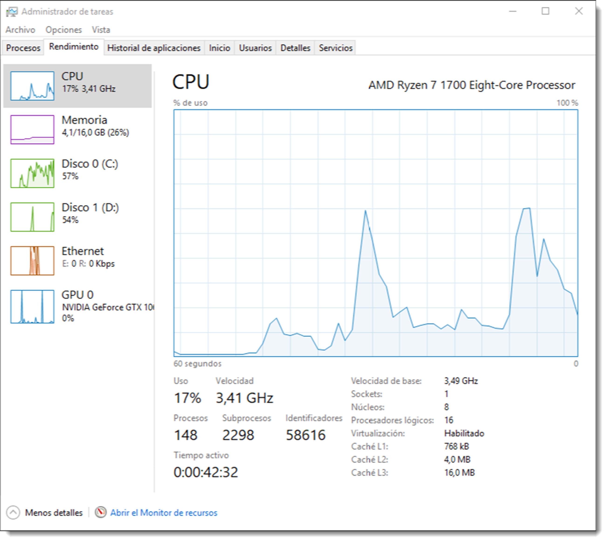
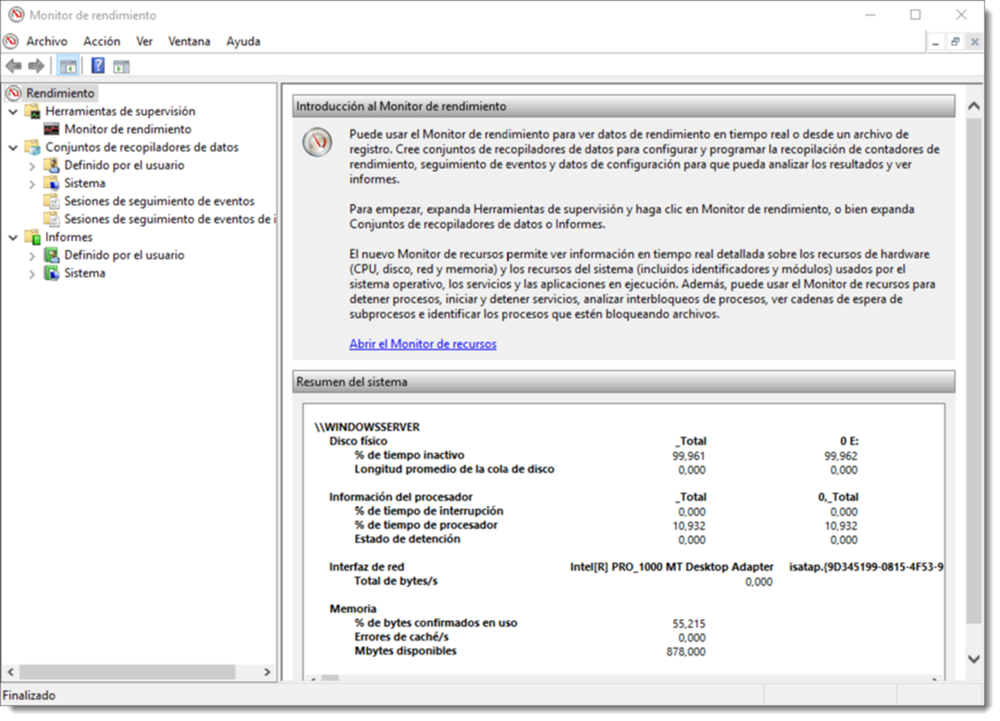
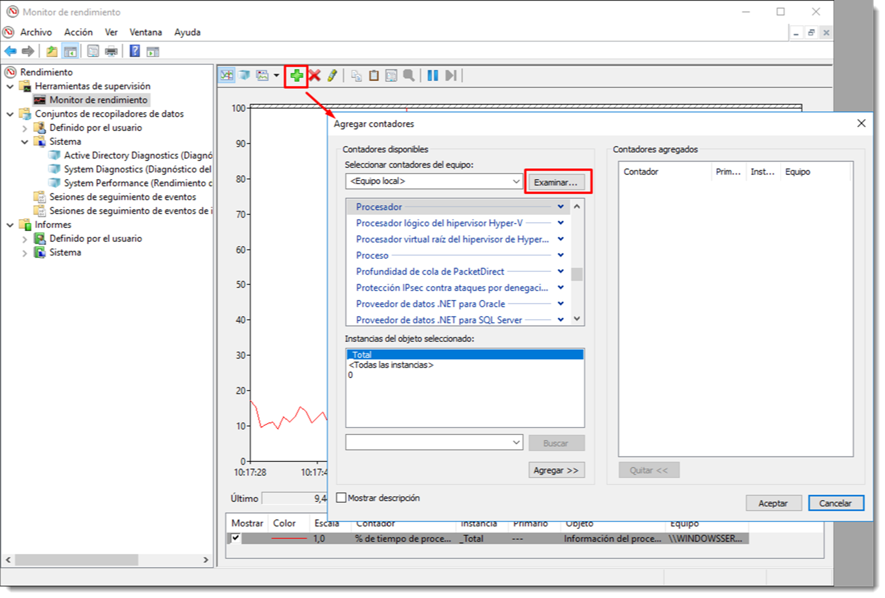

# Monitorización del rendimiento del sistema

Es posible definir el concepto rendimiento como la rapidez con la que un equipo realiza las tareas para las que fue diseñado, tanto relacionadas con el sistema, como aplicaciones y servicios. Este rendimiento del sistema estará limitado por diferentes aspectos:

- la velocidad del procesador,
- la cantidad y velocidad de la memoria principal,
- la velocidad de los dispositivos de almacenamiento externo y
- la velocidad de las interfaces de red.

Implantar un sistema de vigilancia es importante porque:

- son el complemento necesario para la administración de sistemas.
- se dispone de alarmas que avisan cuando algo no funciona bien.
- permite detectar el origen de las incidencias.
- genera estadísticas que darán una visión de las necesidades del sistema y como anticiparlas.

Todo proceso de monitorización y administración de sistemas comienza por un estudio previo de las necesidades, es decir, contestar a la pregunta **¿qué y cómo debo vigilar?**. La respuesta a esta pregunta facilita la creación de un plan de monitorización del sistema, aunque el plan ideal es aquel que engloba la observación de todo el sistema en conjunto.

Es preciso realizar una prueba del rendimiento del sistema **inmediatamente** después de la instalación y configuración. Una vez medido, cuando instalemos un servicio, programa, hardware o sencillamente cambiemos una configuración, es recomendable volver a ejecutar la prueba de rendimiento para compararla con la anterior y comprobar así cómo ha afectado el cambio al sistema.

Es necesario ajustar las observaciones por costes de tiempo y consumo de recursos. En efecto, el hecho de observar el sistema **no debe ser una interferencia para el funcionamiento del mismo**. Es perentorio encontrar un compromiso entre observación y consumo de recursos. De cualquier otro modo el funcionamiento del sistema puede verse degradado por el sistema de control y observación.

También es importante que los datos que se recojan se encuentren **sintetizados y ordenados** de manera que sea sencilla su interpretación. De nada sirve una ingente cantidad de información si no es posible sintetizarla de manera rápida y eficaz. Para ello se cuenta con gráficos, informes e histogramas que facilitan la interpretación de los datos.

## Herramientas de monitorización: en tiempo real y continuada (local)

Existen numerosas herramientas para realizar estas tareas, pero este sección se centra en las que se encuentran disponibles en los sistemas operativos **de forma nativa**. Los sistemas operativos de Microsoft han contado de forma tradicional con el Monitor de rendimiento el cual ofrece un resumen en tiempo real del estado del equipo. Más reciente es el Monitor de recursos, que ofrece información mucho más pormenorizada sobre diferentes aspectos del sistema.

El monitor de rendimiento de Microsoft Windows Server 2016 permite comprobar cómo está afectando los programas en ejecución al rendimiento del sistema informático, ofreciendo datos que permiten ser analizados en tiempo real o almacenados para su análisis posterior. A esta herramienta se accede desde  Administrador del servidor → Herramientas → Monitor de rendimiento.

Estas herramientas ofrecen utilidades que permiten la supervisión, análisis del sistema, recogida de datos y sintetizar la información en informes. Además, su GUI permite personalizar la recogida de datos de rendimiento y sesiones de seguimiento de eventos. Para poder realizar todas estas actividades, huelga decir que el  Monitor de rendimiento  debe ejecutarse desde un usuario que pertenezca al grupo **Administradores**. No obstante, si es necesario crear Conjuntos de recopiladores de datos, ver informes o configurar los registros, es posible usar cualquier usuario contenido en el grupo incorporado Usuarios del registro de rendimiento.

## Supervisar una actividad concreta

Una de las ventajas de esta herramientas es que no sólo permite la observación de todo el sistema, sino que permite la vigilancia detallada de un elemento sospechoso. Es posible añadir contadores al gráfico de evolución para poder visualizar ya no sólo un elemento hardware del equipo, sino también software.

En efecto, esta aplicación permite la supervisión de un proceso o servicio y además de forma pormenorizada, analizando el consumo de RAM, acceso a la memoria secundaria o uso del procesador o utilización de las interfaces de red.

Otra de las características de esta utilidad que resulta enormemente interesante, es la de poder registrar estos datos en cualquier equipo del dominio. Para ello tan sólo será necesario la selección del equipo a través del menú Examinar...

Para agregar una actividad de este tipo será suficiente con pulsar en el botón de la cruz verde (tal y como se indica en la Figura ) y elegir qué actividad y sobre qué elemento es necesario realizar el seguimiento. Es posible realizar este proceso tantas veces como sea necesario para obtener el resultado deseado.

Cada vez que se incluya una actividad, ésta se añadirá al gráfico inicial de la herramienta, donde puede ser analizado. Si este gráfico contiene demasiada información es posible editar el estilo a través de la leyenda en la parte inferior. Además se pueden añadir, quitar o editar nuevos elementos al gráfico desde los iconos de la parte superior.

Otro de los aspectos interesantes de esta herramienta es la posibilidad de cambiar el tipo de gráfico. Resulta evidente que esto va a depender del tipo de información que se necesite monitorizar.

## Crear un Recopilador de datos

Tras haber añadido las actividades al monitor de recursos, es muy probable que en un futuro se requiera volver a supervisar estos datos para comprobar si todo sigue con normalidad. Para esta tarea es posible crear un recopilador de datos y guardarlo para cuando sea necesario su consulta. Para crear un nuevo Conjunto de recopiladores de datos, el primer paso será disponer de los contadores adecuados a la medición y guardarlos como un conjunto de recopiladores de datos, que se podrá utilizar en lo sucesivo. Se accede a través del menú Acción → Crear nueva Vista personalizada…

Esta acción disparará un asistente que preguntará el nombre del conjunto de datos, el lugar donde se guardará y el usuario con el cual se lanzará por defecto. El usuario que lance la monitorización es de vital importancia ya que no todos los usuarios disponen de acceso a este recurso. Será recomendable que el usuario pertenezca al grupo administradores o al de Usuarios del registro de rendimiento, como ya se ha mencionado. Una vez guardado el conjunto, se podrá acceder a él en la sección Conjunto de recopilaciones de datos → Definido por el usuario. Desde aquí es posible su activación, detención o edición, si ya no cumple con los objetivos para los que fue diseñado.

Otra de las características interesantes de esta herramienta es la programación de la ejecución de los conjuntos de recopiladores de datos. En efecto es posible planificar la observación de un determinado elemento del sistema en un intervalo de tiempo concreto donde se sospecha que se produce algún error o para comprobar su rendimiento en plena carga, o para aquello para lo que haya sido diseñada la observación.
La programación se realiza a través de las propiedades del Conjunto de recopiladores de datos, tal y como se muestra en la Figura 5. Desde allí se podrá establecer una intervalo de fechas, una duración máxima de la observación, o incluso ejecutar una tarea tras finalizar la observación, si así se requiere.
El objeto final de estas observaciones es la recolección de datos para su posterior análisis, por lo que prestar atención a cómo y dónde se guardan estos datos es de vital importancia.
Para poder modificar el modo en el que el Conjunto de recopiladores de datos guarda la información, hay que dirigirse al conjunto, seleccionarlo y acceder al menú Acción → Administrador de datos… Desde aquí será posible determinar aspectos como el espacio mínimo del sistema para que la tarea se ejecute, el número máximo de subcarpetas que se crearán de forma automática, el nombre del archivo o archivos de informe que se genera, reserva de espacio, tamaño máximo y acciones a realizar si se superan estos límites.
Por ejemplo, una de estas reglas es que cuando del archivo supere el tamaño máximo determinado, éste se copie en un fichero CAB (Cabinet, archivo que contiene los datos de registro sin procesar y comprimidos) o sea eliminado. Como siempre, dependerá de los objetivos de observación que se persigan.
15.1.4 Consulta de los datos de rendimiento
La creación de estos conjuntos de observación y los datos que generan tienen como objetivo la consulta y análisis de los datos para comprobar si todo funciona de forma correcta. Para esto, también se utiliza el Monitor de rendimiento.
La primera tarea será detener todas las recopilaciones de datos que estén en marcha a través del menú Conjuntos de recopiladores de datos → Detener. Tras esto, en la sección Informes → Definido por el usuario aparecerán los conjuntos que se han definido y será posible consultar los datos recopilados.
15.1.5 Conjuntos de recopilaciones de datos de sistema
Además de poder configurar las observaciones que el administrador del sistema cree oportunas, esta aplicación tare consigo una serie de informes por defecto que se utilizan para la comprobación de rendimiento y realizar diagnósticos del sistema. En el menú Conjuntos de recopiladores de datos → Sistema se encuentran los informes que trae por defecto, como el System Diagnostics (Diagnóstico del sistema) y el System Performance (Rendimiento del sistema). No obstante, el número de informes que aquí aparezcan dependerá de los roles y características de los que disponga el equipo. De este modo, en este equipo debe aparecer Active Directory Diagnostics ya que posee las herramientas para gestionar un servicio de directorio y ha sido promocionado.
Para lanzar cual quiera de estos informes, es suficiente con resaltarlos y dirigirse al menú Acción → Iniciar. Cuando el informe esté preparado, aparecerá en la sección de Informes → Sistema → System Diagnostics. La duración de la ejecución del informe dependerá del informe elegido, pero oscila entre sesenta y trescientos segundos.
El resultado es un informe completo del sistema mostrando aspectos tanto de hardware como de software y específicamente en los dispositivos que más afectan al rendimiento: procesador, memoria principal y dispositivos de red. Aunque no de forma muy profusa,
