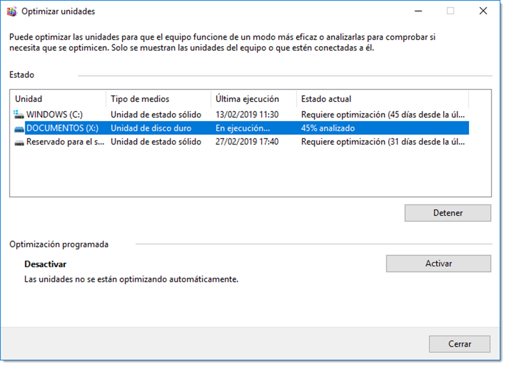

# Administración de la memoria secundaria

Tras el proceso de instalación de un sistema operativo es necesario abordar la configuración de la memoria secundaria. Es preciso conocer cual es la estructura física del sistema de almacenamiento de información, su manejo así como el sistema de directorios y ficheros a utilizar.

Cada sistema operativo posee su propia estructura de directorios lógica y es conveniente estar familiarizado con ella para su correcta administración. También será necesario conocer los diferentes sistemas de ficheros y adecuarlos a los diferentes usos del sistema.

## Sistemas de particionado

Una vez comprobada la compatibilidad, es preciso configurar la memoria secundaria para que pueda contener los archivos del sistema operativo. Tanto si el disco duro utilizado es nuevo como si no, deberemos revisar las particiones de ese dispositivo.

Los discos duros se dividen en áreas denominadas particiones. Cada partición es una unidad lógica de almacenamiento que se puede formatear para almacenar información. Durante el proceso de instalación, la mayoría de los sistemas operativos crean particiones del espacio disponible en el disco duro y lo formatean de forma automática. Aunque siempre solicitando la autorización del usuario. La información cómo están dividido este espacio se denomina tabla de particionado y su tratamiento dependerá del sistema gestor elegido.

Un sistema operativo se almacena en una partición de disco y un disco con varias particiones puede almacenar varios sistemas operativos. Son dos los estándares de esquemas de partición más utilizados: **MBR y GPT**.

### MBR (Master Boot Record)

Presentado en 1983, tiene 512 bytes de longitud y contiene el cargador de arranque y un programa ejecutable que permite al usuario elegir entre varios sistemas operativos. Además contiene información de la partición activa. Se ha convertido en el estándar de facto, pero presenta ciertas limitaciones que se solucionaron en el sistema **GPT**. Se utiliza en ordenadores con **firmware basado en BIOS**, aunque también es compatible con el sistema **UEFI**. MBR posee diferentes tipos de particiones:

- **partición primaria**, que suelen contener los archivos del sistema operativo. No se pueden subdividir en secciones más pequeñas pero sí se le puede asignar un sistema de archivos. En un disco duro tan sólo pueden coexistir hasta cuatro particiones primarias. Si el sistema necesita de más particiones primarias, o bien instala otro disco duro, o bien utiliza una partición extendida.
- **partición extendida**, que se puede dividir hasta en 23 particiones, aunque no se le pueda asignar una sistema de archivos y tan sólo se puede asignar una de estas particiones por disco. Cada una de las partes de una unidad extendida se denomina unidades lógicas. Este tipo de particiones se crearon para superar el límite de cuatro particiones primarias por disco.
- **unidad lógica**, es una sección de una partición extendida a la que se le puede asignar un sistema de ficheros. Toda unidad lógica se encuentra contenida en una partición extendida, y como mínimo, debe existir una unidad lógica en una partición extendida para que un sistema operativo pueda usar ese espacio.
- **partición activa**, es la que se utiliza para almacenar y para iniciar un sistema operativo. Sólo una de las particiones primarias por disco se puede marcar como activa al mismo tiempo. Las particiones activas sólo se encuentran en las unidades con tablas de partición de MBR.

Una configuración común para el disco duro de un ordenador, es crear una partición primaria para el sistema operativo y permitir que una partición extendida ocupe el espacio restante. Cualquier partición adicional necesaria se puede crear dentro de la partición extendida, hasta un máximo de 23.

### GPT (Globally Unique IDentifier Partition Table)

Sustituye el esquema de partición MBR y está basado en la creación de un identificador único para cada una de las particiones. En este sistema, al contrario que ocurre en MBR, tan sólo existen particiones primarias. No presenta limitaciones a la hora de crear particiones más que las que le imponga el sistema operativo. Por ejemplo, los sistemas operativos de Microsoft admiten hasta 128 particiones, y éste será su límite.

También mejora la capacidad de los discos duros que pasa de 2 TB en el sistema MBR a teóricamente 9,4 ZB (no se existe todavía un disco duro con esta capacidad para poder comprobarlo).
Otra de las ventajas reside en que la información de la tabla de particiones no sólo se encuentra almacenada al inicio del disco, como en los sistemas MBR, sino que tiene una copia de dicha tabla fragmentada y repartida por todo el disco. De esta forma, es posible recuperarla tas su pérdida.

| MBR                                | GPT                                      |
| ---------------------------------- | ---------------------------------------- |
| Máximo 4 particiones primarias     | Máximo 128 particiones en Windows        |
| Tamaño máximo de partición 2 TB    | Tamaño máxima de partición 9,4 ZB        |
| Sin copia de la tabla de partición | Con copia de la tabla de la partición    |
| Datos de arranque en un lugar      | Datos de arranque repartido por el disco |
| Cualquier PC soporta MBR           | PC basado en UEFI y de 64 bits           |

Durante el proceso de instalación del sistema operativo se realiza el particionado del disco duro donde se instala, como mínimo. Es muy habitual que se necesite cambiar este particionado o editar nuevos discos. Se dispone para ello de varias utilidades propias del sistema operativo o de terceros.

## Creación de particiones

Los sistemas operativos basados en GNU/Linux utilizan ficheros de dispositivo para referirse a los dispositivos de hardware. Todos estos ficheros se ubican en la carpeta del sistema `/dev`. Las unidades de almacenamiento no son una excepción y es aquí donde se podrán encontrar los ficheros que hacen referencia tanto a dispositivos de almacenamiento como a sus particiones.
De este modo, el primer disco duro conectado en GNU/Linux se conoce como `/dev/hda`.

```bash title="Listado de HD"
/dev/hda – Dispositivo maestro en la IDE 1 o SATA 0
/dev/hdb – Dispositivo esclavo en la IDE 1 o SATA 1
/dev/hdc – Dispositivo maestro en la IDE 2 o SATA 2
/dev/hdd – Dispositivo esclavo en la IDE 2 o SATA 3

```

Si los discos duros en lugar de ser IDE son **SCSI o SATA**(cosa habitual en la actualidad), en lugar de indicar hda sería nombrado `sda`.

Cuando un disco se particiona, se utiliza un número a continuación del nombre del disco duro para representarla. Así, `/dev/hda2` se refiere a la segunda partición del disco duro maestro de IDE 1. Como en un disco duro no pueden existir más de cuatro particiones primarias, éstas reciben números del 1 al 4. Si creamos una partición extendida, ésta no recibe ningún numero (igual que en Microsoft Windows no se le asigna una letra) y a las unidades lógicas que se crean dentro de dicha partición extendida se le asignan números a partir del 5.

```bash title=""
/dev/hdb1
```

Primera partición primaria del disco duro 2 (esclavo en el primer canal IDE).

```bash title=""
/dev/sda5
```

Primera unidad lógica del disco duro cero (primer disco SATA).

Ahora que se conoce el tratamiento que los sistemas operativos dan a las particiones, se procederá a su
creación a través, tanto del terminal como de interfaz gráfica.

En línea de comandos existe una aplicación denominada `fdisk` que ofrece una guía para elaborar el particionado. Este comando reconoce hasta 83 tipos de particiones diferentes y cuatro sistemas de particionado, aunque solo se trabajará con una pequeña parte de ellas. Al ejecutarlo, la aplicación guiará al usuario a través de menús que facilitarán todas las tareas. Para lanzar la aplicación es necesario usar esta estructura

```bash title="Comando fdisk"
fdisk <opciones> <disco>
```

en donde `<disco>` utiliza la nomenclatura descrita en el apartado anterior. De esta forma, si se requiere mostrar la información de particionado de un disco duro se usará

```bash title="Listado de particiones"
fdisk -l /dev/sda
```

Es necesario tener presente que `fdisk` es un comando del sistema y requiere permisos de administración para realizar su tarea. Es por esto que requiere ser ejecutado o con una cuenta que tenga los permisos adecuados o suplantando a dicho usuario. Como se trabaja en un entorno Ubuntu, es posible utilizar el comando sudo anteponiéndolo de cualquier otro comando.

Para realizar el particionado de un segundo disco que se acaba de conectar al sistema, se empleará el siguiente

```bash title="Particionar"
fdisk /dev/sdb
```

Tras lanzar el comando y pulsar la letra m, se accederá a un completo menú con el que se podrá realizar el particionado.

Todas las opciones de esta herramienta son autoexplicativas. No obstante, si el disco instalado no ha tenido nunca una partición, es necesario seguir estos pasos:

- localiza el conjunto de opciones Crea una nueva etiqueta, indicando el tipo de tabla de partición. Habitualmente se trabajará con el antiguo modelo **MBR** (representado con la opción crea una nueva tabla de particiones DOS vacía), o con el recomendado **GPT** (opción g del menú).
- localiza el grupo de opciones General y particiona el disco en función de las necesidades. El programa irá guiando al usuario a través de menús. Si se elige un sistema de particionado MBR (DOS en el menú), es recomendable crear primero las particiones primarias, luego las extendidas y por último las unidades lógicas.
- una vez terminado el particionado del disco, es necesario utilizar la opción escribe la tabla en el disco y sale, **correspondiente a la letra w**.

Hay que tener en cuenta que, por defecto, fdisk expresa las unidades en sectores, algo a lo que el usuario no está acostumbrado. Es posible especificar el tamaño de las particiones con el siguiente código: **K** para kilobytes, **M** para megabytes, **G** para gigabytes,**T** para terabytes y P para petabytes. Cuando el asistente pregunte el sector del final de la partición, si es necesario que esa partición tenga un tamaño de 100 gygabytes, bastará con especificar **+100G o +100000M.**

## Sistemas de ficheros

Tras la instalación del sistema operativo es habitual que se requiera la instalación de varias unidades de almacenamiento extra. Tan sólo será necesaria la conexión de esta unidad al puerto pertinente y encender el ordenador. Si el disco duro es nuevo o no posee información de particionado, ese dispositivo no podrá ser utilizado por el sistema operativo. Hay que dotarlo de estructura de estructura lógica, es decir, de un sistema de particionado y de un sistema de ficheros compatible con el sistema operativo utilizado.
De forma muy resumida, los sistemas de archivos (file system) estructuran la información guardada en una unidad de almacenamiento. Cada sistema operativo utiliza su propio sistema de archivos, aunque los hay que son compatibles en diferentes versiones. El tipo de sistema de archivos se determina en el proceso de dar formato a cada una de las particiones.
Todo sistema de ficheros debe permitir crear, borrar y modificar ficheros, permitir el acceso controlado a la información, el acceso a los ficheros mediante nombres simbólicos, optimizar el rendimiento, ofrecer soporte multiusuario y minimizar las pérdidas de información, entre otras características.
Pero, ¿qué es un archivo o fichero?. Se trata de un mecanismo de abstracción que sirve como unidad lógica de almacenamiento de información. El fichero agrupa una colección de datos relacionados entre sí y definidas por su creador. A todo fichero le corresponde un nombre único que lo identifique entre los demás ficheros.

Cualquier sistema operativo distingue entre varios tipos básicos de ficheros:

- **regulares** o normales, ficheros que contienen datos (información).
- **directorios**, aquellos ficheros cuyo contenido es información sobre otros ficheros.
- **de dispositivo**, existen dispositivos cuya E/S se realiza como si fuesen ficheros, por lo tanto es razonable asociarles ficheros para simplificar y hacer más transparente el intercambio de información con dichos dispositivos.
- **de enlace**, son ficheros que apuntan a otros ficheros. Habitualmente suelen existir enlaces **simbólicos y físicos o duros**.

      - **físicos**, se refiere a un mismo archivo usando dos nombres distintos. El enlace duro apuntará al archivo original y guarda el mismo aspecto y comportamiento. Hay que tener en cuenta que no pueden existir enlaces duros entre dos archivos de particiones separadas, debido a limitaciones de su estructura física.
      - **simbólicos**, utilizados para salvar la imposibilidad anterior. A diferencia de los enlaces duros, que apuntan a un archivo por su estructura física (i-nodo), un enlace simbólico apunta a otro archivo por su nombre. Esto permite enlazar (apuntar) a otros archivos localizados en otras particiones, e incluso en otras unidades de red. En otro sistemas operativos se funcionan de forma similar a los accesos directos.

Existen diferentes tipos de sistemas de archivo:

- **de disco**, diseñados exclusivamente para almacenar archivos en una unidad de disco conectada directamente al ordenador. Algunos de los sistemas de archivos más usuales de este tipo son **ext4, Reiser, FAT32, NTFS, WINFS, ZFS.**
- **distribuidos o de red**, son sistemas que acceden a sus archivos a través de una red. Algunos de los más comunes son AFS, AppleShare, CIFS (también conocido como SMB o Samba, usado en redes Microsoft), NSS (para sistemas Novell Netware 5) o NFS. Permiten el acceso a recursos independientemente del sistema de archivos originario en el que se encuentre.
- **transaccionales**, es una clase especial de sistema de ficheros encargado de almacenar los eventos o transacciones. Se utilizan para asegurar la integridad del sistema comprobando que toda operación debe estar acabada. En caso de que ocurra algún error y una operación quede a medias, queda reflejado en el journal (bitácora o registro) y en el siguiente arranque se puede comprobar las operaciones no completadas y deshacerlas. Algunos sistemas de ficheros que implementan esta característica son ReiserFs, ext3 y ext4.
- **virtuales**, se trata de una capa de abstracción encima de un sistema de archivos más concreto. El propósito de un VFS es permitir que las aplicaciones cliente tengan acceso a diversos tipos de sistemas de archivos concretos de una manera uniforme. Puede ser utilizada para tender un puente para poder utilizar sistemas de archivos de Windows, de Mac OS y Unix indistintamente.
- **de propósito especial**, son básicamente aquellos que no pueden clasificarse en ninguna de las dos formas anteriores. Algunos de ellos son **CDFS** (utilizado como sistema de archivos de CD-ROM), **DEVFS** (sistema de archivos virtual usado por Unix, cuyo propósito es controlar los archivos de dispositivos que se hallan almacenados en los directorios /sys y /dev de la estructura de archivos convencional) **SWAP**, utilizado en sistemas GNU/Linux para la zona de gestión de memoria virtual y de intercambio.

La creación de particiones y asignación de un sistema de ficheros son tareas básicas que un administrador debe conocer. Estas tareas se pueden realizar a través de interfaz gráfica como en terminal.

Una vez terminado el particionado del disco, para poder utilizarlo hay que dotarlo de un sistema de ficheros compatible con el sistema operativo que vaya a utilizar este dispositivo. En el terminal se dispone del comando mkfs con el se puede realizar esta tarea de forma simple

```bash title="Creación de sistema de ficheros"
mkfs <opciones> < -t tipo_sistema_ficheros> <dispositivo>
```

De esta forma el siguiente comando asignará el sistema de archivos ext4 a la primera partición primaria del segundo disco duro del sistema

```bash title=" Ejemplo creación de sistema de ficheros"
mkfs -t ext4 /dev/sdb1
```

La herramienta mkfs soporta multitud de sistemas de ficheros. Los más utilizados, y los que con total seguridad serán necesarios para la administración de cualquier sistema serán **ext3, ext4, SWAP, vfat (para dispositivos USB extraíbles), FAT32 y NTFS**

## Puntos de montaje

GNU/Linux no utiliza letras para acceder a las particiones, así que ¿cómo es posible grabar un archivo por ejemplo en /dev/hdb6?. En Microsoft Windows se copiaría el archivo en D: o E: o la letra que asignemos a esa partición, pero esto no se hace de este modo en GNU/Linux. Cada dispositivo de almacenamiento (partición, disquete, CD) que se utilice debe ser montado sobre un **punto de montaje**.

Recuerda que en GNU/Linux solo existe un espacio de almacenamiento, un único árbol que empieza en el raíz y que contiene todo lo que tenemos en nuestro sistema. Esto se consigue asociando cada partición a un directorio mediante un proceso denominado montaje. Montar una partición hace que su espacio de almacenamiento se encuentre disponible accediendo al directorio especificado (conocido como punto de montaje).

Por ejemplo, si se monta la partición `/dev/sda5` en `/usr`, significa que todos los ficheros y directorios a partir de /usr se ubican físicamente en `/dev/sda5`. Por lo tanto, el fichero `/usr/feo.txt` estará almacenado en `/dev/sda5`, cosa que no ocurre con el fichero `/home/FEO/otrofeo.txt.`

Continuando con el ejemplo, también es posible que uno o más directorios dentro de `/usr` sean puntos de montaje de otras particiones. Se puede montar la partición `/dev/sda7` en `/usr/local`, lo que significa que el fichero `/usr/local/fea.txt` estará en `/dev/sda7`, no en `/dev/sda5`.

Cuando se conecta una unidad de almacenamiento o un lector óptico, el sistema tiene que crear un punto de montaje para poderlo utilizar. Este punto de montaje en casos de dispositivo extraíbles, como memorias USB, suele ser una carpeta que creamos manualmente en el sistema o se crea automáticamente en la carpeta denominada `/media`. Esto solo ocurre en distribuciones basadas en Ubuntu (saltándose la estructura FHS).

El uso general del comando mount es el siguiente:

```bash title="Comando mount"
mount -t <tipo_de_dispotivo> <directorio_de_destino>
```

Cuando se ejecuta el comando `mount` sin argumentos, mostrará un listado de lo que está montado en el sistema y la carpeta sobre la que lo hace.

```bash title="Salida del comando mount"
mount
/dev/sda1 on / type ext4 (rw,errors=remount-ro)
proc on /proc type proc (rw,noexec,nosuid,nodev)
sysfs on /sys type sysfs (rw,noexec,nosuid,nodev)
none on /sys/fs/fuse/connections type fusectl (rw)
none on /sys/kernel/debug type debugfs (rw)
none on /sys/kernel/security type securityfs (rw)
udev on /dev type devtmpfs (rw,mode=0755)
devpts on /dev/pts type devpts (rw,noexec,nosuid,gid=5,mode=0620)
tmpfs on /run type tmpfs (rw,noexec,nosuid,size=10%,mode=0755)
none on /run/lock type tmpfs (rw,noexec,nosuid,nodev,size=5242880)
none on /run/shm type tmpfs (rw,nosuid,nodev)
none on /run/user type tmpfs (rw,noexec,nosuid,nodev,size=104857600,mode=0755)
/dev/sda5 on /home type ext4 (rw)
binfmt_misc on /proc/sys/fs/binfmt_misc type binfmt_misc (rw,noexec,nosuid,nodev)

```

De toda la información que nos ofrece el comando es importante prestar atención a las particiones. En este caso existen dos particiones el `/home y /`

```bash title=""
/dev/sda1 on / type ext4 (rw,errors=remount-ro)
/dev/sda5 on /home type ext4 (rw)

```

Con el siguiente comando se monta la segunda partición primaria del segundo disco SATA en la carpeta personal del usuario Feo

```bash title=""
mount /dev/sdb2 /home/Feo/datos
```

Tras montar el volumen, a través de la carpeta `/home/Feo/datos` accederé a la partición `/dev/sdb2`.

Es posible dotar de diferentes puntos de montaje a una misma partición. Esto quiere decir que existirán dos puertas de entrada. Esta configuración es requerida cuando varios programas necesiten acceso a una misma partición. Es una situación rara, pero llegado el caso es posible del siguiente modo.

Se necesita un segundo punto de montaje en la misma partición del ejemplo anterior. Crear un segundo punto de montaje es tan sencillo como enlazar el existente a otra carpeta, para ello se usará el modificador `-B`:

```bash title=""
mount -B /home/Feo/datos /home/MuyFeo/documentos
```

Cuando se monta una partición en una carpeta, por defecto se le asignan los permisos de escritura y lectura para el usuario que monta esa unidad. Es posible limitar esos permisos añadiendo al final del comando el modificador `-r`:

```bash title=""
mount /dev/sda5 /home/Feo/Escritorio/Datos -r
```

De este modo se monta la primera unidad lógica del primer disco duro SATA en la carpeta Datos (situada en el escritorio del usuario Feo) con permisos de lectura (r de read en inglés).

También es habitual montar la unidad de CD-ROM en una carpeta para tener acceso a ella:

```bash title=""
mount -t iso9660 -o ro /dev/cdrom /media/cdrom

```

Es muy útil desmontar estas unidades cuando se haya terminado con su uso. Para ello usaremos el comando umount y especificando la carpeta que se necesita desmontar

```bash title=""
umount /home/Feo/Escritorio/Datos

```

Es posible desmontar varias unidades en un mismo comando umount si las separamos con espacios. Hay que tener cuidado con el desmontaje de unidades ya que es posible que algún programa esté utilizando un archivo de ese dispositivo. Si esto ocurriese, el sistema advierte que la partición está en uso y no procederá con el desmontaje. Podemos obligar al sistema operativo que cuando deje de estar utilizada, procesa con su desmontaje. Usaremos la opción -l para ello:

```bash title=""
umount /home/Feo/Escritorio/Datos -l

```

Si existe certeza de que ningún fichero está usando el disco y tenemos que desmontarlo a pesar de las advertencias, se dispone del modificador `-f`

```bash title=""
umount -f /home/Feo/Escritorio/Datos

```

Lo que hay que tener muy en cuenta es que este montaje de carpetas es temporal, es decir, tan solo es válido mientras la sesión del usuario siga activa. Una vez esta sesión sea finalizada, por ejemplo reiniciando el equipo, todas estas particiones se perderán, teniendo que volver a montarlas tras el reinicio de una nueva sesión.

### Montaje automático con fstab

GNU/Linux ofrece la posibilidad de hacer esos montajes permanentes, o más bien que se monten de forma automática al inicio de cada sesión. En realidad esta tarea ya la realiza el sistema operativo con las particiones del sistema, así no hay que montar la partición del disco duro cada vez que iniciamos la sesión. Esta configuración se hace a través del fichero fstab.

El fichero fstab (File System TABle) que se encuentra en el directorio `/etc`, es parte de la configuración del sistema y muestra la lista de discos y particiones disponibles. Este fichero monta las particiones listadas al iniciar el equipo con las configuraciones que tenemos realizadas mediante `mount`.
El uso básico es de esta forma:

```bash title="Distibucion de cada una de las lineas"
dispositivo punto_de_montaje sistema_de_archivos opciones frecuencia_dump pass_num
```

Entre una sección y otra les separa una tabulación. Cada opción significa:

- **dispositivo**, es el nombre del dispositivo y la localización del mismo, normalmente en /dev. En Ubuntu las entradas del fstab también pueden comenzar con el Universal unique Identifier (UUID) que se asignan al sistema de ficheros cuando se formatea.
- **punto_de_montaje**, que es el punto de montaje donde los datos se añaden al sistema de ficheros.
- **sistema_de_archivos**, que hace referencia al tipo de sistema de ficheros que puede ser uno de los siguientes:

      - ext3/ext4, la mayoría de los sistemas hoy en día lo usan. Se le denomina journaled lo que significa que si el sistema se apaga de forma anormal, no se pierden datos.
      - swap, partición para la gestión de la memoria virtual.
      - ntfs y vfat, particiones de Microsoft Windows y memorias USB.
      - auto, detección automática del tipo de sistema de ficheros.

- **opciones**, son las opciones con las que se monta la unidad:

      - **auto/noauto**, con auto la partición será montada automáticamente en el arranque.
      - **exec/noexec**, si es posible ejecutar binarios o no en esa partición.
      - **ro/rw**, si se permite sólo lectura ro y lectura escritura rw.
      - **user/nouser**, si es posible que cualquier usuario monte esta unidad. Con nouser sólo el usuario root tendrá privilegios para montar una partición.
      - **sync/async**, los ficheros pueden ser escritos de forma síncrona o asíncrona. Las operaciones de escritura de los discos duros no son sincronizadas, la escritura empieza mucho después de que se ejecute el comando. Si está configurada la forma asíncrona los ficheros son escritos con éxito pero no lo estarán físicamente.
      - **defaults**, configura las opciones por defecto, que son: rw, suid, dev, exev, auto, nouser y async

- **frecuencia_error**, indica la frecuencia con la que se realizará la de comprobación de errores. Si es cero, es que no lo comprobará y si es uno, sí lo hará.
- **pass-num**, controla el orden en el que fsck comprueba los errores de la partición en el arranque. Puede tomar como valores 0, 1 y 2. Siendo 1 la partición raíz, 2 otras particiones y 0 pero deshabilitar el chequeo

Si es necesario montar una partición de inicio, será obligatorio incluir una línea al final del fichero fstab siguiendo el patrón descrito. Para ello, será necesario abrir el fichero /etc/fstab con permisos de administración para poder editarlo:

```bash title=""
  sudo nano /etc/fstab
```

Una vez abierto, añadir esta línea al final del fichero:

```bash title=""
/dev/sda2 /media/datos auto rw,user,auto 0 0
```

Esta nueva estrada en el fichero fstab indica que al inicio de sesión montará la partición `/dev/sda2` en la carpeta `/media/datos`, detectará de forma automática el sistema de ficheros, configurará las opciones de lectura escritura, cualquier usuario podrá montar esta partición y se montará de forma automática durante el inicio de sesión. Además la búsqueda de errores está deshabilitada (el último cero es para indicar que no haga la comprobación de ficheros de forma predeterminada).

Aunque al principio pueda parecer una estrategia complicada, el uso de este sistema de montaje de particiones presenta muchas más ventajas que la asignación de letras por partición. No en vano, Microsoft Windows ya hace tiempo que implementa este sistema en sus sistemas operativos, además del uso de letras.

### Mantenimiento de discos

Una vez construida la estructura necesaria para un disco duro, dividiendo el disco en particiones, asignándole un sistema de ficheros y montando esa unidad, es importante vigilar la integridad y rendimiento de dicho dispositivo. Para ello se dispone de la herramienta fsck la cual corrige problemas de inconsistencia en discos duros. Para realizar esta comprobación es muy recomendable que el disco se encuentre desmontado, ya que de otra forma podría causar daños al sistema de ficheros de la unidad de almacenamiento.

```bash title="Sintaxis del comando fsck"
fsck <opciones> <dispositivo>
```

De esta forma, si se necesita comprobar la integridad de la segunda partición del tercer disco duro instalado, este será el comando a ejecutar

```bash title="Ejmplo de fsck"
fsck /dev/sdc2
```

También posible la comprobación de todas las particiones de un disco en una sola orden si tan sólo se especifica el disco, lo cual simplifica la tarea

```bash title="Ejmplo de fsck"
fsck /dev/sdc
```

Las opciones que `fsck` puede tomar, son las siguientes:

- `-a` confirmar automáticamente los mensajes
- `-c` comprobar bloques en el disco
- `-f` forzar la verificación aunque todo parezca normal
- `-v` muestra más información
- `-r` modo interactivo, espera nuestra respuesta ante cualquier mensaje
- `-y` asume sí como respuesta predeterminada

Otra de las tareas de mantenimiento que es recomendable llevar a cabo en los discos duros es su desfragmentación. Cuando un archivo se guarda en un disco duro, éste se divide en partes de igual tamaño que el bloque del disco. Este tamaño depende del sistema de ficheros que se utilice. Estos fragmentos de fichero no se guardan de forma contigua, sino que el sistema operativo los sitúa de forma aleatoria mejorando así la velocidad de escritura. No prevee una estrategia de ordenación, sino que los guarda allá donde exista un bloque libre.

Esta circunstancia facilita la escritura, pero penaliza la velocidad de lectura. Al leer un archivo, el transductor del disco debe recorrer posiciones aleatorias, empleando más tiempo en esta tarea. El proceso de desfragmentación recorre el disco buscando las partes que componen un fichero y las reúne para que el proceso de lectura sea más rápido. Dicho de otra manera, realiza el trabajo de planificación que en el proceso de escritura no se ha realizado.

Este problema afecta sobre todo a los sistemas de archivo basados en tablas de índices y en mucha menos medida a los basados en nodos-i. Así, los sistemas de fichero **ext3 y ext4 no padecen de este problema**, y sí **FAT32, FAT16, vfat y NTFS**. Este es el motivo por el cual se relaciona este problema con sistema operativos de la familia de Microsoft.

La herramienta de desfragmentación en Microsoft Windows se encuentra en <span class="menu">Inicio</span> → <span class="menu">Herramientas administrativas de Windows</span> → <span class="menu">Desfragmentar y optimizar unidades</span>.


