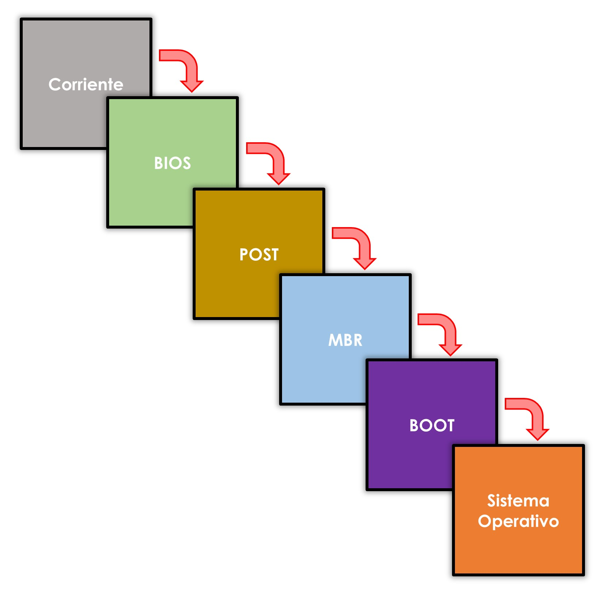

# Gestores de arranque

Los gestores de arranque de un ordenador indican dónde se encuentra el sistema operativo que se ha de cargar en memoria principal para que asuma el control del equipo. Pero antes de llegar a esta fase, el sistema realiza una serie de tareas y comprobaciones que se conocen como **secuencia de arranque**. A diferencia del arranque del sistema operativo, ésta es común a todos los ordenadores y se compone de las siguientes fases:

    - la secuencia de arranque comienza cuando el usuario pulsa el botón de encendido (arranque en frío). La corriente llega a la placa base y desde allí al resto de componentes.
    - el procesador busca las instrucciones necesarias para el inicio de la BIOS o UEFI. Éstas se encuentran en una memoria ROM asociada al procesador que contiene un salto hacia la ubicación del firmware BIOS.
    - se carga la BIOS y lee la configuración almacenada en la memoria **CMOS**. Tras esto, ejecuta la primera subrutina que es el POST (Power On Seft Test) y se trata en un conjunto de instrucción que comprueban si el estado del hardware es correcto. El **POST** envía la información mediante señales acústicas para informar al usuario de los errores encontrados. Cada fabricante posee un código de errores, por lo que será necesario la consulta del manual de la placa para comprobar su equivalencia. Lo que sí parece unánime es que al terminar la prueba de hardware, si no se han detectado errores, se produce un único pitido corto. Si se detecta algún error, el proceso de arranque se detiene.
    - la **BIOS/UEFI** busca el firmware de la tarjeta gráfica y le cede el control de forma temporal para que inicie la interfaz gráfica. A partir de este punto, toda la información del proceso de arranque será ofrecida por pantalla.
    - una vez recuperado el control, continua con la carga del resto del hardware.
    - realiza una comprobación de los componentes de memoria, tanto principal a través del MemoryTest, como secundaria comprobando las interfaces IDE (si existiesen), SATA y PCI Express.
    - genera un resumen con toda la información detectada del hardware que muestra por pantalla.
    - finalmente localiza el gestor de arranque y pasa el testigo a éste para que se prosiga con el inicio de la carga del sistema operativo.

Esta última fase es diferente si el sistema tiene implementado BIOS o UEFI. Si se trata del segundo caso, el propio firmware de la placa base es capaz de iniciar el sistema operativo ahorrando tiempo de búsqueda. En realidad se siguen utilizando gestores de arranque por cuestiones de compatibilidad con sistemas operativos antiguos.
A partir de aquí el sistema de arranque del sistema operativo dependerá de cual esté instalado en el ordenador, pero todos siguen el siguiente patrón:


- el gestor de arranque usa la información de la BIOS/UEFI para buscar la partición de arranque.
- carga los archivos que constituyen el núcleo del sistema operativo en memoria principal.
- lee los archivos del registro, elige un perfil de hardware y carga los controladores de dispositivos.

En este momento, el kernel del sistema operativo toma control del proceso y comienza a cargar el resto de archivos del sistema operativo en memoria principal. Una vez terminada la carga, ofrece el control al usuario a través de una interfaz, ya sea a través de un terminal (**CLI**) o con interfaz gráfica (**GUI**).

## Modificación del gestor de arranque

Los sistemas operativos de Microsoft, tienen el gestor de arranque integrado en el sistema operativo. En Microsoft Windows 10, es posible acceder a él desde el menú de <span class="menu">Inicio</span> → <span class="menu">Aplicaciones</span> → <span class="menu">Herramientas Administrativas de Windows</span> → <span class="menu">Configuración del Sistema</span>. Aunque en todas las versiones se puede abrir esta configuración usando la herramienta `msconfig` en la opción <span class="menu">Inicio</span> → <span class="menu">Ejecutar</span>.

Cualquiera de estas dos acciones nos da acceso a la configuración de arranque del sistema, pestaña <span class="menu">Arranque</span>, desde la que podremos configurar el orden que aparecen los elementos en el menú, la duración de la espera antes que el sistema inicie la opción por defecto, modificar la opción predeterminada, si se necesita arrancar en modo a prueba de errores o si es necesario el arranque en modo verbose, el cual ofrece información de arranque del sistema operativo paso a paso.


Además, el las opciones avanzadas podremos asignar recursos para un sistema operativo en concreto, o si es necesario su ejecución en modo depuración. Este modo ofrece información de cada uno de los pasos que realiza el sistema y resulta muy útil para la detección de problemas.

Por lo que respecta a **GNU GRUB**, también es posible modificar las opciones de arranque del sistema. Esta operación es posible realizarla directamente desde el archivo de configuración de grub situado en /boot/grub/grub.cfg. Hay que tener extremo cuidado cuando se edite un archivo del sistema. Como medida de seguridad siempre realizaremos una copia de los ficheros que se han de modificar. Hay numerosas formas de hacer esta copia y el siguiente comando es una buen ejemplo de ello:

```bash title="Hacer una copia del fichero de configuración"
sudo cat /boot/grub/grub.cfg >>/home/usuario/grub.cfg.copia
```

Para luego comenzar la edición del fichero de configuración:

```bash title="Editor nano para editar el archivo de configuración"
sudo nano /boot/grub/grub.cfg
```

El archivo `grub.cfg` está dividido varias partes con las que podremos cambiar opciones del menú que aparece al iniciar el ordenador. De entre todo el código que contiene este fichero,, las partes que imprimen las opciones del menú están contenidas entre líneas como estas:

```bash title=""
###BEGIN /etc/grub.d/10_linux ###
Código con las opciones de lanzamiento del sistema operativo
### END /etc/grub.d/10_linux
```

Cada una de esta sección del código contendrá una entrada del menú. Hay que tener en cuenta que el texto **“10_linux”** hace referencia a una entrada específica del fichero `/etc/grub.d`, por lo que en cada línea esta parte del código será diferente. Si se elimina todo el código contenido entre estas líneas, ellas inclusive, la opción a la que se refiere desaparecerá del menú de inicio.

Eliminar código de un archivo de configuración nunca es una buena idea, así que comentaremos estas líneas añadiendo una almohadilla # como primer carácter.

Dentro de éste código se encontrará el texto mostrado por pantalla antecedido por la opción menuentry. Si lo que queremos es cambiar el texto que aparece en el menú, escribiremos el nuevo texto entre las comillas del código.
Otra línea importante es la que hace referencia al sistema operativo predeterminado:

```bash title=""
set default=”4”
```

Esta línea indica que de forma predeterminada arrancará el sistema operativo número cinco del listado que contiene el listado anterior. Si es necesario que arranque el primer sistema operativo del listado, tan solo hay que cambiar el cuatro **por un cero**. Recuerda que GNU/Linux comienza a numerar desde el cero, no desde el uno. Hay que tener en cuenta el orden en el que los sistemas operativos están ordenados en el fichero para obtener el resultado deseado.

Por último, la duración que aparece el menú en pantalla se puede modificar desde estas líneas:

```bash title=""

if [ ${recordfail} = 1 ]; then
set timeout=-1
else
set timeout=10
fi
```

Esta condición nos muestra el menú durante diez segundos. El tiempo que se puede ajustar es el que se encuentra en el else, ya que la primera opción será ejecutada si algo ha ido mal. Modificando este sencillo fichero de texto es posible cambiar las opciones de arranque del sistema basado en GNU GRUB.

Gracias a la comunidad, GNU GRUB dispone de una herramienta gráfica que nos permite realizar estas acciones de una forma más sencilla. Esta aplicación se llama **Grub-Customizer** y permite realizar todas estas configuraciones de un modo más seguro y eficiente, además de ofrecer muchas más opciones de configuración como la edición del estilo del menú o la inclusión de imágenes. Para instalarlo será necesario configurar su repositorio, actualizarlo y proceder a su instalación, tal y como detallan los siguientes comandos

```bash title="instalación de un paquete"

sudo add-apt-repository ppa:danielrichter2007/grub-customizer
sudo apt-get update
sudo apt-get install grub-customizer
```

## Arranque dual

En ocasiones será útil que se instalen dos o más sistemas operativos en un mismo ordenador. Nunca podrán funcionar de forma simultánea, pero existe la posibilidad e cargar uno durante el inicio del equipo. Cuando el gestor de arranque se inicie, mostrará al usuario la opción de elegir el sistema operativo que necesite. Si el usuario no selecciona uno, el gestor de arranque tiene configurado uno por defecto, y será ese el sistema que inicie.

A la hora de configurar un sistema de arranque dual, hay que tener presente que los sistemas operativos deben instalarse en particiones separadas. Muchos no son compatibles entre sí y la instalación de uno eliminaría el anterior. Existe la excepción de Microsoft Windows, la cual dispone de varias versiones que sí permite instalarlas en la misma partición. A pesar de ello, esta práctica no es recomendable. Una buena idea es dotar a cada uno de su propio espacio.

Durante el proceso de instalación, cada sistema operativo instala su gestor de arranque y, dependiendo de la versión, es posible que elimine el anterior. Esto suele ocurrir cuando el sistema operativo que se instala posteriormente es más antiguo que el instalado. Este problema es muy sensible en las versiones de Microsoft Windows, en donde es recomendable seguir un orden de instalación comenzando desde la más antigua hasta la más reciente. Una vez concluida la instalación de las versiones de Microsoft Windows, se recomienda instalar las de GNU/Linux.

Este problema, el de eliminar el gestor de arranque anterior, no afecta a las distribuciones de GNU/Linux, ya que utiliza un gestor de arranque independiente del sistema operativo y, habitualmente, se utiliza **GNU GRUB o Lilo (Linux Loader)**, aunque éste último cada vez menos. GNU GRUB (GRand Unified Bootloader) recorre todas las particiones del disco duro en busca de ficheros de arranque de sistemas operativos. Los detecta y los incorpora a un menú que mostrará al usuario al iniciar el equipo. Por tanto, GNU GRUB permite la instalación de cualquier sistema operativo en cualquier orden.
