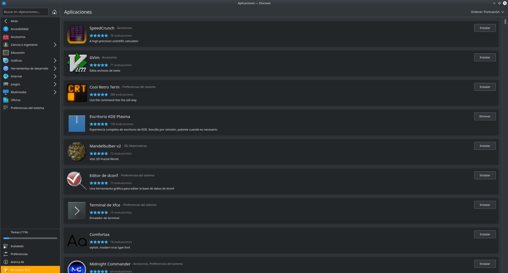

## Instalación/desinstalación de software en GNU/Linux

Los sistemas basados en GNU/Linux también disponen de varias formas de administrar software; desde repositorios a través de Internet, desde los gestores de aplicaciones de cada distribución (muy parecidas a la Tienda de Microsoft) o directamente desde un paquete de instalación.

Al contrario que en Microsoft Windows, en las distribuciones basadas en GNU/Linux el software se distribuye en paquetes. Se debe tener en cuenta que los paquetes son dependientes de la distribución en la que se estén usando. Actualmente existen dos grandes conjuntos de paquetes, aunque también existen distribuciones que poseen su propio sistema de paquetes:

- **deb** (nombre proviene de Deborah Murdock, ex-esposa del fundador de la distribución Debian Ian Murdock), contiene todos los ficheros de un paquete preparado para ejecutarse en las distribuciones basadas en Debian, como por ejemplo Ubuntu, Kubuntu, Linux Mint o ZorisOS entre otras. Este tipo de paquetes posee la particularidad de carecer de actualización. Si existe una revisión de una aplicación, se instalarán todos los paquetes que la componen, y no tan solo los modificados.
- **rpm** (Redhat Package Manager), son paquetes que se usan en las distribuciones Red Hat, Fedora y OpenSUSE entre otras. Este sistema de paquetería no tiene el problema de actualización, y no es necesario la inclusión de los paquetes que no han sido modificados. Esto genera ficheros de menor tamaño.
- **Ebuild**, paquete usado exclusivamente por la distribución Gentoo y contiene un script ejecutable.

A pesar de la incompatibilidad entre ellos, existen herramientas para convertir entre los diferentes tipos de paquetes, como Alien Package Converter. En la mayoría de los casos los desarrolladores de software ofrecen sus programas contenidos en varios tipos de paquetes.

En los sistemas basados en GNU/Linux, los programas se comportan como portables, lo que permite al sistema operativo no acarrear con carga extra que no sea la suya propia.

Aunque esta técnica resulta más económica en cuanto a recursos del sistema operativo y memoria principal, no lo es con la memoria secundaria ya que tiene que contener más información, a veces información duplicada en varios de estos programas.

Algo que hay que tener en cuenta en el software que acompaña a GNU/Linux son las dependencias. Hay aplicaciones que utilizan a otras como punto de partida para su desarrollo o parte de ellos. Esto provoca que la segunda dependa de la primera y para que pueda funcionar sea necesario instalar la primera. Eso se gestiona a través de los paquetes de software, un concepto que no existe en sistemas operativos de Microsoft. Un programa está compuesto por uno o varios de estos paquetes, y para que la aplicación sea funcional, todos los paquetes que componen una aplicación deben estar instaladas. A esta circunstancia hace referencia las dependencias.

Afortunadamente, se dispone de instaladores que resuelven estas dependencias de paquetes por sí solas, siendo el usuario un mero espectador en la instalación.



Son los gestores de paquetes y cada distribución posee una distinta. Los gestores obtienen los programas desde los repositorios instalados en el sistema operativo. Estos repositorios son conjuntos de aplicaciones a los que se puede acceder a través de Internet. Tan sólo tendremos que buscar el software necesario y proceder con su instalación.

Los repositorios que GNU/Linux utiliza se configuran a través de PPA (Personal Package Archive) los cuales permiten a los desarrolladores distribuir software sin necesidad de esperar a que se actualicen los propios de cada distribución. Existen dos formas de añadir uno del que descargar software:

- en modo **GUI** (Guide User Interface) a través del Gestor de Paquetes añadiendo el nuevo repositorio en Origenes de software.
- en modo **CLI** (Command Line Interface) con la aplicación apt-get.

Se centrará la explicación en la segunda forma ya que la primera es autoexplicativa.

`apt-get` es un sistema de gestión de software basado en CLI pero que utiliza repositorios de software en línea para descargar e instalar programas. Resulta muy sencillo la gestión del software con esta aplicación ya que no sólo es posible su instalación/desinstalación, sino que también es posible mantener actualizado todos los programas con una sola orden en el terminal. Además, permite actualizar el sistema operativo con la misma facilidad. Hay que recordar que apt-get modifica el sistema, por lo que será necesario ejecutarlo con permisos de administrador a través del comando sudo.

Este programa se usa de una forma muy intuitiva

```bash title="Sintaxis de apt-get"
 apt-get <opciones> acción <paquete1> [<paquete2>... <paquete N>]


```

En donde algunas de las opciones más importantes son:

- `-s` simula una acción
- `-d` sólo descarga
- `-y` no pregunta al usuario y asume que sí a todas las preguntas
- `-f` intenta continuar si las dependencias fallan
- `-m` intenta continuar si los archivos no son localizables
- `-b` construye el paquete fuente después de obtenerlo
- `-V` muestra números de versión detallados
- `-q` realiza una instalación sin mostrar ningún mensaje en pantalla
- `-u` muestra los paquetes a actualizar

Y las acciones que es posible realizar son:

- `update` actualiza el índice de paquetes listados en los repositorios
- `upgrade` actualiza el software más reciente en los repositorios
- `install` instala la aplicación o aplicaciones especificadas
- `remove` desinstala los paquetes especificados
- `purge` desinstala y elimina cualquier configuración de usuario
- `build`-dep satisface las dependencias del paquete al instalarlo
- `download` descarga el paquete en el directorio actual

El uso del comando es sencillo e intuitivo. Por ejemplo, para instalar un paquete

```bash title="Ejemplo de apt-get"
apt-get install libreoffice-base
```

o para desinstalar un paquete determinado. Si queremos quitar también su configuración se utiliza la accion `purge`

```bash title="Ejemplo de apt-get"
apt-get remove chrome
```

Los repositorios que usa esta aplicación se encuentran en un fichero ubicado en **/etc/apt/sources.list**.
El directorio **/etc/apt/sources.list.d** ofrece una manera de añadir entradas de «sources.list» en ficheros separados.

Cuando `apt-get` recibe una orden de instalación, buscar el nombre del programa entre los repositorios y pregunta al usuario si lo desea instalar. Una de las problemas que posee esta aplicación es que se debe conocer el **nombre exacto de la aplicación**, esto depende del nombre que el desarrollador haya utilizado, y a veces suelen complicar estos nombres de forma innecesaria.

Si se conoce parte del nombre, es posible buscar entre todos los repositorios los paquetes que lo contengan usando este comando

```bash title="Ejemplo de apt-cache"
apt-cache search firefox
```

**Cada distribución de GNU/Linux posee un repositorio**, pero existe la posibilidad de añadir un repositorio personal de cualquier desarrollador. Para esta tarea se usará el siguiente comando

```bash title="Ejemplo de  add-apt-repository"
add-apt-repository ppa:danielrichter2007/grub-customizer
```

Con esta instrucción se añade el repositorio a la lista. Cuando se necesite la instalación de un software al programa de instalación buscará, además, también en este repositorio. Si lo que se necesita es eliminar un repositorio, se usará la opción `–-remove` de la siguiente manera

```bash title="Ejemplo de  add-apt-repository"

add-apt-repository --remove ppa:danielrichter2007/grub-customizer
```

Al final de cualquiera de estas instrucciones es conveniente actualizar la información de los repositorios

```bash title="Actualización de los paquetes disponibles"
sudo apt-get update
```

`apt` no es sólo un comando, sino un conjunto de aplicaciones que permiten la gestión del software de forma eficaz. Así `apt-file` permite buscar un determinado fichero entre los paquetes del repositorio, `apt-cache` que gestiona la información contenida en la base de datos interna de apt, o apt-show usado para mostrar toda la información de los paquetes instalados.

Además de estos dos modos, GNU/Linux dispone de una tercera forma de instalación que se realiza a través de un paquete de software descargado, por lo que no será necesario la conexión a Internet. Esto se realiza con la aplicación `dpkg`, y al igual que ocurre con apt no se trata sólo de un comando, sino de una serie de aplicaciones que conviene conocer, aunque no sea el propósito de este manual. El uso de `dpkg` es realmente sencillo

```bash title="Sintaxis de dpkg"
dpkg <opciones> <acción> <fichero-paquete>

```

Las acciones que son posibles a través de este comando son:

- `-i` instalar un paquete
- `-r` elimina el paquete pero deja intacta la configuración
- `-P` elimina el paquete y la configuración de usuario
- `-l` muestra los paquetes instalados coincidentes con el patrón

De este modo, para instalar un programa usamos el comando `dpkg` de la siguiente manera:

```bash title="Ejemplo de dpkg"

  dpkg -i nombre-paquete.deb
```

Para desinstalar un paquete

```bash title="Ejemplo de dpkg"

dpkg -r nombre-paquete.deb
```

Pero también podremos consultar el software instalado en nuestro sistema de la siguiente forma

```bash title="Ejemplo de dpkg"
dpkg -l
```

Este comando genera un listado debidamente formateado en columnas que indicarán el estado del programa (si está instalado o requiere de alguna acción añadida), el nombre, la versión, la arquitectura y una breve descripción del mismo.
