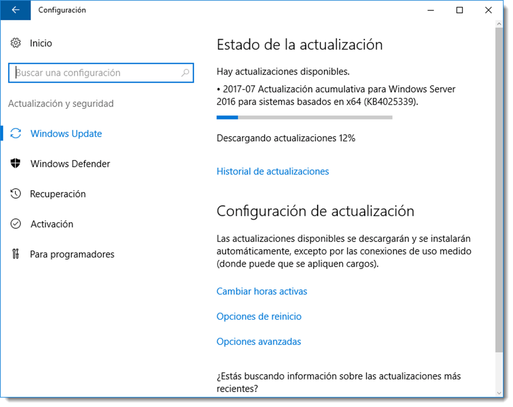

# Actualización de sistemas operativos. Parches de seguridad

Mantener al día el software del sistema informático es fundamental para su buen funcionamiento y seguridad. Es evidente que no todo el software tiene la misma prioridad y son los sistemas operativos lo que deben ir por delante en cuestiones de actualización.

Las tareas de actualización y seguridad son similares en ambos tipos de sistemas operativos, pero se prestará especial atención a los SOR.

En la familia de Windows todos los sistemas operativos poseen una herramienta que los mantiene actualizados y esa es Windows Update. Se accede a ella a través de <span class="menu">Configuración</span> → <span class="menu">Sistema</span> → <span class="menu">Actualización y Seguridad</span> → <span class="menu">Windows Update</span> y desde allí se pueden activar las actualizaciones automáticas, configurar qué actualizaciones se deben instalar, a qué hora y la opciones de reinicio si fuese necesario.


Hay que tener en cuenta que un SOR **no se puede reiniciar a la ligera,** ya que de él depende el buen funcionamiento del sistema informático. Es conveniente que exista un servidor de backup que recoja el testigo en cuanto el principal se reinicie, o realizar esta parada en un horario poco sensible.

Con más o menos diferencias, todas las versiones modernas de los sistemas operativos de Microsoft tienen habilitada esta característica por defecto. Es conveniente revisar la configuración de estas actualizaciones para dar prioridad a las que Microsoft cataloga como críticas ante cualesquieras otras.

En **Ubuntu Server** también se dispone de una herramienta similar a ésta pero que se gestiona a través del terminal. Una vez más se deberá acceder a un fichero de texto y modificarlo. Este fichero es `/etc/apt/apt.d.conf.d/10perodic` y tendrá el siguiente contenido:

```bash title="Contenido del fichero 10periodic"
APT::Periodic::Update-Package-Lists “1”;
APT::Periodic::Download-Upgradeable-Packages “0”;
APT::Periodic::AutocleanInterval “7”;


```

Para activar las actualizaciones automáticas será necesario modificar la línea `APT::Periodic::Download-Upgradeable-Packages` cambiando el 0 por un 1. Con esto se activarán las actualizaciones automáticas en Ubuntu Server.

Pero esta configuración descargará todos los paquetes disponibles en el repositorio de Ubuntu, y tal vez no sea buena idea colapsar al servidor con actualizaciones de escaso interés. Existe una aplicación que permite seleccionar las actualizaciones que son necesarias instalar y cuales no. Es necesario instalar la aplicación unattended-upgrades

```bash title="Instalación de unattended-upgrades"
sudo apt-get install unattended-upgrades
```

Tras la instalación se dispondrá de un nuevo fichero de configuración que permitirá administrar los repositorios desde los cuales se van a recibir actualizaciones así como los paquetes que es necesario instalar. A estos últimos se los denomina Blacklist (lista negra). Se dispondrá por tanto de gran flexibilidad para determinar qué paquetes y de dónde se deben instalar de forma desatendida.
Aparece este fichero `/etc/apt/apt.conf.d/50unattended-upgrades`, el cual contiene, entre otro, el siguiente texto:

```bash title="Contenido del fichero de configuración"
// Automatically upgrade packages from these (origin:archive) pairs
Unattended-Upgrade::Allowed-Origins {
“${distro_id}:${distro_codename}-security”;
// “${distro_id}:${distro_codename}-updates”;
// “${distro_id}:${distro_codename}-proposed”;
// “${distro_id}:${distro_codename}-backports”;
};
```

Estas líneas hacen referencia a diferentes tipos de actualizaciones. Para descargar e instalar de forma desatendida alguno de estos tipos de actualizaciones, bastará con descomentar la línea eliminando la doble barra al inicio de la misma.

Tanto `${distro_id} como ${distro_codename}` son variables de entorno del sistema Ubuntu de esta forma se crea un único fichero de configuración para cualquier versión del kernel.

Es buena práctica instalar por defecto todas las actualizaciones que los desarrolladores del sistema operativo marquen como de **seguridad o críticas**, dejando a la elección del administrador del sistema informático el resto de actualizaciones.
