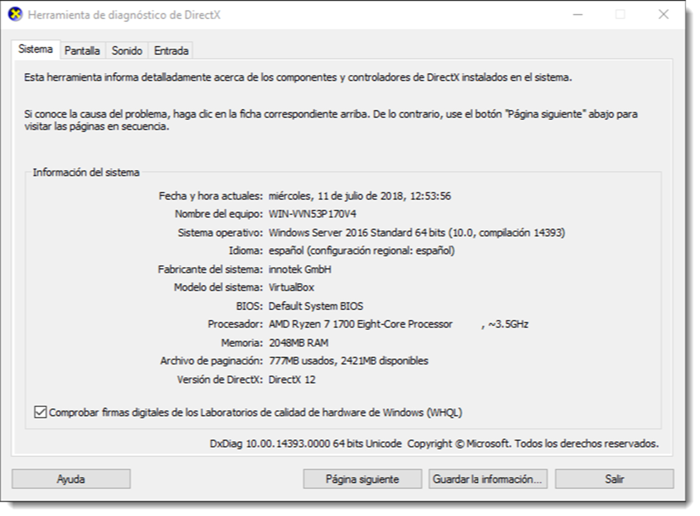

# Documentación de la configuración del sistema informático

Al igual que cuando se programa es habitual olvidar comentar el código, uno de los aspectos que más se descuidan cuando se procede a implantar un sistema informático es la documentación del proceso y configuración del mismo. No es ocioso encarecer que un SOR es algo vivo que irá creciendo y adaptándose a las necesidades del entorno en el que se encuentra. Cuanto más precisa sea la documentación que se genere, menos problemas existirán para retomar el trabajo de instalación o configuración un tiempo después de haberlo dado por concluido.

En este sentido, una de las primeras cuestiones que hay que resolver es la nomenclatura. Es buena idea asignar a cada equipo de nuestra red un identificativo único que puede estar relacionado con la función que realiza, su ubicación dentro de la empresa, área en la que se emplea o ambas. El objetivo es poder referirnos a cada elemento de la red de una forma abreviada y cómoda.

Una vez identificados los equipos y resto del hardware del sistema (impresoras, dispositivos de interconexión, escáneres, cámaras, etcétera), es buena idea disponer de un documento con el perfil de la instalación para cada uno de los equipos incluidos en el sistema. En esta documentación debería constar, además del identificador, los siguientes datos:

- **datos de hardware**, su ubicación dentro del sistema, función, el tipo de procesador que incorpora, el tipo y cantidad de memoria principal y secundaria, tarjeta de red, tarjeta gráfica. Es buena práctica reflejar los dispositivos conectados al equipo, como impresoras y escáneres entre otros.
- **descripción del sistema operativo**, que incluirá su nombre y versión, la fecha y la hora de instalación, el usuario que actúa como administrador y su contraseña y las licencias instaladas en él. Cuando el sistema informático utiliza sistemas operativos privativos es de vital importancia, sobre todo para posteriores operaciones de actualización, la clave de producto. Se trata de la secuencia de números y letras, normalmente organizadas en grupos y separadas por guiones, que suele venir adherida al embalaje del medio de almacenamiento en el que se distribuye el producto.
- **parches y actualizaciones** de los sistemas operativos, especialmente en los de Microsoft Windows. Es buena praxis incluir la fecha de la instalación y una descripción de su objetivo.
- **configuración de la red**, aunque lo más probable es que se trabaje con un servicio DHCP, es buena idea registrar también los datos que conforman la red en la que está inmerso el equipo, especialmente si existen subredes: IP del equipo, máscara de subred, puerta de enlace, el servidor DNS, el nombre del dominio y subdominio en el que se integra el equipo.
- **software instalado**, información útil para comprobar si las versiones que se usan en el sistema se encuentran actualizadas o si, por el contrario, es necesario desactualizarlas. En ciertos ambientes mantener el software a la última versión no es conveniente.

El modo de almacenar y obtener toda esta información debe permitir la actualización de los datos de una forma óptima, eso, por supuesto, descarta la opción de disponer de este documento impreso en papel. Es conveniente toda la información de la implementación esté contenida en una base de datos de fácil y rápido acceso.
Existen numerosas aplicaciones tanto para sistemas operativos de Microsoft como de GNU/Linux que permiten la recolección y administración de esta información como **Network Inventory Advisor, Spiceworks Inventory, Open-Audit o GLPI**. Todas ellas trabajan utilizando el modelo cliente-servidor implementado en la red. De este modo se instala una aplicación servidor encargada de recolectar la información de forma centralizada, junto con una aplicación cliente en cada ordenador del sistema.

A pesar de contar con estas aplicaciones, los sistemas operativos poseen herramientas para la recolección de datos, aunque no se comportan de forma tan eficiente. En Microsoft Windows se dispone de la herramienta de diagnóstico de DirectX denominada **dxdialog**, la cual muestra toda esta información por pantalla.

En GNU/Linux se dispone de varias herramientas que, a través del terminal ofrecen la información detallada del sistema. Comandos como `uname, who, ifconfig, df, top, fdisk, apt, hwinfo, mount o free` son sólo algunos. Como administradores es buena práctica realizar informes periódicos del estado del sistema con estos comandos. Lo ideal es que se programe un shellscript que genere un informe con esta documentación del sistema, actividad que se tratará en lo sucesivo.

Es necesario, por tanto, recopilar, guardar y actualizar la información de un sistema informático para poder diagnosticar de manera precisa en estado del mismo y que acciones son necesarias para su mantenimiento. Hay que tener muy presente que un sistema operativo es un ente vivo que cambia con cada inicio.

