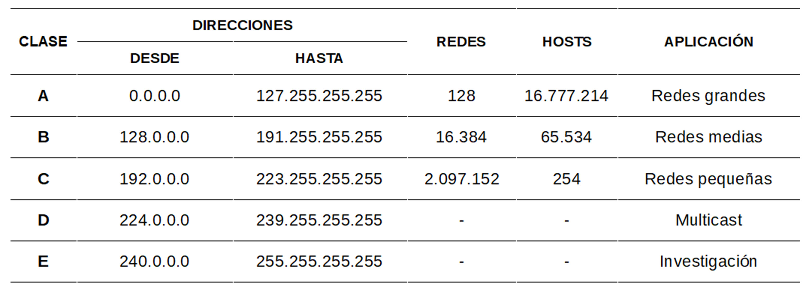
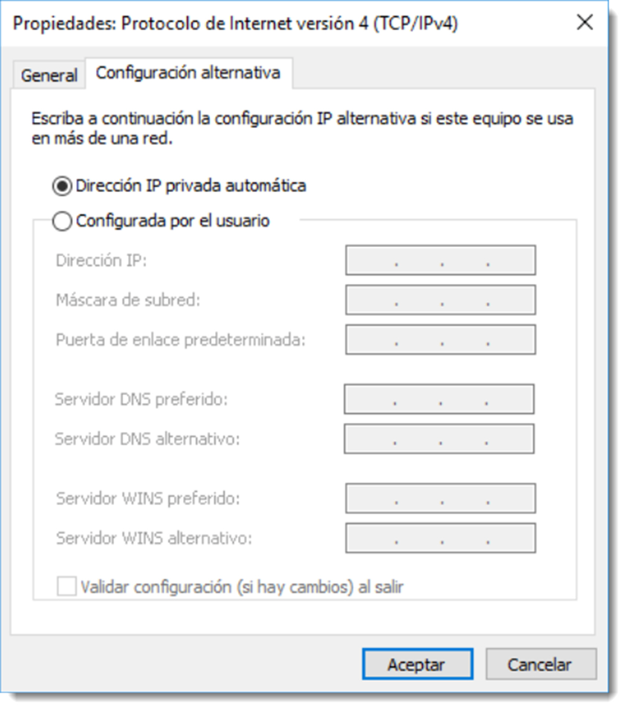
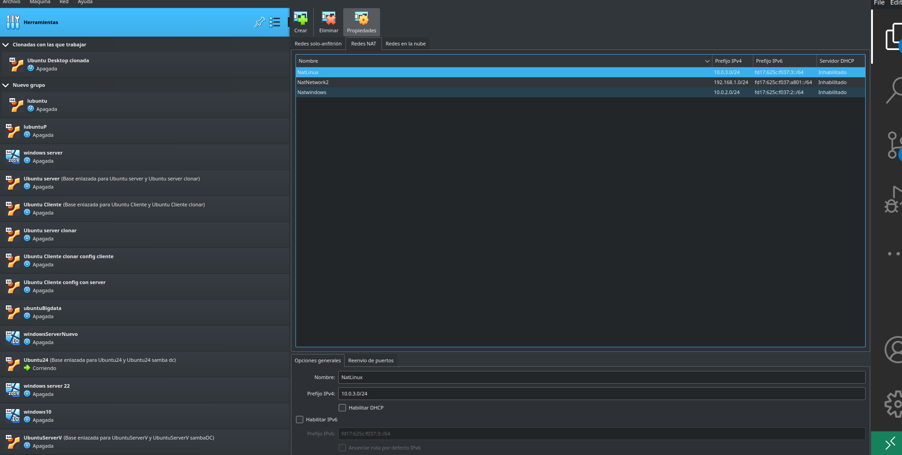

# Configuración del protocolo TCP/IP

Antes de iniciar el proceso de instalación de un servicio de directorio, es necesario realizar la configuración adecuada del protocolo TCP/IP (Transmission Control Protocol/Internet Protocol). La función del protocolo TCP es la de generar una conexión virtual entre dos elementos de la red, a través de la cual fluye la información. Antes de iniciar la comunicación, este protocolo, configura una “camino” seguro entre el origen y el destino de la conexión. Tras esto, establece los parámetros de calidad mínima de la conexión y ofrece el resultado a las capas superiores. La configuración de esta ruta virtual ocupa un tiempo de proceso, pero que tras él, la comunicación se realiza de forma segura y rápida.

El protocolo **UDP (User Datagram Protocol)**, también situado en la capa de transporte, tiene un funcionamiento sensiblemente diferente. Al contrario que su compañero de capa, éste no establece un “camino” ni unas condiciones de calidad previas de conexión. Divide el archivo en datagramas y los envía a su destino sin establecer ninguna confirmación de entrega. Evitar todas estas comprobaciones hace que este protocolo sea más rápido que TCP, pero menos confiable. Los protocolos como DNS (Domain Name Server) y DHCP (Dynamic Host Configuration Protocol) utilizan este protocolo para enviar sus mensajes.

Por otro lado, el protocolo **IP (Internet Protocol)**, se encarga de transmitir datos de forma bidireccional a través de distintas redes físicas previamente enlazadas. Este protocolo se diseñó suponiendo que la entrega de paquetes no sería confiable, así que se le dotó de técnicas de encaminamiento para encontrar el destino final de paquete. Para ello establece una identificación unívoca de cada componente de red pertenezca a esta comunicación asignando direcciones IP distintas a cada host de la red. Existen diferentes versiones de este protocolo, siendo la más utilizada la IPv4 para entornos LAN.

!!! info inline end "Subredes"

    Las subredes son redes segmentadas por el administrador de la red para suministrar una estructura de enrutamiento jerárquica. Permiten un mayor aprovechamiento de las redes, brinda contención de difusión.

Una dirección **IPv4** esta compuesta por cuatro octetos separados por un punto y divididos en dos partes, una que identifica la red a la que pertenece el equipo, y otra que identifica el equipo en esa red. En función de como se distribuyan estas dos partes tendremos diferentes tipos de direccionamiento IP, como se indica en la siguiente tabla.



Todos estos conceptos ya son conocidos y no se profundizarán en ellos. Resulta evidente que son conocimientos necesarios para construir una infraestructura de red de forma adecuada y que el administrador ha de poseer las destrezas necesarias para controlar de forma adecuada esta terminología así como su implantación.

Antes de realizar cualquier configuración, es necesario realizar un análisis detallado de los requerimientos de la red y realizar una previsión del direccionamiento IP. Es fundamental una buena previsión para no tener que realizar costosas reconfiguraciones en el futuro.



De este modo, este análisis previo debe tener en cuenta aspectos como:

- dimensionar de forma holgada los equipos y dispositivos de conexión de la red, así como si es necesario realizar **subredes**.
- reservar una serie de direcciones para los servidores y configurar éstos como IP fija. Los servidores deben estar localizables en todo momento, por lo que es imprescindible que sus direcciones sean fijas.
- elegir en consecuencia un tipo de **IP válida A, B o C**. En la mayoría de casos la elección correcta para instaurar una red es el tipo B, ya que la C tiene serias limitaciones de expansión de hosts y las A en redes.
- reservar conjuntos de direcciones para dispositivos comunes. En efecto un buen método de trabajo es asignar conjunto de direcciones para agrupar los equipos con características similares. Por ejemplo, es buena práctica limitar un conjunto de IP para los equipos de una determinada área o departamento o colocar todas las impresoras en un rango de IP reservado para ellas.
- holgar la reserva de direcciones IP, de este modo en caso de expandir la red, será muy sencillo asignar direcciones a los nuevos dispositivos.

Una vez diseñada la arquitectura lógica de la red es preciso configurar esa dirección en el servidor para que esté accesible al resto de equipos. Esta configuración se realizará a través de <span class="menu">Inicio</span> → <span class="menu">Configuración</span> → <span class="menu">Red e Internet</span> → <span class="menu">Cambiar opciones del adaptador</span>. Esta ventana mostrará los **NIC (Network Interface Card)** que el sistema tiene disponibles.
Con un doble click sobre la <span class="menu">NIC</span> → <span class="menu">Propiedades</span> que se necesita configurar se accederá a su pantalla de configuración de las funciones de red. Será necesario entrar en la opción denominada <span class="menu">Protocolo de Internet versión 4 (TCP/IPv4)</span> y asignar una dirección válida a este equipo.

Además, en de asignar una IP, será necesario especificar otra información como:

- la **máscara de subred**, utilizada para crear subredes dentro de una misma red y para delimitar los dominios de colisión.
- **puerta de enlace predeterminada**, que indicará la dirección del dispositivo encargado de unir dos redes diferentes. Lo habitual es que esta dirección sea la del servidor que gobierne la red, pero eso dependerá de la arquitectura de red utilizada.
- **direcciones del servidor DNS** que usará cualquier dispositivo para obtener información sobre los dispositivos de la red, como se verá detalladamente con posterioridad. Es recomendable especificar una dirección de DNS preferido, al que se le preguntará en primera instancia y uno alternativo, al que se consulta si el primero falla.

## Configuración de red alternativa personalizada

En algunas ocasiones los equipos se mueven entre varias redes dentro de la misma organización o incluso fuera de ella (por ejemplo equipos portátiles). Resulta muy cómodo la configuración de una red secundaria que el sistema probará si falla la configuración inicial.

Esta configuración no será necesaria si se dispone de un servicio DHCP funcionando en la red, ya que será éste el que asigne los datos necesarios para configurar el equipo, lo que suele ser habitual. No obstante es conveniente conocer que se dispone de esta configuración alternativa de red.

En el sistema operativo Ubuntu Server la configuración de las IP de los NIC se realizará durante el proceso de instalación o a posteriori. La diferencia es que no se dispondrá de una GUI para realizarla, por lo que habrá que recurrir al CLI.

## Ficheros de configuración de red en GNU/Linux

Desde la versión 17.04 de Ubuntu Server, la configuración de las interfaces de red se realiza a través de `netplan`. Este nuevo método está basado en la configuración de la red con ficheros YAML (YAML Aint’s Markup Language) que `netplan` aplica a los NIC. Es un sistema en el que intervienen un menor número de archivos de configuración y ofrece una mayor compatibilidad con dispositivos virtuales. No obstante, y debido a que los dos sistemas han de coexistir durante un tiempo, es esta unidad se tratarán los dos sistemas de forma pormenorizada.

### Distribuciones de Ubuntu Server anteriores a 16.10 (inclusive)

Los archivos necesarios para la configuración de red de los NIC en GNU/Linux se encuentra en `/etc/network/interfaces`. Existen varias entradas por cada tarjeta de red. El contenido de este fichero es:

```bash title="Contenido del fichero de Configuración"
# This file describes the network interfaces available on your system

# and how to activate them. For more information, see intercfaces(5)

# The loopback network interface

auto lo
iface lo inet loopback

# The primary network interface

auto enp0s3
iface enp0s3 inet dhcp
```

El fichero muestra dos configuraciones de NIC. La primera es la de loopback, de ahí su nombre “lo”. El dispositivo NIC principal es enp0s3 y como se aprecia en la última línea del archivo, está configurado de modo automático. Espera encontrar algún servicio de DHCP que le ofrezca una IP.

Esta configuración para un cliente es muy válida, pero para un servidor es muy recomendable que la IP sea fija.

Cuando se realiza un cambio de configuración en un NIC, será necesario desactivar y activar el servicio que la gestiona para que los cambios surjan efecto. Es posible realizar esta tarea sin reiniciar el servidor a través del comando ifconfig:

```bash title="Activar servicio de red"
sudo ifconfig enp0s3 up
```

para activar (levantar) el NIC, o

```bash title="Desctivar interfaz"
sudo ifconfig enp0s3 down
```

para descativar (bajar) la NIC.

Antes de editar este archivo, es necesario comprobar cual es la configuración actual de la red. Se utiliza el comando `ifconfig` o `ip` en un terminal y devuelve la siguiente información:

```bash title="salida del comando ip a"

enp0s3 Link encap:Ethernet direcciónHW 08:00:27:40:65:bd
 Direc. inet:10.0.2.15 Difus.:10.0.2.255 Másc:255.255.255.0
Dirección inet6: fe80::a00:27ff:fe40:65bd/64 Alcance:Enlace
ACTIVO DIFUSIÓN FUNCIONANDO MULTICAST MTU:1500 Métrica:1
Paquetes RX:0 errores:0 perdidos:0 overruns:0 frame:0
Paquetes TX:22 errores:0 perdidos:0 overruns:0 carrier:0
colisiones:0 long.colaTX:1000
Bytes RX:0 (0.0 B) TX bytes:2792 (2.7 KB)

lo Link encap:Bucle local
 Direc. inet:127.0.0.1 Másc:255.0.0.0
Dirección inet6: ::1/128 Alcance:Anfitrión
ACTIVO BUCLE FUNCIONANDO MTU:65536 Métrica:1
Paquetes RX:20 errores:0 perdidos:0 overruns:0 frame:0
Paquetes TX:20 errores:0 perdidos:0 overruns:0 carrier:0
colisiones:0 long.colaTX:1
Bytes RX:1792 (1.7 KB) TX bytes:1792 (1.7 KB)

```

La información que hay que tener en cuenta se encuentra en las dos primeras líneas de del NIC enp0s3:

- **direcciónHW**, hace referencia a la dirección de red física de la NIC.
- **Direc**. inet, hace referencia a la IP actual del servidor, en este caso la que le ha facilitado el servidor DHCP
- **Difus**, muestra la dirección de broadcast de la red
- **Másc**, indica la máscara de subred

!!! warning inline start "Direcciones"

    Es necesario recordar que en todo rango de direcciones de IP hay dos direcciones que no pueden ser asignadas a ningún dispositivo; la primera y la última del rango. La primera se usa como identificador de la red y la última como dirección de difusión, es decir, un paquete enviado a esta IP será transmitido al resto de equipos pertenecientes a su red (o subred).

Salvo la dirección física, será necesario incluir el resto de información de forma manual si este equipo tiene que tener una IP fija. Estos datos serán introducidos en fichero `/etc/network/interfaces` por lo que se abrirá con permisos de superusuario:

```bash title="Edición del archivo"
sudo vim /etc/network/interfaces
```

Se editará el archivo de la siguiente manera:

```bash title="Fichero editado"
# This file describes the network interfaces available on your system

# and how to activate them. For more information, see intercfaces(5)

# The loopback network interface

auto lo
iface lo inet loopback

# The primary network interface

auto enp0s3
iface enp0s3 inet static
address 192.168.1.50
gateway 192.168.1.1
netmask 255.255.255.0
network 192.168.1.0
broadcast 192.168.1.255

```

A tener en cuenta:

- se ha configurado la NIC enp0s3 como static en lugar de dhcp. Ya no aceptará una configuración de red que no sea la que figura en las siguientes líneas.
- hay que especificar la address (dirección IP del equipo), gateway (puerta de enlace predeterminada) y la netmask (máscara de subred).
- de forma opcional, se identifica a IP de red y la de broadcast.

Una vez guardado el fichero de configuración, será necesario reiniciar el servicio de red para que reconozca la nueva configuración:

```bash title="reinicio del servico"
sudo systemctl restart NetworkManager.service
```

A este archivo se pueden añadir las configuraciones de las NIC que sean necesarias para el correcto funcionamiento del servidor. Si se prefiere, en lugar de reiniciar el servicio es posible reiniciar el sistema con el comando reboot o shutdown. Siempre es preferible el reinicio del servicio afectado por la configuración y no la totalidad del sistema. Reiniciar un servidor puede suponer problemas en la administración de la red.

### Distribuciones de Ubuntu Server 17.10 y posteriores

Para configurar una NIC con `netplan`, es necesario dirigirse a la carpeta `/etc/netplan` en donde se encontrarán los ficheros de configuración de red. Estos fichero están basados en el formato YAML que posee su propia sintaxis de lenguaje de marcas.

El primer paso es generar un fichero de texto con extensión yaml y situado en la carpeta `/etc/netplan`. Es posible que el sistema operativo ya disponga de uno si durante la instalación ha encontrado una NIC. En tal caso, es preferible usar ese fichero

```bash title="crear un fichero de configuración"
sudo vi /etc/netplan/01-netcfg.yaml
```

Ahora toca editar este fichero y dotarle de la información de red necesaria.

```bash title="Con esta información"
network:
    version: 2 # versión del documento
        ethernets: # tipo de red a configurar
            enp0s3: # dispositivo a configurar
            dhcp4: no # servicio dhcp desactivado
            addresses: [192.168.100.100/24] # dirección de red
            gateway4: 192.168.100.100 # puerta de enlace
            nameservers: # servicios de DNS
                addresses: [192.168.100.100] # principal
                search: [8.8.8.8] # de búsqueda o secundario
            optional: true
```

La información que se desprende de la lectura de este archivo resulta evidente a poco que se conozca un mínimo de teoría de redes. Con las etiquetas **networks, ethernets y enp0s3** se está acotando el NIC que se configurará. Las siguientes etiquetas hace referencia a la configuración de red de ese dispositivo. Todo bastante intuitivo.

Es posible configurar diferentes redes y dispositivos de red a través de uno de estos ficheros yaml, tan sólo hay que estructurar la información en etiquetas del mismo modo que en el ejemplo expuesto. Una vez que el fichero esté debidamente configurado, se deberá aplicar esta configuración con el comando.

```bash title="Aplicar los cambios"
sudo netplay apply
```

Si se consulta la configuración de red, `netplan` habrá configurado de forma correcta la interfaz (o interfaces) configuradas en el fichero yaml. Recuerda que siempre en buena idea consultar la ayuda de un comando.

## Resolución de problemas de conectividad en sistemas operativos en red

Los problemas que un ordenador pueda tener en su hardware o software quedan adscritos a sus componentes o a la configuración del sistema operativo. Un problema de red puede saltar estar fronteras y añade una nueva dimensión al problema: la propia red y sus componentes.
Es vital diseñar una buena estrategia de acción para que el técnico encargado de diagnosticar el problema no emplee demasiado tiempo y esfuerzo en el diagnóstico. Existe una metodología en seis fases que se ha demostrado útil:

- **identificar el problema**, tarea que puede ser complicada pero que se puede intuir con ayuda del historial de eventos del sistema operativo, o una breve entrevista con el usuario del ordenador utilizando preguntas abiertas o cerradas que ayuden a identificar el problema.
- **establecer una teoría** de causas probables.
- **poner a prueba la teoría** para determinar la causa. Si no es posible demostrar la teoría, se reformulará hasta dar con la causa.
- **establecer un plan de acción**, tras la confirmación del problema, se hace necesario un listado de tareas para solucionar el problema e implementar una solución.
- **verificar la funcionalidad** del sistema e implementación de medidas preventivas, es recomendable que no vuelva a ocurrir.
- **documentar el problema**, las soluciones planteadas y los resultados.

A continuación se muestran los problemas de red más comunes y algunas soluciones a implementar:

**Las luces de la NIC no están encendidas.**

| Causas probables                                 | Soluciones posibles                              |
| ------------------------------------------------ | ------------------------------------------------ |
| El cable de red está desconectado o está dañado. | Reemplazar el terminal RJ-45 o cambiar el cable. |
| La NIC está dañada.                              | Reemplazar la NIC                                |

**Los ordenadores portátiles no pueden detectar la red inalámbrica.**

| Causas probables                                                                   | Soluciones posibles                                          |
| ---------------------------------------------------------------------------------- | ------------------------------------------------------------ |
| El router o el punto de acceso inalámbrico se configuró con un protocolo distinto. | Reconfigurar el protocolo de comunicación del router.        |
| No se transmite el SSID.                                                           | Configurar el router inalámbrico para que transmita la SSID. |
| La NIC inalámbrica está deshabilitada.                                             | Habilitar la NIC inalámbrica del ordenador.                  |

**El ordenador tiene una dirección IP 169.254.X.X.**

| Causas probables                                    | Soluciones posibles                                  |
| --------------------------------------------------- | ---------------------------------------------------- |
| El cable de red está desconectado.                  | Conectar el cable de red.                            |
| El router está apagado o la conexión es defectuosa. | Comprobar la conexión del router y el servicio DHCP. |
| La NIC está dañada.                                 | Reemplazar la NIC.                                   |

**Un dispositivo remoto no responde a una solicitud de ping.**

| Causas probables                                                                                      | Soluciones posibles                                                   |
| ----------------------------------------------------------------------------------------------------- | --------------------------------------------------------------------- |
| El firewall de Microsoft Windows está configurado para deshabilitar el ping de manera predeterminada. | Configurar el firewall para que acepte el comando ping.               |
| El dispositivo remoto está configurado para no responder a solicitudes de ping.                       | Configurar el dispositivo remoto para que acepte solicitudes de ping. |

**Un usuario puede acceder a la red local, pero no puede acceder a Internet.**

| Causas probables                                    | Soluciones posibles                                    |
| --------------------------------------------------- | ------------------------------------------------------ |
| La dirección de la puerta de enlace no es correcta. | Establecer una dirección de puerta de enlace correcta. |
| El proveedor de Internet está teniendo problemas.   | Ponerse en contacto con el proveedor.                  |

**Un equipo conectado a una red no es capaz de ver los recursos compartidos.**

| Causas probables                                                                                   | Soluciones posibles                                                                     |
| -------------------------------------------------------------------------------------------------- | --------------------------------------------------------------------------------------- |
| El nombre del grupo de trabajo no es correcto.                                                     | Cambiar el nombre del grupo de trabajo.                                                 |
| La ubicación de red es incorrecta.                                                                 | Cambiar la ubicación de red por la adecuada.                                            |
| La detección de redes y el uso compartido de archivos están desactivados (sólo Microsoft Windows). | Activar la detección de redes y el uso compartido de archivos (sólo Microsoft Windows). |

Esta es una pequeña muestra de los problemas y las posibles soluciones específicas de red. El espectro de posibles problemas y soluciones es mucho más amplio.

## ¿Cómo vamos a trabajar?

Voy a explicar el modo más difícil que es en Linux. Vamos a disponer de la siguiente configuración.


Si observamos, tenemos dos interfaces de red en la máquina virtual de Ubuntu server. **La primera interfaz** adaptador puente (**en el primer tema está explicado**) la utilizaremos para configurar y manipular el Servidor ubuntu mediante ssh. **La segunda interfaz**, vamos a utilizar una red Nat que nos crea una red privada con salida a Internet.

Vamos a configurar el servidor Ubuntu la red NAT . Previamente debe estar creada y configurada en Virtual Box.

.

Como vemos en la siguiente imagen he creado una red nat llamada NATlinux. Con un **rango de IPS** , en el que se ha **deshabilitado** el DHCP. Que supone esta configuración que en el interfaz de red que se crea en la maquina virtual asociado a esta configuración, pues que no se le puede asignar una IP fuera de ese rango y tampoco se asigna una IP de forma automática.

```bash title="configuración de los ficheros de red"

ad@ServidorUbuntu:/etc/netplan$ sudo cat 01-netcfg.yaml
[sudo] password for ad:
     network:
       version: 2
       ethernets:
         enp0s3: # Interfaz para realizar una red con el cliente y crear poder salir a internet
           dhcp4: false
           addresses:
             - 10.0.3.3/24 # Dirección que se le pone al host
           routes:
             - to: default #Esto cambia con la anterior configuración
               via: 10.0.3.1
           nameservers:
             search: [ ejemplo.local ]
             addresses:
               - 8.8.8.8
               - 8.8.4.4
         enp0s8: #Interfaz para comunicarnos con el ordenador anfitrión mediante ssh y facilitarnos su configuración
           dhcp4: true (el router asignará una ip, es decir como si estuviera en la red)

```

Puede ser que dentro de `/etc/netplan/` haya varios fichero. Estos vienen marcados con un número en su nombre **que va a dar la prioridad.**
Como configuramos el cliente que se va a conectar con ubuntu server.

```bash title="configuración de los ficheros de red del cliente Ubuntu "

sudo cat /etc/netplan/01-network-manager-all.yaml

# Let NetworkManager manage all devices on this system
network:
  version: 2
  renderer: NetworkManager
  ethernets:
    enp0s3:
        dhcp4: no (# No tenemos DHCP, si no fuera true y lo de bajo no valdría)
        addresses:
          - 10.0.3.5/24
        routes:
            - to: default
              via: 10.0.3.1
        nameservers:
          search: [example.local]
          addresses:
            - 10.0.3.3

```
