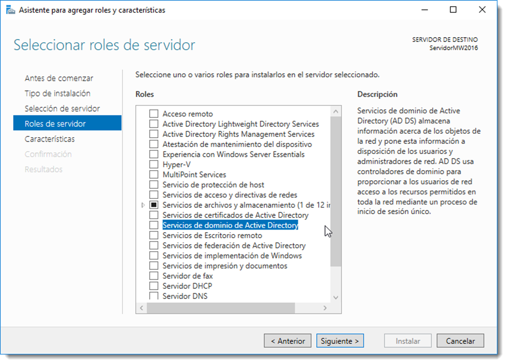

# Instalación de servicio de directorio

Una vez realizadas las configuraciones previas y antes de comenzar con el proceso de instalación, es necesario aclarar una serie de conceptos que se usarán en lo sucesivo. Se trata de servicios necesarios para el correcto funcionamiento del directorio:

- **Kerberos**, es un protocolo de seguridad creado por el MIT (Massachusetts Institute of Technology) que usa cifrado de claves simétricas para validar usuarios de red. Esta validación frustra los intentos de acceso a la red de usuarios no autorizados.
  Usa tickets para la validación de usuarios. Estos tickets los facilita el centro de distribución de claves o KDC (Key Distribution Center). Una vez que el usuario se ha autenticado,el KDC le envía un ticket específico para esa sesión a la máquina del usuario. De esta manera cualquier servicio buscará el ticket en la máquina en lugar de preguntarle al usuario que se autentique usando una contraseña.
  Kerberos tiene su propia terminología para definir varios aspectos del servicio:

  - **real**, red que usa Kerberos compuesto de uno o varios KDC.
  - **principal**, es el nombre único de un usuario o servicio que puede autenticar mediante el uso de Kerberos.
  - **ticket**, son datos cifrados que el servidor facilita a los clientes para su autenticación y que son almacenados durante la sesión. Existen diferentes tipos:

    - _TGT (Ticket Granting Ticket)_, usado para la autenticación de un usuario en la red y que se solicita al iniciar la sesión. Habitualmente los TGT tienen una validez de 10 horas.
    - _TGS (Ticket Granting Service)_: solicitado por un usuario para autenticarse frente a un servicio de red.

- **SAMBA**, es una implementación de código abierto de los protocolos de ficheros compartidos SMB/CIFS para sistemas de tipo Unix. Permite la interoperatividad entre servidores GNU/Linux y clientes basados en Microsoft Windows. También proporciona servicios de archivos e impresión y puede integrarse en Active Directory, ya sea como controlador de dominio principal o como miembro del dominio. Será esta la característica que se explotará en este manual.

- **SMB/CIFS**, Server Message Block y Common Internet File System son protocolos de red desarrollados para compartir archivos e impresoras entre nodos de una red. El protocolo SMB fue desarrollado originalmente por IBM y posteriormente ampliado renombrado a CIFS por Microsoft. Sin embargo, desde una perspectiva funcional, ambos son protocolos muy similares y utilizados por SAMBA.
- **NTP (Network Time Protocol)**, es un protocolo de Internet usado para sincronizar los relojes del sistema del ordenador a una fuente de tiempo de referencia.
  

Al margen de esta nueva terminología, se utilizará otra como **LDAP, DNS o DHCP** que ya resulta familiar. Todos estos servicios se han de instalar y configurar durante el proceso de instalación del directorio. Existen varias formas de realizar esta tarea:

- **asistida**, en donde un asistente guiará el proceso de instalación y tan solo detendrá el proceso cuando requiera información necesaria para continuar con ella.
- **manual**, en la que se deberá instalar cada uno de los servicios por separado y configurarlos para que funcionen en conjunto.

En este manual se tratará de forma pormenorizada ambas formas. Antes de iniciar cualquiera de ellas, hay que realizar varias comprobaciones:

- que el **nombre del equipo** sea el adecuado, cambiarlo una vez instalado el servicio de directorio puede ser una tarea complicada para algunos servicios.
- que la **tarjeta de red** que apunta a la red interna (si el servidor dispone de varias), disponga de una **IP fija**.
- que el usuario del administrador tenga una **contraseña válida**.
- que el sistema operativo esté **actualizado** con los paquetes de seguridad más recientes instalados.

Si todo esto es correcto, se procederá con la instalación de los servicios de directorio. Recuerda que esta instalación se realiza sobre un SOR previamente instalado en un equipo.

## Instalación de servicios de directorio en Microsoft Windows Server

Se trata de una instalación casi desatendida. El proceso de instalación se inicia a través de un asistente el cual guía al usuario durante el proceso de instalación. Durante el proceso, este asistente instalará todos los servicios necesarios y los configurará en función de los datos que el usuario facilite durante la ejecución del asistente.
Este proceso se realizará en dos fases:

- la primera, dotar de las herramientas necesarias al servidor para actuar como controlador de dominio.
- la segunda, promocionarlo a una función específica dentro del dominio. En esta ocasión a controlador principal ya que no existe otro controlador en la red.

En versiones anteriores de Microsoft Windows Server, la instalación de los servicios de directorios se realizaba a través del comando `dcpromo`. Desde hace algunas versiones, esta característica es tratada como un rol del sistema. Los **roles** y las características son funcionalidades de las que se va a dotar al servidor, como por ejemplo que sea un servidor de archivos, de impresión, que controle las DNS o que asigne IP de manera automática. Cada una de estas **características** se instalan y configuran de forma pormenorizada.

Desde <span class="menu">Inicio</span> → <span class="menu">Administrador</span> del servidor se accede a la configuración del servidor así como a la configuración del todo el Dominio. Desde aquí se iniciará el proceso de instalación de los servicios de directorio. También desde aquí es posible comprobar el nombre del ordenador y la IP del mismo a través de las opciones <span class="menu">Servidor local</span> → <span class="menu">Nombre de equipo</span> y <span class="menu">Servidor local</span> → <span class="menu">Ethernet</span>.

Una vez correctamente configurado se accede a <span class="menu">Panel</span> → <span class="menu">Agregar roles y características</span>. Se selecciona una instalación basada en roles y características. Tras esto, se selecciona el servidor al cual se debe dotar de las herramientas necesarias y se asigna el rol de Servicios de dominio de Active Directory de entre todos los disponibles. Al seleccionar esta opción el sistema informa que es necesario agregar una serie de dependencias (características requeridas) para que el sistema funcione de forma correcta. Se aceptarán estas características requeridas.

Tras la instalación de los roles necesarios, se mostrará una pantalla para seleccionar las características adicionales que el servidor debe disponer. En este momento de la instalación no será necesario especificar ninguna de ellas.

Con posterioridad se instalarán una a una las necesarias. Cuando termine el asistente de configuración, se procede a la instalación desde el botón <span class="menu">Instalar</span>.

Una vez finalizado el proceso, el servidor ya posee las herramientas para convertirse en un controlador de domino, pero todavía no lo es. Para ello se debe especificar qué función realizará este equipo en el directorio, a través del botón <span class="menu">Promover este servidor a controlador de dominio</span>. Se trata del primer controlador de la red, por lo que es necesario agregar un nuevo bosque y para ello especificar el nombre del dominio raíz. En el caso del ejemplo se usará el nombre **miempresafea.local**, pero recuerda utilizar el nombre de la empresa que has diseñado.

Lo siguiente que es necesario especificar es el **nivel funcional tanto del bosque como del dominio**. Este nivel nos marca el conjunto de características de las que el dominio va a disponer. Si se dispone controladores con varios tipos de sistemas operativos en ella, es preciso que se encuadre un mismo nivel de funciones entre ellos. De este modo, si contamos con un controlador instalado en Microsoft Windows Server 2008, el nivel funcional del directorio es conveniente que se reduzca a este sistema operativo de red. En el caso que se describe en este manual, se instalará un segundo controlador de dominio basado en Microsoft Windows Server 2016, por lo tanto será éste el nivel funcional del bosque como del dominio.

Este equipo también actuará como servicio de **DNS** y contendrá el catálogo global. También es necesario especificar una contraseña para el modo de restauración de los servicios de directorio. Se utilizará **“Restaura#2019”**.

La instalación del servicio de nombres es necesario realizarla en este servidor al tratarse del primero en el bosque. Como todavía no existe este servicio, es imposible que se pueda delegar a otro servidor.

En la pantalla de opciones adicionales el propio sistema recomienda un nombre NetBIOS que dejaremos intacto. En lo referente a las rutas de acceso, se recomienda usar las sugeridas por el sistema. En esta rutas de guardarán los scripts de inicio de los clientes, las configuraciones de políticas de grupo y seguridad así como la base de datos del catálogo global.

Tras mostrar un resumen de la configuración, el asistente realiza una comprobación de los requisitos del sistema para poder promocionar el servicio. Si se ha elegido un nivel funcional diferente a Microsoft Windows Server 2016, es posible que aparezcan varias alertas que serán solucionadas con posterioridad. Una vez más, pulsando en el botón <span class="menu">Instalar</span> dotará a este equipo las características necesarias para convertirse en controlador de domino principal.

Al finalizar el proceso de instalación y tras el reinicio, en el panel de administración del servidor se puede apreciar como existen tres nuevos roles para este servidor, como el rol de dominio de Active Directory, el rol de DNS y el de servicios de archivos y de almacenamiento. Éste último hace referencia a la creación y administración de los recursos compartidos del sistema, que será tratado con posterioridad.

## Instalación de servicios de directorio en Ubuntu Server

El proceso de instalación en sistemas basados en GNU/Linux es mucho más descriptivo e interesante. Los servicios se han de instalar uno a uno y conectarse entre sí. Esta instalación ofrece una nueva visión del proceso mucho más cercana y con menos capas de abstracción, lo que se traduce en un aumento de las complicaciones para el administrador. A pesar de ello, este sistema permite un mayor control sobre los componentes y una visión más clara de como funciona el servicio de directorio al completo.
Antes de iniciar la instalación de Samba y convertir el equipo en un controlador de dominio, es recomendable actualizar los repositorios de apt-get y revisar las actualizaciones del sistema operativo. Así se asegurará que se utiliza la última versión del software.

```bash title="Actulización de la base de datos y de los paquetes"
sudo apt-get update
sudo apt-get upgrade

```

La primera comprobación que hay que realizar el que el nombre del equipo sea el correcto. Para ello comprobamos el fichero `/etc/hostname`, en el caso de este ejemplo el nombre del equipo es ServidorUbuntu. Si es necesario cambiar el nombre, es posible modificando el nombre en este fichero. Los cambios aparecerán tras el reinicio de la sesión.

Otro fichero que se ha de configurar es el `/etc/hosts`, que nos permite relacionar la IP y el nombre del equipo. Se establecerá la correspondencia entre la IP del servidor, el nombre de equipo y el **FQDN (Fully Qualified Domain Name)** de este modo: ServidorUbuntu.miempresafea.local.

Recuerda hacer una copia del fichero antes de su modificación:

```bash title="Copia de seguridad"
cp /etc/hosts /etc/hosts.copia
```

El fichero debe quedar de este modo:

```bash title="Fichero de configuración"
127.0.0.1 localhost
192.168.100.100 ServidorUbuntu.miempresafea.local ServidorUbuntu
# The following lines are desirable for IPv6 capable hosts

::1 localhost ip6-localhost ip6-loopback
ff02::1 ip6-allnodes
ff02::2 ip6-allrouters

```

Ya está todo listo para instalar Samba en el servidor. Para variar, la instalación se realiza a través del siguiente comando:

```bash title="Instalación SAMBA"
sudo apt-get install samba krb5-config winbind smbclient

```

Con este comando se están instalando varios paquetes:

- **samba**, que contiene todas las herramientas para la creación de un servicio de directorio en este equipo.
- **smbclient**, que permitirá gestionar los clientes que pertenezcan a este servicio
- **winbind**, conjunto de herramientas que permitirán a los sistemas operativos basados en Microsoft Windows acceder a este servicio.
- **krb5-config**, que instalará el servicio Kerberos para la autentificación de los usuarios

El único que requiere atención en esta parte de la instalación es el de Kerberos, el cual realizará varias preguntas:

- el **reino** en el que se van a ofrecer los tickets de autentificación, en el ejemplo será _MIEMPRESAFEA.LOCAL_
- el **host** que contendrá el servidor de Kerberos, en este caso es el mismo que contiene el dominio, que será _ServidorUbuntu.miempresafea.local_
- y por último, el host que contendrá el servidor Kerberos con fines administrativos, que será el mismo que en el caso anterior: _ServidorUbuntu.miempresafea.local_

Antes de pasar a configurar _samba_, es conveniente hacer una copia del fichero de configuración original, por si hubiera que retomar la instalación desde este punto:

```bash title="Copia de seguridad de los archivos de seguridad"
sudo mv /etc/samba/cmb.conf /etc/samba/smb.conf.copia
```

Ahora sí, lanzamos el la configuración del servicio:

```bash title="Configuración de Samba"
sudo samba-tool domain provision
```

Una vez lanzado el asistente, irá preguntando los datos necesarios para la configuración. Muchos de ellos ya han sido configurados con anterioridad y los mostrará entre corchetes. Si estos valores son correctos, no será necesaria su modificación:

- **Realm** → MIEMPRESAFEA.LOCAL
- **Domain** → MIEMPRESAFEA
- **Server** Role → dc
- **DNSbackend** → SAMBA_INTERNAL
- **DNSforwarder IP address** → 8.8.8.8 (este dato sí hay que cambiarlo ya que de este modo podremos salir al otras redes. Para ello usamos el servicio DNS de Google).
- **Administrator** password → **P4ssw0rd** (durante el proceso de creación del directorio se crea al administrador que recibe el nombre de administrator, en inglés.)

La opción elegida en la línea DNS backend, es la SAMBA_INTERNAL. Esto quiere decir que será el propio Samba el que gestionará el servicio de resolución de nombres. Esta es la opción más fácil de implementar, aunque es posible instalar otro servicio de DNS como **Bind 9**. En esta configuración se dejará la opción por defecto.

Tras la instalación se mostrará un resumen en la pantalla de las características del directorio creado. Pero es recomendable consultar el nuevo fichero de configuración que se ha creado el cual debe tener el siguiente aspecto:

```bash title="Fichero de configuración Samba"
# Global parameters

[global]
workgroup = MIEMPRESAFEA
realm = MIEMPRESAFEA.LOCAL
netbios name = SERVIDORUBUNTU
server role = active directory domain controller
dns forwarder = 8.8.8.8

[netlogon]
path = /var/lib/samba/sysvol/miempresafea.local/scripts
read only = No

[sysvol]
path = /var/lib/samba/sysvol
read only = No

```

El dominio se ha creado con éxito y el servidor ha sido configurado como controlador de dominio de Active Directory. Esto quiere decir que este controlador puede integrarse en un directorio junto con otros controladores. Esta integración resulta fundamental ya que este tipo de directorios son los más utilizados en el ámbito empresarial, y siempre es buena idea contar con una alternativa a la omnipresencia de los sistemas operativos de Microsoft. Para lograr esta compatibilidad se ha generado tres bloques en el fichero de configuración.

- **global**, muestra la configuración del dominio junto con los roles para los que se ha creado.
- **netlogon**, se ha creado de forma automática la carpeta para los scripts de inicio de sesión de los clientes.
- **sysvol**, es responsable de la difusión las políticas de grupo aplicadas en el editor de directivas de grupo. Todos los cambios son replicados a través de este recurso compartido.

La conexión entre los servicios de Samba y el de Kerberos (para autientificar a los usuarios), se realiza a través de un archivo de configuración generado durante la instalación de Kerberos. Tan sólo será necesario copiarlo

```bash title="Copia de configuración"
sudo mv /var/lib/samba/private/krb5.conf /etc/

```

A continuación es necesario detener varios servicios instalados con anterioridad y que ahora serán gestionados a través de Samba. Se paran y se deshabilitan
sudo systemctl stop smbd nmbd winbind systemd-resolved
sudo systemctl disable smbd nmbd winbind systemd-resolved

Ahora desenmascaramos el servicio que se encargará de las tareas de los que se acaban de desactivar

```bash title="Desbloquear el servicio"
systemctl unmask samba-ad-dc
```

Si todo ha ido de forma correcta, el terminal responderá con este mensaje

```bash title="Mensaje"
Removed /etc/systemd/system/samba-ad-dc.service

```

Para más información. Mira este [link](https://wiki.samba.org/index.php/Managing_the_Samba_AD_DC_Service_Using_Systemd#Introduction)

También será necesario eliminar el archivo `resolv.conf` encargado de redireccionar las peticiones de DNS. Primero se comprueba la existencia de enlace

```bash title=""
ll /etc/resolv.conf
```

comando que mostrará la configuración de dicho enlace. Se elimina

```bash title="borrar"
sudo rm /etc/resolv.conf
```

y se crea uno nuevo con la configuración requerida

```bash title=""
sudo nano /etc/resolv.conf
```

que contendrá los siguientes datos

```bash title="Datos del fichero resolv"
domain MIEMPRESAFEA.LOCAL
nameserver 127.0.0.1
```

Ya está todo listo para activar el servicio de Samba

```bash title="Comienzo del Servicio"
sudo systemctl start samba-ad-dc
```

Además, será conveniente hacer que el sistema lo inicie en cada reinicio

```bash title=" Activación cuando se reinicie"
sudo systemctl enable samba-ad-dc
```

Tras esto, se comprueba que el equipo ofrece el servicio de Active Directory y en qué nivel funcional lo hará

```bash title=""
samba-tool domain level show
```

comando que mostrará la siguiente información

```bash title="Información del anterior comando"
Domain and forest function level for domain 'DC=miempresafea,DC=local'

Forest function level: (Windows) 2008
Domain function level: (Windows) 2008
Lowest function level of a DC: (Windows) 2008

```

Un detalle a tener en cuenta es que, a diferencia de Microsoft Windows Server 2016, este sistema sí admite usuarios locales en el equipo. No es nada relevante ya este equipo se dedicará únicamente a la gestión del controlador de dominio, pero se puede comprobar como los usuarios locales no han desparecido de la máquina.

En este punto del manual se dispone de dos controladores de dominio; uno configurado en Microsoft Windows Server 2016 y otro en Ubuntu Server. A partir de estas líneas se realizarán configuraciones en ambos servidores pero en dos redes distintas, de ese modo es posible practicar la administración de servicios de directorio desde GUI y desde CLI.
