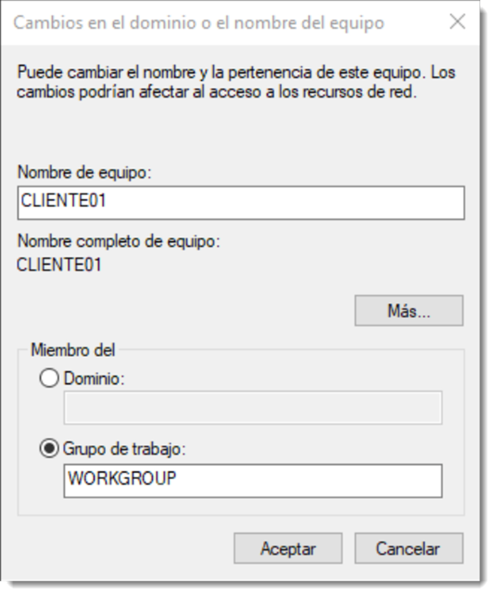
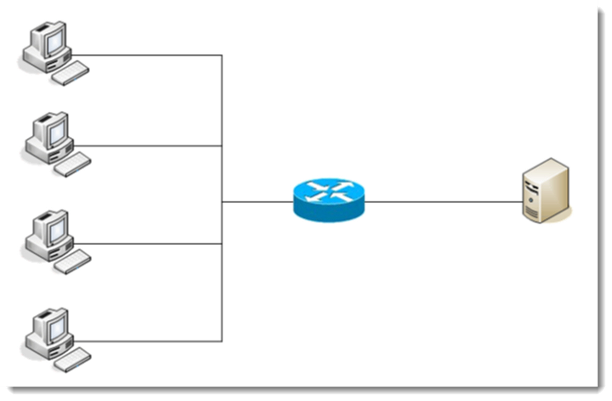
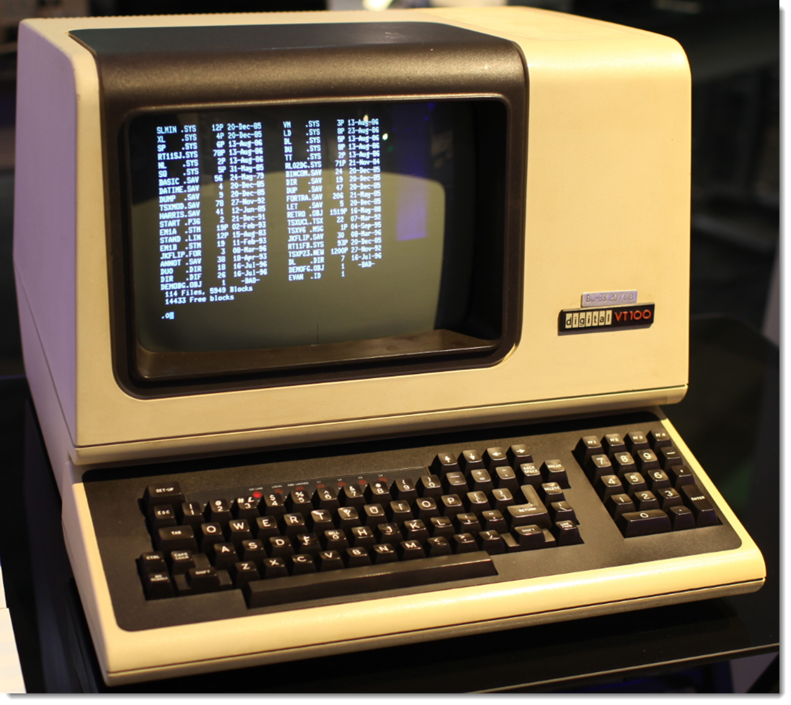
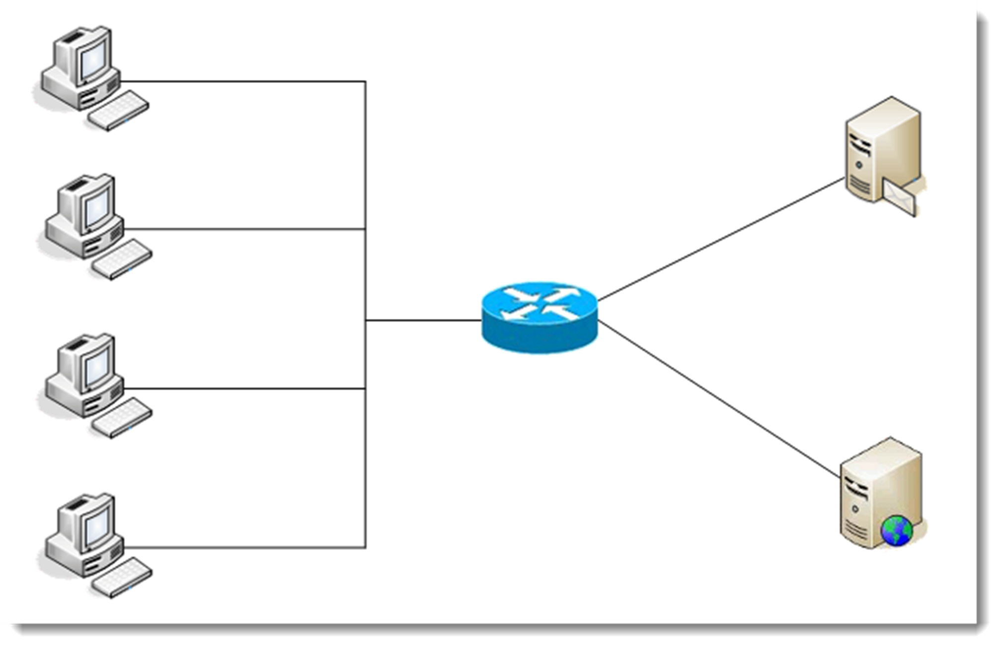
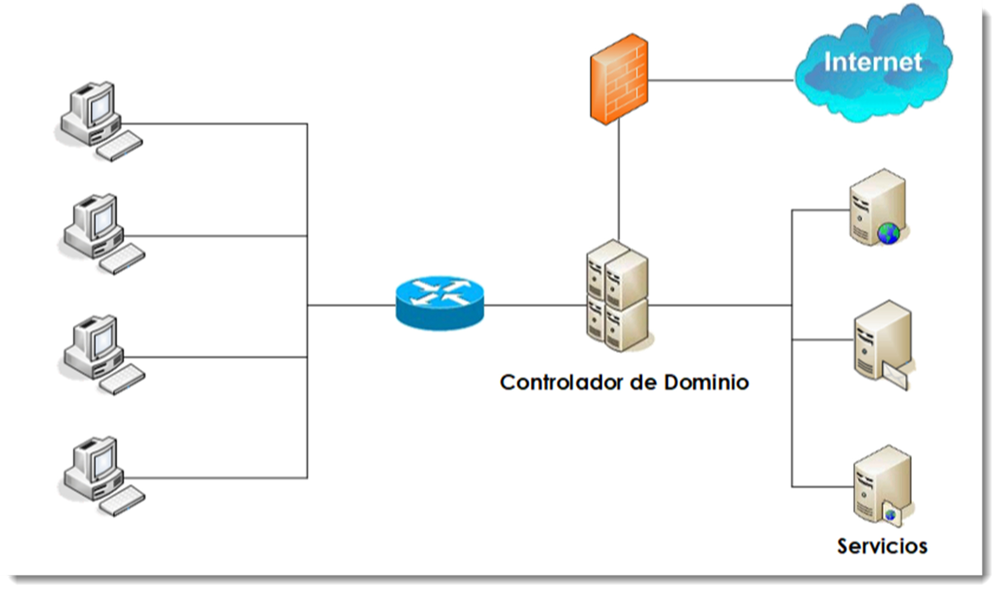
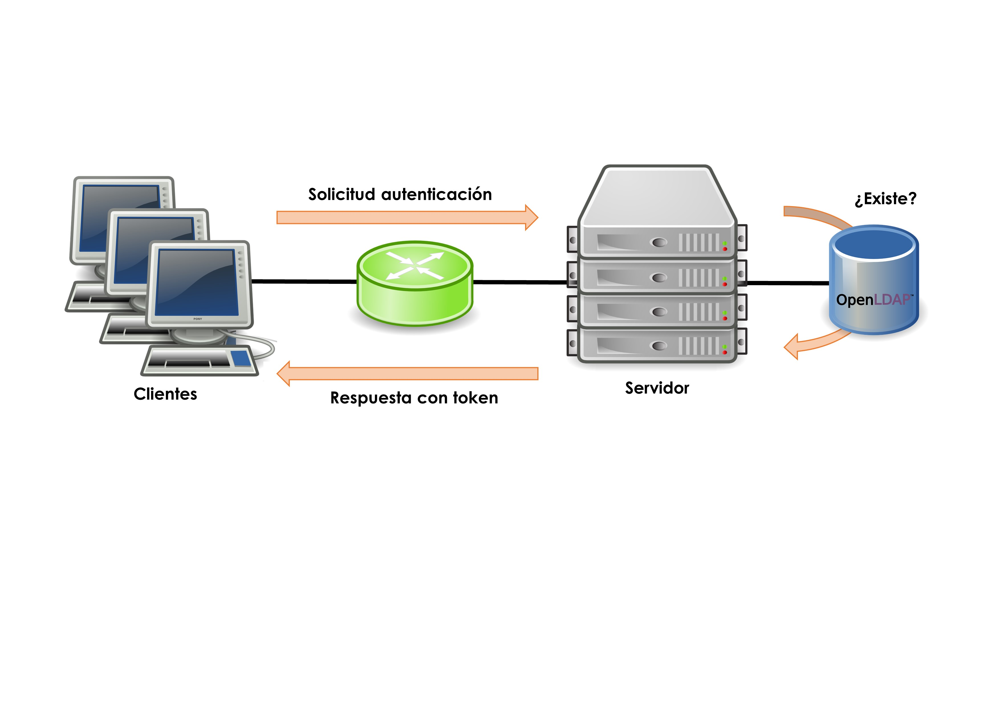

# Sistema de organización de redes

Si no se concibe un ordenador sin sistema operativo que lo administre, tampoco debe existir una red de cierta entidad sin sistema operativo de red que la gestione. Éste será el encargado de gestionar los elementos que componen la red a través de una serie de herramientas y capacidades que los sistemas operativos clientes, los vistos hasta el ahora, no disponen. Ofrecen y administran recursos y servicios al resto de ordenadores que componen la red vigilando el acceso y uso de los mismos.

En definitiva, un sistema operativo de red (SOR en lo sucesivo), está diseñado para administrar redes y todos los elementos que la componen. Sus tareas más importantes son la gestión centralizada de los recursos, ofrecer servicios a los clientes, proporcionar acceso seguro a esos recursos y monitorizar todo lo que pasa en la red. Tareas que se irán viendo en profundidad en las siguientes unidades.

## Administración de una red entre iguales. Estructura trabajo en grupo

Una red plana, entre iguales o punto a punto, es aquella en la ninguno de los equipos realiza tareas de administración de la red, sino tan sólo de sí mismo. No existe un equipo que haga las veces de administrador, por lo que en realidad, todos los clientes se convierten en administradores de los recursos que ofrecen a la red. Por ejemplo, si un cliente decide compartir un recuso, éste estará disponible para todos los miembros de la red sin distinción.
Si es necesario limitar el acceso a un subconjunto de usuarios, habrá que establecer una contraseña y hacérsela llegar a través de un medio seguro.

Si cada uno de los usuarios empieza a compartir recursos sin control, su localización puede ser una tarea complicada, ya que los usuarios de la red deben conocer en todo momento su distribución y configuración. La localización puede suponer un grave problema.
Microsoft introdujo en sus sistemas operativos la posibilidad de crear grupos de trabajo que dividían la red en subconjuntos. De este modo, si se sabe a qué grupo pertenece el equipo que comparte un recurso será más sencillo su localización. Estas divisiones se realizaban por funciones, por ubicación física o por cualquier otro criterio de la empresa. Resultaba más sencillo localizar recursos, pero no solucionaban el problema de acceso.
Además de la nula administración de los recursos, este sistema de organización de red presenta numerosos problemas de seguridad. Cada usuario puede tomar sus propias decisiones a la hora de compartir, las cuales no tienen por que coincidir con las de otros usuarios. Esto provoca que se deban conocer diferentes técnicas de seguridad para tener acceso a los recursos. Es evidente que no se trata de una forma óptima de trabajar.

## Estructura cliente-servidor. Servidores independientes

Se trata de un modelo de aplicación distribuida en el que las tareas se dividen entre los proveedores de recursos o servicios. A estas máquinas se las conoce como servidores y a los equipos que demandan estos servicios se les conoce como clientes. Cuando un cliente necesita un servicio ofrecido por un servidor, el primero realiza una petición que será respondida por el segundo.
Es una separación lógica, es decir, el que ofrece los servicios no necesariamente debe situarse en una sola máquina ni es necesariamente un sólo programa. Además, esta división lógica no es estricta, ya que un servidor puede actuar como cliente de otro proveedor de servicios.
Esta configuración lógica de red está basada en la terminal tonta o cliente ligero. Disponían de un teclado como dispositivo de entrada y un monitor como dispositivo de salida. No presentaban capacidad de cómputo ni de almacenamiento, siendo éstas capacidades prestadas por un superordenador o _mainframe_ al que se conectaban varios de estos terminales. Fruto de esta arquitectura física surge la organización lógica de redes **cliente-servidor**.

Es una red en la que los clientes están conectados a un servidor en el que se centralizan los recursos y servicios con que se cuenta la red. El servidor es el encargado de ponerlos a disposición de los clientes cada vez que estos son solicitados. Por lo tanto, todas las gestiones que se realizan se concentran en el servidor, lo que facilita la localización de los recurso de una forma sencilla.

Sin embargo, agregar un segundo servidor puede complicar las cosas de manera significativa. El problema surge porque cada servidor individual mantiene su propia lista de usuarios y recursos. El servidor A ofrece alojamiento a aplicaciones, el servidor B al correo electrónico y las aplicaciones de contabilidad y la base de datos se encuentran en el servidor C. Los usuarios que requieren acceso a la base de datos y utilizar las aplicaciones, necesitan una cuenta en dos se los tres servidores. Cada una de esas cuentas de usuarios debe ser creada y mantenida de manera separada. Es fácil para los servidores perder sincronía cuando deben ser actualizados manualmente.

La situación también se complica desde el punto de vista de usuario, pues debe conectarse y mantener una contraseña en cada uno de los servidores. Aunque este proceso puede ser automatizado, suele ser propenso a errores.
Este tipo de redes siguen siendo adecuadas en situaciones simples, donde sólo existe un servidor y tiene unas funciones muy delimitadas.

A pesar de plantear solución a la ubicación de los recursos del sistema, todavía quedan problemas por resolver relacionados con la asignación de permisos a los recursos o la sincronización de la información. Estas y otras cuestiones serán resueltas con el siguiente modo de organización de red.

## Servicios de directorio

Con el anterior sistemas de organización de redes se ha dado un paso hacia la gestión óptima de los elementos de una red, no obstante todavía quedan ciertos problemas por resolver. La dispersión de la información platea un problema de accesibilidad y control.
Aquí es donde se hacen útiles los servicios de directorios, que son un conjunto de aplicaciones que guardan y administran toda la información sobre los elementos de una red. Cada recurso de la red se considera como un objeto, donde su información se almacena como atributos. Para la gestión de esta información, el servicio de directorio establece una serie de permisos de acceso y condiciones de seguridad que la salvaguardan esta información.
Un servicio del directorio ofrece una infraestructura para localizar, manejar, administrar, y organizar los componentes y recursos comunes de una red. Cada uno de estos recursos pueden ser volúmenes, carpetas, archivos, impresoras, usuarios, grupos, dispositivos, números de teléfono y un largo etcétera. Un servicio del directorio es un componente fundamental del SOR ya que es la herramienta que los diferencia de los sistemas operativos clientes.
Los servicios de directorios contienen diferentes objetos relacionados entre sí, y que será conveniente familiarizarse con ellos:

- **directorio**, es un repositorio único para la información relativa a los objetos de una organización.
- **dominio**, es una colección de objetos dentro de un directorio.
- **objeto**, cualquiera de los elementos que forman parte del directorio. Pueden ser recursos, usuarios, equipos, relaciones de confianza, servidores, unidades organizativas entre otros. En general todos estos objetos se clasifican en tres categorías:

      - **usuarios**, identificados a través del binomio nombre/contraseña y que pueden organizarse en grupos.
      - **recursos**, elementos que los usuarios pueden usar para el correcto desarrollo de su actividad.
      - **servicios**, que son funciones a los que el usuario tienen acceso como el correo electrónico, copias de seguridad en la nube, conexión Internet entre otros.

- **unidad organizativa**, es un contendedor de objetos que permite organizarlos en subconjuntos de forma jerárquica. Facilita la organización de los dominios.
- **grupo**, conjunto de objetos usuario. Al igual que las unidades organizativas, facilitan la organización y administración de los objetos, los grupos lo hacen con objetos tipo usuario.
- **controlador de dominio**, equipo que contiene la base de datos de objetos para un determinado dominio, incluida la información de seguridad y la responsabilidad de la autenticación de objetos de su ámbito de gobierno.
- **catálogo globa**l, base de datos con la información de todos los objetos que contiene el directorio. Esta información habitualmente se divide entre los controladores de dominio siendo éstos responsables del mantenimiento de su parte de esta información.
- **maestro de operaciones**, existen un conjunto de operaciones que deben estar centralizadas para mantener la consistencia del sistema. El equipo encargado de esas operaciones obtiene este rol específico. Según el caso puede ser un equipo independiente que controle estas operaciones o asignar estas tareas a un equipo existente.
- **árbol**, un conjunto de dominios dependientes de una raíz común y que tienen una estructura jerárquica. Se caracterizan por tener un espacio de nombres común (un servidor DNS propio). El objetivo de esta fragmentación de la estructura es replicar sólo la información necesaria y disminuir el tráfico de red.
- **bosque**, se trata del mayor contenedor lógico dentro del directorio, conteniendo a todos los árboles dentro de su ámbito. Cada uno de estos contenedores posee su propio espacio de nombres y una forma de relacionarse con el resto de bosques.
- **esquema**, se refiere a la estructura de los objetos que forman la base de datos. Usa la técnica clase/objeto para definir la estructura de un objeto. Si se crean dos objetos usuarios, ambos tendrán los mismos atributos (estructura), pero diferentes atributos. -**sitio**, conjunto de objetos equipo que se encuentran relacionados de una forma lógica, geográfica o técnica particular y que necesitan un subconjunto de normas diferentes al resto. -**relaciones de confianza**, son un método de comunicación segura entre dominios, árboles y bosques, que permiten a los usuarios autentificarse en otra parte del directorio a la que no pertenece.

Este listado pretende ser un resumen de los diferentes componentes que conforman un directorio. Se tratarán con mayor profundidad todos estos conceptos en otras unidades.

Para nombrar a todos estos objetos que componen la red, los servicios de directorio definen un espacio de nombres unívoco, e identifican a cada uno de estos objetos con un nombre único en todo el directorio. De esta forma será sencillo acceder a los objetos ya que tan sólo hay que conocer su nombre. Una vez accedido, es posible obtener todos los atributos de ese objeto.

La tecnología utilizada para crear este espacio de nombres es la **DNS (Domain Name Server)**, y su funcionamiento es similar al de Internet. Cada uno de los objetos del directorio posee un DN (Distinguished Name) que lo identifica de forma unívoca del resto de elementos del directorio.

Otro aspecto importante de los servicios de directorio, es que ofrecen una capa de abstracción para facilitar el acceso a los objetos. Se debe indicar una única ubicación en donde se dirigirán las peticiones de información. No importa si la información solicitada se encuentra o no en ese emplazamiento, el servicio de directorio dará servida cuenta de las solicitudes que le lleguen. Si se permite el símil, es el Google del sistema informático que se gestiona.
Es posible que toda la información no esté contenida en un único equipo por cuestiones de rendimiento, escalabilidad o idiosincrasia del sistemas informático. En estos casos crear un subconjunto de la información contenida en los servicios de directorio parece una buena opción y dotarlos de las herramientas necesarias para su gestión autónoma. A pesar de esta autonomía, todos los objetos de este subconjunto pertenecen al conjunto global y deben comportarse como tales.

Existen multitud de servicios de directorio pero en este manual se van a tratar los siguientes:

- **Active Directory**, ideado por Microsoft e implementado desde su versión Microsoft Windows 2000 que usaba tecnología propietaria, para más tarde adaptar el protocolo LDAP a su servicio
- **OpenLDAP**, recibe el nombre del protocolo homónimo que gestiona el intercambio de información. Es uno de los más usados en sistemas basados en GNU/Linux.
- **SambaLDAP**, un servicio compuesto por un conjunto de protocolos (OpenLDAP, Kerberos y Samba) que permite la fácil coexistencia de entre sistemas operativos diferentes.

Otros servicios de directorio que implementan este protocolo de acceso a datos son el **Novell Directory Services, Red Hat Directory Server o Apache Directory Server** entre otros.

En resumen, un servicio de directorio ofrece toda la información de los recursos de la red a través de una única ubicación. Para ello convierte cada recurso en un objeto y almacena su información en una base de datos jerárquica y, opcionalmente, distribuida. La gestión de estos datos se realiza a través de un protocolo determinado por la versión del servicio de directorio escogido.

### Protocolo LDAP

El **LDAP (Lightweight Directory Access Protocol)** es un protocolo a nivel de aplicación que da acceso a un servicio de directorio ordenado y distribuido para la búsqueda de la información de un entrono de red.

En la década de los 80, la especificación de directorio **X.500** vio la luz. El protocolo que daba acceso a la información contenida en él, fue DAP (Directory Access Protocol) y estaba basado en la pila de protocolos OSI (Open Systems Interconexion). Gracias al auge de Internet, la pila de protocolos **TCP/IP** cobraron especial protagonismo y su uso fue generalizado en cualquier infraestructura de red, incluidas las LAN.

Ante esta situación, en 1993 se implementó el protocolo LDAP que utilizaba la pila de protocolos TCP/IP para el acceso a la información contenido en un servicio de directorio. El funcionamiento de LDAP es relativamente simple: un cliente se inicia una sesión en un servidor LDAP solicitando alguna información. Esta solicitud es transmitida al servidor, devuelta al protocolo LDAP y enviada al cliente. Salvo en contadas excepciones, el cliente no ha de esperar la respuesta del servidor para realizar la siguiente petición.
