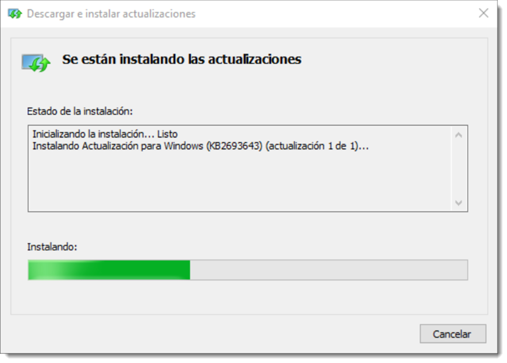
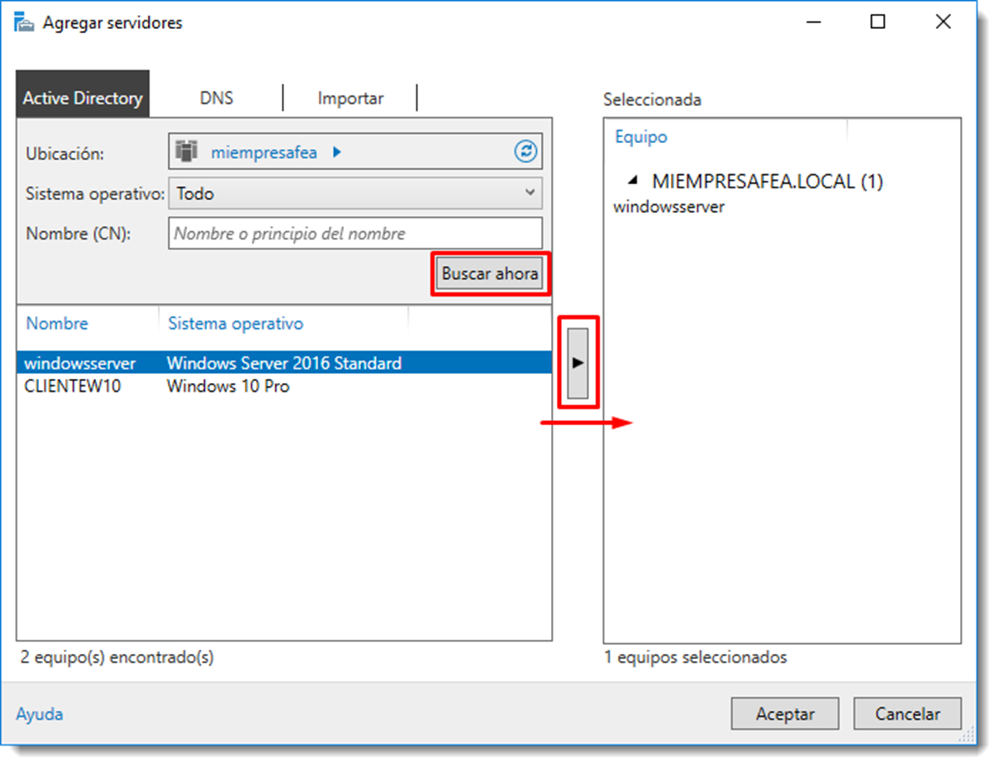

# Administración remota

Una de las recomendaciones en todo directorio es la de habilitar un sistema para la administración de los servidores de forma remota. Habitualmente, el acceso a los servidores suele estar restringido y puede resultar incómodo el trabajar con ellos, ya que suelen estar en salas bajo llave, controles de acceso, climatización no apta para mamíferos, entre otros problemas.

Aprovechando que los clientes deben conectarse a los servidores para solicitar datos y realizar acciones, es buena idea habilitar a éstos para que, desde ellos, se realicen gestiones de administración remota. La forma de hacerlo dependerá del tipo de servidor que gobierne la red.

## Gestión desde sistemas operativos cliente de Microsoft

Microsoft dispone de una herramienta gratuita que permite esta tarea: **Remote Server Administration Tools**, en lo sucesivo **RSAT**. Se trata de una aplicación cuyo objetivo es administrar el servidor pensada para instalarse en clientes que replica las herramientas disponibles en el controlador del dominio. Este software está idealmente pensado para servidores tipo **CORE** en los que no existe una GUI y toda su administración queda adscrita a un terminal. El consumo de recursos de la GUI queda traspasada al cliente, utilizando el servidor estos recursos para otros menesteres.

La configuración ha de realizarse en dos fases: la configuración del servidor y la del cliente. En el primer caso será necesario activar, por un lado la Administración Remota desde el <span class="menu">Administración del servidor</span> → <span class="menu">Servidor local</span> → <span class="menu">Administración remota</span>. Esta configuración habilita una regla en el Cortafuegos de Windows que permite el acceso a estos servicios desde el exterior.



Una vez configurado el servidor, toca el turno al cliente. Es preciso señalar que cualquier usuario con permiso para instalar software podrá realizar estas acciones, pero en ningún caso administrar el servidor.

Para poder utilizar **RSAT** será necesario iniciar sesión como administrador del dominio o una cuenta que disponga de permisos suficientes. No obstante, por coherencia del proceso, se realizará todo con la cuenta de administrador de dominio.

Se inicia sesión en el cliente con la cuenta de administrador de dominio, descargar la versión correcta y se instala el programa. En realidad lo que hace este programa es añadir una herramienta al sistema operativo, como si de una actualización del mismo se tratase.

Tras el proceso de instalación y el pertinente reinicio, se comprueba que en el menú de <span class="menu">Inicio</span> existe una nueva aplicación denominada Administrador del servidor y que la interfaz gráfica de esta herramienta es exactamente igual que la de Microsoft Windows Server. De esta forma será más sencillo el cambio entre una y otra forma de administrar el servidor.

El siguiente paso es conectar esta herramienta con el servidor que se debe administrar. Si en la infraestructura de red existe más de uno, es posible tener una de estas herramientas para cada uno, eso sí, en diferentes clientes. Para enlazar esta herramienta con el servidor se pulsa el botón derecho sobre la opción <span class="menu">Todos los servidores</span> → <span class="menu">Agregar servidores</span> del panel de la izquierda.



A partir de este momento toda la gestión realizada en esta herramienta tendrá su efecto en el controlador de dominio configurado.

## Gestión desde sistemas operativos cliente GNU/Linux

En los sistemas operativos basados en GNU/Linux se dispone de la herramienta **SSH (Secure Shell)**. SSH es un protocolo seguro para la administración remota de servidores, routers, switches y un largo etcétera de equipos. Permite manejar por completo el servidor o dispositivo de red mediante un intérprete de comandos.

Además, es posible ejecutar programas gráficos a través de la propia sesión SSH e incluso el uso de la herramienta PowerShell de Microsoft a través de este protocolo.

También permite la transferencia de datos de manera segura a través del protocolo **SFTP (SSH File Transfer Protocol)**.

El protocolo SSH es fundamental en el ámbito de las redes y administración de sistemas ya que dispone de una amplia gama de opciones para dotar a nuestro sistema de la máxima seguridad posible. Proporciona:

- **confidencialidad**, los datos van cifrados de extremo a extremo de la comunicación
- **autenticación**, se requiere para poder usar el servicio. Es posible identificarse con usuario/clave o con criptografía de clave pública
- **integridad**, si los datos se modifican o los modifica un usuario malintencionado se podrá detectar, ya que usa HMAC (Hashing for Message Authentication) para comprobar la integridad de todos y cada uno de los datos.

Existen dos versiones de SSH, la versión 1 no se recomienda usarla, de hecho, por defecto siempre se utiliza la versión SSHv2 de este protocolo. Por defecto SSH utiliza el protocolo TCP de la capa de transporte y el **puerto 22**, aunque es posible modificar este comportamiento. Para la configuración de SSH se usará el programa **OpenSSH** que ofrece servicios tanto de cliente como de servidor. Como es obvio el proceso de instalación del servicio se realizará en dos fases; la del servidor y la del cliente.

Para instalar en servicio de OpenSHH es necesario la instalación de algunos paquetes, si no están instalados ya en el sistema

```bash
sudo apt install openssh-server
```

se arranca el servicio

```bash title=""
sudo /etc/init.d/ssh start

```

Uno de los ficheros que hay que tener en cuenta cuando se usa este servicio es `/etc/ssh/sshd_config` el cual contiene su configuración. Desde aquí es posible configurar los intentos de conexión, el número de conexiones simultáneas, el modo de autenticación, el puerto de escucha, restringir la dirección de conexión y otras muchas opciones. Está fuera de este apartado explicar todas y cada una de ellas. Es recomendable consultar la ayuda y visitar su página web si se requiere alguna configuración más de las que se detallan a continuación.

- **Port 22**, el servicio ssh se comunica a través del puerto 22 por defecto. Un ataque a este servicio siempre se realiza a través del puerto 22 y al usuario root. Cambiar estas configuraciones puede ser buena práctica si se sospecha de alguna intrusión.
- **PermitRootLogin no**, permite deshabilitar el login del usuario root para dotar al sistema de mayor seguridad.
- **LoginGraceTime**, tiempo necesario para introducir la contraseña.
- **MaxAuthTries**, intentos permitidos para introducir la contraseña.
- **MaxStartups**, número de login abiertas desde una IP, se evita que se puedan utilizar varias sesiones de forma simultánea.
- **AllowUsers**, lista blanca que permite configurar los usuarios que podrán conectarse. Una medida muy restrictiva pero a la vez muy segura ya que bloqueará todas las conexiones de los usuarios que no estén en el listado.

OpenSSH permite varias formas de autenticación en el servidor. La más común es utilizar el binomio usuario/contraseña, pero también es posible utilizar claves criptográficas, usar One Time Password generados por aplicaciones externas entre otros. El sistema informático que se está construyendo se encuentra dentro de una red confiable, por lo que todas estas medidas de seguridad no serán necesarias. Aún así, es interesante que el administrador conozca la existencia de estas técnicas de seguridad extra.

Para que un cliente pueda conectarse al servidor a través de SSH tan sólo será necesario utilizar el comando ssh utilizando el nombre del equipo o bien la dirección IP

```bash
ssh administrador@ubuntuserver.miempresafea.local
```

Cuando la conexión se haya establecido aparecerá un mensaje como este

```bash
The authenticity of host 'ubuntuserver.miempresafea.local' can't be established.
DSA key fingerprint is 94:68:3a:3a:bc:f3:9a:9b:01:5d:b3:07:38:e2:11:0c.
Are you sure you want to continue connecting (yes/no)?
```

Al contestar `yes` se establece una conexión y se le preguntará la contraseña especificada al usuario. En este momento se dispone de un terminal abierto en el servidor con el usuario administrador.
