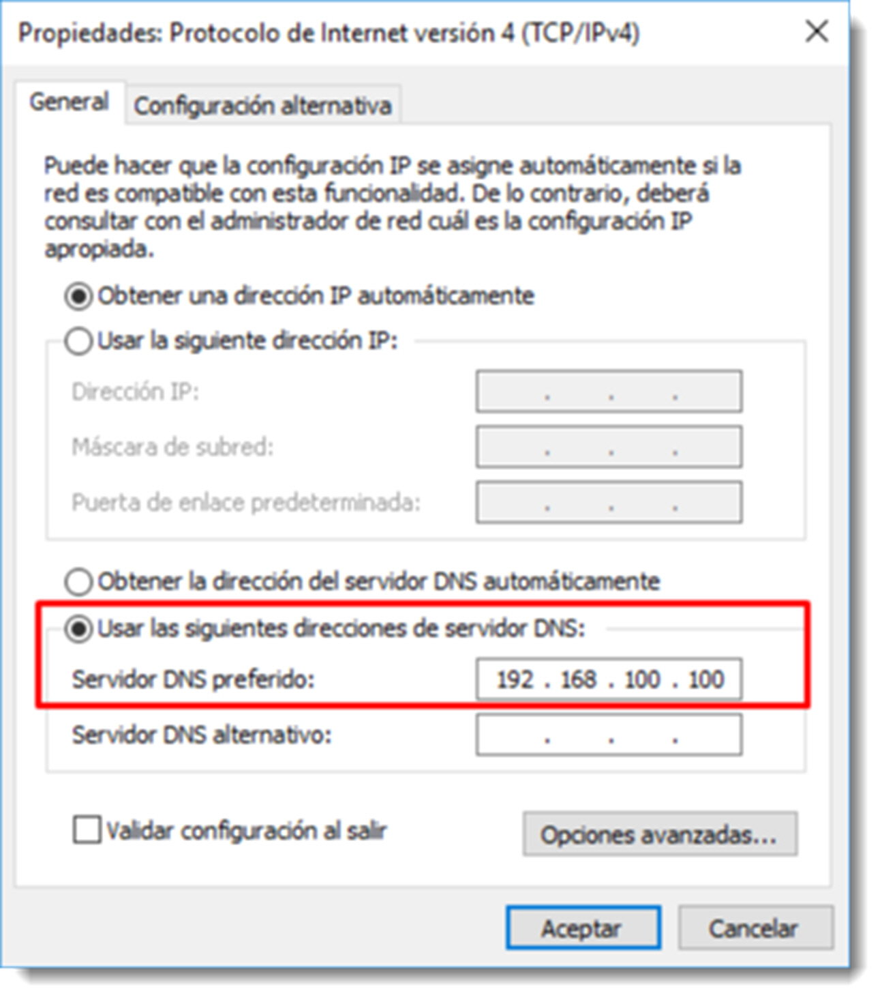
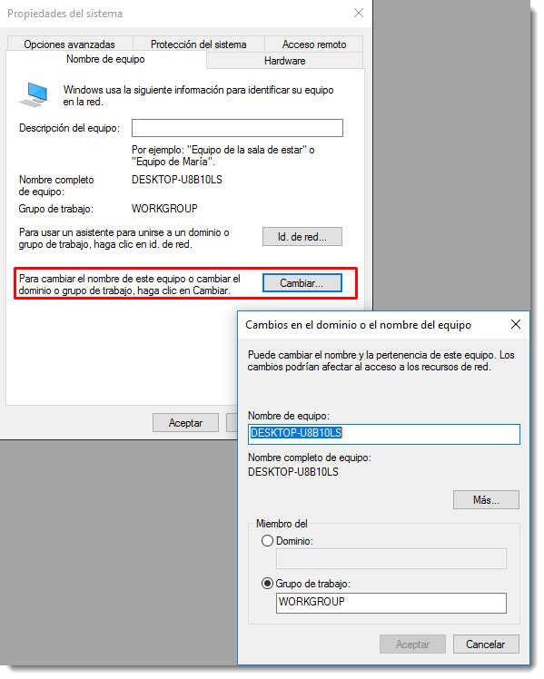
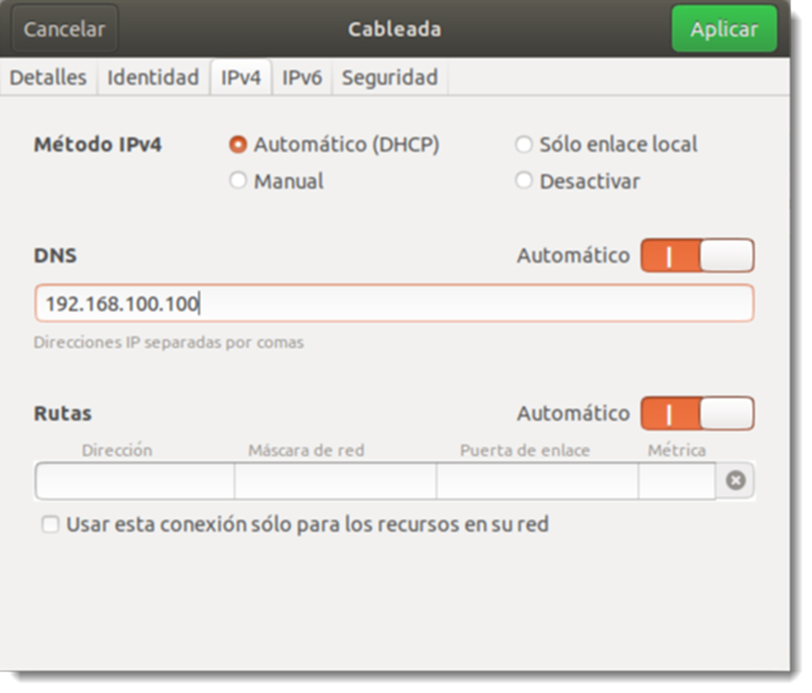
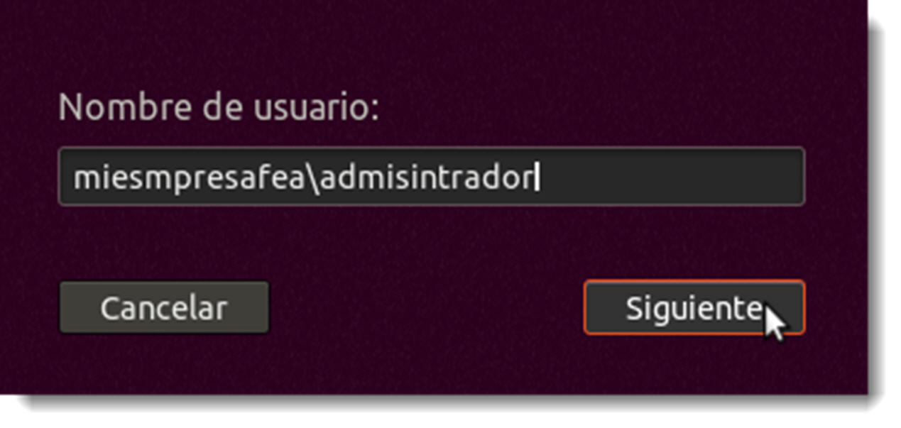

# Conexión de clientes a un controlador de dominio

## Clientes Microsoft Windows

Un controlador de dominio sin objetos que controlar sería un caro objeto de decoración. Cuando un cliente pasa a formar parte del dominio, éste queda adscrito a un ámbito con unas normas muy bien definidas y que se va a ver en la obligación de cumplir. Sin embargo, también va a tener acceso a una serie de recursos que, de ninguna otra manera, podría haber tenido acceso antes de la pertenencia al dominio.

Todo cliente que quiera pertenecer a un dominio debe cumplir los requisitos exigidos por éste, que dependerán de los objetivos que persiga. Además, se deben seguir los siguientes pasos:

- configurar la red del cliente de forma adecuada para que coincidan con las del dominio
- ajustar el nombre del equipo del cliente si existen alguna nomenclatura especificada o cumpliendo las restricciones impuestas por el dominio
- unir el equipo cliente al dominio
- iniciar sesión con la cuenta de usuario especificada

Una vez preparado el cliente, se detallan a continuación los pasos a seguir para unir un cliente con Microsoft Windows 10 Professional al dominio.

El primer paso es comprobar que la configuración de red del cliente sea compatible. Es posible utilizar una IP fija, pero si el servidor dispone de un servicio DHCP es posible dejar la configuración automática para que el cliente solicite una antes de la la inclusión al dominio. Este es una práctica recomendable para los clientes, de esta forma la administración de las direcciones queda centralizada.

Para que la asignación automática funcione es preciso que el cliente tenga claro a quien preguntar dónde se ubican el resto de elementos de la red. Para ello se utiliza el DNS, por lo que la única información que el cliente necesita será la dirección de IP del servicio de DNS, que habitualmente será la misma que la del servidor que presta el servicio.

Es necesario comprobar que todo funciona de forma correcta, por lo que se abrirá un terminal en el cliente `cmd.exe` y se realizará un ping al servidor

` ping miempresafea.local`

Si se utiliza el nombre del servidor en lugar de su dirección IP, no sólo se comprobará que el equipo cliente está en la misma red que el servidor, sino también que la configuración DNS del cliente es correcta y que el servidor DNS del controlador de dominio está funcionando de forma adecuada.



El segundo paso será ajustar el nombre del equipo para adaptarlo a las reglas de dominio. Para comprobar el nombre actual del equipo, se accede a través de botón derecho sobre <span class="menu">Inicio</span> → <span class="menu">Sistema</span>. En la parte inferior, además de algunos detalles sobre el hardware del equipo, se encuentra su nombre (tanto el nombre NetBIOS como el nombre DNS), la descripción y el nombre del grupo de trabajo o dominio al que pertenece. El nombre del equipo es el que asigna Microsoft Windows de forma automática durante el proceso de instalación. También pertenece a un grupo de trabajo **(WORKGROUP)**, incluido en todos los equipos de la marca de Redmond desde las primeras versiones con soporte de trabajo en red.

Desde esta pantalla es posible proceder al cambio de nombre, no obstante se realizará mediante de la ventana de <span class="menu">Sistema</span>, ya que el método común en todos los sistemas operativos de Microsoft. Se accede a través del <span class="menu">Panel de Control</span> → <span class="menu">Sistema y Seguridad</span> → <span class="menu">Sistema</span> → <span class="menu">Cambiar Configuración</span>. En la nueva ventana que aparece, se pulsará sobre el botón <span class="menu">Cambiar…</span>. Se escribe el nombre al cliente según especificaciones del dominio y se marcará la opción Domino, procediendo después a poner el nombre del dominio al que se va a acceder en el recuadro inferior.

El cliente se conectará y solicitará las credenciales de algún usuario del dominio con permisos suficientes para realizar esta acción. Recuerda que para estas acciones se necesitan ciertos privilegios que las cuentas normales no poseen. Al aceptar los datos, la ventana de autenticación se cierra y en su lugar aparece un mensaje indicando que el equipo se ha unido correctamente al dominio. Tras este cambio el sistema operativo solicitará un reinicio para terminar con la configuración.



Tras el reinicio el sistema operativo, el cliente ofrece una nueva forma de inicio de sesión. Ahora es posible acceder a la sesión local, de igual forma que se hacía hasta el momento, pero se añade la posibilidad de hacerlo también en el domino al que se acaba de unir. Para acceder a uno u otro, hay que tener en cuenta varias cosas:

- **lugar de inicio de sesión**, ahora es posible hacer lo forma local, especificando el nombre del equipo, o en el dominio, especificando el nombre del mismo,
- **usuario que inicia la sesión**, si la ubicación de acceso es el equipo local, habrá que especificar un usuario de ese ámbito. Si por el contrario se requiere entrar en el dominio, habrá que utilizar un usuario del dominio creado en el servidor con anterioridad.

Huelga decir que dependiendo de la ubicación elegida para el inicio de sesión será posible acceder a unos recursos u otros. Para comprobar que todo ha ido como debiera, se iniciará sesión en el dominio con un usuario del domino (en estos momentos tan sólo se dispone de la cuenta de administrador) y se comprueban los valores de Nombre de equipo y Miembro del que ofrece ahora la ventana de propiedades del sistema.

## Clientes GNU/Linux

La conexión de un cliente GNU/Linux a un entorno Active Directory no es complicada, el problema es que estos clientes no vienen preparados por defecto para su integración. Esto obliga al administrador a realizar algunos pasos extra que alargan el proceso, aunque mucho de ellos es posible automatizarlos a través de un shellscript, como se verá en lo sucesivo.
Este proceso se realizará en varias fases:

- configurar las características de red y nombre del cliente
- instalar el software necesario (stack SSSD + realmd)

      - **Kerberos**, para poder recibir tickets de validación por parte del servidor.
      - **SSSD (System Security Services Daemon)**, permitirá la autenticación de los usuarios contra la base de datos Active Directory. En el servidor Samba anterior se usó Winbind, pero en el cliente nos quedamos con SSSD+realmd para que funcione igual con AD de Windows o con Samba.
      - **NTP (Network Time Protocol)**, responsable de sincronizar el funcionamiento del reloj del sistema con el servidor

- añadir el nombre del equipo al host
- autenticación en el dominio

El primer paso consisten en cambiar el nombre al equipo. A pesar de que durante la instalación se configuró, es muy probable que no sea de utilidad para la inclusión en una estructura de dominio. Lo primero que tenemos que hacer es :

```bash title="cambiar nombre mediante comandos"
sudo hostnamectl set-hostname cliente-ubuntu01
```

Además de este fichero, es necesario modificar el /etc/hosts. Aquí es el primer lugar en donde busca el sistema para resolver un nombre de dominio. Se edita el fichero añadiendo a la dirección loopback el nombre del equipo seguida del nombre del equipo que tendrá en el dominio, tal y como aparece en el siguiente ejemplo. **La resolución real debe venir del DNS del controlador de dominio (Windows o Samba); /etc/hosts solo sirve de apoyo local.**

```bash title=""
127.0.0.1 localhost
127.0.1.1 cliente-ubuntu01 cliente-ubuntu01.miempresafea.local


# The following lines are desirable for IPv6 capable hosts

::1 ip6-localhost ip6-loopback
fe00::0 ip6-localnet
ff00::0 ip6-mcastprefix
ff02::1 ip6-allnodes
ff02::2 ip6-allrouters

```

### Si NO disponemos de un DHCP instalado en el servidor.

En este caso, hay que configurar manualmente la configuración IP. Tenéis que ver el [tema anterior](../UD4/IP.md#como-vamos-a-trabajar).

### Si disponemos de un DHCP instalado en el servidor.

Por lo que respecta a la dirección de red, se accede a través de la configuración de red, y se configurará de la siguiente manera:

- método de obtención de IP en automático, ya que se dispone de DHCP.
- en servidores DNS hay que colocar la IP del servidor y añadir el secundario 8.8.8.8

  

El siguiente paso es configurar la resolución de nombres. Por defecto cuando Ubuntu tiene que resolver un nombre primero mira en el fichero `/etc/hosts` para hacerlo. Si la resolución no es satisfactoria busca en el servidor de **DNS**. Esta configuración no es la adecuada para un equipo que constantemente va a solicitar datos a un controlador de dominio. Además, esta configuración puede ocasionar algún problema que obstaculice la traducción.

Para cambiar el orden de consulta y que lo haga primero al servicio de DNS disponible en la red, se accede al fichero `/etc/nsswitch.conf` y se edita cambiando el orden de los elementos que aparecen en la línea que comienza con la palabra host.
La línea inicial es esta

```bash
  hosts: files mdns4_minimal [NOT FOUND=return] dns

```

que modificamos de la siguiente manera

```bash
hosts: files dns mdns4_minimal [NOT FOUND=return]

```

De esta forma cambiamos el orden de consulta del sistema por defecto. Para comprobarlo, se hace un ping al servidor de DNS

```bash
ping ServidorUbuntu.miempresafea.local
```

### Instalación del software necesario

Hora de instalar los paquetes necesarios. Es posible que algunos de éstos ya se encuentren instalados en el equipo, en ese caso apt saltará la instalación de ese paquete. Usaremos el stack SSSD con realmd/adcli, sin Winbind ni smbd en el cliente.

```bash
sudo apt install sssd-ad sssd-tools realmd adcli krb5-user ntp
```

Aquí tenéis un [link](https://documentation.ubuntu.com/server/how-to/sssd/with-active-directory/?_gl=1*ml0eoq*_gcl_au*MTkwMTQwNjgzMi4xNzM3NjM1MzU3&_ga=2.145475508.104790640.1738153494-1149087011.1715791238) de donde he sacado estos apuntes.

`realm` genera la configuración de **SSSD** automáticamente al unir el equipo, pero si hay que revisarla o ajustarla debe conservar permisos 600 y propiedad root:root:

```bash
sudo chown root:root /etc/sssd/sssd.conf
sudo chmod 600 /etc/sssd/sssd.conf
```

Un ejemplo de configuración válida (realm la crea) es:

```bash title=""
[sssd]
services = nss, pam
config_file_version = 2
domains = MIEMPRESAFEA.LOCAL

[domain/MIEMPRESAFEA.LOCAL]
id_provider = ad
access_provider = ad
fallback_homedir = /home/%u@%d
use_fully_qualified_names = True
ldap_id_mapping = True
cache_credentials = True

```

Un detalle importante es que al conectarse a un dominio con una cuenta de usuario, éste no va a disponer de una carpeta /home en el sistema, o al menos no de la forma tradicional. En la última línea del archivo de configuración se especifica que las carpetas de usuario que inicien sesión usando este servicio, van a estar almacenadas en la carpeta `/home/usuario@dominio`, separándolas del resto de usuarios locales. Algo similar ocurre en los sistemas operativos de la familia de Microsoft, ya que añaden el nombre del dominio a la carpeta de usuario. Será necesario cambiar los permisos al fichero antes de continuar.

Por último, es necesario revisar el fichero `/etc/nsswitch.conf`

```bash title=""
passwd: compat sss
group: compat sss
shadow: compat sss
…
services: db files sss
…
netgroup: nis sss
sudoers: files sss

```

Este archivo es el que indica el orden de la resolución de nombres, por lo que el nuevo servicio instalado debe figurar en él. Si no es así se ha de revisar la configuración antes de continuar ya que, si no es correcta, no usará el servicio SSSD para autentificar al usuario, buscará en los archivos locales, no lo encontrará y devolverá un error de inicio de sesión.

Como siempre que se modifica un fichero de configuración de un servicio, será necesario su reinicio para que los cambios surtan efecto

```bash title=""
sudo systemctl restart ntp
sudo systemctl restart sssd
```

### Unir el equipo al dominio

Comprobamos primero que el dominio se descubre por DNS (sirve igual para un AD en Windows Server o en Samba):

```bash
sudo resolvectl status  # verifica que el DNS apunta al DC
sudo realm -v discover miempresafea.local
```

Si la salida es correcta, unimos el equipo:

```bash
sudo realm join miempresafea.local
```

El comando pedirá credenciales con permisos para unir equipos al dominio y generará automáticamente `/etc/sssd/sssd.conf`, fragmentos de Kerberos y los módulos PAM/NSS necesarios.

### Habilitar inicio de sesión en modo gráfico

Es probable que al iniciar el cliente, en la interfaz gráfica de inicio de sesión tan sólo permita la entrada al equipo con usuarios locales o la sesión de invitado. Una vez más, para evitar esta circunstancia es necesario editar dos ficheros

```bash
sudo vim /usr/share/lightdm/lightdm.conf.d/50-unity-greeter.conf
```

y añadir al final del fichero

```bash
greeter-show-manual-login=true
```

Ahora se comprueba el fichero de configuración PAM de sesión

```bash
sudo nano /etc/pam.d/common-session
```

La pila de PAM para sesión debe incluir SSSD. Normalmente ya existe la línea

```bash
session optional pam_sss.so
```

Si no estuviera, añádela encima de `session required pam_unix.so` para que los usuarios de dominio puedan crear sesión mediante SSSD. Para crear automáticamente el /home de los usuarios de dominio, ejecuta:

```bash
sudo pam-auth-update --enable mkhomedir
```

### Verificar acceso y Kerberos

- Consultar un usuario del dominio en NSS:

```bash
getent passwd usuario@miempresafea.local
```

- Ver grupos:

```bash
groups usuario@miempresafea.local
```

- Comprobar ticket Kerberos (si instalaste `krb5-user`):

```bash
klist
```

Ahora es posible iniciar sesión en el dominio desde la interfaz gráfica además de las cuentas locales.

