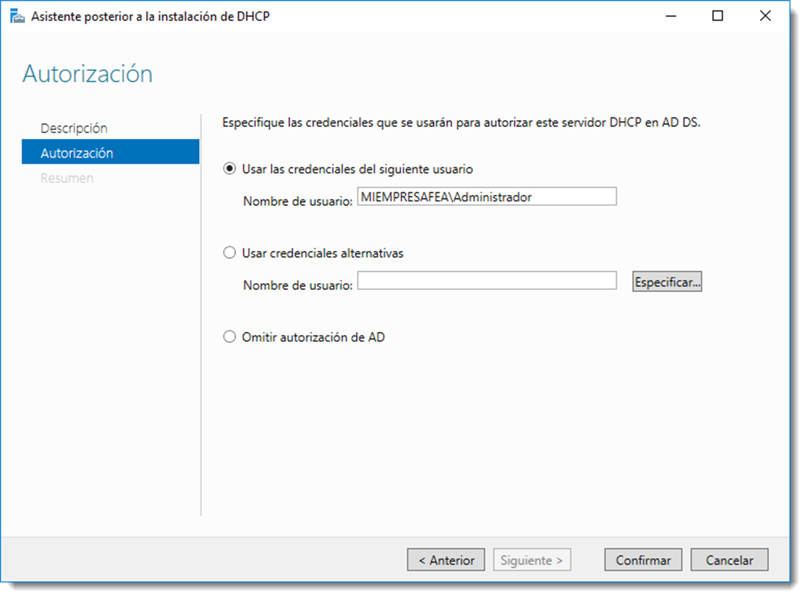
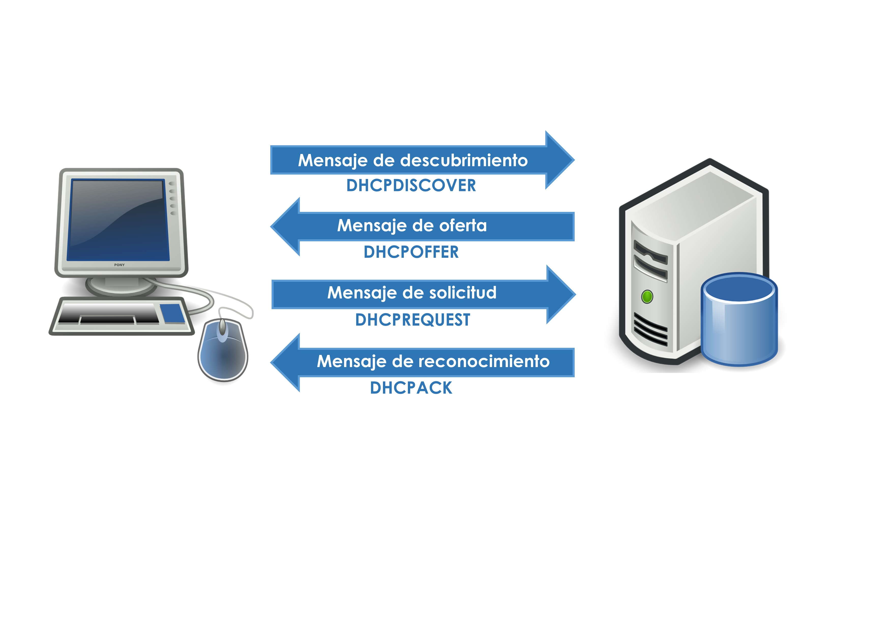
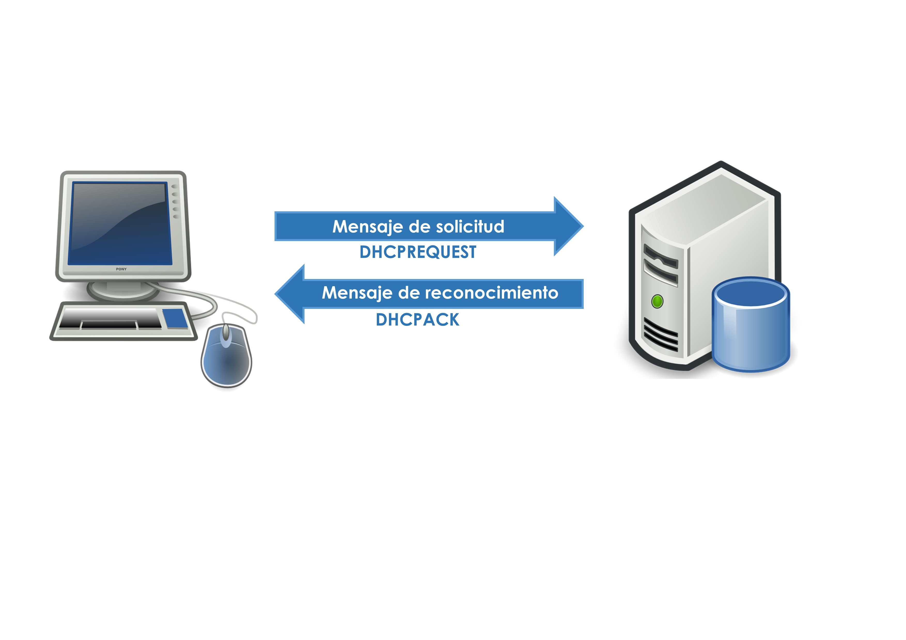
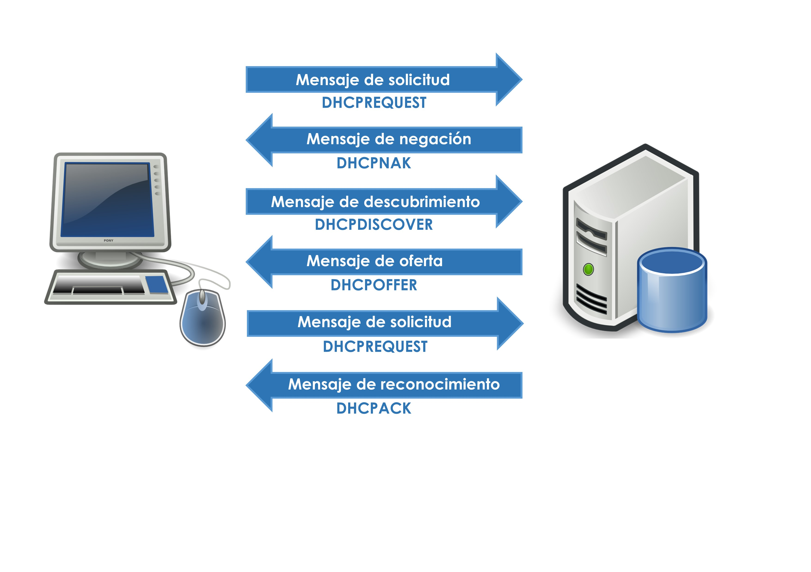

# Instalación y configuración del servicio DHCP

Todo elemento contenido en una red debe estar identificado a través de una **dirección IP unívoca**. En redes pequeñas, esta asignación puede ser controlada por el administrador de la red, pero a poco que crezca el número de dispositivos, esta tarea se convertirá en un quebradero de cabeza.

El servicio **DHCP (Dynamic Host Configuration Protocol)** ofrece el control de este proceso de una manera autónoma. El administrador establece unas pautas de asignación y este servicio se encarga de aplicar esas directrices a la asignación de IP. DHCP ofrece tres ventajas clave en la planificación, diseño y mantenimiento de una red:

- **administración centralizada**, se elimina la necesidad de configurar de forma manual cada componente de la red, específicamente equipos cliente. Es muy conveniente que tanto los equipos servidores, dispositivos de interconexión y algunos otros dispositivos sensibles como **NAS (Network Attached Storage)** o impresoras, tengan una **IP fija**. Esto permitirá una
  localización más rápida (depende) y sencilla de estos dispositivos
- **configuración sencilla y rápida**, es necesario establecer unas pautas de asignación. Con estas reglas el servicio asignará las IP de forma desatendida.
- **flexibilidad**, permite modificar las pautas de asignación de una forma rápida y fácil. Tras cambiar los criterios se produce una reasignación de IP automática y transparente al usuario.
  

## Funcionamiento del DHCP

La primera vez que un equipo arranca necesita una dirección IP para poder interactuar con el resto de componentes, a este proceso se le denomina obtención de una concesión inicial:

La primera vez que un equipo arranca necesita una dirección IP para poder interactuar con el resto de componentes, a este proceso se le denomina **obtención de una concesión inicial**:

- El cliente difunde por la red un mensaje _DHCPDiscover_ para descubrir un servidor de DHCP. Como el cliente todavía no tiene IP, realiza una solicitud por difusión en área local a través de **ARP**.
- El servidor recibe esta solicitud y envía un paquete _DHCPOffer_ a la dirección **MAC** del solicitante ofreciendo una IP válida. Si existen más de un servidor DHCP en la red, el cliente recibirá varios de estos paquetes quedando a su criterio la elección de uno u otro.
- Si el cliente acepta esta concesión ofrecida por el servidor, envía a éste un _DHCPRequest_ confirmando la validez de la asignación.
- Una vez asignada esa dirección, el servidor envía un _DHCPAck_ al cliente con la confirmación y con el resto de información necesaria para establecer la conexión.



Las asignaciones de IP a través de DHCP suelen tener fecha de caducidad por motivos de seguridad. Este tiempo de renovación lo marca el administrador y es similar al _TTL (Time To Live)_ de la caché de **DNS**. Cuando es necesaria una renovación se realiza de la siguiente manera:

- El cliente envía un mensaje de solicitud _DHCPRequest_.
- El servidor comprueba la posibilidad de mantener esa IP al equipo. Si es posible envía un _DHCPAck_ que confirma su mantenimiento. Si no es posible enviará un _DHCPOffer_ y se renovará la concesión.
  

En determinadas circunstancias el cliente puede perder la conexión con el servicio de DHCP. Si el cliente no es capaz de localizar ningún servidor para renovar su concesión, éste envía una difusión de ARP (Address Resolución Protocol). Si esta solicitud se resuelve correctamente, el cliente de DHCP supone que se encuentra situado en la misma red donde obtuvo su concesión actual, y la continúa usando.
Si la difusión de ARP no recibe respuesta, el cliente supone que se ha trasladado a una red que no dispone actualmente de servicios de DHCP. En este caso se autoconfigura mediante APIPA (Automatic Private IP Addressing) que asigna una IP dentro del rango 169.254.0.0 y 169.254.255.255. Tras esta configuración el cliente intentará localizar un servidor de DHCP de forma periódica, ya que con la IP asignada no es posible la comunicación con el resto de elementos de la red.
Este proceso se realizará de la siguiente forma:

- El cliente envía un mensaje de renovación DHCPRequest.
- El servidor no puede determinar la identidad del solicitante o ya que o pertenece a otra red o subred o sencillamente ha perdido su asignación. El servidor envía un paquete de rechazo de solicitud _DHCPNak_.
- El cliente inicia el proceso para conseguir una concesión inicial.
  

## Configuración del servicio DHCP

Antes de configurar un servicio de DHCP se ha de tener una previsión de qué direcciones IP serán asignadas de manera automática, si hay que reservarlas para futuras ampliaciones o si se realizarán rangos de asignación a determinaros equipos. Con esa información disponible es necesario conocer los diferentes elementos que configuran un servidor DHCP:

- **ámbito**, conjunto de IP que el DHCP gestionará. Normalmente está compuesto por todas las IP direccionables de una red o subred.
- **exclusiones**, conjunto de IP que no se asignarán de forma automática ya que lo han sido de forma manual.
- **reservas**, grupo de IP que no se asignarán a pesar de no estar asignadas. Se trata de direcciones que se reservan para futuras ampliaciones de red.

## Instalación en Microsoft Windows Server

Para la instalación del servicio DHCP en Microsoft Windows Server , es necesario añadir el rol adecuado al servidor. Desde el <span class="menu">Administrador del servidor</span> → <span class="menu">Administrar</span> → <span class="menu">Agregar roles y características</span>, se puede lanzar el asistente para añadir roles. Tras preguntar que tipo de instalación y seleccionar el servidor en donde se va a crear el servicio, se elegirá la opción **“Servidor DHCP”** que iniciará el proceso.
Una vez configurada la instalación será necesario configurar el servicio con los datos que antes se ha previsto. Pulsando en **“Completar configuración de DHCP”** se podrá indicar con qué credenciales es posible administrar el servicio de DHCP. Es recomendable usar al usuario administrador ya que de esa forma no se necesitará alternar entre sesiones de varios usuarios.

Una vez autorizado, aparecerá una nueva herramienta con la que se podrá administrar el servicio. El uso de esta herramienta es muy intuitivo y, teniendo claro los conceptos especificados al inicio, no habrá problema alguno durante su configuración. Una vez finalizada, cada vez que un equipo se conecte a la red, preguntará al DHCP por una IP para poder navegar a través de la red.

En un equipo el cual tiene asignado una dirección IP a través de DHCP, puede liberar, renovar o verificar la concesión sin esperara a que el servidor lo haga. En redes pequeñas al liberar la IP de un cliente y su reasignación, se encontrará que la IP es la misma. Esta situación es política del servidor DHCP que trata de asignar la misma IP que la concesión inicial, si es posible.

Para liberar una concesión asignada por el servidor

`ipconfig /release`

A partir de este momento el cliente se queda sin asignación de IP y fuera de la red hasta que se produzca una nueva asignación.

Para renovar una concesión

`ipconfig /renew`

El servidor reasigna una IP si no posee ya una asignada.

## Instalación en Ubuntu Server

Como viene siendo habitual, ates de instalar un servicio es recomendable comprobar si existen nuevas actualizaciones de software en apt-get.

```bash title="Actualizar el sistema"
sudo apt upgrade
sudo apt update
```

Tras esto, se procederá a la instalación de los paquetes requeridos para implementar el servicio de DHCP.

```bash title="Instalar DHCP"
sudo apt-get install isc-dhcp-server

```

Una vez instalado, se editará el archivo de configuración del servicio con los datos de la planificación previa. El archivo a editar está situado en `/etc/dhcp/dhcpd.conf`. Es muy recomendable realizar una copia de seguridad de este fichero antes de continuar.

El archivo `dhcpd.conf` posee numerosas líneas comentadas, pero tan solo interesan las que hacen referencia al nombre de dominio (domain-name), a las direcciones de los servidores DNS (domain-name-servers) y la configuración de TTL (default-lease-time). Estas líneas se completarán con la información de la que se dispone

```bash title="Configuración"
# option definitions common to all supported networks...
option domain-name "miempresafea.local";
option domain-name-servers 192.168.100.100, 8.8.8.8;

default-lease-time 600;
max-lease-time 7200;
```

También en necesario indicar los datos comunes a todos los equipos a los que se le asignará una dirección de IP, es decir, la máscara de red, la dirección de difusión y la puerta de enlace.

```bash title="Configuración"
option subnet-mask 255.255.255.0;
option broadcast-address 192.168.100.255;
option routers 192.168.100.1;
```

Una vez hecho, es necesario especificar el rango o rangos disponibles para la asignación de IP.

```bash title="Configuración"
subnet 192.168.100.0 netmask 255.255.255.0 {
range 192.168.100.10 192.168.100.100;
range 192.168.100.200 192.168.1.250;
}
```

Estas líneas de texto establecen un ámbito nuevo (subnet) que ocupa toda la red ya que la máscara de subred es 255.255.255.0 en una dirección tipo C. Es posible crear diferentes subredes de asignación de IP añadiendo más líneas como esta. Además de establecer el ámbito de direcciones IP, crea dos rangos de asignación; el primero desde la IP 10 hasta la 100, y el segundo desde la 200 hasta la 250. Cualquier equipo que solicite una dirección IP a este servidor ofrecerá una de cualquiera de estos dos rangos.

Por último, para poder reservar IP para un equipo en concreto, al igual que en Microsoft Windows Server 2016, es necesario especificar la dirección **MAC (Media Acces Control)** junto con su nombre de host y la IP reservada. La dirección del servidor debe ser estática y no debe ser asignada a ningún otro equipo de la red.

```bash title=""
host servidorubuntu {
hardware ethernet 08:00:27:2F:0B:E6
fixed-address 192.168.100.100
}
```

Si es necesario la reserva de varias IP en este ámbito, se deberá crear varias líneas como esta con la información pertinente.
Una vez configurado este fichero, será necesario reiniciar el servicio DHCP para que los cambios surtan efecto.

```bash title=""
sudo systemctl isc-dhcp-server (busca el nombre del servicio) restart

```

También se pueden utilizar las acciones stop y start para detener e iniciar el servicio respectivamente. Al igual que clientes de Microsoft, desde Ubuntu Server también es posible tanto liberar como renovar una dirección IP asignada a través de DHCP.

```bash title=""
sudo dhclient -r
sudo dhclient
```

Ejecutando estos comandos en un cliente, el primero liberará la IP asignada y el segundo solicitará al servidor una nueva IP, es decir, la renovará.
