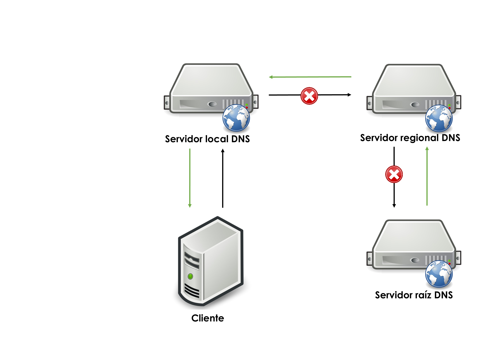
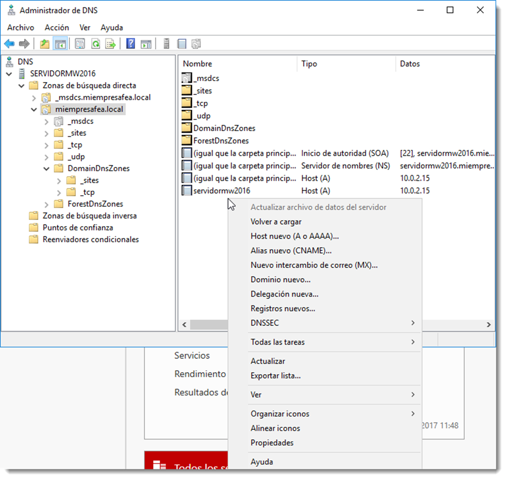

# Configuración de la resolución de nombres DNS



Todos los equipos configurados con el protocolo **TCP/IP** tienen una dirección de IP unívoca que se utiliza para la comunicación con otros equipos de la red. Para facilitar una comunicación efectiva y eficiente, los usuarios deben poder referirse a los equipos por un nombre y permitir que su equipo use su dirección de IP de forma transparente ya que es mucho más sencillo de recordar un nombre de equipo que una combinación de números.

En los inicios de **ARPANET**, el antecesor de la Internet actual, sólo existía un pequeño número de equipos conectados entre sí. El Centro de Información de Red, ubicado en el Instituto de Investigaciones de Stanford, era el responsable de completar en un único archivo denominado hosts.txt los nombres y direcciones de todos los equipos. Los administradores debían mandar un mensaje al administrador del archivo, quien actualizaba este fichero. A continuación, los usuarios de ARPANET debían descargar la nueva versión del archivo para poder identificar a los equipos.

Resultaba obvio que este método no permitía crecer apropiadamente la red ya que cada vez que un equipo se unía a la red o se producía un cambio de nombre, era obligatorio la actualización y distribución del fichero hosts.txt. Otro factor a tener en cuenta es que, al crecer el número de equipos, crece el riesgo de añadir nombres duplicados, así como la dificultad de intentar un control centralizado.

La naturaleza de la red estaba cambiando. Los grandes equipos mainframes con que se había construido ARPANET se estaban viendo desplazados por estaciones de trabajo más pequeñas y numerosas que necesitaban un nombre de equipo único. Resultaba imposible controlar de forma centralizada de una forma óptima.

Nacieron las **RFC (Request For Comment) 882** y **883**, donde se describe el diseño de un **sistema de nombres de dominio**. Éste estaba basado en una base de datos distribuida que contiene información generalizada de recursos. Este diseño evolucionó al servicio de DNS que se usa en la actualidad.

En lo referente a servicios de directorio, el **DNS** se utiliza para crear un espacio de nombres, que define las reglas para asignar un nombre a un elemento del directorio y cómo se resuelve (traduce) un nombre en una dirección IP. Este espacio de nombres está organizado como una base de datos jerárquica que, en un servicio de directorio, puede estar o no distribuida.

Cada entrada de DNS lleva asociada una determinada información. Existen numerosos tipos de registros de recursos definidos en las RFC 1035, 1036 y posteriores, pero la mayoría de estos registros ya no se usan. Los que atañen al servicio de directorio son:

- **A (Adress)** la cual contiene un registro que hace corresponder un nombre de dominio de DNS con una dirección de IPv4 de 32 bits.
- **CNAME (canonical name)** que permite a los administradores de red crear un alias de otro nombre de dominio. Por ejemplo, si es necesario cambiar el nombre de intranet.serviciofeo.net a www.serviciofeo.com por cuestiones de legibilidad, se crearía una entrada CNAME para intranet.serviciofeo.net que apuntase a www.serviciofeo.com. De esta forma un único recurso A puede tener diferentes nombres que hacen referencia a una única IP.
- **PTR (Pointer Reverse)**, usado para los mensajes de búsqueda inversa, conozco la IP del recurso pero no su nombre. Con este tipo de solicitudes el dato devuelto no es la IP, si no el nombre asociado.

Como servicio, se pueden realizar diferentes operaciones:

- **operación de solicitud de información**, un cliente solicita al servicio la información sobre un registro. Por ejemplo, cual es el registro A del dominio llamado <http://www.dominiofeo.net>. El DNS responde a esa solicitud ofreciendo toda la información requerida.
  

- **solicitud inversa**, se produce cuando un cliente solicita el registro de dominio de una cierta dirección IP. Para que el DNS pueda resolver este tipo de solicitudes se debe crear una zona búsqueda inversa en el servicio. Estas solicitudes no son muy comunes y la creación de un PTR no es obligatoria.
- **operación de actualización**, un cliente envía una petición al servicio para actualizar, añadir o eliminar alguno de los registros de información de esa entrada.

## Caché DNS

La información contenida en este servicio no suele variar en el tiempo. En efecto, los datos de nombres de un directorio no suelen modificarse con demasiada regularidad. Por ese motivo, y con el objetivo de reducir el tráfico de red, cada uno de los clientes posee una caché de DNS. En esta caché cada cliente guardará todas las solicitudes que ha ido realizando para evitar volver a realizarlas. Cada información solicitada posee un atributo denominado **TTL (Time To Live)**, que indica la duración que este registro permanece en la caché del cliente. Transcurridos los segundos indicados en este registro, esa información se elimina.

Del mismo modo, existe una **caché negativa** encargada de almacenar los intentos fallidos de solicitud de información. Si se vuelve a demandar información sobre el mismo registro en un tiempo menor que el TTL, será resuelta de forma automática por la caché negativa sin consultar al servicio de DNS.

Muchos de los errores de resolución de DNS son producidos por que los datos de la caché de DNS **no están actualizados**. Quizás se ha producido un error a la hora de guardar un registro en la caché o sencillamente la relación nombre-IP ha cambiado y todavía no se ha reflejado en la caché, ya que no se ha cumplido el TTL. En estas ocasiones será recomendable actualizarla o simplemente eliminarla para obligar al cliente a volver a solicitar la información al servidor.

El comando a usar en sistemas operativos de la familia de Microsoft es ipconfig, con las siguientes opciones:
• `/displaydns`, muestra la información que reside en la caché del cliente.
• `/registerdns`, renueva la información de la caché así como la concesión DHCP.
• `/flushdns`, encargada de eliminar toda información contenida en la caché, lo que obliga a preguntar de nuevo al servidor de DNS.

En los sistemas operativos **GNU/Linux**, el comando a utilizar para comprobar la configuración de la caché DNS es `nscd`. Por desgracia no en todas las distribuciones se instala por defecto, y Ubuntu Server es una de ellas. Este software permite gestionar no sólo la caché del servicio DNS, sino cualquier caché que el cliente esté manejando; servicios, contraseñas cifradas, información de grupos de usuarios locales y de red. Se instala a través del siguiente comando:

```bash title="Instalación de paquete nscd"
sudo apt install nscd

```

Una vez instalado, estas son las opciones que atañen a esta sección:

- `-g`, muestra la información de todos los tipos de caché que gestiona esta aplicación.
- `-i` hosts, elimina la información de caché DNS del cliente.

## Configuración del servicio DNS

Durante la creación del directorio, se ha de crear como mínimo un espacio de nombres el cual debe ser controlado por un servicio de DNS. Para que las solicitudes se resuelvan de forma correcta será necesario la configuración de dos zonas de búsqueda:

- **una zona de búsqueda directa,** la cual devuelve una dirección IP cuando se les proporciona un nombre DNS. Estas zonas se crean automáticamente cuando instalamos el controlador de dominio.
- **una zona de búsqueda inversa** que asigna un nombre DNS a una dirección IP. Es importante destacar que estas zonas no se crean automáticamente en algunas versiones de servicios de directorio, y si es necesaria su creación, habrá que hacerlo de forma manual.

La configuración de estas zonas, así como la creación de nuevas, están disponibles a través de la herramienta <span class="menu">Administrador del servidor</span> → <span class="menu">Herramientas</span> → <span class="menu">DNS</span>

Para crear nuevas zonas de búsqueda, será necesario navegar hasta el lugar donde se requiera la creación de la nueva entrada y pulsar el botón derecho o bien a través del menú <span class="menu">Acción</span>. Cualquiera de estas opciones dan acceso a crear nuevos **host (A), alias (CNAME)**, intercambio de correo (si se dispusiera del servicio de correo), una nueva delegación o dominio, entre otras acciones.

Salvo en condiciones especiales, será el _propio controlador de dominio el que se encargue de gestionar el servicio de DNS_. Cada vez que se actualiza la información del directorio, se añaden, modifican o eliminan las entradas en el DNS. Se dejará la tarea de gestión en manos del servidor por tanto. No obstante es recomendable conocer el procedimiento para gestionar este servicio.

### Uso de DNS en entornos AD (Windows o Samba)

- El DC (Windows o Samba AD DC) debe ser el servidor DNS principal para sí mismo y para los clientes. No pongas 8.8.8.8 como primario; si necesitas salida a Internet, define reenviadores en el propio DC.
- En el DC Samba: usa su DNS interno y configúralo como reenviador hacia los DNS externos. En `/etc/samba/smb.conf`, sección `[global]`, añade por ejemplo `dns forwarder = 1.1.1.1`.
- En el propio DC Ubuntu apunta el DNS a sí mismo: en `/etc/netplan/*.yaml` (o NetworkManager) define `nameservers: [127.0.0.1]` o la IP interna del DC. En la UD4 se desactiva `systemd-resolved` y se fija `/etc/resolv.conf`; si sigues ese esquema, usa 127.0.0.1 y la IP del DC, pero evita que un DNS público quede primero. Alternativamente, puedes dejar `systemd-resolved` activo apuntando al DC.
- En clientes Ubuntu que se unan al dominio (SSSD/realmd): apunta el DNS al DC (Windows o Samba) y comprueba con `resolvectl status` y `dig _ldap._tcp.tu-dominio SRV` antes de `realm join`.

Ejemplo de netplan (sustituye la interfaz y la IP del DC):

```yaml
network:
  version: 2
  ethernets:
    ens33:
      addresses: [10.0.3.3/24]
      gateway4: 10.0.3.1
      nameservers:
        addresses: [10.0.3.3]   # IP del DC (o 127.0.0.1 si es el propio DC)
```

#### Notas sobre `/etc/resolv.conf` e inmutabilidad

- Si cambias `/etc/resolv.conf` a mano, netplan o systemd-resolved lo reescriben. Por eso en la UD4 se marcaba inmutable. Alternativa más limpia: deja el enlace simbólico de `/etc/resolv.conf` al stub de systemd-resolved y configura los DNS en netplan apuntando al DC; así persiste sin necesidad de `chattr +i`.
- `dns forwarder` en `smb.conf` debe apuntar a un DNS externo (ISP, 1.1.1.1, 8.8.8.8) que el DC usará como reenviador para dominios fuera del AD. No pongas aquí la IP del DC ni de otros DC del mismo dominio.

En Ubuntu Server la gestión se realiza a través de `samba-tool dns`.

```bash title="Comando"
samba-tool dns serverinfo miempresafea.local
```

se puede acceder a la información del servidor. De este mismo modo se dispone de modificadores para la gestión del mismo. Recuerda consultar la ayuda del comando para obtener más información, en concreto, esta:

```bash title="Ayuda del comando"
samba-tool dns –help
Usage: samba-tool dns <subcommand>

Domain Name Service (DNS) management.


Options:
  -h, --help  show this help message and exit


Available subcommands:
  add         - Add a DNS record
  delete      - Delete a DNS record
  query       - Query a name.
  roothints   - Query root hints.
  serverinfo  - Query for Server information.
  update      - Update a DNS record
  zonecreate  - Create a zone.
  zonedelete  - Delete a zone.
  zoneinfo    - Query for zone information.
  zonelist    - Query for zones.
For more help on a specific subcommand, please type: samba-tool dns <subcommand> (-h|--help)
```

Por ejemplo, es posible obtener información de las zonas creadas con el siguiente comando:

```bash title="zonas creadas"
samba-tool dns zonelist miempresafea.local
2 zone(s) found

  pszZoneName      : miempresafea.local
  Flags            : DNS_RPC_ZONE_DSINTEGRATED DNS_RPC_ZONE_UPDATE_SECURE
  ZoneType         : DNS_ZONE_TYPE_PRIMARY
  Version          : 50
  dwDpFlags        : DNS_DP_AUTOCREATED DNS_DP_DOMAIN_DEFAULT DNS_DP_ENLISTED
  pszDpFqdn        : DomainDnsZones.miempresafea.local
   pszZoneName      : _msdcs.miempresafea.local
  Flags            : DNS_RPC_ZONE_DSINTEGRATED DNS_RPC_ZONE_UPDATE_SECURE
  ZoneType         : DNS_ZONE_TYPE_PRIMARY
  Version          : 50
  dwDpFlags        : DNS_DP_AUTOCREATED DNS_DP_FOREST_DEFAULT DNS_DP_ENLISTED
  pszDpFqdn        : ForestDnsZones.miempresafea.local
```

Por defecto, Samba **no** crea la zona de búsqueda inversa. Es posible crear esa zona gracias al siguiente comando:

```bash title="búsqueda inversa"
samba-tool dns zonecreate miempresafea.local 0.0.10.in-addr.arpa
```

Si todo ha ido de forma correcta, al volver a listar las zonas disponibles en nuestro servidor, la información mostrará una nueva

```bash title="Zonas disponibles"
samba-tool dns zonelist miempresafea.local
  3 zone(s) found

  pszZoneName      : 0.0.10.in-addr.arpa
  Flags            : DNS_RPC_ZONE_DSINTEGRATED DNS_RPC_ZONE_UPDATE_SECURE
  ZoneType         : DNS_ZONE_TYPE_PRIMARY
  Version          : 50
  dwDpFlags        : DNS_DP_AUTOCREATED DNS_DP_DOMAIN_DEFAULT DNS_DP_ENLISTED
  pszDpFqdn        : DomainDnsZones.miempresafea.local

  pszZoneName      : miempresafea.local
  Flags            : DNS_RPC_ZONE_DSINTEGRATED DNS_RPC_ZONE_UPDATE_SECURE
  ZoneType         : DNS_ZONE_TYPE_PRIMARY
  Version          : 50
  dwDpFlags        : DNS_DP_AUTOCREATED DNS_DP_DOMAIN_DEFAULT DNS_DP_ENLISTED
  pszDpFqdn        : DomainDnsZones.miempresafea.local

  pszZoneName      : _msdcs.miempresafea.local
  Flags            : DNS_RPC_ZONE_DSINTEGRATED DNS_RPC_ZONE_UPDATE_SECURE
  ZoneType         : DNS_ZONE_TYPE_PRIMARY
  Version          : 50
  dwDpFlags        : DNS_DP_AUTOCREATED DNS_DP_FOREST_DEFAULT DNS_DP_ENLISTED
  pszDpFqdn        : ForestDnsZones.miempresafea.local
```

De este modo es posible administrar los elementos que conforman el servidor DNS de Samba. Es conveniente familiarizarse con las acciones de añadir, eliminar o actualizar la información de este servicio.
