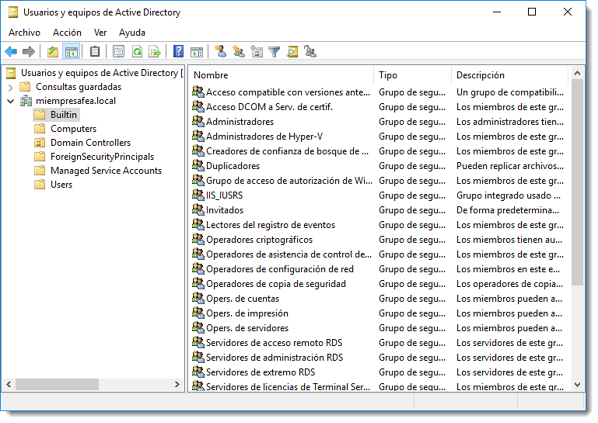
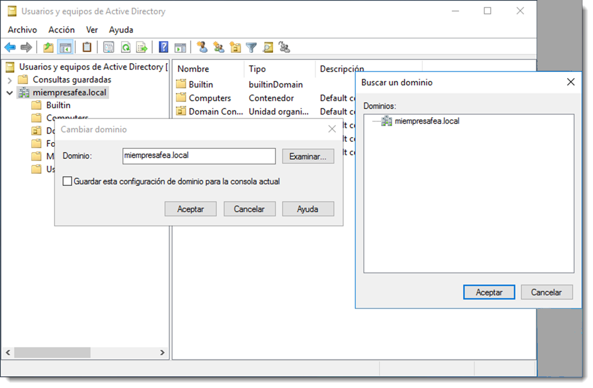

# Administración de usuarios

Los objetos son el contenido de un directorio. Componen la estructura organizativa del dominio y la relación entre ellos dictará su funcionamiento. Los objetos de los que dispone Active Directory son multitud, pero este apartado tan solo hará referencia los usuarios y cuentas.

Cada usuario que tenga acceso al dominio requerirá una cuenta de usuario. Esta cuenta lo identifica como miembro del dominio y le otorga una serie de privilegios para poder interactuar con el resto de objetos del dominio. Posibilita tres acciones básicas:

- **autentificar** la identidad de la persona que se conecta al directorio.
- **controlar el acceso** a los recursos del dominio.
- **auditar** las acciones realizadas.

Todos estos objetos se gestionan desde la herramienta Administrador del servidor → Herramientas → Usuarios y equipos de Active Directory. Esta utilidad incluye una barra de herramientas especializada que proporciona acceso instantáneo a las funciones más comúnmente utilizadas y una barra de descripción que proporciona información sobre de estado del objeto. También muestra las acciones que se pueden realizar sobre cada objeto en el menú Acción una vez que se ha seleccionado el objeto.

Los objetos más representativos de un directorio son los siguientes:

- **dominio**, objeto raíz que identifica el dominio que está administrando actualmente.
- **unidad** organizativa, contenedor utilizado para crear agrupaciones lógicas de objetos de equipo, de usuario y de grupo.
- **usuario**, representa un usuario de la red, tanto físico como lógico, y funciona como un almacén de información de identificación y de autenticación.
- **grupo**, objeto contenedor que aúna a varios objetos de usuario. Un objeto grupo tan sólo puede estar formado por objetos usuario y de grupo. Supone uno de los pilares básicos para la administración de los permisos, como se tratará en lo sucesivo.
- **equipo**, cada uno de los equipos de la red que proporciona la cuenta de máquina necesaria para que el sistema inicie sesión en el dominio.
- **contacto**, representa un usuario externo al dominio para propósitos específicos. No proporciona las credenciales necesarias para iniciar sesión en el dominio, es decir, no es posible autentificarse con un contacto en el dominio.
- **unidad organizativa**, objeto contenedor que representa una agrupación lógica de usuarios, equipos u otros grupos, incluso los tres a la vez.

Se puede utilizar el complemento **Usuarios y equipos de Active Directory** para administrar cualquier dominio de la red. Para cambiar el dominio que se muestra en el administrador, hay que resaltar la raíz o el objeto dominio en el árbol de la consola y escoger Cambiar dominio... con el dominio en el menú Acción. Esto muestra el cuadro de diálogo donde se puede introducir el nombre del dominio o buscar.

