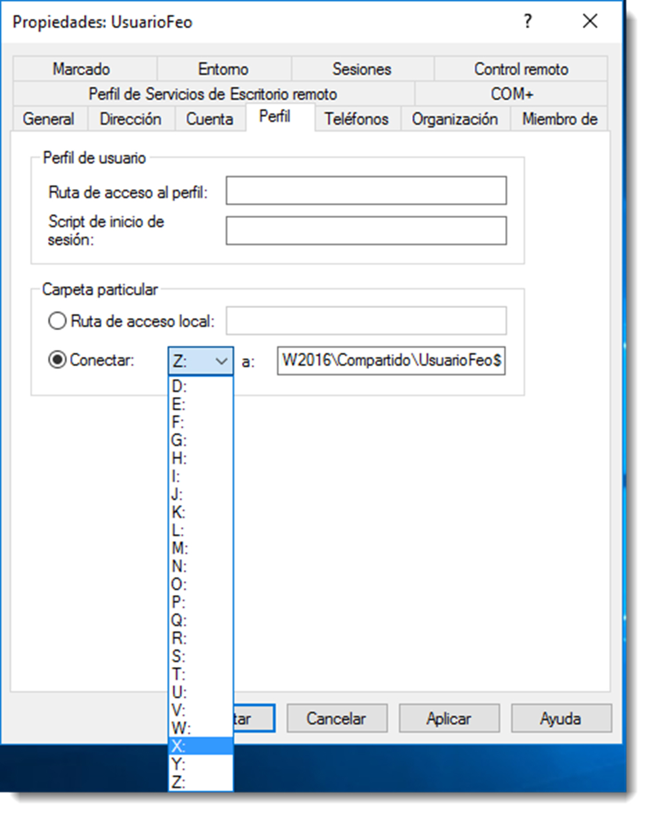

# Carpetas personales. Redireccionamiento de las carpetas de usuario

Los directorios o carpetas personales son almacenes que proporciona un servidor para los documentos de los usuarios. Situar las carpetas personales de este modo tiene varias ventajas:

- la copia de seguridad de los documentos de usuario está centralizada.
- los usuarios pueden acceder a sus directorios principales desde cualquier equipo cliente.
- se puede acceder a los directorios principales desde clientes que ejecuten cualquier sistema operativo.
- los contenidos no son parte de los perfiles de usuario, por lo que no afectan al tráfico de la red durante el inicio de sesión.

Para realizar esta tarea es necesario compartir una carpeta y asignar esa carpeta a cada usuario.

En Microsoft Windows Server se accede a través de la ficha de usuario y se introduce la ruta de la carpeta según el espacio de nombres del servidor. Un aspecto a tener en cuenta es que, si queremos que una carpeta compartida no se muestre cuando cualquier otro usuario del sistema obtenga la lista de carpetas compartidas por el servidor, deberemos añadir el carácter '$' al final.

En sistemas de la familia de Microsoft, existe un sistema de nomenclatura de recursos de red basado en un espacio de nombres común. Su formato es el siguiente:

`\\equipo\carpeta_contenedora\carpeta_compartida`

En donde:

- **equipo** es el nombre del ordenador que contiene la carpeta.
- **carpeta_contenedora** representa el nombre del recurso de red compartido, no de la carpeta. Si durante el proceso de compartir la carpeta no se ha modificado, será el mismo, pero es posible que tenga un nombre diferente.
- **carpeta_compartida** es el nombre que se le asigna a la carpeta del usuario. La carpeta que realmente contendrá sus datos y que estará dentro del recurso compartido que actúa como contenedor.

Una vez asignada una letra de unidad de red, cuando el usuario inicie sesión aparecerá un nuevo volumen en su sistema de archivos con la mencionada letra y apuntando a la carpeta compartida del servidor.

Toda esta configuración también es posible realizarla a través de una directiva de grupo que desvíe el almacenamiento desde las carpetas predeterminadas hasta la carpeta de red adecuada. Pero esta opción se abordará en unidades posteriores.

En sistemas operativos basados en GNU/Linux será necesario el uso del sistema de ficheros nfs, como ya se ha abordado en el punto anterior.
