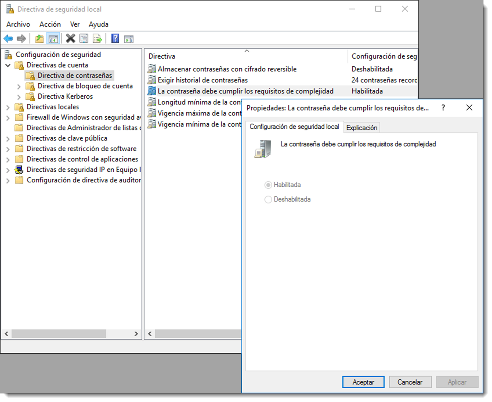
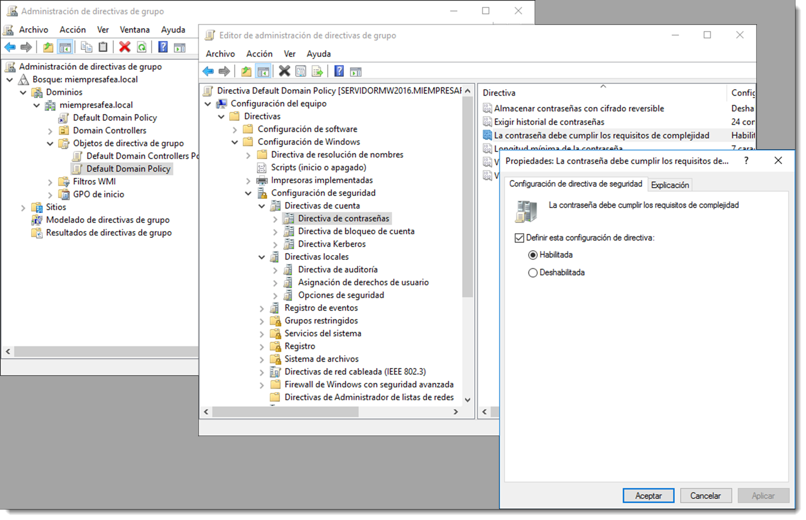

         7.5  Directivas de seguridad locales

Las directivas de seguridad son reglas que los administradores pueden configurar en un equipo con el objetivo de proteger sus recursos. Estas directivas forman parte las configuraciones de seguridad de las **GPO (Group Policy Objetc) o políticas de grupo**, que serán analizadas en detalle en lo sucesivo.
La configuración de directivas de seguridad puede controlar:

- autenticación de usuario para una red o dispositivo.
- los recursos a los que los usuarios pueden tener acceso.
- la opción de registrar las acciones de un usuario o grupo en el registro de eventos.
- la pertenencia a un grupo.

Para administrar las directivas de seguridad se usará la herramienta <span class="menu">Inicio</span> → <span class="menu">Herramientas administrativas </span> → <span class="menu">Directiva de seguridad local</span> la cual permitirá modificar numerosas opciones de seguridad tales como:

- **directivas de cuenta**, se definen en el mismo equipo y afectan a la forma en que las cuentas de usuario pueden interactuar con él. Incluyen los siguientes tipos de directivas:

      - **directiva de contraseñas**, determinan la configuración de contraseñas, como la duración y la aplicación.
      - **directiva de bloqueo de la cuenta**, especifican las condiciones y el tiempo que se bloqueará una cuenta del sistema.
      - **directiva Kerberos**, se usan para delimitar la configuración relacionada con Kerberos, como la duración y aplicación de un ticket de acceso.

- **directivas locales**, incluyen los siguientes tipos de configuración de directiva:

      - **directiva de auditoría**, detalla la configuración de seguridad que controla el registro de eventos de seguridad y especifica qué tipos de eventos de seguridad se registran.
      + **asignación de derechos de usuario**, enumera los usuarios o grupos que tienen derechos de inicio de sesión o privilegios sobre un dispositivo.
      + **opciones de seguridad**, establece la configuración de seguridad para el equipo, como los nombres de administrador y de cuenta de invitado, el acceso a unidades de almacenamiento, la instalación de controladores, el inicio de sesión, etcétera.

- **firewall de Windows con seguridad avanzada**, utilizado para proteger el dispositivo de la red mediante el uso de un cortafuegos.
- **directivas de restricción de software**, usada para identificar el software y controlar su capacidad para ejecutarse.
- **directivas de control de aplicaciones**, controla qué usuarios o grupos pueden ejecutar determinadas aplicaciones.
- **directivas de seguridad IP en el equipo local**, garantiza las comunicaciones privadas, seguras, a través de redes IP mediante el uso de servicios criptográficos de seguridad (Ipsec).

En cualquier caso, estas políticas se aplican a un equipo en concreto y son útiles para él, pero es necesario recordar que estos equipos se encuentran ubicados en un entorno de directorio y, que las políticas de seguridad generales para él no solo se realizan a través de estas directivas, sino a través de la GPO (Group Policy Objetc). Estas GPO se configuran en el controlador del dominio y, si alguna de estas directivas de seguridad locales contradice a una política de grupo del servidor, será ésta última la que prevalezca en aras de aplicar una seguridad común al directorio.

Este es el causante por el cual, en un controlador de dominio, no se puedan modificar directamente las directivas de seguridad locales, sino que se debe realizar a través de las GPO, ya que de este modo afectarán a todo el dominio y no tan solo a un equipo.


Para configurar las directivas de seguridad locales en Microsoft Windows Server se realiza a través de <span class="menu">Administrador del servidor </span>→ <span class="menu">Herramientas</span> → <span class="menu">Administración de directivas de grupo</span>. Una vez abierta, dentro del dominio y de la carpeta <span class="menu">Objetos de directiva de grupo</span>, se podrán configurar las directivas locales bien para los controladores de dominio o bien para todo el dominio.



En sistema operativos basados en **GNU/Linux** estas directivas se encuentran repartidas en varios ficheros que el administrador deberá conocer, aunque el más importante de ellos es /etc/login.defs el cual establece el conjunto de normas de seguridad que se han de cumplir cuando se crea un usuario. Toda la información referida al usuario de sistemas locales se encuentra contenida entre los siguientes archivos:

- `/etc/passwd`, que ofrece información sobre usuarios.
- `/etc/group`, que contiene información sobre grupos y los usuarios que los forman.
- `/etc/shadow`, que dispone de las contraseñas cifradas de los usuarios.
- `/etc/gshadow`, en el que se encuentran las contraseñas cifradas de los grupos, aunque en realidad este fichero no suele utilizarse.
- `/etc/login.defs`, contiene las normas que todo usuario cumplirá al crear su cuenta en este equipo.

No es recomendable la modificación de estos archivos de forma manual ya que poseen una estructura muy rígida y cualquier fallo en su edición daría como resultado que el usuario no se reconociera en el sistema. La mejor opción para modificar estos archivos son los comandos `useradd, usermod, userdel, groupadd, groupmod, groupdel, adduser, deluser y passwd`.

La excepción a la norma es el fichero `/etc/login.defs` el cual contiene todas las características que se le dan a un usuario en la hora de su creación. Entre otras, es conveniente familiarizarse con:

- `CREATE_HOME`, indica si es necesario crear el directorio /home del usuario. En determinados escenarios puede ser interesante que algunos usuarios no tengan esta carpeta
- `DEFAULT_HOME`, especifica el lugar en donde se creará la carpeta /home de ese usuario. Es posible que se encuentre en un recurso compartido en la red o en otra ubicación.
- `LOGIN_RETRIES`, determina el número máximo de reintentos tras una contraseña fallida. Cuando se supere este número, la cuenta se bloqueará.
- `MAX_MEMBERS_PER_GROUP`, máximo número de usuarios por grupo
- `PASS_MAX_DAYS`, número máximo en el que se puede utilizar la contraseña. Pasado este tiempo se solicitará la creación de una nueva.
- `PASS_MIN_DAYS`, número mínimo de días permitidos entre los cambios de contraseña. Cualquier cambio de contraseña intentado antes de transcurrir este tiempo, será rechazado
- `PASS_WARN_AGE`, número de días de aviso dado antes de que expire una contraseña. Un cero significa advertencia se da sólo al día que expira la contraseña, un valor negativo significa que no se da ninguna advertencia. Si no se especifica, no se proporcionará ninguna advertencia.

Todas las configuraciones contenidas en este fichero serán aplicadas al momento de creación del usuario. Una vez creado, es posible modificar estos valores a través del comando chage. De este modo se podrán crear configuraciones personalizadas por cada usuario.

El uso general de este comando es

```bash
chage <opciones> <valores> <usuarios>
```

Consultando la ayuda de chage se obtienen algunas opciones interesantes:

- `-d`, `--lastday` ÚLTIMO_DÍA establece el día del último cambio de la contraseña a ÚLTIMO_DÍA. Si este valor es cero, el usuario deberá cambiar su contraseña al inicio de la siguiente sesión.
- `-E, --expiredate` FECHA_CAD, establece la fecha de caducidad a FECHA_CAD.
- `-I, --inactive` DÍAS, deshabilita la cuenta después de los días de la fecha de caducidad.
- `-l, --list` muestra la información de la cuenta.
- `-m, --mindays DÍAS_MIN`, establece el número mínimo de días antes de cambiar la contraseña.
- `-M, --maxdays DÍAS_MAX`, establece el número máximo de días antes de cambiar la contraseña.
- `-W, --warndays` DÍAS_AVISO establece los días de aviso de expiración.

De este modo es posible modificar los datos del usuario referidos a las directivas de contraseña como por ejemplo

```bash
chage -d 0 usuarioFeo
```

comando que obliga a **usuarioFeo** a cambiar su contraseña al inicio de la siguiente sesión, para comprobarlo se usa el modificador `-l`,

```bash
chage -l usuarioFeo
```

También se pueden obligar a que un usuario cambie su contraseña cada 7 días con

```bash
chage -M 7 usuarioFeo
```

Hay que recordar que todas estas modificaciones y restricciones locales se perderán si se trabaja en un entorno de red. Eso sí, si estas modificaciones se realizan en un sistema que actúe como controlador de dominio afectarán a todo los elementos del dominio.
