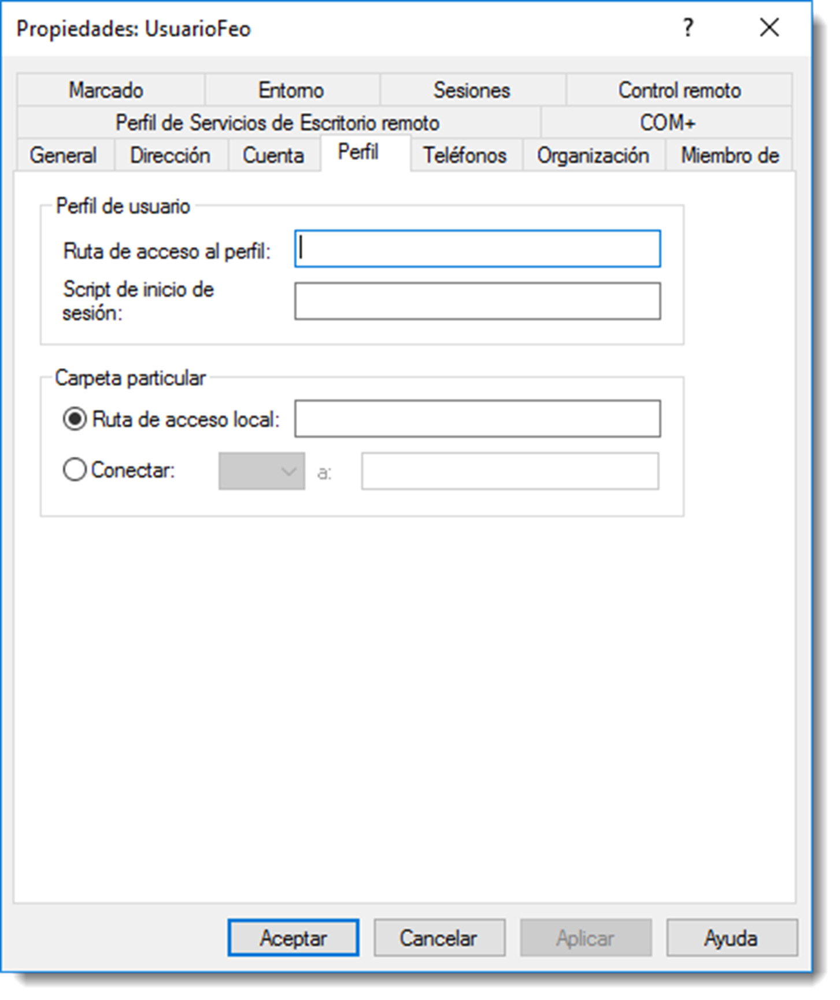

# Perfiles de usuario, móviles y obligatorios

Un perfil de usuario es un entorno personalizado específicamente diseñado para un usuario en concreto. Cada usuario tiene uno, ya que se crea un perfil automáticamente cuando inicia sesión en un equipo. Por defecto, los perfiles que se crean son locales, es decir, si el mismo usuario del dominio accede a dos equipos distintos, creará dos perfiles independientes.
Habitualmente los usuarios trabajan con la misma máquina, pero hay ocasiones en las que es necesario que cambien su ubicación de trabajo. Es buena idea entonces que el perfil de ese usuario viaje con él, ya que éste contiene gran parte de la información de trabajo.

Todos los perfiles se generan a partir de una copia del perfil Default User. La información del registro para Default User se encuentra en el archivo `ntuser.dat` en sistemas operativos de Microsoft.

En sistemas basados el GNU/Linux, ocurre de forma similar. El fichero `/etc/profile` contiene la estructura de los perfiles. Además, durante el proceso de creación de perfiles, consulta los scripts ubicados en la carpeta `/etc/profile.d` que también ejecutará durante la creación de un usuario.

Dentro de cada perfil es posible encontrar la siguiente información:

- **configuración local**, que contiene datos de programa, historial y archivos temporales.
- **datos de programa**, configuraciones especificas de software de cada usuario, archivos, carpetas, accesos directos, escritorio documentos y plantillas de usuario.
- **configuración de inicio**, elementos del menú Inicio del usuario así como aplicaciones.

Además de toda esta información, los sistemas operativos de Microsoft también guardan en el perfil de usuario información referida a impresoras, conexiones de red, listado de archivos recientes, o las cookies del navegador entre otra información.

No es de extrañar que si un usuario cambia de equipo y crea un nuevo perfil, eche de menos toda esta información y, aún peor, no pueda desempeñar su trabajo con normalidad.

Los perfiles ofrecen varias ventajas:

- **varios usuarios** pueden utilizar el mismo equipo, cada uno con su configuración personalizada al iniciar la sesión.
- los cambios realizados por un usuario en el escritorio **no afectan a otro.**
- si los perfiles de usuario se almacenan en un servidor, es decir se usan perfiles móviles, éstos **pueden seguir a los usuarios** a cualquier equipo de la red.

Desde el punto de vista de un administrador, la información del perfil puede ser una valiosa herramienta para configurar perfiles de usuario predeterminados universales o para personalizar los perfiles para diferentes departamentos o áreas del trabajo.

Existen diferentes tipos de perfiles:

- **perfiles locales**, creados en un equipo cuando un usuario inicia sesión. El perfil es específico de un usuario y se almacena en el disco duro del equipo local.
- **perfiles móviles**, creados por un administrador y almacenados en un servidor. Estos perfiles siguen al usuario a cualquier máquina donde éste inicie sesión.
- **perfiles obligatorios**, son perfiles móviles que sólo pueden ser modificados por un administrador. Éste podrá definir configuraciones para usuarios o grupos, que no podrán personalizar sus perfiles.
- **perfil temporal**, cuando se produce un error que impide cargar un perfil móvil o un perfil obligatorio, se crea un perfil temporal para facilitar el inicio de sesión del usuario. Una vez finalizada se sesión, el perfil temporal se elimina.
- **perfil super-obligatorio**, se incorpora a partir de Microsoft Windows Server 2008 y su objetivo es similar al de los perfiles obligatorios, con la diferencia de que, si se produce un error que impida cargar el perfil, el usuario no podrá iniciar sesión.

## Perfiles locales

Los perfiles locales se crean en los equipos cuando los usuarios inician sesión. En función del sistema operativo así como de su versión, estos perfiles se almacenarán en lugares distintos del cliente:

- en Microsoft Windows 10, y desde Microsoft Windows Vista, se ubica en` %systemroot%/Usuarios/%username%`
- en Microsoft Windows XP, `%systemroot%/Documents and Settings/%username%`
- en GNU/Linux, los perfiles de usuario se crean en la carpeta `/home/$USER`, con la excepción del usuario root, que por motivos de seguridad posee su propio perfil en la ruta /root.

La primera vez que un usuario inicia sesión en un equipo, se genera una carpeta de perfil para el usuario, y los contenidos de la carpeta Default User se copian en ella. Cualquier cambio realizado por el usuario al escritorio se almacena en ese perfil recién creado. Si un usuario tiene una cuenta local en el equipo además de una cuenta de dominio e inicia sesión utilizando ambas cuentas, éste dispondrá de dos carpetas de perfil en el equipo local; una para cuando el usuario inicie sesión en el dominio utilizando la cuenta de usuario del dominio y otra para cuando el usuario inicie sesión de forma local en el equipo. El perfil local se mostrará con el nombre de inicio de sesión. El perfil de dominio también se mostrara con el nombre de inicio de sesión, pero llevara añadido el nombre del dominio.

En sistemas basados en GNU/Linux, toda la información referida al usuario se encuentra en el directorio `/home/$USER`. Cuando se accede con usuarios distintos, tanto el usuario local como el usuario de red dispondrán de diferentes perfiles.

## Perfiles móviles

Un perfil móvil se almacena en un servidor y, después de que el inicio de sesión del usuario sea autentificado en el servicio de directorio, se copia al equipo local. Esto permite al usuario tener el mismo escritorio, la configuración de las aplicaciones y la configuración local en cualquier máquina.

Cuando el usuario inicie sesión en un equipo, el perfil del servidor se descarga al equipo local. Al cerrar la sesión, el perfil se almacena tanto localmente como en la ubicación de la ruta de acceso al perfil del usuario. Cuando el usuario inicia sesión de nuevo, el perfil del servidor se compara con la copia en el equipo local y se carga la versión más reciente. Si el servidor no esta disponible, se utiliza la copia local. Si el servidor no esta disponible y es la primera vez que el usuario ha iniciado sesión en el equipo, se crea un perfil de usuario localmente utilizando el perfil Default User.

Para configurar un perfil móvil simplemente hay que completar las siguientes acciones:

- crear una **carpeta compartida** en el servidor para los perfiles.
- asignar en la cuenta de usuario una **ruta de acceso** a la carpeta compartida.

Una vez realizadas estas acciones, el perfil de usuario se copia en el servidor y estará disponible para el usuario desde cualquier equipo.

Pero no todo son ventajas en esta configuración de perfiles. Cuando el usuario cierre sesión, todo el contenido de su perfil se copiará al servidor a través de la red y, cuando el mismo usuario vuelva a conectarse al dominio, el perfil volverá a ser descargado en el equipo cliente. Esta transferencia de datos continua entre el servidor y el cliente no sólo será percibida por el usuario como una pérdida de tiempo, sino que sobrecargará el tráfico de la red, lo que podrá repercutir sobre el rendimiento del resto de los usuarios.

Otro problema que puede surgir es de la incompatibilidad de perfiles en los sistemas operativos de la familia Microsoft. A partir de Microsoft Windows XP el esquema de los perfiles fue modificado. Esto quiere decir que si un usuario inicia sesión en un equipo con Microsoft Windows XP en un equipo, generará un perfil diferente a si lo inicia en Microsoft Windows 7 o 10. Además de consumir espacio en el servidor y de ancho de banda, los perfiles que se cargan en distintos equipos no son los mismos, dependerán de la versión del sistema operativo.

La solución puede pasar por utilizar la **carpeta personal** para cada usuario en el servidor. De este modo tan sólo los documentos necesarios serán guardados en al servidor y serán transferidos bajo demanda.

En los sistemas operativos GNU/Linux se actúa de la misma forma, primero se crea una carpeta compartida que contendrá los ficheros y después se indica al usuario cual es la ruta de su perfil. Esta tarea engloba compartir carpetas y el servicio `samba` que se abordará en la siguiente unidad, pero realizaremos los pasos necesarios para preparar el acceso a estas carpetas compartidas.



Para poder acceder desde un equipo a una carpeta compartida por nfs en un servidor, será necesario instalar los paquetes **portmap y nfs-common** en el cliente

```bash
sudo apt-get install portmap nfs-common
sudo /etc/init.d/portmap restart
```

Cuando finalice la instalación será posible utilizar el sistema **nfs como un nuevo sistema de ficheros de red**, lo que permitirá gestionar carpetas remotas como si fuesen propias del sistema local. Algo muy parecido a lo que realiza el comando `netuse` o la conexión de unidades de red de los clientes de Microsoft Windows.

Ahora es posible montar la carpeta compartida en nuestro sistema de archivos. De esta manera, el acceso es exactamente igual que a cualquier otra carpeta del disco duro local.

En el servidor existe la carpeta compartida /datos/usuarios/usuarioFeo con los datos del usuario Feo. Es posible montar esa carpeta como si fuera una más del sistema de ficheros local

```bash title=""
sudo mount -t nfs ip-del-servidor:/home/MIEMPRESAFEA.LOCAL/usuarioFeo/datos
```

A partir de este momento la carpeta datos contiene la información de la carpeta /datos/usuarios/usuarioFeo del servidor.

Como ya se ha estudiado, es posible que el sistema monte de forma automática una carpeta compartida por nfs al iniciar sesión a través del archivo `/etc/fstab`

```bash
ip-del-servidor:/home/MIEMPRESAFEA.LOCAL/usuarioFeo/datos nfs
```

## Perfiles obligatorios

Un perfil móvil permite que un usuario pueda iniciar una sesión desde diferentes clientes, manteniendo su escritorio de trabajo. Sin embargo, en muchas ocasiones esto no es suficiente y necesitamos también que el usuario no pueda realizar cambios en ese perfil. Para ello se dispone de los perfiles obligatorios.

En sistemas operativos de Microsoft, sólo hay que modificar el nombre del un archivo oculto, que inicialmente se llama **NTUSER.DAT** por el de **NTUSER.MAN**.

Hay que acceder a la carpeta del perfil, mostrar todos los archivos ocultos o de sistema y cambiar el nombre del archivo. Sin embargo, el usuario administrador no posee los permisos suficientes para realizar esta acción, ya que solo el propio usuario y el grupo **SYSTEM** tienen permisos. A pesar de ello se está trabajando con la cuenta Administrador, y la ventana que nos muestra el error incluye también un botón que nos permite **tomar posesión de la carpeta**. No es buena práctica tomar posesión de un recurso que no pertenece al administrador y tan sólo debe ser utilizada en situaciones extremas.

Aunque parezca un contrasentido, debe ser el propietario de la carpeta el que deba asignar los permisos al usuario administrador. Así que se iniciará la sesión con el usuario en cuestión y se añadirán los permisos al administrador. Una vez asignados podrá entrar, mostrar los ficheros ocultos y de sistema y renombrar el fichero.
