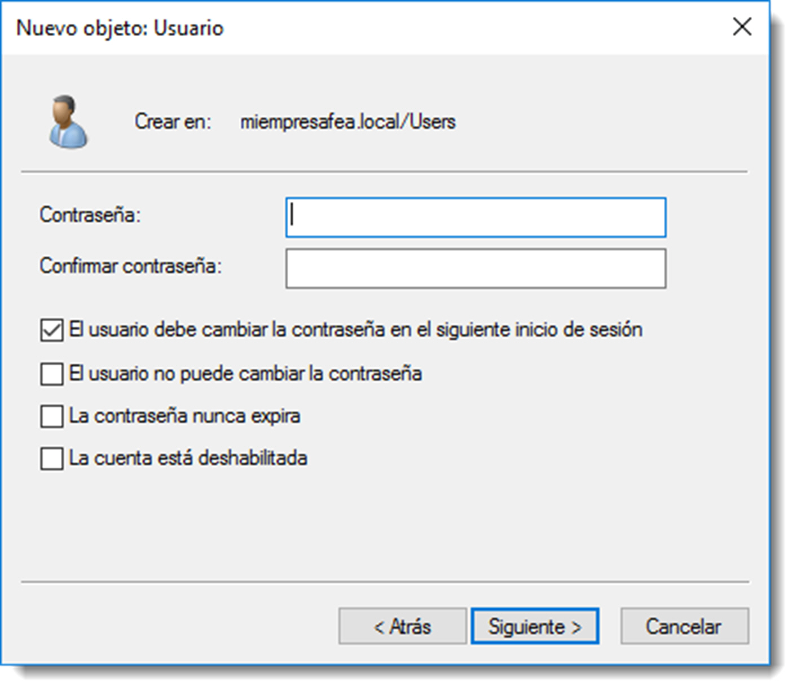

# Política de contraseñas

Todos las cuentas de usuario deben tener contraseñas robustas y ser cambiadas de forma periódica ya que, si ésta se actualiza cada poco tiempo, las cuentas de usuario permanecerán seguras contra cualquier tipo de ataque.
Una contraseña robusta tiene las siguientes características:

- contiene caracteres **alfabéticos y no alfabéticos**.
- tiene una longitud de al menos **ocho caracteres**.
- **no contiene información personal** conocida como la fecha de nacimiento, el número de teléfono o el número de matrícula del vehículo habitual.
- contiene algún **carácter especial**, como la arroba, almohadilla o dólar.

Conviene educar a los usuarios sobre las contraseñas y su privacidad, pero sobre todo, merece la pena hacer caso de los propios consejos. Hay que asegurarse de que la contraseña seleccionada para administración es robusta y cambiarla frecuentemente. Hacer esto ayudara a evitar intrusiones no deseadas en el sistema.

Es buena práctica que los administradores dispongan de dos cuentas en el sistema: **una cuenta administrativa y una cuenta de usuario normal**. Se debería utilizar la cuenta de usuario normal a menos que se estén realizando tareas administrativas. A causa de los privilegios asociados a las cuentas administrativas, son un objetivo primario para los intrusos.

Otra medida de seguridad interesante es que las cuentas deben establecerse de forma que se bloquearan cuando se introdujeran contraseñas incorrectas. Se pueden permitir varios intentos, para dejar margen a errores tipográficos. Esta configuración pertenece a la configuración de políticas de grupo, tema que se tratará en otra unidad.

Durante la creación de un usuario, el sistema ofrece varias posibilidades en lo referente a la contraseñas y que hay que tener muy en cuenta:

- El usuario debe cambiar la contraseña en el siguiente inicio de sesión, de esta forma tan solo el usuario conoce la contraseña. Ni el administrador del domino puede acceder a ella.
- El usuario no puede cambiar la contraseña, requerido cuando por necesidades de seguridad la contraseña debe ser controlada por el administrador.
- La contraseña nunca expira, no se aplicarán las restricciones de caducidad de contraseña a esta cuenta.
- Cuenta deshabilitada, deshabilita cuentas que momentáneamente no se necesitan en la red. También es posible que se active automáticamente debido a las restricciones de seguridad impuestas por el Administrador.

En Microsoft Windows Server aplicar estas opciones se realiza a través del asistente de creación de usuarios o consultando las propiedades de la cuenta de usuario. Estas configuración en GNU/Linux y Samba se realizan a través de opciones del comando samba-tool:

- `--must-change-at-next-login`, usado durante el proceso de creación del usuario, el usuario debe cambiar la contraseña en su próximo inicio de sesión.
- `samba-tool user enable/disable` para habilitar/deshabilitar la cuenta de usuario especificada.
- `samba-tool user password`, para cambiar la contraseña a una cuenta de usuario.
- `samba-tool user setexpiry` nombre_de_la_cuenta -–noexpiry, para indicar que esa cuenta nunca caduca o `--days=30` para indicar que la contraseña caduca a los 30 días.
