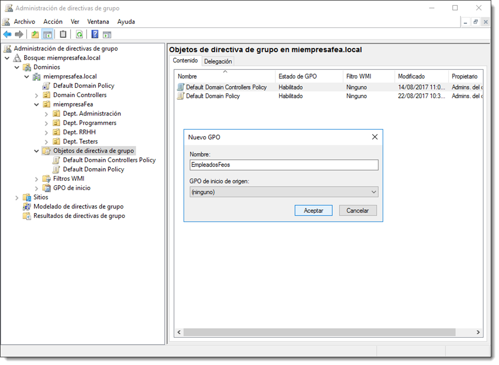
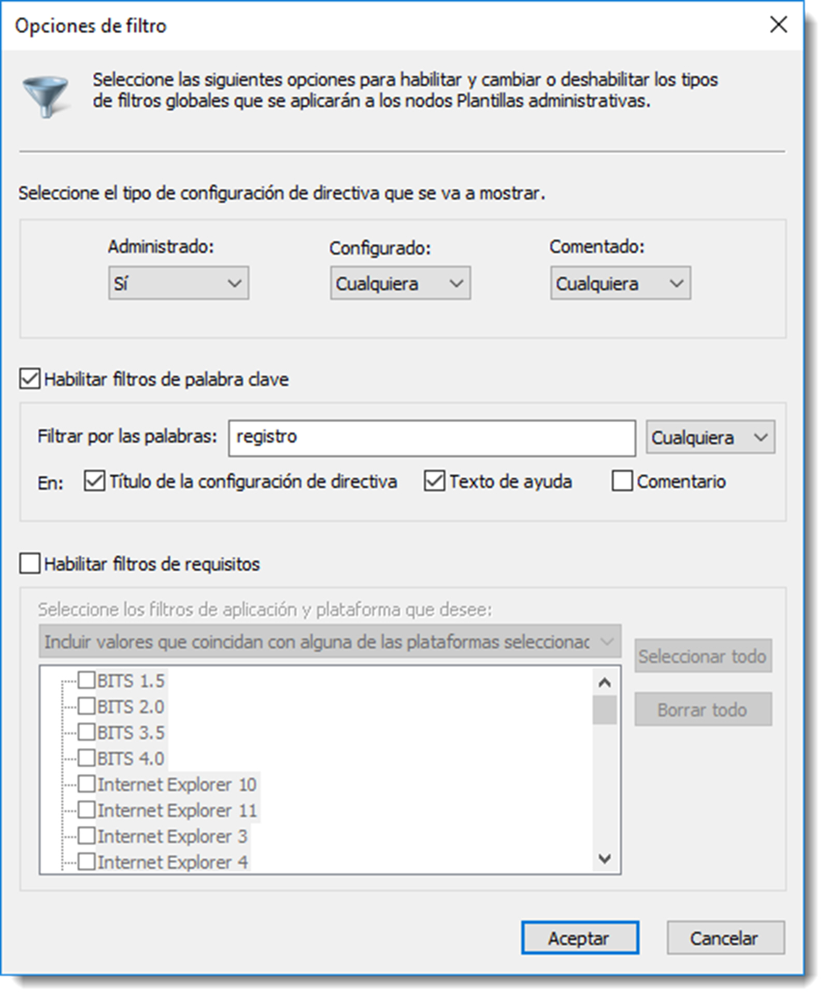
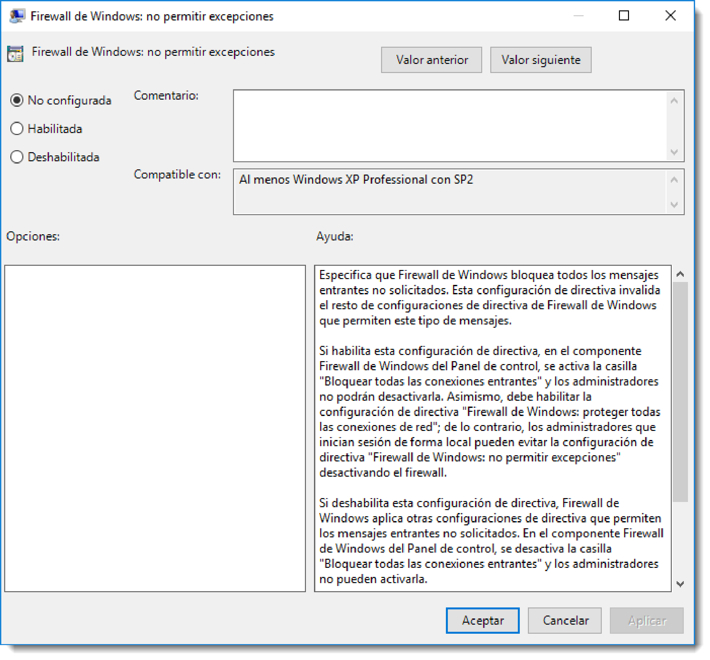
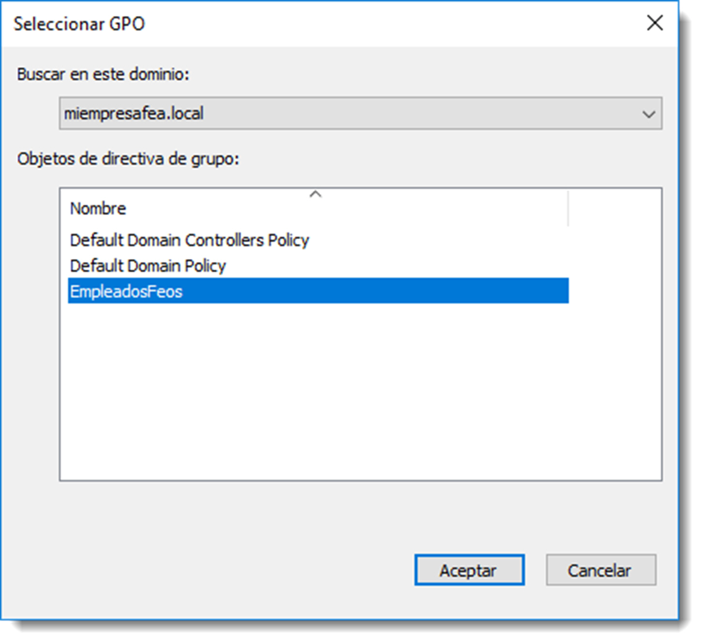
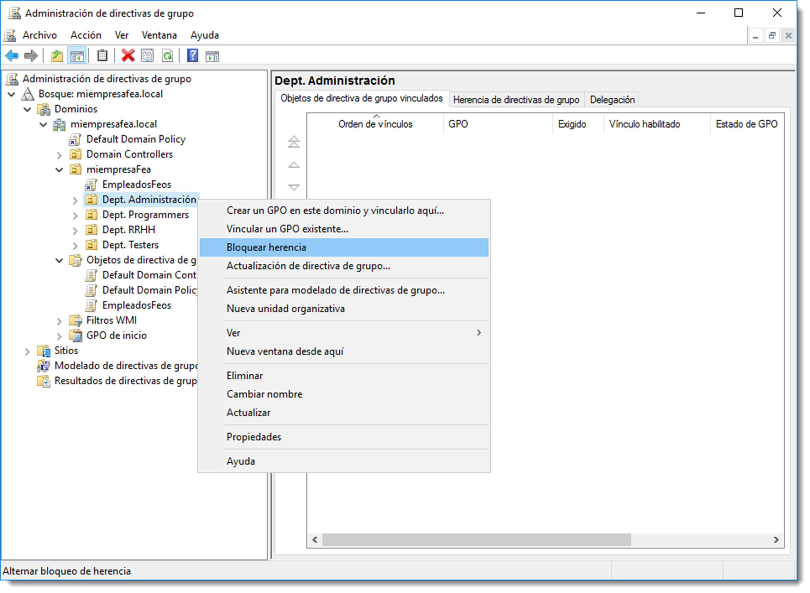

# Administración de directivas de grupo

La administración de las directivas de grupo en Microsoft Windows Server se realiza a través del Editor de administración de directivas de grupo al cual se accede a través de <span class="menu">Administración del servidor</span> → <span class="menu">Herramientas</span> → <span class="menu">Administración de directivas de grupo</span> → <span class="menu">Editar...</span> , haciendo clic sobre el objeto de directiva que se desea editar. El uso de esta herramienta es intuitivo y autoexplicativo.

En Ubuntu Server estas configuraciones se realizan a través del subcomando samba-tool gpo, el cual ofrece las siguientes opciones:

```bash
$ samba-tool gpo

Usage: samba-tool gpo <subcommand>
Group Policy Object (GPO) management.
Options:
-h, --help show this help message and exit
Available subcommands:
aclcheck - Check all GPOs have matching LDAP and DS ACLs.
create - Create an empty GPO.
del - Delete a GPO.
dellink - Delete GPO link from a container.
fetch - Download a GPO.
getinheritance - Get inheritance flag for a container.
getlink - List GPO Links for a container.
list - List GPOs for an account.
listall - List all GPOs.
listcontainers - List all linked containers for a GPO.
setinheritance - Set inheritance flag on a container.
setlink - Add or update a GPO link to a container.
show - Show information for a GPO.
For more help on a specific subcommand, please type:
samba-tool gpo <subcommand> (-h|--help)

```

## Creación y edición de una directiva de grupo

Con la herramienta Administración de directivas de grupo de Microsoft Windows Server tan sólo será necesario situar el cursor en el apartado Objetos de directiva de grupo e ir al menú <span class="menu">Acción</span> → <span class="menu">Nuevo</span> y crear un nuevo objeto asignándole un nombre.

Una vez creado, se usará el Editor de administración de directivas de grupo para aplicar la configuración necesaria a la nueva directiva. Para buscar la directiva adecuada, si no se conoce su paradero, es conveniente usar el **filtro de búsqueda**.





Si es necesario encontrar una directiva relacionada con el registro del sistema operativo, verbigracia, desde el menú <span class="menu">Acción</span> → <span class="menu">Opciones de filtro…</span> es posible aplicar un filtro relacionado con la temática de la directiva. Lo más eficaz es usar la opción Habilitar filtros de palabra clave y buscar alguna coincidencia en el título de la directiva o en el texto de ayuda.

Localizada la directiva se editará pulsando doble clic sobre ella. Esto abrirá la ventana de edición que constará de la información sobre la directiva:

- **comentario**, es conveniente indicar los motivos por los que se ha configurado esta directiva para el resto de administradores o para uno con mala memoria.
- **compatible con**, identifica los sistemas operativos con los que es compatible esa directiva. Aplicar una directiva para un sistema operativo que no figura en la lista, no tendrá ningún efecto sobre el cliente.
- **opciones**, algunas directivas poseen opciones de configuración, las cuales se especifican en este apartado.
- **ayuda**, una detallada descripción de los efectos de la directiva en sus diferentes configuraciones.

Al margen de estos elementos, cada directiva dispone de varios valores de configuración. La mayoría de directivas ofrecen tres opciones:

- **no configurada**, la directiva no tiene efecto alguno.
- **habilitada**, la directiva ejerce su efecto sobre los objetos del directorio donde haya sido vinculada.
- **deshabilitada**, la directivo no ejerce su efecto.

  

Aunque pueda parecer una contradicción, no configurada y deshabilitada poseen efectos diferentes en algunas políticas, sobre todo en las que niegan aluna acción. En cualquier caso, una política no configurada no formará parte de la plantilla administrativa que genera el dominio con la configuración de la directiva de grupo, una deshabilitada sí lo hace.

En GNU/Linux se dispone del comando `samba-tool gpo` pero la administración de las GPO a través de este comando resulta algo tediosa y muy limitada. Este comando está destinado a la creación y consulta rápida de los ficheros que componen una directiva de grupo. Una opción más interesante es el uso de aplicaciones con GUI, ya que, para esta tarea resulta altamente recomendable su uso.

Existen varias opciones para realizar esta tarea entre ellas **SWAT (Samba Web Admin Tool)** y **RSAT (Remote Server Administration Tool) de Microsoft**. Es preferible el uso de RSAT para la gestión de las GPO ya que el uso de una GUI es de vital importancia para poder administrar de forma eficaz la cantidad de directivas con las que cuenta Active Directory.

La instalación de estas herramientas así como su uso se verán en unidades sucesivas.

## Vinculación de una directiva de grupo

Tras la configuración de la directiva, es necesario indicar a qué objetos va a afectar. La vinculación se realiza a través de la herramienta <span class="menu">Administración del servidor</span> → <span class="menu">Herramientas</span> → <span class="menu">Administración de directivas de grupo</span>. Se selecciona el objeto continente al que se debe aplicar la directiva creada y en con el menú <span class="menu">Acción</span> → <span class="menu">Vincular un GPO existente…</span> se podrá realizar el vínculo.



Una vez realizado, todos los elementos que estén contenidos del objeto vinculado heredarán de forma automática esta política. A veces es necesario que uno de los objetos contenidos no herede esa política ya que necesita otra configuración distinta al resto. En el ejemplo mostrado en la imagen, es posible que los empleados del Departamento de Administración requieran de otras necesidades y será preciso bloquear la herencia para poder aplicar una directiva menos restrictiva.



Para comprobar que todo ha resultado como debiera, se puede consultar la pestaña <span class="menu">Herencia de directivas de grupo</span> en donde todas las unidades organizativas de miepresaFea heredan las políticas de Default Domain Policy y de EmpleadosFeos. La única que no tiene herencia es la unidad organizativa que ha sido bloqueada. Por supuesto, este proceso es reversible y si el bloqueo desaparece, el objeto estará afectado de nuevo por las directivas superiores.

## Actualización de clientes

La directiva de grupo se aplica a la configuración del equipo cuando se inicia el sistema operativo, y del usuario una vez que éste inicia sesión en el equipo. Además, también se actualizan de forma regular durante la sesión de trabajo, y se asegura de aplicar las nuevas directivas y cambiados sin esperar a que el equipo se reinicie o el usuario cierre sesión. El periodo de tiempo entre estas actualizaciones se llama **intervalo de actualización de la directiva de grupo** y el valor predeterminado es de **noventa minutos**, más un intervalo de tiempo al azar para evitar que todos los equipos se actualicen al mismo tiempo. Si se modifica una directiva en mitad de la sesión de trabajo, ésta aplicará los cambios en noventa minutos. No es necesario esperar al cierre de sesión o el reinicio del equipo.

No obstante, si la actualización ha de ser inmediata, existe la opción de realizarla de forma manual a través del comando `gpupdate`. Si además se usa el modificador `/force` se forzará a actualizar todas las directivas de grupo y no sólo aquellas que hayan cambiado. En ninguno de los dos casos se actualizan las directivas configuradas como no configurada.

```bash title=""

gpupdate
Actualizando directiva…

La actualización de la directiva de equipo se completó correctamente.
Se completó correctamente la Actualización de directiva de usuario.
```

En los sistemas operativos con Samba como gestor de directorio, para actualizar las políticas será necesario reiniciar el servicio de la siguiente manera

```bash
sudo /etc/init.d/samba/stop
sudo /etc/init.d/samba/restart
```

Además se puede utilizar las opciones que ofrece el comando para descargar los ficheros de directiva, y después proceder a su comprobación

```bash
sudo samba-tool gpo fetch
sudo samba-tool gpo aclcheck
```

A pesar de existir estas opciones a través del terminal, en sistemas basados en GNU/Linux, es preferible usar las herramientas GUI para realizar estas acciones.

## Copia de seguridad y restauración de una directiva de grupo

Crear diferentes directivas de grupo es una tarea costosa que bien podría ser uno de los círculos del infierno de Dante Alighieri. Es extremadamente recomendable realizar una copia de seguridad de las plantillas administrativas. En la herramienta **Administración de directiva de grupo**, situando el curso sobre Objetos de directiva de grupo y yendo al menú <span class="menu">Acción</span> → <span class="menu"></span> da acceso a un sencillo asistente que permitirá realizar las copias de seguridad.

Para proceder con la restauración de una directiva de grupo en concreto, existe otro asistente al que se accede de idéntica forma que el anterior, salvo que esta ver se accede dese el menú <span class="menu">Acción</span> → <span class="menu">Administrar copias de seguridad…</span> . El control de las directivas de grupo puede suponer una tarea tediosa, pero los resultados en cuanto a seguridad son una gran recompensa por el tiempo empleado. Una buena gestión de políticas de grupo pasa por, al igual que con los permisos a recursos, permitir al usuario realizar las tareas que debe hacer, ninguna más.
