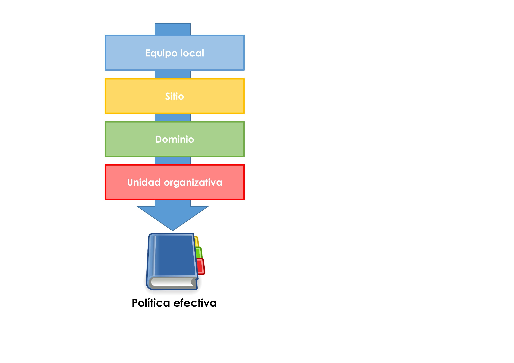
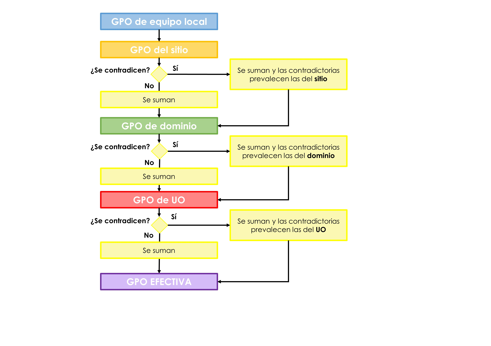
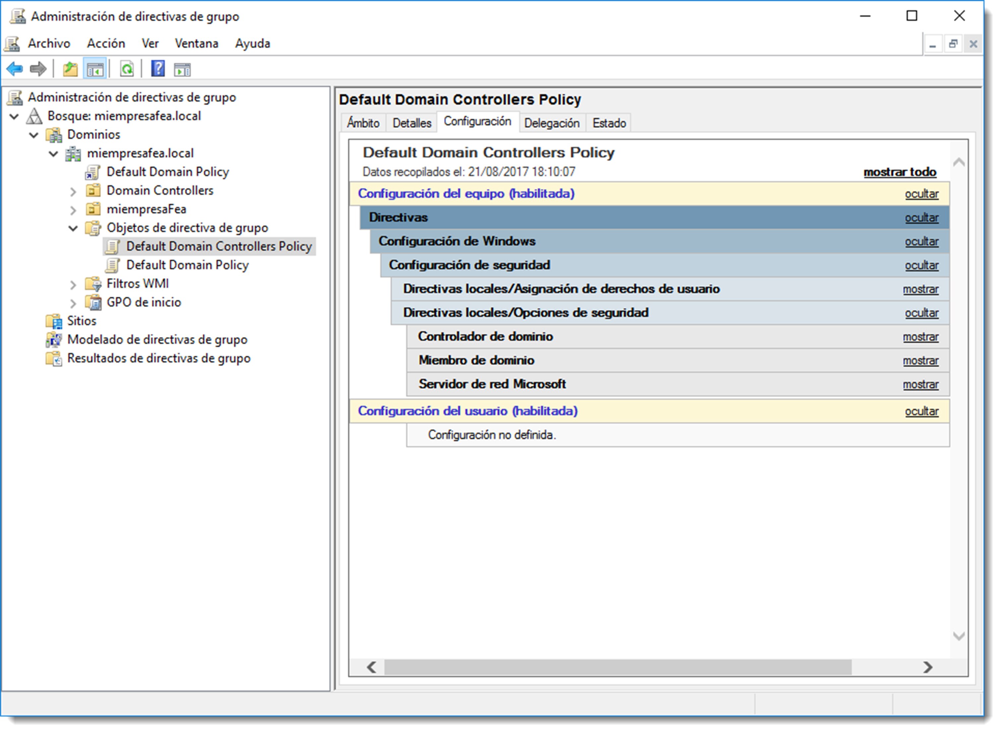
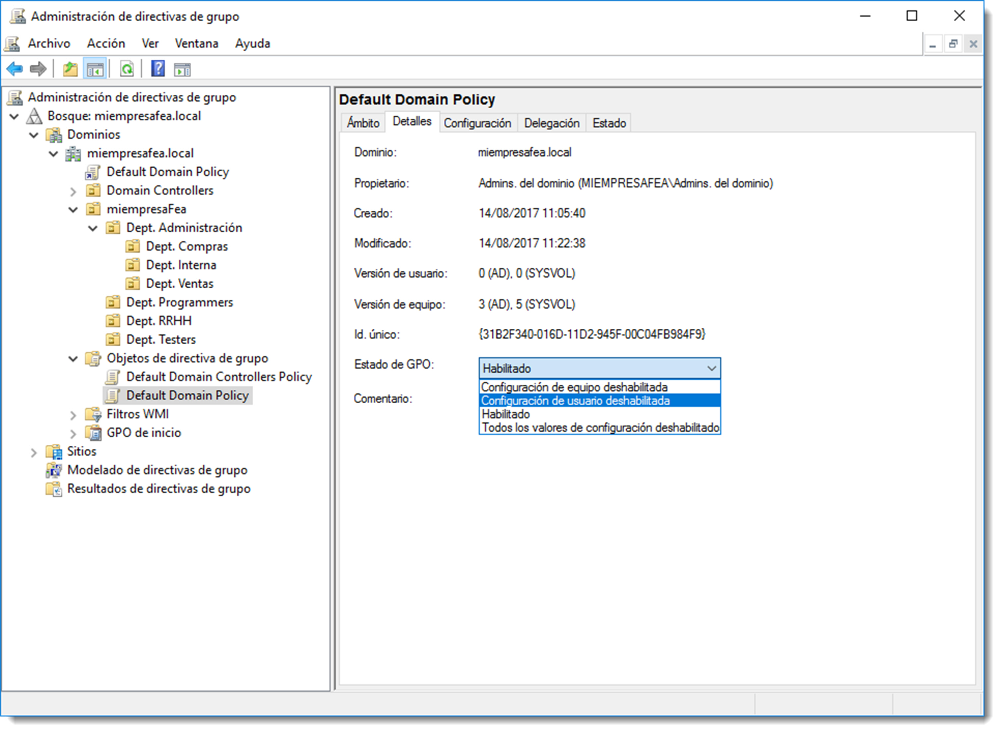

# Directivas de grupo

Las directivas de grupo o **GPO (Group Policy Object)** son un conjunto de configuraciones específicas para usuarios y equipos de un dominio. Cuando una directiva de grupo es aplicada en un controlador de dominio, todos los objetos del que es responsable han de cumplir esa regla. Además, su utilización es sencilla y centralizada. Bastará habilitar o deshabilitar la opción necesitada en el gestor de GPO.

Los requisitos para usar GPO:

- la red debe basarse en una estructura de directorio y existir un controlador de dominio al menos.
- los equipos y usuarios a administrar deben estar unidos al dominio, y deben usar credenciales de dominio para iniciar sesión en sus equipos. Es decir, ser un objeto del directorio.

También es posible configurar GPO de forma local en cada equipo. Esta capacidad es interesante en escenarios excepcionales o equipos de grupo de trabajo, pero no se recomienda el uso de la directiva de grupo local en redes de empresa. El motivo es simple, la directiva de grupo basada en dominio centraliza la administración. La directiva de grupo local requiere configuración para cada equipo, lo que no es un escenario ideal en un entorno de una red empresarial.

Es importante resaltar que las GPO **tienen prioridad sobre las opciones de configuración del perfil del usuario** en caso de que se cree un conflicto entre ambas configuraciones. Se trata del nivel más alto en las restricciones de seguridad del dominio.

!!! note annotate "Diferentes Herramientas"

      Para la configuración de GPO que sólo afecten a un usuario o equipo local se puede utilizar el editor de directivas locales `gpedit.msc`. En nuestro caso accederemos en el entorno de Servicios de Dominio de Active Directory, con la consola de administración `gpmc.msc`

Curiosamente, y pese a su nombre, las Directivas de Grupo no pueden ser asociadas a un grupo de usuarios o grupos de equipos, pues tan sólo son aplicables a Sitios, Dominios o Unidades Organizativas, y el resultado de su aplicación afecta a los objetos que contienen.

## Ámbito de las directivas

La configuración de GPO está contenida en un objeto de directiva de grupo, de modo que se asocia dicha directiva a los Sitios, Dominios o Unidades Organizativas del directorio. Es posible asignar una GPO a un objeto determinado del dominio y afectará al resto de objetos que contiene. Si es necesario aplicar una serie de reglas a un conjunto de equipos, es preferible introducir esos equipos en una unidad organizativa y aplicar una GPO a dicha unidad, que asignar esa política equipo por equipo. También es posible aplicar diferentes GPO a un mismo objeto. En ese caso será necesario indicar, además, el orden en el que aplicarán esas directivas en el objeto.



Cuando se habilita una GPO, el orden en que la misma es aplicada es el siguiente:

- en primer lugar se aplica el objeto de directiva de grupo **local** único de cada equipo.
- en segundo lugar se aplican los objetos de directiva de grupo del **sitio**, en el orden especificado administrativamente.
- en tercer lugar los objetos de directiva de grupo del **dominio**, en el orden especificado administrativamente.
- en cuarto lugar los objetos de directiva de grupo de las **unidades organizativas**, de unidad organizativa principal a secundaria, y en el orden especificado administrativamente en el nivel de cada unidad.

De forma predeterminada, cuando las directivas son incoherentes las aplicadas en último lugar sobrescriben las directivas aplicadas con anterioridad. Sin embargo, si no hay incoherencias de configuración, tanto las directivas anteriores como las posteriores contribuyen a la directiva efectiva, es decir, se suman las configuraciones de las distintas directivas asociadas al objeto en cuestión.

Hay que tener en cuenta que existe **herencia** entre los objetos a los que se le aplican las GPO. Si se asigna una directiva de grupo a una unidad organizativa, los objetos contenidos en ella, heredan esa política. Algo muy similar a lo que ocurre con los permisos de acceso. La herencia puede ser bloqueada. Si un administrador bloquea una GPO a un objeto de nivel superior, automáticamente dejará de afectar al objeto bloqueado. Si ese objeto contiene otros objetos, éstos también tendrán la herencia bloqueada.



Bloquear la herencia implica que no heredará directivas del dominio, ni tampoco sus directivas descendientes. Sin embargo, sí se producirá herencia a partir de la directiva hacia abajo.

## Directivas de grupo por defecto

Al crearse el domino, también se crean las dos directivas que le afectan por defecto:

- **Default Domain Policy**, la cual se sitúa en la raíz del dominio y afecta al conjunto de unidades organizativas. Los parámetros que contiene son de configuración básica, entre ellos los de contraseña y de bloqueo.
- **Default Domain Controller Policy**, se sitúa y afecta a la unidad organizativa Domain Controllers. Los parámetros de la directiva se reservan a los controladores de dominio y se pueden configurar los siguientes tipos de parámetros:

      - directivas de asignaciones de derechos, permiten atribuir permisos adicionales a un usuario.
      - directiva de opciones de seguridad, permite la configuración de los parámetros de auditoría.

Es reseñable que estas GPO no tienen una profusa configuración y se centran en aspectos fundamentalmente de seguridad. Estas dos políticas podrían ser editadas para incluir todas las configuraciones que sean necesarias, pero es buena práctica crear diferentes objetos de GPO en función de la configuración que contengan.



## Contenido del objeto de directiva de grupos

Los objetos que contienen las directivas de grupo poseen una estructura jerarquizada destinada a organizar la ingente cantidad de opciones que son configurables en GPO. En cada directiva aparecen dos ramas que agrupan las opciones dependiendo si lo son para configurar el equipo o a los usuarios. Dentro de cada una de ellas se encuentran las mismas ramas aunque con directivas distintas:

- configuración de **software**, listado de software que el equipo debe tener instalado. Si no es así, se instalará desde el repositorio especificado en la directiva.
- configuración de **Windows**, directivas basadas en la configuración sistema operativo que debe tener para poder pertenecer al dominio y la configuración de seguridad mínima. Desde esta rama se configuran los scripts de inicio y apagado, las impresoras de red que el equipo debe tener y la configuración de seguridad, entre otras muchas opciones.
- **plantillas administrativas**, listado de todas las directivas que hacen referencia a la configuración del sistema operativo. Éste es el grueso de los contenidos de directiva y son archivos de configuración en formato **ADMX** que se sitúan en la carpeta **SYSVOL** del controlador de dominio que las exige. Desde allí, estas plantillas se distribuyen entre los equipos cliente y el resto de controladores.

Para facilitar la aplicación de estas directivas, es posible filtrar qué rama debe aplicarse. Si , por ejemplo, una directiva sólo hace referencia a modificaciones en la rama de equipo, es posible desactivar la de usuario para que el equipo receptor no compruebe estas configuraciones, ahorrando así un tiempo de cómputo valioso.



## Plantillas administrativas

Los archivos de plantilla administrativa contienen la configuración de las directiva de grupo configuradas en el dominio. Son archivos basados en XML con funcionalidad multilingüe y se almacenan en la carpeta `%SystemRoot%\PolicyDefinitions`.

Una plantilla administrativa está compuesta por dos tipos de archivo: **ADMX (Administrative Template XML-Based) y ADML (Administrative Template Language Package)**. El primero contiene la información independientemente de la estructura y determina la configuración de la directiva o directivas configuradas. Los archivos ADML proporcionan la estructura que necesitan los archivos ADMX para mostrar la configuración en el idioma o estructura correcta.

Además del contenido y su estructura, estos archivos también contienen la información sobre ubicaciones en el registro, opciones o restricciones en los valores asociados, valores predeterminados para opciones no definidas y explicaciones de texto acerca del propósito de cada configuración.

Cuando se genera un directorio con Active Directory, se crea un almacén central, una carpeta para contener estas plantillas. Esta carpeta es gestionada por el administrador y creada en el recurso SYSVOL. Se trata de la ubicación de almacenamiento predeterminada y centralizada para todos los archivos de plantilla administrativa del dominio.

Las herramientas de la directiva de grupo usan solamente los archivos situados en el controlador de dominio e ignoran las versiones almacenadas localmente. La carpeta raíz para el almacén central se debe denominar policies y debe situarse en `%SystemRoot%\SYSVOL\domain\policies`. En ella se encontrarán los archivos de configuración de cada uno de los objetos de directiva identificada por su GUID (Globaly User Identifier).

De igual forma ocurre en Ubuntu Server. Samba ubica las políticas de grupo en la ruta `\\nombre_del_dominio\sysvol\nombre_del_dominio\Policies`, y de igual manera se identifican con su GUID.

El comando para comprobar las dos directivas de grupos creadas de forma predeterminada es:

```bash
samba-tool gpo listall
GPO : {31B2F340-016D-11D2-945F-00C04FB984F9}
display name : Default Domain Policy
path : \\miempresafea.local\sysvol\miempresafea.local\Policies\{31B2F340-016D-11D2-945F-00C04FB984F9}
dn : CN={31B2F340-016D-11D2-945F-00C04FB984F9},CN=Policies,CN=System,DC=miempresafea,DC=local
version : 0
flags : NONE

GPO : {6AC1786C-016F-11D2-945F-00C04FB984F9}
display name : Default Domain Controllers Policy
path : \\miempresafea.local\sysvol\miempresafea.local\Policies\{6AC1786C-016F-11D2-945F-00C04FB984F9}
dn : CN={6AC1786C-016F-11D2-945F-00C04FB984F9},CN=Policies,CN=System,DC=miempresafea,DC=local
version : 0
flags : NONE
```

## Directivas de auditoria

La auditoría permite almacenar una entrada en un registro de eventos cuando un usuario realiza alguna acción en el sistema, registrando al usuario y que acción ha realizado. Esta información es extremadamente útil para ayudar a identificar problemas en el sistema o para comprobar en cada momento las actividades de los usuarios. Entre otros, es posible auditar varios tipos de eventos:

- **eventos de inicio de sesión de cuenta**, que audita cada conexión y desconexión de un usuario o equipo.
- **administración de cuentas**, al registrar este evento resulta muy sencillo conocer quién ha creado, modificado o eliminado una cuenta.
- **acceso del servicio de directorio**, determina que usuarios y grupos acceden a los objetos del dominio.

Configurar las auditorías es útil cuando se debe seguir el rastro de algún problema de rendimiento o de seguridad. En directorios de un considerable tamaño no es recomendable auditar cada uno de los objetos de dominio ya que el consumo de recursos puede mermar tareas más perentorias del sistema. Como es habitual, se debe encontrar un compromiso entre seguridad y rendimiento, auditando tan solo los puntos críticos del sistema. Aunque este tema será tratado ampliamente con posterioridad.
