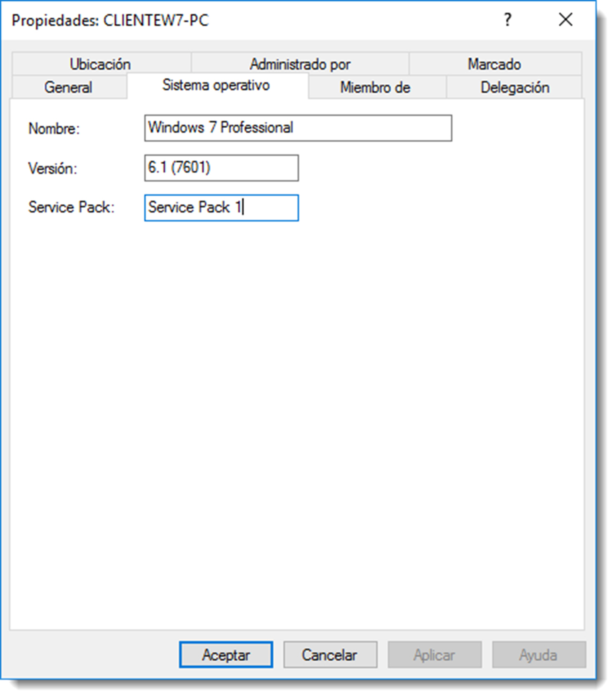

# Equipos del dominio

Las cuentas de equipo en un dominio representan los equipos que se introducen en el directorio y, Igual que sucede con las cuentas de usuario, deben ser únicas en todo el dominio. Las cuentas de equipos se crean con dos objetivos fundamentales:

- **autenticar la identidad** de un equipo ya que sólo podrán iniciar una sesión desde aquellos equipos que pertenezcan al dominio, aunque esto es decisión del administrador.
- **autorizar o denegar** el acceso a los recursos del dominio.

Cuando un equipo se une al dominio, de forma automática se crea la cuenta de ese equipo, aunque se puede crear de forma manual. Esta cuenta posee información sobre el equipo del dominio y permite hacer referencia a ese equipo.

En Microsoft Windows Server, se dispone de la herramienta Administrador del servidor → Herramientas → Usuarios y equipos de Active Directory que permite a gestión de cuentas de equipo. Por defecto, las cuentas creadas de forma automática se almacenan en la unidad organizativa Computers si trabajan como estaciones de trabajo o en Domain Controllers si lo hacen como controladores de dominio. Es posible crear nuevas unidades organizativas y mover las cuentas de equipo según las necesidades del proyecto; organizar los equipos por sistema operativo instalado, por ubicación o por el color de la caja, todo dependerá de las necesidades de administración.

Samba no dispone de esta gestión por el momento y las cuentas de equipo se generan siempre de forma automática. En futuras versiones se incluirá un subcomando para la gestión de estos elementos.
