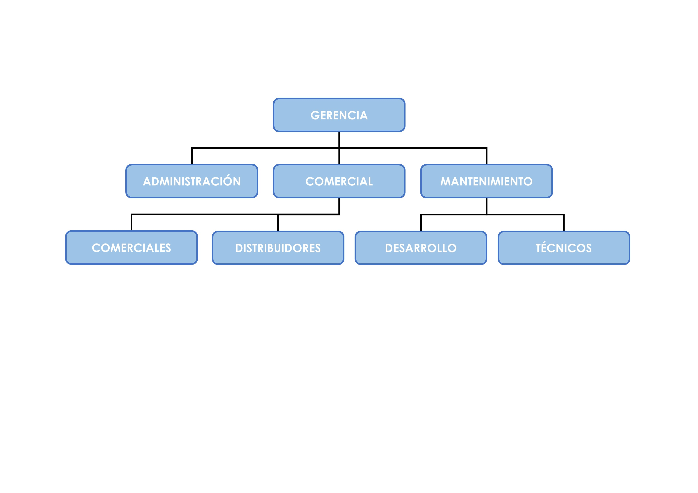

# Estrategias de anidamiento

Un grupo es un conjunto de cuentas de usuario, equipos, contactos y otros grupos que se pueden administrar como una sola unidad. Los usuarios y los equipos que pertenecen a un grupo determinado se denominan miembros del grupo. Cada grupo creado dentro de un dominio tiene un identificador numérico para que el sistema lo gestione, con la excepción de un determinado tipo de grupo denominado de distribución que no lo posee.
Los grupos de dominio se usan para:

- **simplificar la administración**, si se asignan permisos para un recurso compartido a un grupo, se concede el mismo acceso al recurso a todos los miembros de dicho grupo.
- **delegar la administración**, a un grupo le puede agregar miembros que desee que tengan los mismos derechos o permisos de los que disponga el grupo.
- **crear listas de distribución de correo electrónico**.

Se caracterizan por su ámbito y su tipo. El ámbito determina el alcance del grupo dentro de un dominio, bosque o directorio. El tipo determina el uso que se la va a dar al grupo. Existen diferentes tipos de grupo en un directorio:

- **grupos de distribución**, se utilizan para crear listas de distribución de correo electrónico. Estos grupos no disponen de características de seguridad ni identificador de grupo, por lo que no pueden aparecer en las listas de control de acceso discrecional DACL (Discretionary Access Control Lists). Esto quiere decir que no se le pueden asignar permisos a ningún recurso del sistema.
- **grupos integrados o builtin**, creados durante la instalación de los servicios de directorio y son fundamentales para simplificar la asignación de funciones de administración del sistema.
- **grupos de seguridad**, los cuales permiten asignar permisos sobre los recursos compartidos.

Para ilustrar la utilidad de los los objetos descritos en este tema, se va a crear una empresa ficticia basada en el siguiente organigrama:

Como se aprecia en gráfico, la empresa está formada por cuatro grandes departamentos relacionados entre sí; **Gerencia, Administración, Comercial y Mantenimiemto**. Algo más pequeños y dependientes de departamentos mayores existen los de **Comerciales, Distribuidores**, dependientes de del departamento comercial, y **Desarrolladores y Técnicos**, dependientes del departamento Mantenimiento. No es de extrañar esta agrupación, ya los empleados adscritos a cada departamento van a disponer de unas tareas, habilidades, conocimientos y necesidades distintas a los otros.

En este tema se dispondrá de varios objetos para trasladar esa estructura de la vida real al directorio. Bien es cierto que no existe una única solución válida, pero hay algunas van que funcionan mejor que otras.
