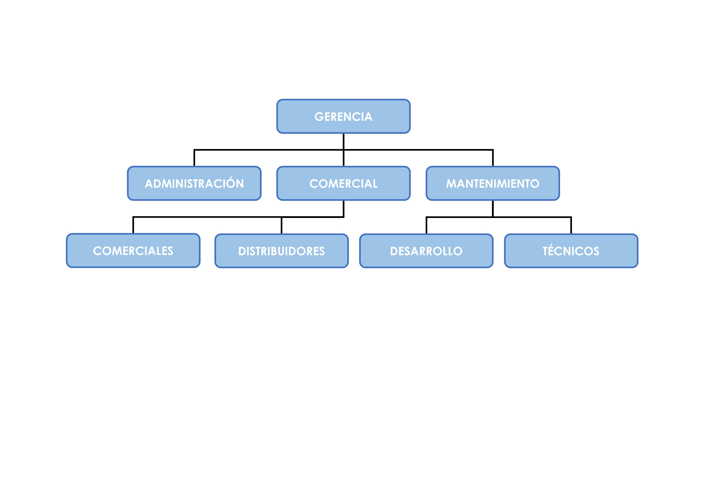

# Estrategias de anidamiento

Un grupo es un conjunto de cuentas de usuario, equipos, contactos y otros grupos que se pueden administrar como una sola unidad. Los usuarios y los equipos que pertenecen a un grupo determinado se denominan miembros del grupo. Cada grupo creado dentro de un dominio tiene un identificador numérico para que el sistema lo gestione, con la excepción de un determinado tipo de grupo denominado de distribución que no lo posee.
Los grupos de dominio se usan para:

- **simplificar la administración**, si se asignan permisos para un recurso compartido a un grupo, se concede el mismo acceso al recurso a todos los miembros de dicho grupo.
- **delegar la administración**, a un grupo le puede agregar miembros que desee que tengan los mismos derechos o permisos de los que disponga el grupo.
- **crear listas de distribución de correo electrónico**.

Se caracterizan por su ámbito y su tipo. El ámbito determina el alcance del grupo dentro de un dominio, bosque o directorio. El tipo determina el uso que se la va a dar al grupo. Existen diferentes tipos de grupo en un directorio:

- **grupos de distribución**, se utilizan para crear listas de distribución de correo electrónico. Estos grupos no disponen de características de seguridad ni identificador de grupo, por lo que no pueden aparecer en las listas de control de acceso discrecional DACL (Discretionary Access Control Lists). Esto quiere decir que no se le pueden asignar permisos a ningún recurso del sistema.
- **grupos integrados o builtin**, creados durante la instalación de los servicios de directorio y son fundamentales para simplificar la asignación de funciones de administración del sistema.
- **grupos de seguridad**, los cuales permiten asignar permisos sobre los recursos compartidos.

## Qué significa anidar grupos

Anidar grupos consiste en **meter un grupo dentro de otro grupo**. No se hace por capricho, sino para separar claramente tres ideas:

- quién es la persona
- qué función desempeña
- a qué recurso puede acceder

En un dominio bien organizado **no se asignan permisos directamente a usuarios**, sino a grupos de permiso. El anidamiento permite que la cuenta de usuario llegue a ese permiso a través de su grupo de rol.

## Modelo recomendado en esta unidad

En esta UD se recomienda el modelo `A -> GG -> DL -> Permisos`:

- `A` (`Accounts`): cuentas de usuario.
- `GG` (`Global Group`): agrupa personas por departamento o rol.
- `DL` (`Domain Local`): representa el permiso sobre un recurso concreto.
- `Permisos`: ACL efectiva aplicada a la carpeta, impresora o aplicación.

Resumen práctico:

- `GG` responde a "quiénes son"
- `DL` responde a "a qué recurso acceden"

## Ejemplo explicado paso a paso

Supongamos que María trabaja en Comercial y necesita usar el ERP:

```text
maria -> GG_Comercial -> DL_ERP_RW -> ERP
```

La lógica es la siguiente:

1. `maria` se añade a `GG_Comercial`.
2. `GG_Comercial` se anida dentro de `DL_ERP_RW`.
3. El ERP solo concede permisos a `DL_ERP_RW`.

Resultado: María entra al ERP, pero el ERP no tiene que conocer a María directamente.

## Por qué compensa hacerlo así

La gran ventaja aparece cuando hay cambios de personal. Si María deja Comercial y pasa a Administración:

- se elimina de `GG_Comercial`
- se añade a `GG_Administracion`
- no hace falta tocar la ACL del ERP ni revisar recurso por recurso

Esto reduce errores, ahorra tiempo y hace que la administración sea mucho más mantenible.

## Analogía sencilla

Compararlo con las llaves de un centro educativo:

- `GG_Comercial` sería el grupo de personas que forman parte de Comercial
- `DL_ERP_RW` sería el grupo que tiene "llave" del ERP

No se reparte la llave una por una cada vez que entra o sale un trabajador. Se gestiona la pertenencia al grupo adecuado.

## Errores frecuentes

- confundir anidamiento con meter usuarios en muchos grupos sin criterio
- usar el mismo grupo para representar a las personas y al permiso del recurso
- dar permisos directos a usuarios en lugar de a grupos
- confundir grupos con OU; la OU organiza y recibe GPO, el grupo concede acceso

Para ilustrar la utilidad de los los objetos descritos en este tema, se va a crear una empresa ficticia basada en el siguiente organigrama:


Como se aprecia en gráfico, la empresa está formada por cuatro grandes departamentos relacionados entre sí; **Gerencia, Administración, Comercial y Mantenimiemto**. Algo más pequeños y dependientes de departamentos mayores existen los de **Comerciales, Distribuidores**, dependientes de del departamento comercial, y **Desarrolladores y Técnicos**, dependientes del departamento Mantenimiento. No es de extrañar esta agrupación, ya los empleados adscritos a cada departamento van a disponer de unas tareas, habilidades, conocimientos y necesidades distintas a los otros.

En este tema se dispondrá de varios objetos para trasladar esa estructura de la vida real al directorio. Bien es cierto que no existe una única solución válida, pero hay algunas van que funcionan mejor que otras.
