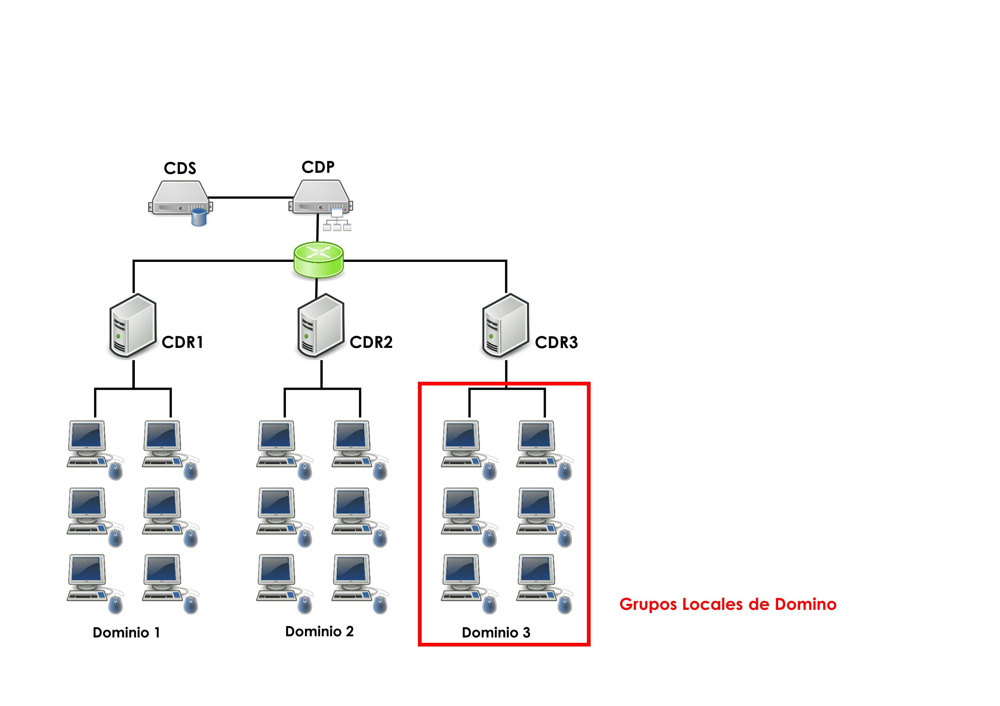
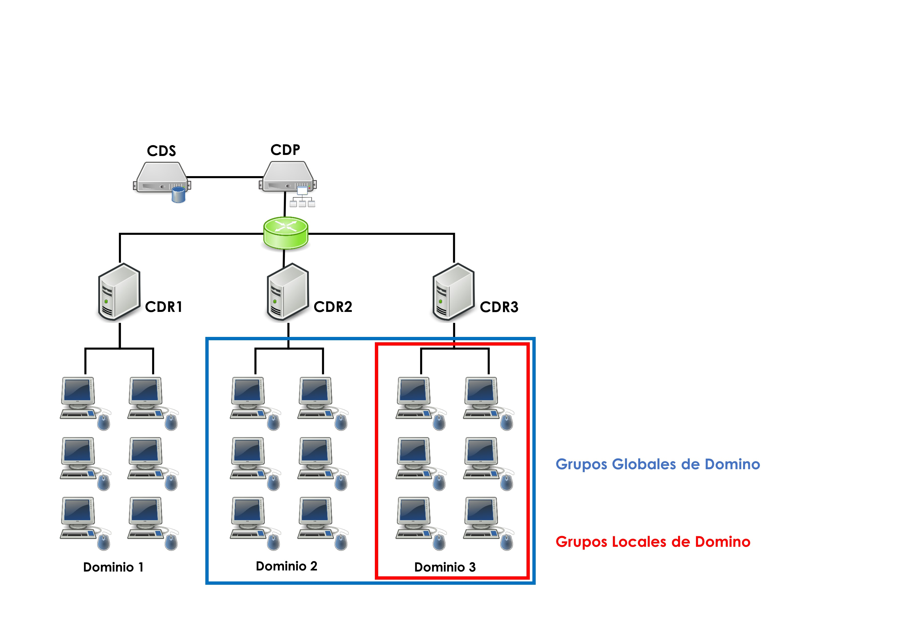
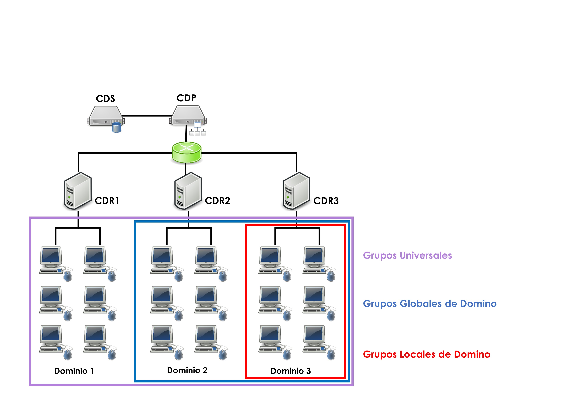
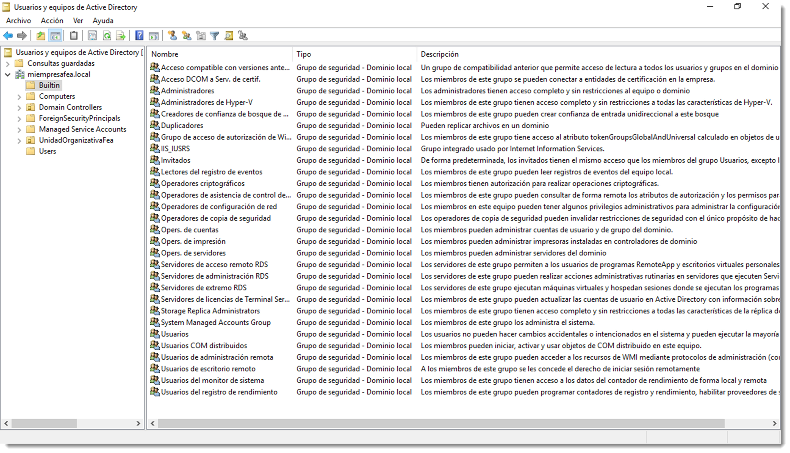

# Grupos de seguridad

Estos grupos son creados en el dominio, por los administradores, para adaptar a éste al funcionamiento de la empresa o actividad que se necesite gestionar. Es posible crear un número infinito de grupos para dar servida cuenta a las necesidades de la empresa. A estos grupos se les asigna derechos y permisos sobre recursos de manera directa, de este modo aparecen en las listas de control de acceso discrecional **DACL (Discretionary Access Control Lists)** y eso los faculta para acceder a los recursos compartidos.

Es usual que muchos de estos grupos representen parte de la realidad de la empresa. Así como las cuentas de usuario representan a los empleados, los grupos representan a partes funcionales de la misma. Por ejemplo, en una empresa de desarrollo de software existen empleados encargados de escribir código y otros de comprobarlo. Resulta evidente que cada usuario necesita unos permisos diferentes de acceso al recurso (en este caso el código fuente del programa). En esta situación es conveniente crear dos grupos de seguridad y asignar los permisos de escritura a uno de ellos y de lectura a otro. Después, asignar a los desarrolladores al grupo con permiso de escritura y a los probadores al grupo de lectura.

!!! note annotate "SID (Security Identifier) es un identificador"

      Se asigna a cada **objeto**. Estos identificadores han de ser únicos en todo el ámbito del directorio. No importa que dos objetos tengan el mismo nombre si pertenecen al dominios distintos, aunque en realidad no es cierto ya que existen el FQDN. Por ejemplo dos grupos de nombre “Administradores” en dominios distintos. Cada uno de esos grupos tendrá un SID distinto y el sistema operativo se referirá a él a través de este SID. Este identificador está formado por el identificador del dominio al que pertenece y el identificador propio del objeto.

Aunque muy simple, este es un buen ejemplo para entender las estrategias de división y anidamiento de los grupos y su fortaleza. Que duda cabe que una buena estrategia a la hora de crear grupos facilita enormemente la gestión de acceso a los recursos del directorio.

Los grupos de seguridad poseen otra característica que no hay que descuidar, **el ámbito del grupo**. Se entiende por ámbito como el área de acción a la que los miembros del grupo tendrán acceso. Un directorio puede estar dividido en varios bosques, estos bosques en dominios y estos últimos en subdominios. Cada una de estas secciones del directorio es un ámbito de actuación al que poder limitar las acciones de un grupo. Si se limita el ámbito de acción de un grupo a un determinado dominio, **este grupo no podrá ejercer sus derechos fuera de él**.

Estas limitaciones son muy útiles cuando la estructura del dominio es muy grande y segmentada, ya que enclaustra a los usuarios en una determinada zona de acción y limita el acceso a otras áreas. Una buena planificación de grupos pasa por permitir hacer a los usuarios tan sólo **lo que estén destinados a hacer**.

Para ilustrar un ejemplo de grupos se dispone de un directorio dividido en tres subdominios. Cada uno de estos subdominios posee un **controlador de dominio regional (CDR)** encargado de gestionar sus propios objetos. Estos tres CDR se encuentran conectados a su vez a un controlador de dominio principal, el cual gestiona todos los objetos del sistema y contiene el catálogo global (CG). Por supuesto, éste posee un controlador de dominio secundario (CDS) que tomará el control si el CDP deja de funcionar.

Se dispone de varias opciones de ámbito:

- **grupos de seguridad locales de dominio**, cuentan con un identificador SID (Security IDentified) que es reconocido dentro del dominio en el que se crean, de modo que estos grupos no serán visibles fuera del dominio. Dentro del ámbito en el que fue creado, todos los controladores de dominio y todos los clientes serán capaces de reconocerlos.

  Los grupos locales de dominio pueden **contener como miembros a usuarios de cualquier dominio, a grupos globales de cualquier dominio, a grupos universales de cualquier dominio, y a otros grupos locales, pero éstos últimos creados dentro del propio dominio**.
  

- **grupos de seguridad globales de dominio**, su SID (Security IDentified) es reconocido fuera de su propio dominio, por lo que puede ser visto y usado en dominios que no son el propio donde se crearon. Estos grupos pueden contener como miembros únicamente **cuentas de usuario y grupos globales de su propio dominio.**
  
- **grupos de seguridad universales**, no tienen ningún tipo de limitación y su SID es reconocido en todo el directorio. Pueden ser vistos en cualquier dominio del árbol, y pueden contener cualquier tipo de usuario o grupo de cualquier dominio. **Se recomienda no utilizarlos**, ya que es posible llegar a crear situaciones de inseguridad para algunos recursos.
  

En Microsoft Windows Server, la administración de los grupos se realiza a través de la herramienta <span class="menu"> Administrador del servidor</span> → <span class="menu">Herramientas</span> → <span class="menu">Usuarios y equipos de Active Directory</span>. Desde la opción Acción del menú es posible acceder a la gestión de los grupos de una manera fácil y eficaz.

Como siempre, la gestión de elementos del directorio en Ubuntu Server se realiza a través de la interfaz CLI. Para ello se usa el comando `samba-tool group` que ofrece las siguientes opciones:

```bash
samba-tool group
Usage: samba-tool group <subcommand>

Group management.

Options:
-h, --help show this help message and exit

Available subcommands:
add - Creates a new AD group.
addmembers - Add members to an AD group.
delete - Deletes an AD group.
list - List all groups.
listmembers - List all members of an AD group.
removemembers - Remove members from an AD group.

For more help on a specific subcommand, please type: samba-tool group <subcommand> (-h|--help)

```

Se utilizará el siguiente comando para crea un grupo

```bash
samba-tool group add grupoFeo --group-scope=Domain --group-type=Security --description="Grupo del departamento Feos" --gruopou="Departamentos"
```

Estas son las opciones más importantes de este subcomando:

- `--groupou=GROUPOU`, unidad organizativa donde se creará el grupo. Si no se especifica se creará en la ubicación por defecto.
- `--group-scope=GROUP_SCOPE`, ámbito del grupo que puede contener tres valores; Domain, Global o Universal.
- `--group-type=GROUP_TYPE`, tipo de grupo Security o Distribution.
- `--description=DESCRIPTION`, descripción del grupo entre comillas dobles.
- `--gid-number=GID_NUMBER`, número de identificación del grupo.

Este identificador debe crearse bajo las normas del documento de estandarización RFC2307 GID number. Si no se especifica, será el controlador de dominio el que lo creará de forma automática. Siempre es una buena opción dejar esta tarea al controlador de dominio.

Si se necesita añadir usuario al grupo

```bash
samba-tool group addmembers grupoFeo usuarioFeo1,usuarioFeo2,usuarioFeo3
```

El comando anterior añadirá a los tres usuario dentro del grupo grupoFeo recién creado. Para comprobarlo, es necesario usar el siguiente comando

```bash
samba-tool group listmembers grupoFeo
```

Aunque este método de gestión parezca un anacronismo, en realidad es el que usa el sistema operativo debajo de la capa de abstracción que supone la GUI y, además, permite la automatización de esta tareas mediante la creación de scripts, tema que se abordará en lo sucesivo.

## Grupos predeterminados, incorporados o built-in

Cuando se instala un directorio se incluyen varios grupos predeterminados que se crean y se configuran automáticamente. Éstos permiten agregar o eliminar usuarios si es necesario, pero no la eliminación de los grupos en sí mismos. Por defecto, los grupos integrados carecen de derechos de acceso a recursos, es decir, no se pueden dar permiso de acceso a una carpeta a un grupo integrado de forma directa. Aún así, es posible asignar estos derechos agregando los grupos incorporados a grupos de seguridad creado por el administrador.



En Microsoft Windows Server se incluyen, entre otros, los siguientes grupos incorporados:

- **Administradores**, permite a los miembros del grupo realizar tareas administrativas.
- **Invitados**, conjunto de todos los invitados del dominio.
- **Usuarios**, realizan tareas para las que les hayamos concedido derecho a recursos. Todos los usuarios del dominio se agrupan aquí.
- **Opers. de cuentas**, pueden crear, eliminar y modificar cuentas de usuario y otros grupos, a excepción del grupo Administradores.
- **Operadores de servidores**: pueden administrar los servidores de la red, apagarlos, instalar o cambiar la configuración de hardware, servicios etcétera.
- **Operadores de copia de seguridad**, tienen permiso para realizar copias de seguridad y restaurar todos los controladores de dominio.
- **Operadores de impresión**, son capaces de configurar y administrar impresoras de red que existan en los controladores de dominio.

También existen objetos cuya pertenencia a grupos no se pueden ver ni modificar. Estos grupos se conocen con el nombre de identidades especiales. Representan a distintos usuarios en distintas ocasiones, en función de las circunstancias. Por ejemplo, **el grupo Todos** es una identidad especial que representa a todos los usuarios actuales de la red, incluidos invitados y usuarios de otros dominios.

En GNU/Linux, y más concretamente en los servicios de directorio de Samba, existen multitud de estos grupos, alrededor de treinta y cinco grupos, que se pueden consultar mediante el comando

```bash
samba-tool group list
```

La mayoría de ellos poseen un nombre autoexplicativo, otros coinciden con los descritos en el caso de Microsoft Windows Server. En cualquier caso, no es necesario conocer los entresijos de todos y cada uno de estos grupos, pero sí saber que es posible contar con ellos para asignar tareas de administración.

A principio de este tema se ilustró un ejemplo de una empresa pequeña con diferentes departamentos. ¿Cuál sería la distribución en grupos de es estructura departamental?. La respuesta resulta casi instantánea; es necesaria la creación de un grupo por cada departamento y situar en ellos a las cuentas de usuario que trabajen en ellos.

¿Y si un usuario trabaja en los departamentos de Gerencia y Administración?. Nada obliga a una cuenta de usuario a pertenecer tan sólo a un grupo, por lo que esa cuenta se encontrará ubicado en dos grupos.

Con toda seguridad, existirá un empleado que se encargará de coordinar cada departamento y que éstos van a requerir acceso a unos recursos diferentes para llevar a cabo esta tarea. Es posible crear un grupo con todos los coordinadores de cada departamento. A esto se le conoce como **grupo transversal**.

Una buena planificación de los grupos de seguridad y aplicar una lógica estructura de anidamiento redunda en facilitar la administración de los usuarios y sus permiso. Puede parecer una tarea tediosa para directorios pequeños, pero a medida que éstos crecen se empieza a observar los beneficios de esta organización de grupos.
