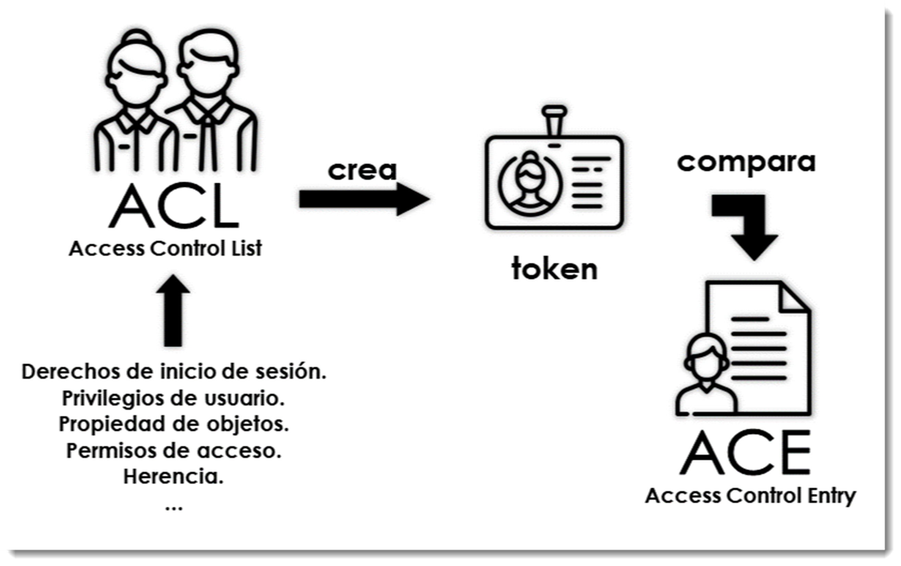
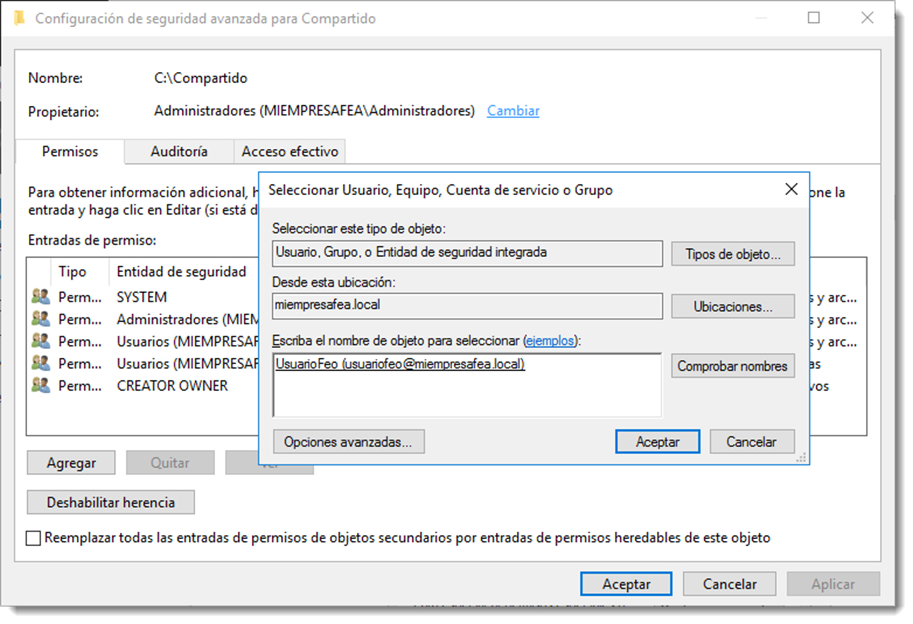

# Control de acceso a recursos

El controlador del dominio debe proteger archivos, aplicaciones y otros recursos de un uso no autorizado. Para ello utiliza un proceso que compara las cuentas de usuario y la pertenencia a grupos con los derechos, privilegios y permisos asociados con esas cuentas. El control de acceso es, por tanto, e**l proceso de autorizar a usuarios, grupos y equipos el uso a los objetos ofrecidos en todo el directorio**. Existen varias formas de limitar o autorizar el acceso y muchas de ellas se realizan de forma simultánea. Será el controlador de dominio el que aplique y combine los diferentes controles de acceso en función de su prioridad.

Cuando un usuario inicia sesión en un dominio, recibe un **token de acceso** que determina el nivel de uso a los objetos del directorio. Antes de permitir la utilización de un objeto a un usuario, se comprueba que el token de acceso y si está autorizado a realizar la tarea. Para ello compara la información del token de acceso **con las ACE (Access Control Entry)** del objeto. Este proceso busca el permiso que permita la acción requerida por el usuario sobre el objeto en este token, si no encuentra ninguno que lo permita expresamente, lo deniega y el usuario no podrá realizar la acción sobre el objeto.



## Listas de control de acceso

Las **ACL (Access Control List)** son el resultado de la combinación de todos los permisos, derechos y privilegios que el usuario posee. Al iniciar sesión esta ACL se asigna al usuario contenida en el token de acceso que será comparado con la ACE de cada objeto con el que se pretenda interactuar, como se ha mencionado con anterioridad.
Para la creación de la ACL se combinan diferentes tipos de autorización de uso en función de su prioridad siguiendo un orden preestablecido:

- **derechos de inicio de sesión y privilegios de usuario**, se aplican a cuentas de usuario y permiten realizar acciones específicas como administrar ciertos servicios. Normalmente se usan los grupos incorporados para asignar derechos y privilegios introduciendo la cuenta del usuario en un grupo con un derecho concreto.
- **propietario del objeto**, de forma predeterminada el propietario del objeto es el su creador, sean cuales sean los permisos de un objeto, el propietario podrá cambiarlos. Es una buena práctica que los objetos compartidos los cree siempre un usuario administrador y no dejar en manos de los usuarios su creación.
- **permisos**, definen el tipo de acceso a un objeto o propiedad de ese objeto. A diferencia de los derechos y privilegios, los permisos se asignan a objetos. Existen varios tipos de permisos que se combinarán entre sí creando una lista de control de acceso o ACE al objeto.

Estos son los permisos que se comprueban cuando un usuario trate acceder a un objeto. Por ejemplo, si usuarioFeo, que es un usuario incluido en el **grupo Operadores de copia de seguridad**, trata de acceder a los archivos incluidos en la copia de seguridad pero los permisos efectivos del fichero en cuestión no se lo permite, usuarioFeo tiene el derecho de acceso que prevalece sobre los permisos.

De igual forma, si usuarioFeo es propietario de un objeto del dominio, bien por que es su creador bien por que le han transferido su propiedad, es capaz de acceder a él a pesar de que los permisos no se lo permitan.
Para realizar el cambio de propietario en Microsoft Windows Server 2016 es necesario acceder, clicando con el botón derecho sobre el objeto, <span class="menu">Propiedades</span> → <span class="menu">Seguridad</span> → <span class="menu">Opciones Avanzadas</span> → <span class="menu">Cambiar</span>. Aparecerá el buscador de usuarios del dominio en el que se indicará a qué usuario pertenece ahora el objeto.



En los sistemas operativos basados en GNU/Linux se dispone de dos comandos en el terminal para realizar esta tarea; `chown` y `chgrp`.

El uso del primero permite el cambio del propietario. Hay que recordad que cuando se crea un recurso (fichero, carpeta, dispositivo hardware, etcétera), éste debe tener un creador. En GNU/Linux, además, debe pertenecer a un grupo del sistema que suele ser al que pertenece al usuario. Si en algún momento es necesario el cambio de estos valores, es posible hacerlo gracias a estos comandos.

El uso de chown es muy simple

```bash title=""
chown <opciones> <usuario>[:<grupo>] <recurso>

```

En este ejemplo se pasa el control al usuario administrador del recurso carpetaFea, que originalmente pertenece a usuarioFeo. Además se usa la opción -R para que afecte también a todo su contenido

```bash title=""

chown -R administrador carpetaFea
```

Pero esto no cambia el grupo al que pertenece el recurso, para ello será necesario indicarlo en el comando

```bash title=""

chown -R administrador:sudoers carpetaFea
```

En el ejemplo anterior, tras los dos puntos se especifica el grupo al que va a pertenecer el recurso. También es posible utilizar el carácter punto en lugar de los dos puntos. Este cambio también se puede realizar a través del comando chgrp. Su uso es muy intuitivo

```bash title=""
chgrp <opciones> <grupo_de_destino> <recurso>
```

De esta manera, el cambio de grupo del ejemplo anterior es posible hacerlo de la siguiente manera

```bash title=""
chgrp sudoers carpetaFea
```

El uso de estos comando no reviste dificultad alguna.

La combinación de todos estos permisos puede conducir a un verdadero dolor de cabeza. Es interesante el uso de una estrategia que limita los accesos y usar tan solo uno de estos elementos para su gestión. Se recomienda no usar los privilegios de usuario salvo en casos muy especiales, así como la creación de los objetos del dominio desde la misma cuenta de usuario, preferiblemente la de administración. También es buena idea limitar la creación de objetos a los usuarios que no sean administradores. De esta forma, la responsabilidad de acceso de los recursos recaerá sobre los permisos.
