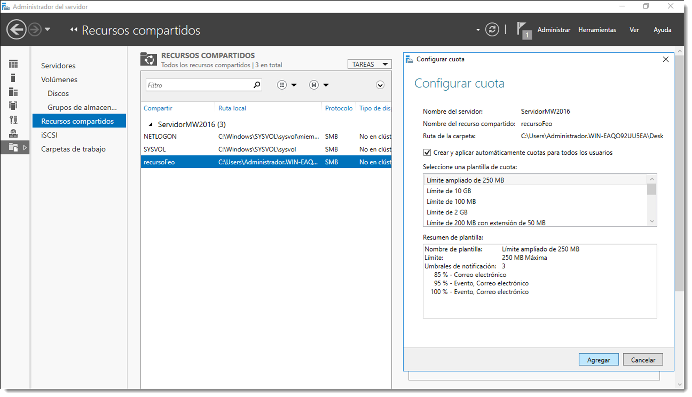
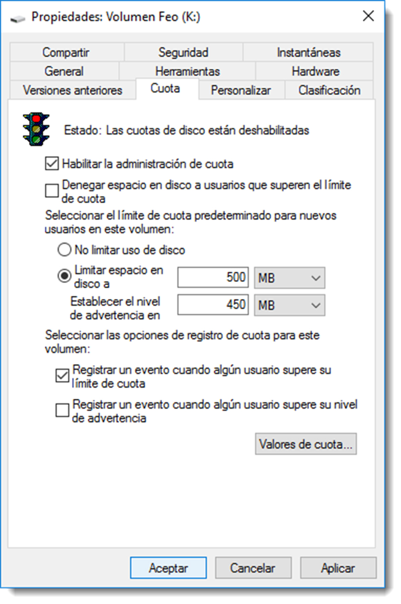
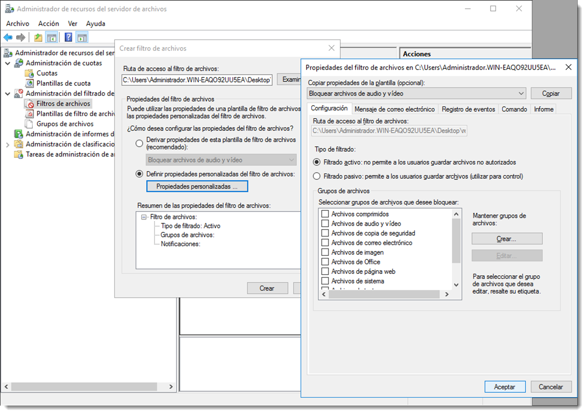

# Cuotas de disco

Las cuotas de disco permiten controlar **la cantidad de ficheros que se introducen en un recurso compartido**. El espacio de almacenamiento de un servidor es finito y, aunque no lo parezca, si se estrangula uno de los volúmenes, es un tarea costosa asignar nuevo espacio o simplemente no es posible. Además es buena práctica economizar el espacio de almacenamiento, sobre todo el del servidor. Con esto se consiguen dos objetivos:




    - **formar al usuario** y obligar a filtrar qué información es sensible y cual no.
    - evitar el **SDD** (Síndrome de Diógenes Digital), según el cual se guarda cualquier archivo ante la posibilidad de volver a necesitarlo en un futuro próximo. Futuro que nunca llega.

Con la herramienta **Administración de cuotas**, se pueden realizar las siguientes tareas:

- crear cuotas para limitar el espacio asignado a un volumen o carpeta y generar notificaciones cuando se esté a punto de alcanzar o superar el límite de dichas cuotas.
- generar cuotas automáticas aplicables a todas las carpetas existentes en un volumen o una carpeta y a todas las subcarpetas que se creen.
- definir plantillas de cuota que puedan aplicarse fácilmente a nuevos volúmenes o carpetas y que puedan utilizarse en toda una organización.

Algunas de las tareas que se puede realizar con esta herramienta es establecer un límite de, por ejemplo, 2 GB en las carpetas personales de los usuarios, configurando una notificación para el administrador y otra para el usuario cuando se superen los 1,8 GB de almacenamiento.

Microsoft Windows Server dispone de un complemento que realiza esta tarea, el Administrador de recursos del servidor de archivos. Se trata de un rol que será necesario instalar y para ello es necesario acceder a <span class="menu">Administrador del servidor</span> → <span class="menu">Instalar nuevo rol</span> → <span class="menu">Servicios de archivos y almacenamiento</span> → <span class="menu">Servicios de iSCSI y archivo</span> → <span class="menu">Administrador de recursos del servidor de archivos</span>.

Tras la instalación del componente, hay que dirigirse al <span class="menu">Inicio</span> → <span class="menu">Herramientas administrativas</span> → <span class="menu">Administración de recursos del servidor de archivos</span>, y una vez abierta la herramienta a <span class="menu">Administración de cuotas</span> → <span class="menu">Cuotas</span>. Se creará una nueva cuota y como ruta se elegirá la del recurso compartido que se necesita limitar.

Desde la misma aplicación es posible administrar la cuota de la carpeta, editarla o eliminarla. Huelga decir que tan sólo se puede asignar una cuota a un mismo recurso compartido, aunque cada recurso compartido puede tener una cuota diferente.

Existe la posibilidad de asignar una cuota a un volumen directamente, lo que se traducirá en que cada carpeta en creada en ese volumen tendrá la limitación de capacidad exigida por la cuota. Hay que tener cuidado con esta asignación y evitarla, y utilizar las cuotas asignadas a recursos compartidos.

En los sistemas operativos basados en GNU/Linux también es posible establecer límites de almacenamiento por usuario e incluso por grupo de usuarios. Es factible establecer cuotas con dos enfoques diferentes:

- es posible limitar el número de bloques de disco, con lo que se limita el tamaño en disco del que el usuario dispone, tal y como ocurría en Microsoft Windows Server,
- o bien limitar el número de **nodos-i**, lo que establece un límite de ficheros por usuario, independientemente del espacio que ocupen.

Además, de igual modo que en el caso anterior, se pueden fijar dos tipos de límites, el **rígido o hard** que impide que el límite sea sobrepasado, y el flexible o soft que no limita el espacio en disco pero sí avisa al administrador que se han excedido ciertos límites.

Desde la versión 14.04 de Ubuntu Server el kernel viene preparado para soportar cuotas de disco, por lo que tan sólo será necesario la instalación del paquete que permite gestionar las cuotas: `quota y quotatool`.

```bash title=""
sudo apt-get install quota quotatool
```

Al igual que ocurría en el caso anterior, las cuotas han de ser activadas para cada uno de los volúmenes del sistema. Para ello es necesario especificarlo en las opciones del fichero `/etc/fstab.`

```bash title=""

/dev/sdb1 /media/Datos ext4 defaults,usrquota,grpquota 0 0
```

En las opciones de montaje se han añadido las opciones de `usrquota y grpquota`, que permitirán la asignación de cuotas de disco tanto a usuarios como a grupos respectivamente.

Para que los cambios tengan efecto, se
monta y desmonta el volumen aplicando la nueva configuración especificada en el fichero `/etc/fstab`

```bash title=""
sudo mount -o remount,rw /media/Datos
```

La unidad ya está preparada para contener cuotas de disco, por lo que será preciso crearlas a través de los comandos que se han instalado: `quotacheck, edquota y repquota`.

```bash title=""
sudo quotacheck -cgu /media/Datos
```

El comando anterior activa las cuotas para el volumen. La opción `-c` crea los ficheros de configuración necesarios para guardar la información de las cuotas, mientras que las opciones `-u y -g` activan las cuotas de usuario y grupo respectivamente. Si todo ha ido bien, en la carpeta raíz del volumen montado aparecerán dos ficheros `aquota.group y aquota.user` que contendrán la configuración de las cuotas para los usuarios y grupos. No se trata de archivos de texto plano como es habitual, sino que estarán cifrados.

Para añadir una cuota a un usuario se utiliza el comando

```bash title=""
edquota -u administrador
```

Aparecerá en pantalla el editor de texto predeterminado junto con la configuración del usuario especificado

```bash title=""
Disk quotas dor user administrador (uid 1000):
Filesystem blocks soft hard inodes soft hard
/dev/sdb1 0 0 0 0 0 0

```

El significado de cada columna es

- `Filesystem`, indica el volumen en el que se activan las cuotas
- `blocks`, señala el número de bloques que el usuario o grupo está utilizando
- `inodes`, apunta el número de nodos-i que el usuario o grupo está usando
- `soft`, representa un valor de bloques o nodos-i que permite sobrepasar durante un determinado tiempo
- `hard`, es el límite de bloques o nodos-i que no es posible superar

Modificando estos valores y guardando el fichero se establecerán las cuotas del usuario **administrador**. Configurar un valor de cuota a cero significa que no existe límite alguno de almacenamiento para ese usuario. La cuotas para grupos se realizan exactamente igual que con los usuarios. Si es necesario su edición, se volverá a ejecutar el mismo comando y se modificarán los valores oportunos.

En la descripción de la columna soft se hizo referencia a que ese valor es posible rebasarlo durante un tiempo determinado. A ese tiempo se le conoce como periodo de gracia, y una vez superado el límite flexible soft se convierte en límite rígido no pudiendo superarlo. Para modificar esta configuración se utiliza el comando

```bash title=""
  sudo edquota -t
```

Establecerá un valor para el volumen que afectará a todos los usuarios y grupos que tengan una cuota configurada en dicho volumen.
Para consultar todas las cuotas disponibles se utilizará el comando

```bash title=""
sudo repquota /dev/sdb1
```

el cual ofrecerá información detallada sobre los usuarios y grupos que disponen de cuota en dicho volumen.

```bash title=""

\*\*\* Report for user quotas on device /dev/sdb1
Block grace time: 7days; Inode grace time: 7days
Block limits File limits
User used soft hard grace used soft hard grace

---

root -- 20 0 0 2 0 0
usuario +- 351 300 0 15 0 0
```

El formato de salida del informe es autoexplicativo, a excepción de la segunda columna. Los guiones que aparecen a la derecha del nombre de usuario, representan si se ha excedido o no el límite flexible tanto de bloques como de nodos-i. Si se excede este límite el - será modificado por +. De esta forma es relativamente sencillo buscar aquellos usuarios que han superado el límite flexible a través del comando

```bash title=""
sudo repqutota /dev/sdb1 | grep “\+”
```

Para calcular el tamaño de la cuota a través de bloques será necesario conocer el tamaño del bloque del volumen al que se han aplicado las cuotas. Para ello se puede usar el comando `tune2fs` que ofrece amplia información sobre las características de un volumen, entre toda ella, el número de bloques:

```bash title=""
tune2fs -l /dev/sdb1 | grep “Block size”
```

Ahora tan sólo queda multiplicar este tamaño por el número de bloques asignado a la cuota.
Es posible desactivar las cuotas de forma temporal para, por ejemplo, realizar ciertas tareas de mantenimiento o administración,

```bash title=""
quotaoff /dev/sdb1
```

y volverlas a activar

```bash title=""
quotaon /dev/sdb1
```

Recuerda que esta desactivación es temporal. Si se desactivan las cuotas con este comando y se reinicia el sistema, volverán a estar activas ya que se inicializan a través del fichero /etc/fstab. Si es necesario desactivarlas de forma permanente se deben configurar con un valor de cero en el archivo de cuotas.

## Filtrado de ficheros en recursos compartidos

Otra tarea interesante para el administrador es, además del espacio, poder controlar el tipo de ficheros que se guarda en estas carpetas. Existe la posibilidad de controlar qué ficheros se pueden guardar en el recurso y cuales no. Si por ejemplo se dispone de una carpeta para documentos de trabajo, es posible que no tenga ningún sentido almacenar en ella videos, fotografías, ejecutables o archivos de audio.



Esta limitación se puede realizar de forma sencilla a través de la herramienta instalada en el apartado anterior, tan sólo hay que dirigirse esta vez a Administración del filtrado de archivos. De igual manera que en caso previo, hay que especificar la ruta de la carpeta a la que se necesita filtrar el contenido y elegir una de las plantillas de filtrado.

Si ninguna de estas plantillas satisface las necesidades de filtrado, es posible crear una personalizada con los tipos de archivos que no deben estar en este recurso.

La aplicación de estos filtros se realiza a nivel de extensión. Un usuario avanzado podría cambiar la extensión de un fichero de audio y hacerlo pasar por uno de texto para introducirlo en la carpeta. Existen otras medidas accesorias para evitar este tipo de acciones, pero que no se resuelven desde esta utilidad.
