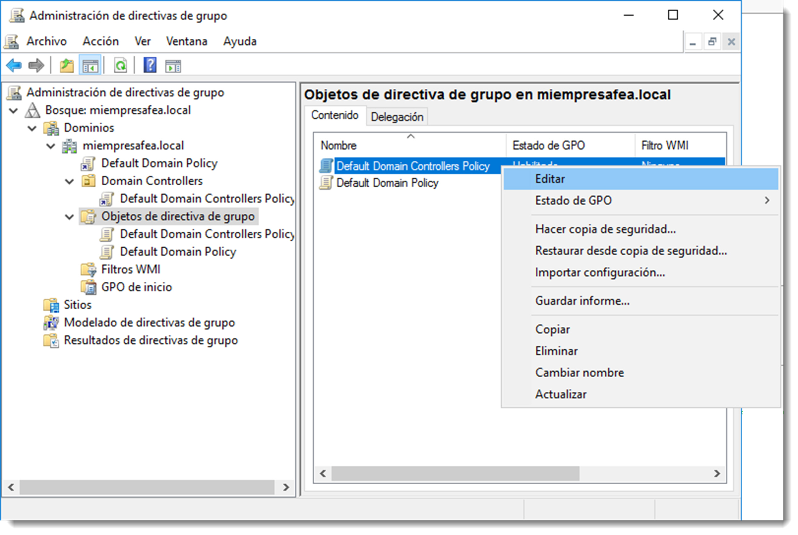
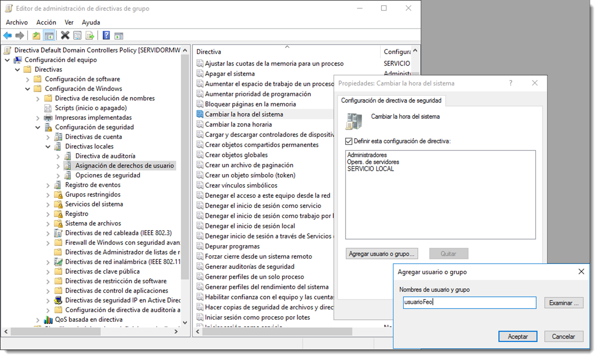

# Derechos de inicio de sesión y privilegios de usuario

Los **derechos de conexión**, o derechos de inicio de sesión, permiten definir el modo en el que iniciará sesión el usuario en el sistema, es decir, si lo hará en modo local, a través de la red o desde una red externa.

Los privilegios definen lo que el usuario podrá hacer en el sistema una vez iniciada su sesión. Ya se ha hablado que durante el proceso de inicio de sesión, el usuario recibe el token de acceso que dictará que acciones puede y no puede realizar. Parte de ese listado de accesos, conocido como **ACL (Access Control List)** será generado a través de los privilegios que el usuario posea.

Los administradores pueden asignar derechos específicos a las cuentas de grupo o a cuentas de usuario individuales. Estos derechos autorizan a los usuarios a realizar acciones específicas, como iniciar una sesión en un sistema de forma interactiva o realizar copias de seguridad de archivos y directorios, entre otros muchos.

Estos derechos de usuario se diferencian de los permisos en que se aplican a las cuentas de usuario, mientras que los permisos se asignan a los objetos. Aunque se pueden aplicar a cuentas de usuario individuales, se administran mejor en una cuenta de grupo. Existen dos formas de asignar privilegios a los usuario o grupos:

- **usando grupos predeterminados**, la unidad organizativa Builtin contiene todos los grupos de seguridad que incorpora de forma predeterminada el dominio. Estos grupos ya disponen de una serie de privilegios asociados en función de la tarea para la que fueron diseñados. Al agregarle a cualquiera de estos grupos un nuevo miembro, automáticamente, dicho miembro heredará todos los privilegios del grupo.
- **a través de las políticas de grupo**, para ello será necesario el uso de la herramienta Administración de directivas de grupo a la que se accede a través de Administración del servidor → Herramientas → Administración de directivas de grupo. No se entrará en detalle con esta utilidad ya que existe una unidad dedicado a ella. Aún así, se localizará la Default Domain Controllers Policy y se procederá a su edición.
  

  En la pantalla de edición, la política a editar será Configuración de equipo → Directivas → Configuración de Windows → Configuración de seguridad → Directivas locales → Asignación de derechos a usuario. Esta opción mostrará todos los privilegios que se pueden asignar a un usuario. Tan sólo habrá que editar la directiva y añadir al usuario o grupo determinado.
  

  De esta forma también es posible la modificación o creación de grupos de seguridad para según las necesidades de la empresa. Si bien es cierto que los grupos **Builtin** satisfacen la mayoría de las necesidades de asignación de privilegios, es posible crear nuevos a través de esta herramienta.

En sistemas operativos basados en GNU/Linux la gestión de los grupos y privilegios se hace a través del comando `samba-tool group`, como ya se ha visto con anterioridad, aunque no llega a los niveles de especificación de Microsoft Windows. _Recuerda que Samba está en continuo desarrollo_ y todas estas características estarán implementadas.
