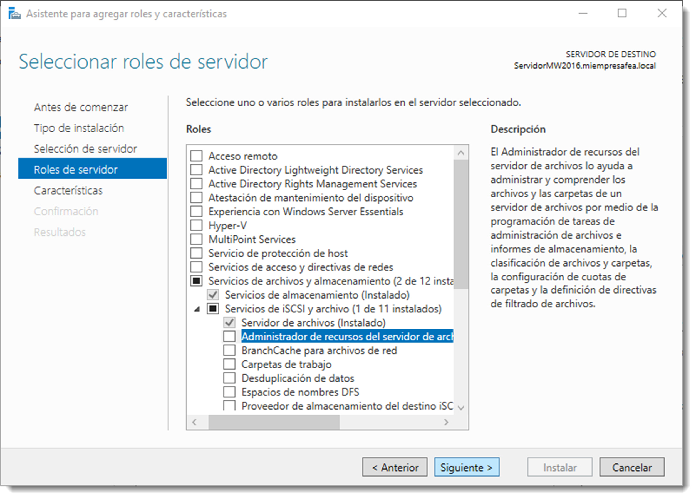

# Herencia

Cada objeto del directorio tiene asignada información de control de acceso. Esta información se denomina descriptor de seguridad y controla el tipo de acceso permitido a usuarios y grupos. Existen dos formas de asignar permisos a los objetos:

- **permisos explícito**s, son aquellos que asigna el usuario o son el resultado de la creación del objeto y son los que se han estudiado hasta ahora.
- **permisos heredados**, son los que se propagan a un objeto desde un objeto primario.

De forma predeterminada, los objetos heredan los permisos de su contenedor cuando se crean. Verbigracia, cuando se crea la carpeta **carpetaFea**, todas las subcarpetas y archivos creados en su interior heredan de forma automática sus permisos. La herencia facilita la tarea de administrar permisos y aseguran su coherencia entre todos los objetos de un contenedor. De esta manera, la carpeta carpetaFea tiene permisos explícitos, mientras que las subcarpetas y los archivos heredan los permisos.

Es posible bloquear esta herencia si es necesario para poder asignar permisos explícitos a un objeto contenido en otro. En Microsoft Windwos Server es posible accediendo a propiedades del objeto, Propiedades → Seguridad → Opciones Avanzadas → Deshabilitar Herencia. Una vez bloqueada la herencia, se deberá especificar si los permisos que tiene ese objeto de le asignan de forma explícita o si se eliminan, decisión tomada en función de las necesidades del proyecto.
