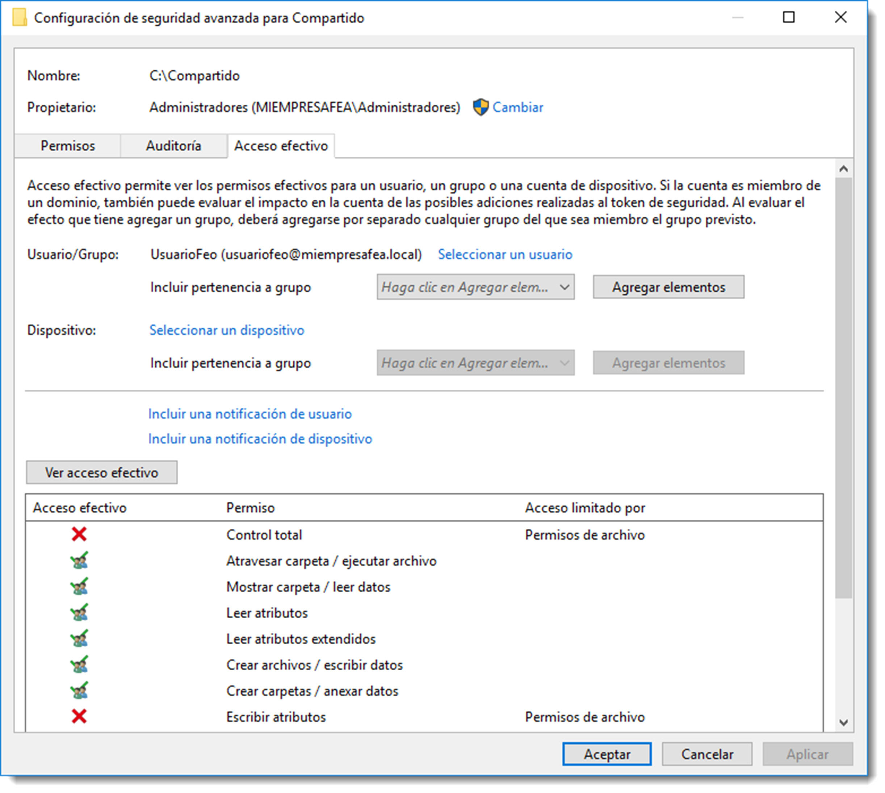
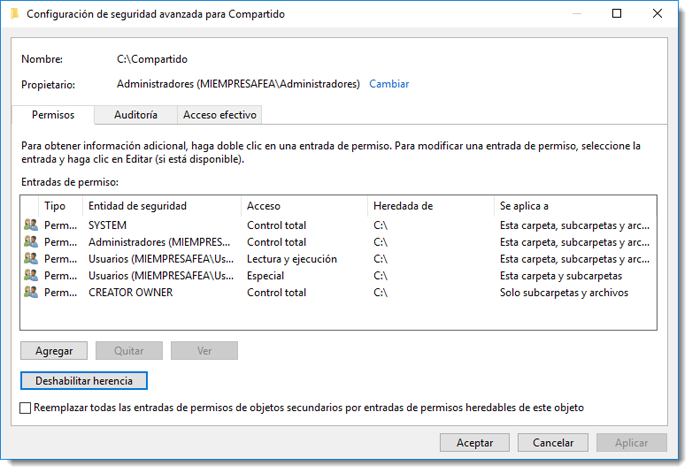
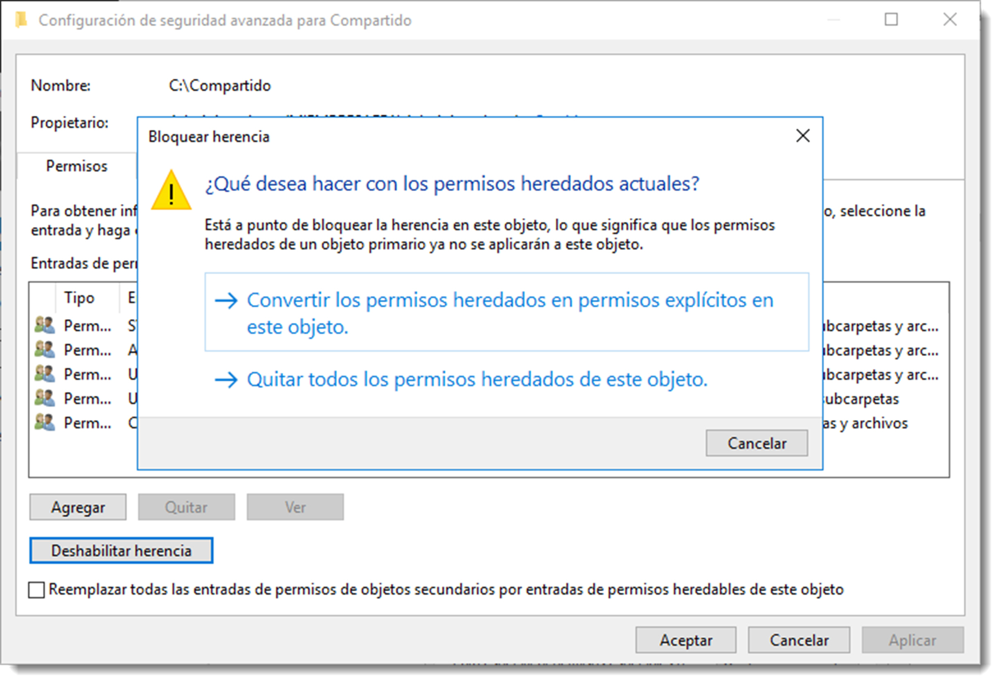

# Permisos de red y locales

En un servidor de archivos, el acceso a una carpeta puede estar determinado por dos conjuntos de entradas de permisos:

- los permisos de recurso compartido definidos tan sólo a carpetas.
- los permisos NTFS (New Technology File System) definidos tato en carpetas como en archivos.

Los permisos de recurso compartido suelen utilizarse para administrar equipos con sistemas de archivos FAT32 (File Allocation Table) o posterior.

Con la aparición del sistema de archivos **NTFS (New Technology File System)**, se incluyeron nuevos tipos de permisos asignables, además, también a ficheros. Ambos sistemas de permisos conviven en entornos de Microsoft pero son independientes, ninguno modifica al otro. Los permisos de acceso final en una carpeta compartida se determinan teniendo en cuenta las entradas de permiso de recurso compartido y de permiso NTFS. En caso de contradicción entre ellos, se aplicarán siempre los permisos más restrictivos.

En la siguiente tabla se enumeran las acciones que son posibles de realizar en función de los permisos asignados.

| Permisos especiales                 | Control total    | Modificar        | Leer y ejecutar  | Mostrar el contenido de la carpeta | Lectura          | Escritura        |
| ----------------------------------- | ---------------- | ---------------- | ---------------- | ---------------------------------- | ---------------- | ---------------- |
| Recorrer carpeta / Ejecutar Archivo | :material-check: | :material-check: | :material-check: | :material-check:                   | :material-close: | :material-close: |
| Listar carpeta / Leer datos         | :material-check: | :material-check: | :material-check: | :material-check:                   | :material-check: | :material-close: |
| Atributos de lectura                | :material-check: | :material-check: | :material-check: | :material-check:                   | :material-check: | :material-close: |
| Atributos extendidos de lectura     | :material-check: | :material-check: | :material-check: | :material-check:                   | :material-check: | :material-close: |
| Crear archivos / Escribir datos     | :material-check: | :material-check: | :material-close: | :material-close:                   | :material-close: | :material-check: |
| Crear carpetas / Anexar datos       | :material-check: | :material-check: | :material-close: | :material-close:                   | :material-close: | :material-check: |
| Atributos de escritura              | :material-check: | :material-check: | :material-close: | :material-close:                   | :material-close: | :material-check: |
| Atributos extendidos de escritura   | :material-check: | :material-check: | :material-close: | :material-close:                   | :material-close: | :material-check: |
| Eliminar subcarpetas y archivos     | :material-check: | :material-close: | :material-close: | :material-close:                   | :material-close: | :material-close: |
| Eliminar                            | :material-check: | :material-check: | :material-close: | :material-close:                   | :material-close: | :material-close: |
| Permisos de lectura                 | :material-check: | :material-check: | :material-check: | :material-check:                   | :material-check: | :material-check: |
| Cambiar permisos                    | :material-check: | :material-close: | :material-close: | :material-close:                   | :material-close: | :material-close: |
| Tomar posesión                      | :material-check: | :material-close: | :material-close: | :material-close:                   | :material-close: | :material-close: |
| Sincronizar                         | :material-check: | :material-check: | :material-check: | :material-check:                   | :material-check: | :material-check: |

Hay que tener muy en cuenta las siguientes estrategias cuando se trabaje con estos permisos:

- Conceder a un usuario el permiso NTFS Control total en una carpeta permite a ese usuario tomar posesión de la carpeta a menos que esté restringido de alguna forma. Nunca, salvo causa justificada, se debe dar este tipo de acceso.
- Es buena práctica administrar el acceso a carpetas exclusivamente **mediante permisos NTFS**. Para ello se deben establecer los permisos de recurso compartido en Control total para el grupo Todos.
- Los permisos NTFS influyen sobre el acceso tanto local como remoto. Por el contrario, los permisos de recurso compartido sólo se aplican a recursos compartidos de red.**No restringen el acceso a ningún usuario local**, por lo que no ofrecen privacidad entre usuarios de un equipo.
- De forma predeterminada, el grupo **Todos** no incluye el grupo Anónimo, por lo que los permisos que se aplican al grupo Todos no afectan al grupo Anónimo.

La administración de los permisos en Microsoft Windows Server se realiza a través de las propiedades de cada recurso. Accediendo a Propiedades se pueden especificar los permisos a través de las pestañas <span class="menu">Compartir</span> y <span class="menu">Seguridad</span>. En la primera pestaña es necesario iniciar el proceso de compartición con el botón Compartir.... A partir de aquí tan solo hay que establecer el binomio permiso-usuario.

Estas tareas en Ubuntu Server se realizan a través del conjunto de herramientas de `samba-tool`, en concreto `dsacl y ntacl`. A pesar de la existencia de estas herramientas, la gestión de los permisos de carpetas se realizará con **RSAT** instalado con anterioridad. Esta tarea es más efectiva y concisa desde el GUI ya que no será necesario recordar todos los usuarios ni grupos creados en el directorio mientras se configuran los permisos. En efecto, el uso de GUI para la asignación de permisos facilita esta tarea que, en CLI, puede llegar a complicarse en demasía. Por este motivo se utilizará la administración remota que funciona de igual modo que en sistemas operativos de Microsoft. Eso sí, hay que tener en cuenta varias cosas antes de usar los permisos NTFS en Ubuntu Server:

- el volumen que contenga el recurso compartido debe disponer de las opciones `acl` durante su montaje. Estas opciones serán indicadas en el fichero `/etc/fstab` para automatizar el proceso.
- si el sistema de ficheros del volumen no es ext4, será necesario la instalación de esta característica . En ext4 viene integrada por defecto.
- los permisos que se apliquen a un recurso a través de Samba sólo serán válidos a través de este servicio, por lo que se desaconseja el acceso en local al controlador de Active Directory.

Será necesario ahora **ampliar los permisos** que GNU/Linux establece a los ficheros para que sean compatibles con los de NTFS de Microsoft Windows. Ya que se quiere integrar este servidor en una estructura de Active Directory será necesario que los permisos asignados a los ficheros sean entendibles por los clientes Microsoft Windows que accedan a este servidor.

Para ello se necesita instalar dos paquetes el `attr` y el `acl` que juntos compatibilizan las listas de control de acceso entre ambos sistemas. La parte interesante de estos paquetes es que esta ampliación de permisos se le puede asignar a tan un medio determinado o a todo el sistema, por lo que ambos permisos de acceso pueden convivir sin conflicto alguno.

Para ello, se va a instalar un segundo disco duro en el servidor. Se convertirá este disco duro en un volumen y se destinará a almacenar los ficheros compartidos del servidor, por lo tanto, será a este volumen al que se le asignará la nueva configuración de permisos. Para realizar esta tarea, seguiremos estos pasos:

- se añadirá un disco duro SATA a la máquina virtual de 400 GB de capacidad.
- se asignará una partición primaria que ocupe el disco entero.
  `sudo fisk /dev/sdb`
- es necesario asigna un sistema de ficheros, en este caso ext4
  `sudo mkfs -t ext4 /dev/sdb1`
- debe crearse un punto de montaje en /media/datos.
  `sudo mount /dev/sdb1 /media/datos`

  Otra acción a llevar a cabo es hacer el montaje del nuevo volumen de forma automática al iniciar el sistema. Pare ello será necesario incluir esta información en el fichero `/etc/fstab`:

`/dev/sdb1 /media/datos ext4 defaults 0 0`

Ahora se instalarán los paquetes necesarios para la asignación de los nuevos permisos:

`sudo apt-get install acl attr`

Una vez terminada la instalación, se asignará la ampliación de permisos a este nuevo volumen añadiendo `user_xattr,acl,barrier=1` al fichero `/etc/fstab`. Debe quedar de la siguiente manera:
/dev/sdb1 /media/datos ext4 user_xattr,acl,barrier=1,defaults 0 0

Se comprueba que todo ha ido bien reiniciando el equipo y accediendo a la carpeta `/media/datos`.

Antes de administrar los permisos de un recurso compartido en un servicio Active Directory con Samba, será necesario su creación y compartición. Esta tarea se realiza añadiendo el recurso al fichero `/etc/samba/smb.conf`. El aspecto que tiene este fichero es el siguiente:

```bash title="Parámetros de smb.cnf"
# Global parameters

[global]
dns forwarder = 8.8.8.8
netbios name = SERVIDORUBUNTU
realm = MIEMPRESAFEA.LOCAL
server role = active directory domain controller
workgroup = MIEMPRESAFEA
idmap_ldb:use rfc2307 = yes

[netlogon]
path = /var/lib/samba/sysvol/miempresafea.local/scripts
read only = No

[sysvol]
path = /var/lib/samba/sysvol
read only = No

```

Tanto `netlogon` como `sysvol` son recursos compartidos que han sido creados durante el proceso de instalación del directorio, y por tanto, son necesarios para el correcto funcionamiento del sistema. Será aquí dónde se crearán los nuevos recursos

```bash title=""
[compartido]
path = /media/datos
read only = No

```

Una vez guardado el fichero de configuración, se reinicia el servicio Samba para que los cambios tengan efecto

```bash title=""
service smbd stop
service smbd start

```

A partir de este momento, el recurso `/media/datos` está accesible desde Samba, aunque sin ningún tipo de restricción. Será necesario ahora el acceso a esta carpeta desde **RSAT** con una cuenta de administración para modificar los permisos de acceso, de igual forma como se realiza en una carpeta compartido en un controlador de domino con Microsoft Windows.

A medida que se vayan cambiado los permisos de este recurso a través de **RSAT**, será posible consultarlos desde el terminal con el subcomando `ntacl` o directamente con el comando `getfacl`

```bash title=""

samba-tool ntacl get /media/datos

```

el cual ofrece información detallada de los permisos o

```bash title=""
getfacl /media/datos
```

que ofrecerá información de los permisos a modo de resumen.

## Permisos efectivos



Cada objeto tiene un conjunto de permisos efectivos asociados. Es muy probable que se pase por alto alguna de las combinaciones de permisos, propiedad o derechos de usuario y su combinación no obtenga el resultado esperado. Se pueden consultar los permisos efectivos que un objeto tiene en un momento dado con respecto a una cuenta de usuario o grupo.

Los siguientes factores se usan para determinar el **conjunto de permisos efectivos** de un objeto:

- Pertenencia al grupo global
- Pertenencia al grupo local
- Permisos locales y de red
- Privilegios locales
- Pertenencia a grupos universales

En Microsoft Windows Server esta consulta se realiza pulsando el botón derecho sobre el recurso compartido <span class="menu">Propiedades</span> → <span class="menu">Seguridad</span> (pestaña) → <span class="menu">Opciones Avanzadas</span> → <span class="menu">Acceso Efectivo</span>. En esta ventana se especifica un usuario o grupo sobre el que se quiera realizar la consulta y se pulsa el botón sobre <span class="menu">Acceso Efectivo</span>.



Cuando se usa la herramienta **Permisos efectivos** puede que los resultados que se muestran no sean coherentes con los permisos reales. Este problema ocurre cuando se da una de estas condiciones:



- se ejecutan las herramientas administrativas de forma remota.
- la cuenta de usuario que se usa no se encuentra en el mismo dominio que el recurso.

Para evitar este problema hay que asegurarse que la cuenta de usuario administrativa usada para ejecutar la herramienta se encuentra en el mismo dominio que el objeto consultado.

En sistemas operativos basados en GNU/Linux, es posible utilizar los comandos

```bash title=""
samba-tool ntacl get /srv/samba/Usuarios
getfacl /srv/samba/Usuarios

```

para obtener un resumen de los permisos efectivos sobre del recurso, como ya se ha mencionado con anterioridad.
