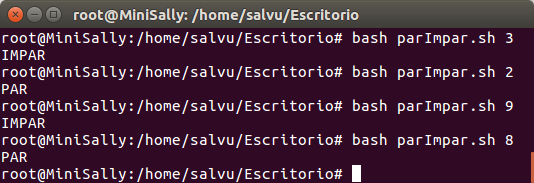

# Argumentos

Un argumento es un parámetros que se le pasa a una función o a un programa. Es decir, son variables de entrada. Puede haber más de uno o ninguno.

<center>
!!! danger "Script con argumentos" 
	
      ./script.sh arg1 arg2 arg3 … argN
</center>

### Ejemplo:

Ejecutamos el mismo script con diferentes argumentos, dando salidas distintas.



- Se puede acceder al contenido de cada uno de los argumentos usando $X donde “X” es la posición del argumento (primero, segundo, tercero, ...).

- `$0`: Es el nombre del script → soyUnScript.sh.

-` $\*`: Una lista con todos los argumentos → salva 1010 "Salva Serrano" /home/Salva /bin/bash.

-`$#`: Número de argumentos → 5.

- `shift`: Elimina el argumento uno ($1) y promueve una posición al resto de argumentos, es decir, lo que antes era $2 ahora será $1.

### Ejemplo 1\.

<center>
!!! info "Script con argumentos" 
	
      `./soyUnScript.sh` salva 1010 "Salva Serrano" /home/Salva /bin/bash
</center>

<center>

| Variable | <center> Contenido </center>                     |
| :------: | :----------------------------------------------- |
|   `$0`   | soyUnScript.sh                                   |
|   `$1`   | salva                                            |
|   `$2`   | 1010                                             |
|   `$3`   | Salva Serrano                                    |
|   `$4`   | /home/Salva                                      |
|   `$5`   | /bin/bash                                        |
|   `$*`   | salva 1010 "Salva Serrano" /home/Salva /bin/bash |
|   `$#`   | 5                                                |

</center>

- Los argumentos van separados por espacios y en caso de insertar un metacaracter, como por ejemplo asterisco (\*), es necesario escaparlo con \:

<center>
!!! warning "Escapar carácteres especiales" 
	
      ./soyUnScript.sh 5 \\* 10
</center>

### Ejemplo de $#

```bash
if [ $# -eq 3 ]
then
        echo "Se han insertado 3 argumentos."
else
        echo "Por favor, inserte 3 argumentos."
fi
```

  

### Ejemplo Shift.

Se puede observar como $1 va a ir valiendo cada uno de los argumentos.

```bash
echo "El primer argumento es: $1"
shift
echo "Ahora el primer argumento es: $1"
shift
echo "Ahora el primer argumento es: $1"
```

  

## Vídeos de Ejemplo.

1. [Ejemplos de Argumentos.](https://youtu.be/-j6-3HWyv_k)
