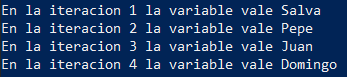

# Estructura FOR IN

## FOR IN

```bash title="FOR IN"
for VARIABLE in LISTA
        do
                ACCIONES
        done
```

- Permite recorrer una lista.

- Importante el espacio entre los corchetes y el uso de “do” y “done” para crear la estructura.

- Por defecto se interpreta como un objeto de la lista todo aquello que va separado por un espacio en blanco.

- Usaremos una variable y en cada iteración dicha variable tendrá un valor de la lista.

!!! info "Iteración"

        Se refiere a cada vez que se va ejecutando el bucle. La primera ejecución con el primer objeto de la lista es la primera iteración, la segunda vez será la segunda iteración, y así sucesivamente.

## Ejemplos de listas

### Ejemplo de lista usando literales

```bash
iteracion=1
for nombres in Salva Pepe Juan Domingo
do
        echo "En la iteracion $iteracion la variable vale $nombres"
        let iteracion=$iteracion+1
done
```

  

### Ejemplo de lista usando variables.

```bash
directorios=`ls`
iteracion=1
for nombres in $directorios
do
        echo "El directorio en la iteracion $iteracion es $nombres"
        let iteracion=iteracion+1
done
```

### Ejemplo de lista usando comandos.

```bash
iteracion=1
for nombres in `ls`
do
        echo "El directorio en la iteracion $iteracion es $nombres"
        let iteracion=iteracion+1
done
```

## Ejemplos genéricos.

### Ejemplos usando el comando seq.

```bash
for numero in `seq 1 10`
do
        echo "Ahora la variable numero vale $numero
done
```

### Ejemplos con un for anidado.

```bash
filas=5
columnas=5
for fila in `seq 1 $filas`
do
        for col in `seq 1 $columnas`
        do
                echo -n "*"
        done
        #Para saltar de linea.
        echo
done
```

  

### Ejemplo recorriendo un fichero SIN espacios en blanco.

```bash
#Solo nos quedamos con los primeros 3 campos porque el 4 de informacion personal
#puede contener espacios
for linea in `cat /etc/passwd | cut -d':' -f1-3`
do
        #Nos quedamos con el nombre de usuario y su uid.
        userID=`echo $linea | cut -d':' -f3`
        usuario=`echo $linea | cut -d':' -f1`
        #Si su UID es mayor de 1000 y menor de 65534 es un usuario normal.
        if [[ $userID -ge 1000 && $userID -lt 65534 ]]
        then
                echo "$usuario es un usuario normal"
        fi
done
```

### Ejemplo recorriendo un fichero CON espacios en blanco usando IFS.

<center>
!!! danger "Cambiar el IFS"
        IFS=$'{\n}'
</center>

- El IFS es el separador por defecto del sistema.

- Existe la variable de entorno $IFS que nos indica cuál es.

- Podemos modificarla dentro de nuestro script como cualquier variable 🔀 IFS=$'{\n}'

- Por defecto el IFS es el espacio en blanco, por esa razón cada objeto de una lista está separado por un espacio en blanco.

En el siguiente ejemplo cambiamos el IFS al salto de línea, de esta forma cada iteración coge una linea entera.

```bash
IFS=$'{\n}'

for linea in `ls -l | tr -s ' '`
do
        echo $linea
done
```

## Vídeo de Ejemplo.

1. [Vídeo Ejemplo Estructura For in](https://youtu.be/dlbvqiW-y14)
