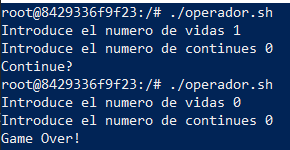
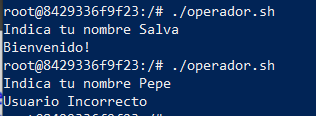

# Operadores Binarios.

## AND.

- Devuelve verdadero cuando las dos expresiones son verdaderas, en otros casos devuelve falso.
- Se aplica mediante el uso de “&&”.

Ejemplo: El programa compara dos argumentos, y dirá si son diferentes de a y b o no.

```bash
read -p "Introduce el numero de vidas " vidas
read -p "Introduce el numero de continues " continues

if [[ $vidas -le 0 && $continues -le 0 ]]
then
        echo "Game Over!"
else
        echo "Continue?"
fi
```

  

## OR.

- El comando OR devuelve verdadero cuando al menos una de sus expresiones se cumple.
- Se representa usando “||” doble barra vertical.

```bash
read -p "Indica tu nombre " nombre

if [[ $nombre == "Salva" || $nombre == "Admin" ]]
then
        echo "Bienvenido!"
else
        echo "Usuario Incorrecto"
fi
```

  

### Uso de múltiples operadores binarios.

- Si quisiéramos agregar más de dos operadores binarios, sería el mismo proceso:

```bash
read -p "Introduce el numero de vidas " vidas
read -p "Introduce el numero de continues " continues
read -p "Quieres activar las trampas? (s/n)" trampas

if [[ $vidas -le 0 && $continues -le 0 && $trampas = "s" ]]
then
        echo "Game Over!"
else
        echo "Continue?"
fi
```

- Si vamos a agrupar diferentes opciones usando varios operadores binarios rodeamos, igual que en las ecuaciones matemáticas, con paréntesis “(“ y “)”.

```bash
read -p "Introduce tu nombre de usuario " usuario
read -p "Introduce tu contrasenya " pass

if [[ ($usuario = "Salva" && $pass = "abc1234") || ($usuario = "Pepe" && $pass="4231abc") ]]
then
        echo "Solo Salva y Pepe pueden acceder con su contrasenya"
else
        echo "O no eres ni Salva, ni Pepe o la contrasenya es incorrecta"
fi
```
