# Variables en BASH

## ¿Cómo creo una variable?

Siempre que creemos una variable debemos hacer uso del **“=” sin espacios en blanco**.

- Los textos 🔀 comillas dobles.
- Los números 🔀 sin comillas dobles.

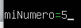

Variables de cadenas de texto 🔀 Con comillas dobles.

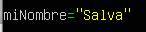

Variables que contienen el valor de un comando 🔀 Usando comillas abiertas.

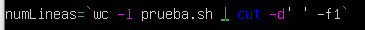

Variables compuestas de otras variables.

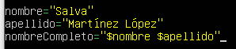

## ¿Cómo muestro por pantalla una variable?

Haciendo uso del símbolo del dolar 🔀 “$”.

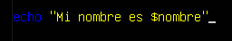

Podemos hacer uso de la opción “echo –n” para mostrar varias salidas en la misma línea.
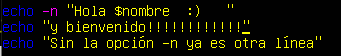
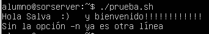
Con la opción “echo –e” puedo hacer uso de caracteres especiales con la contrabarra:

🔀 \n Salto de línea.

🔀 \t Tabulador.

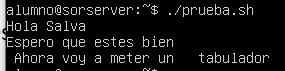

## ¿Cómo recojo información del usuario?

Con el comando “read” podemos recoger lo que escriba el usuario por terminal y guardarlo en una variable.
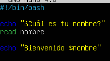
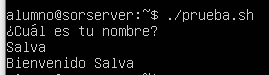
Podemos hacerlo todo en la misma línea con read –p:

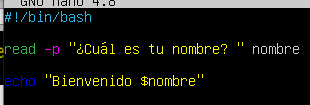
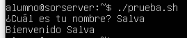

## Vídeos de repaso.

Vídeos de repaso sobre scripts y variables:

1. [Repaso de Scripts y Variables.](https://youtu.be/Yk8uW70A5xQ)

2. [Ejemplos de uso de Variables.](https://youtu.be/QtqXA0VEXEY).
